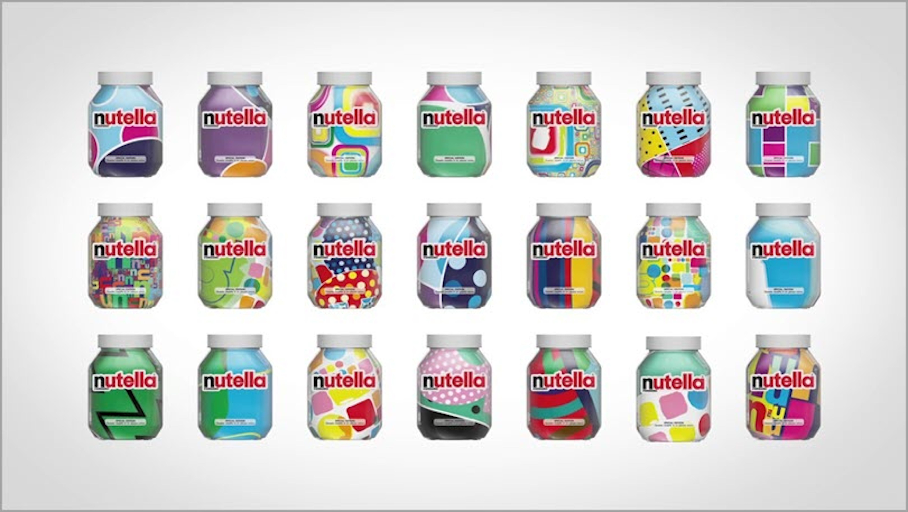

---
Pr-id: MoneyLab
P-id: INC Reader
A-id: 10
Type: article
Book-type: anthology
Anthology item: article
Item-id: unique no.
Article-title: title of the article
Article-status: accepted
Author: name(s) of author(s)
Author-email:   corresponding address
Author-bio:  about the author
Abstract:   short description of the article (100 words)
Keywords:   50 keywords for search and indexing
Rights: CC BY-NC 4.0
...

# 2nd Story - Cyber Bazaar

In the sprawling expanse of the *Cyber Bazaar*, where algorithms hum and
virtual stalls buzz with the clamor of encoded exchanges, communication
is more than a tool—it’s the essence of existence. As living organisms,
communication is a fundamental activity of connecting individual
entities in order to develop linkages and form groups. For human
society, communication is considered an important component in the
formation of communities, it is the glue that binds individuals
together. The communication process is defined as the *transmission of
information*. Communication activities are the act of developing meaning
among entities or groups through the use of a sufficient number of
mutually understood signs, symbols, and semiotic conventions.[^04chapter2_1] The
communication act always involves a specific medium to form and forward
information. Initially, humans use their bodies as mediums to create and
transmit information. We use limbs to make gestures, carriage, and eyes
to receive those. The palate can make sounds; through sounds, oral
language is formed and emitted, and then received by the ears.

Throughout the history of *Homo Sapiens*, we have witnessed the
*parallel shift* between remarkable social changes and significant
transformations in the *communication medium*; in particular, we have
seen how information content has been created and the means by which
information is transmitted.[^04chapter2_2] As an example, the introduction of
written communication marked a new stage in social knowledge formation,
historical documentations, and collective memory establishment.
Knowledge and history have been condensed into recorded characters and
commonly used by governors. From hand writing to woodblock printing,
books have been an integral part of religious and administrative
apparatuses for thousands of years. That is why the oldest known printed
book is the *Diamond Sutra* - an important *Mahayana Buddhist* text from
the Chinese.[^04chapter2_3] Or, the first book in the world to adopt mass printing
techniques with moveable types is the *Christian Bible*.[^04chapter2_4]

 

 

Indeed, human society has entered a new era together with the formation
of *mass communication media* such as the printer, radio, television,
phone, computer and smartphone. The involvement of machines and mass
production marked the beginning of the technological era. When
*automation* first became a critical *part of civilization*, social
connections gradually shifted from *direct* to *indirect* ways through
mechanical means. Instead of face-to-face communication by talking,
distance communication through phone, text message, chat, email, or
video call were introduced and became an indispensable section of the
modern information exchange process. The large scale of social
communication increased rapidly. More recently, the invention of the
Internet has created simple and ubiquitous connections, unprecedented at
any time in history.

Along with the birth and development of mass communication, there has
been the continuous upgrowing of the *media industry*, where all the
elements related to the communication process have become commodities.
The media business has turned the *natural social activity*, the
communication process, into *a productive activity* through the process
of privatization of means and control of information production,
storage, and distribution. Knowledge exchange through writing has been
steadily acquired by publishing and search engine businesses, while mail
exchange had traditionally been controlled by the postal service
industry and, more recently, by email service providers. Social
connections have been taken over by social network platforms.

## Trading Secrets

In the digital age, the global communication industry is owned by
international media conglomerates and new technology empires. Aside from
the classic media capitalists such as publishers, newspapers, magazines,
radio and television centers contemporary society has witnessed the rise
of multinational information technology capitalists. The achievements of
digital technology and computer science have supported the current
communication industry to become versatile and efficient machines; they
are able to simultaneously produce, store and distribute information;
likewise, they are able to work with huge volumes of data and perform
highly accurate tasks. The most significant among all the new
technologies are artificial intelligence, Big data, and the Internet of
Things.

Using classic media tactics, contemporary technologies have helped media
owners adopt new technical methods for information production, storage
and distribution. Previously, the information had been produced
exclusively by professional personnel; currently it is often being
created by amateurs; and soon, machines will gradually take over this
task. Information production previously targeted large social
communities; in the present, it tends to be produced for small groups
and distributed precisely to the right individual target. While it was
necessary to purchase information in the past, that same information has
now become a free product. Fundamental changes in *production
personnel*, *production goals*, and *financial operating mechanisms*
have created a new face for the media industry in the era of artificial
intelligence and automation.

### Workforce

Throughout the 20th century, the majority of information was generated
by professional personnel, such as journalists, writers, editors,
photographers and designers, working for newspapers, radio, television
stations, and publishers. The emergence of digital media contributed to
the new personnel management of the media industry. In the 1990s, the
rise of the Internet generated strong, utopian expectations about a new
freedom paradigm of the online communication that is mainly dominated by
individual, amateur information producers and independent
publishers.[^04chapter2_5] Information consumption was expected to shift from
professional to amateur production sources. The weblog is an early
example of independent, individual publishing platforms on the WWW and
YouTube also witnessed the blooming of independent content producers—the
Youtubers—in the early stages of development of the platform.[^04chapter2_6],
[^04chapter2_7] However, soon after that, at the end of the 90s, independent
digital media was rapidly subsumed by the appropriation mechanism of
capitalism. A new model of labor was introduced into the system: the
pseudo-independent producers, who in fact represented the covert
professional production staff; for instance, behind the various known
reviewers’ websites or YouTube influencers there is often a large team
of professional helpers.

By now, Youtubers, Facebook Live-streamers and Tik-Tokers have become
actual professions. There is a complex ecosystem of educational,
managerial and design services to support these new positions.[^04chapter2_8] The
artificially constructed ‘individual publisher’ has generated the fake
illusions of success in many youngsters of the contemporary digital
space. Over the past two decades the desire of many individuals to
become successful influencers has contributed to the transformation of
cyberspace into a dynamic content creation environment. This dynamism
contributes to the smooth and less expensive operation of the digital
media industry as well. Instead of investing in content production, the
industry is rather focused on providing the storage and distribution
infrastructure, while there is a significant increase in the amount of
invested work in content production by individuals themselves. With a
huge amount of time and effort spent on creating and distributing
information on social networks, ordinary users are becoming a free
workforce in the service of the information market. In the past,
journalists were paid by editorial offices for their writings and
photos, while by now the majority of the users–the *digital
proletariat*–are investing their work in social media for no revenue at
all.

The amateur and unauthenticated information sources from individuals
have also made the *fake news phenomenon* more and more popular. Even
though fake news has a long history, with the speed of spreading rapidly
through the internet space, the phenomenon of fake news has become more
threatening, causing more critical consequences and becoming a
significant problem of our current society. Fake news can lead to
financial market destruction. For example, in 2013, \$130 billion in
stock value was wiped out in a matter of minutes by an AP tweet about an
*explosion* that injured Barack Obama.[^04chapter2_9] Fake news has led to mass
murders, such as Dylann Roof’s shooting at the Charleston church on June
17, 2015, in the U.S. state of South Carolina.[^04chapter2_10] Fake news has also
sabotaged many presidential elections around the world; among them, the
election of Donald Trump in the U.S 2016 and the Facebook - Cambridge
Analytica scandal is the most notable.[^04chapter2_11] Producing and circulating
fake news can be considered a criminal act. In recent years, penalties
for fake news publishing on social media have been enshrined in law by
several countries.

Using the pretext of controlling fake news, media owners have increased
their dominance and act of censorship information in cyberspace. Fake
news is, indeed, published by the authorities themselves, and often
spread *legally* for the purposes of political propaganda. In contrast,
*real stories* may not be conducive for the purposes of media owners
since they are often *constrained* and may sometimes be *banned* from
public circulation. Although users are allowed to post personal
statements and data on social media, many digital networks and countries
have erected barriers of censorship. Information censorship is
essentially just moving from offline to online spaces.

Contemporary users are actively creating information within digital
networks; nonetheless, their *personal information* is also an important
data source in a passive sense. The user information that has been
indirectly generated, after being processed through data analysis is
secondary information. This information is *a valuable commodity* for
trade and exchange on the *data business market*. The need for analyzed
information is a foundational demand in all fields of the present
society. Traders and manufacturers know the market's demand for their
products. The educators need to know the psychology of the learners they
manage. The researchers need to know about the impact rates of issues of
interest and citations. The medical staffs want to understand the
biological body parameters of large social groups, such as heart rate,
breathing, blood pressure. The politicians need to know about the
specific political trends of the population they will be running for.
Promisingly, all of these needs can be served by data analysis results.
Through storing personal information, behaviors and actions in digital
space, users have contributed to an expansive store of information–the
Big Data. Users unconsciously help digital product and service providers
amass their personal data, and this becomes the foundation for data
owners to conduct analysis and produce statistical information.

Moreover, based on the development of machine learning algorithms, AI
content becomes familiar to users today. AI can help correct grammar or
spelling and complete documents in different styles. These text
completion applications have been adopted widely by service providers
such as Google, Apple, Grammarly and other widely used platforms. AI is
now applied to text translation with increasingly improved accuracy,
such as in the service of Google Translate. AI can also generate
informational content for learning, correspondence, business, blog
posts, and social media content. Text creation tools appeared very early
as *Talk with Transformer* which has created great expectations for the
business of automated news creation.[^04chapter2_12] Up to now, there have been
many automatic news creation service providers such as Jasper,
Copysmith, Writesonic, Kafkai, Article Forge, Articoolo, Rytr, CopyAI,
and Peppertype.[^04chapter2_13] In the ever-expanding landscape of digital tools,
ChatGPT by OpenAI stands out as a powerful ally in the realm of content
generation. Leading media agencies such as Reuters and The Washington
Post have also embraced AI tools to enhance their content creation
processes, allowing them to produce high-quality work at scale. The
Washington Post and Reuters have tested models where *bots* write simple
stories, sometimes using artificial intelligence, where the goal is to
help the bots improve their writing over time.[^04chapter2_14] The Washington Post
employs its Heliograf *tool*, which generates short stories based on
structured data about topics such as election results and sporting
events. Forbes is developing an AI assistant for writers called Bertie.
Bertie learns from writers' styles, topic choices, and platform
publishing preferences.[^04chapter2_15]

By far, machine learning can use data and neural networks in a way that
mimics the working of a biological brain. Self-study and thinking will
bring great strides to the potential of machines to create content.
Certainly, the involvement of AI in news creation will accelerate the
production processes of the media industry in the coming decades.

### Media design workforce

> ‘The media are not toys; they should not be in the hands of Mother Goose
and Peter Pan executives. They can be entrusted only to new artists
because they are art forms.’ *–* Marshall McLuhan.[^04chapter2_16]

Canadian communications theorist Marshall McLuhan was the first to use
the term *media* in its modern sense related to communication channels.
In his book *Counterblast*he considered the media an art form.[^04chapter2_17]
Elements of signs, symbols, images, and sounds are the essential
foundation for constituting media content. Artists, painters, designers,
photographers, and filmmakers are the key personnel in the classical
media industry. Media design has become a growing career associated with
digital media. Consistent with the changes of the media industry in the
age of AI and automation, media design gradually moved to a new stage
resulting in the shrinking of *professional personnel*, expanding
*digital design support tools*, and moving towards *artistic creation by
machines*.

In the early 20th century, when mass media appeared, posters were often
hand-crafted by famous artists, and the period of hand-designed media
lasted until computers became popular in the 1990s. Computer graphic
interfaces and specialized design software generated explosive decades
of professional media design in the late 20th century. Since the
beginning of the 21st century, many semi-automated design tools have
been released, supporting untrained media image makers. Users can design
logos on automatic services like Wix.com, easily create a text and image
layout through Canva.com, design websites through the Elementor tool,
and make movies with Adobe spark. Many similar software and design tools
are being developed and widely used.

 

 

 

 

Most design support services operate based on accessing a large data
stock – a design library. Basically, in the design tool services, the
important design elements like composition, the shape of the objects and
style are already fixed. With ready-made templates, the services only
show users how to replace the necessary design elements to make their
own product. Easy to use, these design services became powerful tools
for untrained designers. This easy and convenient design process created
a society where design elements are everywhere. In the book *Made In
China, Designed in California, Criticised in Europe, Amsterdam Design
Manifesto,* Mieke Gerritzen and Geert Lovink referred to this
phenomenon:

> Automation has afforded the affluent citizen of the Western world both
> more space to shop and more time to exercise their creative chops.
> Here, designer and consumer merge. The ubiquity of software has meant
> that suddenly everyone is a de-signer. How hard can it be? The
> discipline has been democratized from cross-discipline to
> anti-discipline. But what have we lost, now that craft doesn’t count
> anymore and design has become a lubricant for any social process
> imaginable? Design suffers from inflation, becoming absorbed into
> anything and everything.[^04chapter2_18]

Furthermore, with machine learning algorithms, *fully automatic tools
for design* could soon become even more popular. Image generation shall
become faster. AI image generation software like DALL-E 2 is one
impressive example. This AI system has learned the relationship between
images and text. DALL-E 2 allowed users to create images from textual
descriptions. By explaining an idea, the machine could automatically
generate a realistic image. One of the first cases of using image
generation AI for design purposes are Karen Chen, a digital artist, who
created a magazine cover for Cosmopolitan using DALL-E 2.

![Figure 2.7: Image Cosmopolitan, ©rockcontent.[^04chapter2_19]
](imgs/TRA_Figure S2. 7.jpg)

 

![Figure 2.8: Two variations of Girl with a Pearl Earring generated by
DALL-E 2, ©Wikimedia Commons. [^04chapter2_20]](imgs/TRA_Figure S2. 8.jpg)

 

The other example is the portrait image generator with SofGAN or TL-GAN.
This software has been used to create billions of virtual characters
with real human features. These images have been used commonly for
virtual accounts on social networks. It is also a source of artificial
characters and *virtual influencers* for the advertising market.[^04chapter2_21]
For example, luxury fashion brand Prada created virtual influencer
*Candy* to become the new face of the *Prada Candy* perfume.

![Figure 2.9: Prada Candy perfume ©virtualhumans.org. [^04chapter2_22]](imgs/TRA_Figure S2. 9.jpg)

 

The support of new technology has created new entities in post-human
society. Users can have many virtual accounts and express their
personalities differently from real and virtual life. The flexibility to
switch personalities creates multi-personality individuals that are
becoming increasingly popular in the new age. In addition, virtual
characters that are entirely composed according to the owner's purpose
become a new social group – the cyborgs who can mimic or have human
characters. One of the characteristics that programmers strive to equip
in this machine-human is creativity.

Presently, in the graphic design industry, artificial intelligence
machines are able to generate multiple variants after recognizing a
pattern. The algorithm is able to extract colors and patterns of a
design and then construct other variants within the range of identified
colors and patterns. Taking the Nutella Unica design for instance, one
testing algorithm was able to shape millions of new Nutella labels from
the combinations of its old design.[^04chapter2_23]

 

From Kjetil Golid's code art website, we could find five fruity savors
from Kômô: Raspberry, Watermelon, Grapefruit, Mango, and Lemon. These
are illustrated with artificial designs originating from the
Crosshatch-Automata sketch:

![Figure 2.11: Kômô design ©packagingoftheworld.com.[^04chapter2_24]](imgs/TRA_Figure S2. 11.jpg)

 

With visual recognition technology to spot people and objects, AI helps
to more quickly and more simply remove the background from a picture.
The algorithm analyzes the image, detects the main and secondary
objects, and then cuts the picture respectively. The user can refine the
cut for better results. Removebg, VistaCreate, Clipping magic and
Photoscissors are free AI background removal tools in the existing
software market.

 

AI has also brought new strides in improving image quality. Some of the
most prominent examples of AI image enhancement tools include Vance AI,
Upscaleics, Remini, and Let's Enhance. Several AI-based image
enhancement tools are capable of helping to adjust noisy, blurred images
to be of high quality, clear and sharp. Using these tools, AI is very
proactive in restoring images and improving resolution. AI image
enhancement tools are able to replace blurred areas, sharpen them, and
save them. In addition, the tool is able to fix poor lighting, contrast,
and accuracy in colors in just a few seconds. These tools can also can
also resize images without stretching or blurring.[^04chapter2_25] AI photo editing
applications are now automatically installed on personal mobile devices,
profoundly affecting user perception of self-image and the world around
them.

 

The *perfected image* of society is a distinct feature of *posthuman
living conditions* when machines are deeply involved in constructing the
concepts of life.  According to Gerritzen & Lovink, ‘In today’s visual
culture, images are more real than real. There is nothing beyond the
image’, and indeed nothing seems real unless we post it on social
media.[^04chapter2_26] The individual existence is dominated by the image of
cyber-representation that is obviously distorted fully by devices,
machines and software controlled by a small group of people. Therefore,
every image around us today is just a designed, subjective reflection.

For a long time, design has been acknowledged as a creative career. When
identifying the focus professions of the creative industry, design has
always been mentioned first.[^04chapter2_27] [^04chapter2_28] Creativity is a human
essential ability that emerged from the early time of humankind.
According to Collins Dictionary: ‘A creative person has the ability to
invent and develop original ideas, especially in the arts. Creative
activities involve the inventing and making of new kinds of things.’ In
the posthuman condition, with the active participation of technology and
machines in the creative process, especially in art and design, the
standard of new things becomes more controversial.

With the deep intervention of machines in creative activity through
design tools, the data library system becomes the foundation for every
new product, and the new designs mostly use the existing design elements
in the library. Creative modules work by connecting available sets of
information. The sets of digital models of artistic styles, color tones,
characters, and scenarios generated by information systems become the
foundation of contemporary creativity. The less data a library has, the
lower the level of design element combination, while the more data a
library has, the more diverse the matching will be. Nevertheless,
creativity through libraries often does not go beyond what already
exists. Thus, the novelty of designing products seems to hang around in
the data stock. Somehow, the role of designers might change from
creators to curators. The standards of beauty are attributed to certain
forms of templates. Mass and similar beauty have become increasingly
popular in contemporary media design aesthetics.

In addition, following the personalization trend in marketing,
individual needs are identified at the heart of the design process in
the present time. *Design thinking* focuses all of its energy on
offering solutions to satisfy target customers. The creative process
mainly focuses on problem-solving instead of creating new ones. In the
words of Gerritzen & Lovink, designing products is ‘invariably the
result of a technical solution. Such a model limits reflection to the
pragmatic – and paradigmatic – procedural steps: making is reflecting.
God forbid that our reflection leaves us empty-handed.’ And that is
definitely not what we want from creative activities.[^04chapter2_29]

If creativity has been formulated through a reflection process, it
obviously loses novelty – the creative core. The creative process may
come to an impasse if the involvement of machines is dominant in the
design practice. In the main branch of humanist philosophy, human nature
is considered autonomous, rational, capable of free will, and unified in
itself as the apex of existence. However, in the posthuman context,
humans seemingly have been dominated strongly by external factors and
digital devices. All the acts of contemporary humans, from awareness to
actions are all manipulated. Even the creativity of design navigates
according to an existing scenario. Overall, we now live in a society
where everything is related to design, and our society only changes when
design results are refreshing. In contrast, when the creative process is
simply the act of combining what is available in a given library and
creativity is coordinated by a small group of programmers, the
development of society becomes threatened.

As with other professions in the traditional media industry, the media
design field has witnessed fundamental changes in the job market. While
the number of professional media designers has diminished along with
growth in the number of amateur media designers, the proliferation of
automated design tools will increase.

Predictively, expert designers will be playing an important role in the
near future until technology takes further steps and overcomes its
current limitations. Simultaneously, unprofessional designers as a group
are likely to diminish and even disappear over time. Analogue design
methods that do not involve digitization will have the opportunity to
survive and enter the same high-priced niche as the current antique
market. *New* design jobs will appear with *new* platforms with *new*
technology applications. In the next 10 years, the 3D design and virtual
reality will have a larger market share than they currently have. Video
design will prevail over still image designs. Post-human societies will
witness boundless intermingling in the design work of humans and
machines. In order to make the parallel existence of humans and machines
add goodness to life, the acts of analysis, criticism and revolution in
the present are very important and decisive.

### Information about production and distribution objectives

In the early days of the media industry, communication products created
based on the favors and ideas of the manufacturers - publishers. When
the information was hard to find, every piece of news became extremely
valuable. In my childhood, I still remember that I used to cut out
beautiful illustrations or photos, good stories, news pieces from the
newspaper(s), and store them. The children of my generation in Vietnam
still gather at exactly 6:45 p.m every day to watch only 15 minutes of
cartoons on the national public television program. Having access to the
press, news and entertainment from the late 20th century is very rare
and privileged in my region of Vietnam. Twentieth century information
producers often paid less attention to the audience.

The production goal of 20th century media aimed at the masses and
large community groups. The social groups defined by gender (male or
female), by age (children, adolescents, middle-aged and elderly), and by
race (people of color, whites, people of Asian descent) became more
obvious in media strategies in the late 20th century. The early stages
of the public relations industry have mostly targeted changing the mass
perception. The lack of and thirst for information made any piece of it
extremely valuable; therefore, they have an enormous impact on society.
In addition, in South-East Asia in the period preceding the 1970s, there
were sharp characteristics of a less divided society, collectivism
strongly dominated many communities after some major wars, and society
navigation in large groups seemed quite convenient. Mass targeting was
the most obvious goal of the 20th-century media industry.

Entering the information overload era, media becomes superfluous, supply
is over demand, and the economic value of news decreases remarkedly.
Societies of the late 20th and early 21st centuries had experienced the
rise of a noticeable social divide, with individualism spreading from
developed to developing countries. From that point on, the media
industry had to take a different turn. Media conglomerates began to
focus more closely on individual needs. The characteristics of each
reader have been scrutinized because media owners recognize that, in the
new age, information only becomes valuable if it fits the needs of each
customer. Properly capturing individual needs becomes the central
paradigm of producing and distributing information in contemporary
society.

With the assistance of AI, personal data is easily recorded, analyzed,
and made available through digital platforms. Demand characteristics of
each user becomes an available and accessible data. Machine learning
algorithms can optimize the production of information and send the right
information to the right people. For example, the machine is able to
identify a user who is a woman, has a MBA degree, works in accounting,
has a stable job at a bank, has frequent feelings of sadness, and longs
for weight loss. Her specific personal data was recorded through her
various activities on digital services that the woman left behind in
cyberspace. The information about this woman will be coded as a set of
keywords such as woman, high education, accountant, bank, sad and
weight. This code may then be stored on the platform and used to sort
relevant marketing information over time. The targeted information will
normally appear on the personal digital interface such as mobile apps,
web searches or social networks. This automatically generated
information can be extremely diverse, such as invitations to join
program, advertisements on banners web, video commercials on YouTube and
compatible search results on search engines.

Meanwhile, media have identified personalizing as the essential goal in
production, storage and distribution of information in order to
successfully compete in the age of information overload and to take
advantage of AI technology.

### Financial operating mechanism

In the last century, subsidies from political organizations and
governments and the direct sales of news have been the main financial
sources of the media industry. If readers cared to find single,
independent sources of information to replace the politically altered
propaganda, they had to pay. In the late 19th century, the main
revenue of the media industry depended on the sales of books,
newspapers, and magazines. Following that, the forms of commercializing
information through radio were popular in the first decades of the 20th
century, when customers could call or ask the switchboard operator on
the telephone for information such as: weather, gold price or lottery
results. In the middle 20th century, customers could buy specialized
TV channels such as news, films, sports and shows by subscribing to
various TV stations.

Presently, in the digital media world, the digital media world provides
most information free of cost. Internet users are able to freely search
and use a huge and varied amount of information available to them in
cyberspace. With information so readily available on line, with free
access a widespread phenomenon, the economic and political value of
traditional media has decreased significantly. Consequently, political
communication is less effective than previously, with lower revenues
flowing to classical media outlets. Users gradually switch to finding
and using free information instead of paid information. In this new
financial environment, many newspapers and radio stations have
difficulties maintaining their operations. The shrinking of traditional
media owners, such as books, newspapers, radio, and TV, has spurred the
expansion of digital media owners. At the beginning of the 21st century,
the media industry began to gradually transition to a new financial
operating mechanism.

Even though media income from direct sales and subsidies has shrunk, and
most information is distributed free of charge, digital media owners
remain the wealthiest businesses in the world.[^04chapter2_30] If most of the
information is free, from where do their profits come? In fact, media
empires still make their fortune from information, but not from the
media delivered to customers, but from the *customers' information* they
systematically and, at times, *secretly collect*. Changing the direction
of information flow has become the strategy for making today's
information technology corporations more profitable. Harvard Professor
Shoshanna Zubov, the author of the book *The Age of Surveillance
Capitalism* considered that we had come into this new world thinking
that we were social media users. She also wondered whether we use the
social media, or the other way around: ‘We mistakenly believed that we
were searching Google and had no idea that Google was searching
us.’[^04chapter2_31]

Media revenues gradually have gradually shifted toward selling user
data, advertisements, or rights-to-use and recurring subscriptions. User
information is the raw material that is used to create valuable
statistical information for many industries. The groundwork for targeted
advertising, especially, is found in the captured individual
characteristics of harvested user information. Advertising optimized by
machine learning algorithms has reaped enormous profits for digital
media companies. User information has also been employed in the
operation of licensing services or recurring subscriptions system. For
example, the entertainment channels such as Netflix will optimize the
topic scope through user data, which allow them to send the most
suitable and attractive products to the customer. This is also the way
to keep users within certain media service packages in the long term,
while effectively increasing the revenue of digital media corporations.
Personalizing in the production and distribution of information is a
prominent feature and the new monetization method of the contemporary
media industry.

### Old tricks, new forms

In the 1920s, Edward Bernays, Sigmund Freud’s American nephew, conceived
of the public relations profession and was the first person to take
Freud’s ideas and use them to manipulate the masses. Bernays introduced
American corporations to how they could make people want things they
*didn’t need* by systematically linking *mass-produced goods* to their
*unconscious desires*.[^04chapter2_32] Bernays’ tactics of influencing society
through psychological effects still have a dominant value today.

In the documentary series *The Century of the Self*, Adam Curtis pointed
out that Bernays was one of the coaches for modern media.[^04chapter2_33] He was
famous for his techniques of mass-consumer persuasion, using different
tactics, from celebrity endorsement and outrageous public relations
stunts to eroticize the motorcar. One of the most memorable
demonstrations of Bernays' communication strategies was breaking the
taboo on women smoking by persuading them that cigarettes were a symbol
of independence and freedom. He proved that this was more than just *a
way of selling* consumer goods, rather a new political idea of *how to
control* the masses. Communication has the ability to encourage the need
to satisfy the inner irrational desires that Sigmund Freud had
identified. Through this satisfaction, people could be made happy and
thus docile. That is how the consuming self was established, a concept
which has come to control today's world.

Basically, the modern media conspiracy is grounded in this specific
application of Freud's psychoanalytical methods. By proposing a
*technique* to probe the *unconscious mind*, Freud provided useful tools
for discovering the secret desires of the masses. His work served as the
precursor to the world with many political spin-doctors, marketing
moguls, and a society that believes in the pursuit of satisfaction and
happiness as humankind foremost goal.

Recognizing the importance of the unconscious mind, media owners from
the 20th century to the present have invested considerable effort and
resources in social psychology research. The contemporary world has
revealed a change: rather than manual survey techniques with paper and
pen, with multiple choice questionnaires or face-to-face interviews, the
digital survey technique, using machines on a large scale, became the
main research method. With lower cost, faster speed, and more up-to-date
technology, an automated process of probing society's unconscious mind
with automatic tools is more effective in this new age.

While media systems of commercial companies try to maintain an apparatus
that produces the demand for happiness and satisfaction, the media
systems of different governments attempt to influence the subconscious
mind of individuals with endless anxieties and fears. It has become
possible for commercial and political media to actually generate
conspiracy theories. The fake news and propaganda that create fears from
events that may never happen generates commercial and political
advantages for media owners. *In Media Control: the Spectacular
Achievements of Propaganda*, Noam Chomsky once wrote ‘You've got to keep
them pretty scared, because unless they're properly scared and
frightened of all kinds of devils that are going destroy them from
outside or inside or somewhere, they may start to think, which is very
dangerous, because they're not competent to think.’[^04chapter2_34]

As a result of a model scenario played out in many countries today, the
media are being used by the political class to create constructed images
of the ‘evil’ that threatens national interests; at the same time,
political channels create the image of heroes as well – namely, the
politician who protects the nation from the illusory enemy. Most of
these villains usually belong to other races, foreigners, and
immigrants; their image is associated with actions of taking jobs,
occupying land, destroying culture and mixing noble bloodlines. These
political plays contribute to the selfish nationalism that has sprung up
in many parts of the world. Media conspiracies associated with extreme
nationalism are one of the many media tactics that political parties
have used over the centuries and are still popular in digital world
today.

By distancing the images of the world from reality and implementing the
lie and threat scenarios, many media companies attempt to dominate and
control societies in the name of democracy and individual freedom. The
virtual space has pushed these scenarios further and further away from
reality, as Noam Chomsky formulates: ‘The picture of the world that's
presented to the public has only the remotest relation to reality. The
truth of the matter is buried under edifice after edifice of lies upon
lies. It's all been a marvelous success from the point of view in
deterring the threat of democracy, achieved under conditions of freedom,
which is extremely interesting.’[^04chapter2_35]

As in the last century, the media have created countless images
representing all issues in the most beneficial way to sponsors –
business owners, corporations, organizations, and governments. The
concept of beauty is constantly sharpened and changed according to
social media campaigns. The standard lifestyle has been shaped through
online advertising campaigns. Mainstream political support has been
guided through the waves of news spread on social media networks. Inner
irrational desires and fears of individuals have been encoded in the
complex system of signs, symbols, signals, and semiotic conventions
through cyberspace. The remarks of Guy Debord in his 20th century
book, *The Society of the Spectacle* remain valid today; societies have
been defeated by the current production conditions when life has been
presented as an immense accumulation of spectacles. Any direct lived
experience has receded into representation through the impact of the
content of: articles; magazines; books; images; sound; entertainment
forms such as games, movies, and music; research information production;
survey data; and advertising. Perception of modern human life is
attacked in full force by *artificial spectacles*.

Entering the hyper-fake online society, the skills required of 21st
century people are to question what is named the truth, what is the
necessary distance to be able to re-evaluate the representative images,
and how to control emotions in front of spectacular and skillful fake
performances. Max Weber noted: ‘It is not true that good can follow only
from good and evil only from evil, but that often the opposite is true.
Anyone who fails to see this is, indeed, a political infant.’[^04chapter2_36]
Comparing and contrasting information and critical thinking are much
more important in the digital media age.

Media owners have positioned people into naive and silly spectators of
different political plays, setting them up for unfounded panic and
erroneous beliefs. The most obvious difference we see in the current
media technological change is that the intensity of influence increases,
the means of the impact are enriched, and the personalization is higher.
The new situation contributes to the creation of deep beliefs and fears
in society.

In the age of AI and automation, we are witnessing changes in production
personnel, production objectives, modes of production, sales and
delivery of information, and ways of generating revenue for the media
industry. The vast amount of information is mainly consumed online. The
domination techniques of the new media industry are mostly relying on
machines and efficient algorithms. However, the nature of *social
manipulation* through the media *has not changed* considerably since the
dawn of the last century.

## References

Ahmed, Umar. ‘The Top 6 Ways Artificial Intelligence Will Affect Design
in the Future.’ *Jeff Bullas*. Last modified 2019.
https://www.jeffbullas.com/artificial-intelligence-design/

Chomsky, Noam. *Media Control: The Spectacular Achievements of
Propaganda*. Seven Stories Press, 2002.

Cobley, Paul. ‘Communication: Definitions and Concepts.’ In *The
International Encyclopedia of Communication*, edited by Wolfgang
Donsbach, 71. Chichester, UK: John Wiley & Sons, Ltd, 2008.

Gerritzen, Mieke, and Geert Lovink. *Made In China, Designed in
California, Criticised in Europe*. Institute of Network Cultures, 2019.

Hart, Michael. ‘This AI Text Generator Is Terrifyingly Human.’
*Nerdist*, 2019.

Haseeb, Azhar. *How To Become A Successful Youtuber*, the Udemy online
course, 2021.

Hesmondhalgh, David. *The Cultural Industries*. SAGE, 2002.

Hiort, A. ‘Prada Creates Virtual Muse Named Candy.’ *Virtual Humans*,
2021.
https://www.virtualhumans.org/article/prada-creates-first-virtual-muse-candy

Howkins, John. *The Creative Economy: How People Make Money From Ideas*.
Penguin, 2001.

Doyle, Krista. ‘9 Best AI Content Generators for Every Kind of Content
in 2023.’ *Jasper*, 2022.

Kapoza, K. ‘Can 'Fake News' Impact the Stock Market?’ *Forbes*, 2017.

Lovink, Geert. *Dynamics of critical internet culture (1994-2001).* Vol.
1. Theory on Demand, Institute of Network Cultures, Amsterdam, 2009.

McLuhan, Marshall, and Harley Parker. *Counterblast*. New York:
Harcourt, Brace & World, 1969.

*The Century Of The Self Part I: The Happiness Machines* (Adam Curtis,
2002) Documentary Series, BBC Two, 17 March 2002.
https://www.youtube.com/watch?v=DnPmg0R1M04

Weber, Max. *From Max Weber: Essays in Sociology*. Routledge, 2013.

Wilson, Peter Lamborn. *Pirate Utopias: Moorish Corsairs & European
Renegadoes*. Autonomedia, 2003.

Wittmann, Alexander. ‘Chasing Profitability in a Changing Media
Landscape.’ *Oracle Net Suite*, 2022.

[^04chapter2_1]: Paul Cobley, ‘Communication: Definitions and Concepts.’ In *The
    International Encyclopedia of Communication*, edited by Wolfgang
    Donsbach, 71. Chichester, UK: John Wiley & Sons, Ltd, 2008.

[^04chapter2_2]: communication medium such as human body, human voice, paper,
    pen, engraving, printer, radio, TV, phone, computers, smartphones,
    wearables, VR \[…\]

[^04chapter2_3]: Wikipedia contributors, ‘Diamond Sutra’, 10 October 2022.
    https://en.wikipedia.org/wiki/Diamond\_Sutra\#/media/File:Jingangjing.jpg.

[^04chapter2_4]: Wikipedia contributors, ‘Gutenberg Bible’, 10 October 2022.
    https://en.wikipedia.org/wiki/Gutenberg\_Bible.

[^04chapter2_5]: Peter Lamborn Wilson, *Pirate Utopias: Moorish Corsairs & European
    Renegadoes*, Autonomedia, 2003.

[^04chapter2_6]: Geert Lovink, *Dynamics of critical internet culture (1994-2001),*
    Vol. 1. Theory on Demand, Institute of Network Cultures, 2009.

[^04chapter2_7]: Rebecca Blood, ‘Weblog History,’ archived May 30, 2015, Web
    Archive, 10 October 2022,
    https://web.archive.org/web/20150530144950/http://www.rebeccablood.net/essays/weblog\_history.html.

[^04chapter2_8]: Azhar Haseeb, ‘How To Become A Successful Youtuber’, *Udemy online
    course*, 25 November 2021.

[^04chapter2_9]: Kenneth Rapoza, ‘Can 'Fake News' Impact the Stock Market?’
    *Forbes*, 2017, https://www.forbes.com/sites/kenrapoza/2017/02/26/can-fake-news-impact-the-stock-market/?sh=56dbf952fac0.

[^04chapter2_10]: Wikipedia contributors, ‘Dylann Roof’, 10 September 2022,
    https://en.wikipedia.org/wiki/Dylann\_Roof.

[^04chapter2_11]: Wikipedia contributors, ‘Facebook–Cambridge Analytica data
    scandal’, 10 September 2022,
    https://en.wikipedia.org/wiki/Facebook%E2%80%93Cambridge\_Analytica\_data\_scandal.

[^04chapter2_12]: Michael Hart, ‘This AI Text Generator Is Terrifyingly Human.’
    *Nerdist*, 2019. https://nerdist.com/article/ai-text-generator-human.

[^04chapter2_13]: Krista Doyle, ‘9 Best AI Content Generators for Every Kind of
    Content in 2023.’ *Jasper*, 2022.
    https://www.jasper.ai/blog/ai-content-generator.

[^04chapter2_14]: Bot is a computer program that
    runs [automated](https://www.oxfordlearnersdictionaries.com/definition/english/automate) tasks
    over the internet. Oxford Learners Dictionaries, ‘Bot’, *oxfordlearnersdictionaries.com,* 15 May 2021.

[^04chapter2_15]: Alexander Wittmann, ‘Chasing Profitability in a Changing Media
    Landscape.’ *Oracle Net Suite*, 2022.
    https://www.netsuite.com/portal/resource/articles/financial-management/media-revenue-models.shtml.

[^04chapter2_16]: Marshall McLuhan and Harley Parker, *Counterblast*. New York:
    Harcourt, Brace & World, 1969.

[^04chapter2_17]: Marshall McLuhan and Harley Parker, *Counterblast*. New York:
    Harcourt, Brace & World, 1969.

[^04chapter2_18]: Mieke Gerritzen and Geert Lovink, *Made In China, Designed in
    California, Criticised in Europe*, Institute of Network Cultures,
    2019.

[^04chapter2_19]: Rock Content, ‘6 Ways Artificial Intelligence Will Affect Design
    in the Years to Come.’ *rockcontent.com*, 30 March 2022.
    https://rockcontent.com/blog/artificial-intelligence-design.

[^04chapter2_20]: Wikipedia contributors, ‘DALL-E’, 10 August 2022,
    https://en.wikipedia.org/wiki/DALL-E.

[^04chapter2_21]: Virtual influencers are someone (or something) with the power to
    affect the buying habits or quantifiable actions of others by
    uploading some form of original—often sponsored—content to social
    media platforms like Instagram, YouTube, Snapchat or other online
    channels. Wikipedia contributors, ‘Influencer marketing’, 10 August 2022.
    https://en.wikipedia.org/wiki/Influencer\_marketing.

[^04chapter2_22]: Astrid Hiort, ‘Prada Creates Virtual Muse Named Candy.’ *Virtual
    Humans*, 2021.
    https://www.virtualhumans.org/article/prada-creates-first-virtual-muse-candy.

[^04chapter2_23]: Umar Ahmed, ‘The Top 6 Ways Artificial Intelligence Will Affect
    Design in the Future.’ *Jeff Bullas*. Last modified 2019.
    https://www.jeffbullas.com/artificial-intelligence-design.

[^04chapter2_24]: Studio Blackthorns, ‘Kômô Probiotic Packaging Made with AI
    Design.’ *Packaging of the World*, 2021.
    https://packagingoftheworld.com/2021/01/komo-probiotic-packaging-made-with-ai.html.

[^04chapter2_25]: Rock Content, ‘6 Ways Artificial Intelligence Will Affect Design
    in the Years to Come.’ *rockcontent.com*, 30 March 2022.
    https://rockcontent.com/blog/artificial-intelligence-design.

[^04chapter2_26]: Mieke Gerritzen and Geert Lovink, *Made In China, Designed in
    California, Criticised in Europe,* Institute of Network Cultures,
    2019.

[^04chapter2_27]: John Howkins, *The Creative Economy: How People Make Money from
    Ideas*, Penguin, 2001.

[^04chapter2_28]: David Hesmondhalgh, *The Cultural Industries*, SAGE, 2002.

[^04chapter2_29]: Mieke Gerritzen and Geert Lovink, *Made in China, Designed in
    California, Criticised in Europe,* Institute of Network Cultures,
    2019.

[^04chapter2_30]: Wikipedia contributors, ‘List of largest companies by revenue’,
    12 January 2022,
    https://en.wikipedia.org/wiki/List\_of\_largest\_companies\_by\_revenue.

[^04chapter2_31]: *In the Age of AI* (dir. Fanning, D. & Docherty, N. 2019),
    Documentary film, Frontline, at: https://www.youtube.com/watch?v=5dZ\_lvDgevk.

[^04chapter2_32]: *The Century Of The Self Part I: The Happiness Machines* (dir.
    Adam Curtis, 2002) Documentary Series, BBC Two, 17 March 2002.
    https://www.youtube.com/watch?v=DnPmg0R1M04.

[^04chapter2_33]: *The Century Of The Self Part I: The Happiness Machines* (dir.
    Adam Curtis, 2002) Documentary Series, BBC Two, 17 March 2002.

[^04chapter2_34]: Noam Chomsky, *Media Control: The Spectacular Achievements of
    Propaganda*, Seven Stories Press, 2002.

[^04chapter2_35]: Noam Chomsky, *Media Control: The Spectacular Achievements of
    Propaganda*. Seven Stories Press, 2002.

[^04chapter2_36]: Weber, Max. *From Max Weber: Essays in Sociology*. Routledge,
    2013.
