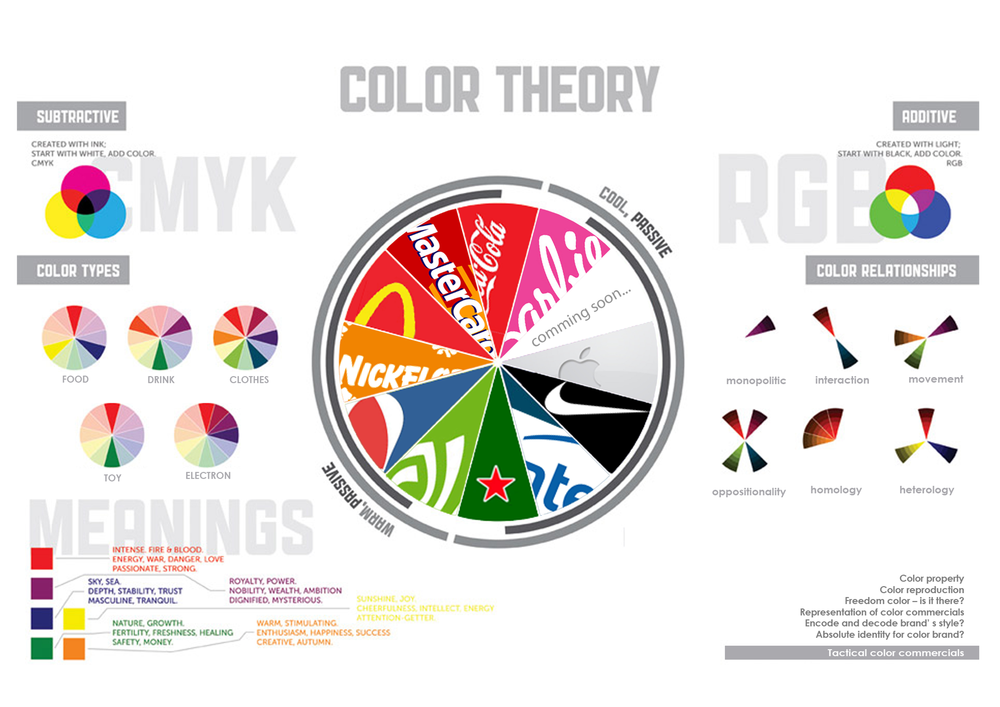

---
Pr-id: MoneyLab
P-id: INC Reader
A-id: 10
Type: article
Book-type: anthology
Anthology item: article
Item-id: unique no.
Article-title: title of the article
Article-status: accepted
Author: name(s) of author(s)
Author-email:   corresponding address
Author-bio:  about the author
Abstract:   short description of the article (100 words)
Keywords:   50 keywords for search and indexing
Rights: CC BY-NC 4.0
...

# **4th Story – Attention: Stolen Treasure**

In the annals of the *Cyber Village*, the fourth tale—titled *Attention:
Stolen Treasure*—begins in the bustling cyber bazaar, a digital
crossroads of trade and deceit. From the dawn of communal gatherings
around ancient fires to the sprawling digital forums of today, the art
of advertising has been a constant, calling out to the collective
consciousness of societies.[^06chapter4_1] Historically, the resonant call of town
criers once harnessed the power of the voice to captivate, their words
carrying the weight of commerce and the messages of political change.
Evidence indicates that ancient Egyptians made use of papyrus to create
sales messages and wall posters.[^06chapter4_2] Artifacts bearing commercial
messages and political campaign notices have been found in the ruins of
Pompeii and ancient Arabia. In ancient Greece and Rome, papyrus was
frequently used for lost and found advertisements. Moreover, wall or
rock paintings served as a method of commercial promotion, a form of
advertising that persists in many parts of Asia, Africa, and South
America to this day.

The use of commercial and non-commercial messages to attract attention
is an indication of an organized society where information is used to
connect individual community members. A small group of the
economically-, politically-, and socially-privileged targets a large and
underprivileged group. Advertising media is an essential
attention-grabbing channel that embodies a stratified society model,
where those who dominate the distribution of information are able to
impose their purposeful messages on various target groups. Historically,
attention is an important target of advertising practitioners from the
initial period. However, the techniques of appropriating the attention
of the community have constantly changed in different periods of time.
The more *sophisticated* the attempts to appropriate attention, the more
intense the human sufferance becomes, and the more the *unconscious
tension of societies* increases.

## Tracing the Stolen Treasure

We journey back to a time before the airwaves buzzed with the relentless
pursuit of consumer attention, a time when advertisements spoke directly
and sparingly to their small, local audiences. Back then, with their
modest production capabilities and limited distribution, advertisements
were woven intimately into the fabric of daily life, often carrying a
weight of reliability that modern commercials can scarcely claim. Each
message served not just as a beacon for goods or services but as a
thread in the tapestry of communal knowledge. In these communities, the
scarcity of information did not cloud judgment but rather sharpened it,
allowing for a direct and discerning engagement with the few
advertisements that dotted the landscape. This era, marked by an
inherent trust in the sparse promotional messages, contrasts sharply
with today's barrage of often dubious claims, inviting us to ponder the
profound shifts not only in how products are sold but in how truth
itself is marketed and consumed.

As an example, the first printed advertisement was a bronze plate dating
from the Song Dynasty (10th to 13th AD). It used to print posters on
a square paper with a rabbit symbol and the words *Jinan Liu's Fine
Needle Shop*.[^06chapter4_3] Written above and below the copper printing plate were
the sentences ‘We buy high-quality steel rods and make fine-quality
needles, To be ready for use at home in no time’. These messages
identified the clear purpose of drawing customers’ attention and
establishing a robust reputation for the shop.

 

In Europe, when the towns and cities of the Middle Ages began to grow
and the general population was yet unable to read, instead of signs that
read *cobbler, miller, tailor, or blacksmith,* images related to their
trades would be used, such as a boot, a suit, a hat, a clock, a diamond,
a horseshoe, a candle or even a bag of flour.[^06chapter4_4] Most of these
advertisements directly introduce the products and services to to
attract the attention of customers.

In the 18th century, advertisements began to appear in the English
weekly newspapers. These early print advertisements were used to
advertise books and newspapers, which became increasingly affordable
with the advancement of the press.[^06chapter4_5] Parallel with this efficient
production and distribution of commercial information, the emergence of
false or *quack* advertisements was observed in the field of promotions.
False pharmaceutical advertisements became a serious social problem, and
skepticism about advertising arose, leading to the development of
regulations for advertising content.

By the middle of the 19th century, mass production had become
commonplace as a result of the commercialization that connected
continents, this driven by colonialism throughout the globe. Printing
techniques developed rapidly. The demand to promote products and
services lead to the birth of the advertising industry. In this period,
biscuits and chocolate became products for the masses. The British
biscuit manufacturers were among the first ones to introduce the idea of
a brand to distinguish between grocery products.[^06chapter4_6] Huntley & Palmers
cookies, one of the first global brands in the world, were sold in 172
countries in 1900, and their global reach was reflected in their
advertisements.[^06chapter4_7]

 

La Press, one French newspaper, was the first to set up paid
advertisments on its pages in June 1836. This advertising service
resulted in lower pricing for the newspaper, expanding its readership
and increasing profitability. Soon after, this formula was copied by
other news publishers.[^06chapter4_8] In the 1840s, Volney B. Palmer founded the
base of the modern advertising agency in Philadelphia. In 1842, Palmer
began to purchase a large amount of space in various newspapers at
discount prices, and he then resold the space to advertisers at higher
prices. At that time, the copy, layout, and artwork was still prepared
by the advertising companies. As a matter of fact, Palmer was the
earliest space broker.[^06chapter4_9] The spatial element in newspapers had become,
by then, a commodity in the supply chain for the advertising production
process.

N.W. Ayer & Son's first full-service advertising agency was founded in
1869 in Philadelphia. Ayer & Son offered to plan, develop and execute
complete advertising campaigns for its clients. In the 1900s, the
advertising agency had become the creative planning provider.
Advertising established itself as a profession.[^06chapter4_10] In the meantime, in
France, Charles-Louis Havas expanded the services of his news agency to
include advertising brokerage, making it the first French group to
organize advertisement space in the newspapers.[^06chapter4_11]

Public spaces were also gradually commercialized into areas for
advertising. Signs appeared in stores and advertisements in newspapers
while advertising posters were produced and displayed throughout the
city. The promoted posters also appeared on public transport vehicles to
attract the attention of passersby in the early part of 20th
Century.[^06chapter4_12]

 

By the beginning of the 20th century, targeted advertising tactics had
been introduced through the practice of Thomas J. Barratt of London,
known as *the father of modern advertising*.[^06chapter4_13] Consulting for the
Pears soap company, Barratt formed various influential advertising
campaigns to promote the products of the company, which involved
targeted slogans, images, and phrases. One of his slogans, ‘Good
morning. Have you used Pears' soap?’ was very well known in its day and
throughout the 20th century.[^06chapter4_14] In 1882, Barratt collaborated with
the English actress, Lillie Langry to create the poster-girl for Pears;
this role resulted in Langtry becoming the first celebrity to endorse a
commercial product.[^06chapter4_15] Being the company's brand manager in 1865,
listed as the first of its kind by the Guinness Book of Records, Barratt
introduced many of the crucial ideas that lie behind successful
advertising, which were circulated widely in his time. Thomas J. Barratt
emphasized the importance of a strong and exclusive brand image for
Pears, highlighting the product’s availability through saturation
campaigns. He also considered the importance of constantly reevaluating
the market for changing tastes and mores. In 1907, he asserted that
‘tastes change, fashions change, and the advertiser has to change with
them. An idea that was effective a generation ago would fall flat,
stale, and unprofitable if presented to the public today. Not that the
idea of today is always better than the older idea, but it is different
– it hits the present taste.’[^06chapter4_16]

 

In the late 19th and early 20th centuries, the development of the
1st and 2nd industrial revolutions initiated a mass production
period which eventually led to overproduction. Consequently, the supply
of goods would grow beyond consumer demand. To be able to sell products,
businesses began to use advertising as a means to bring their attention
to and persuade customers to purchase. Modern advertising flourished
during this period. The sophisticated advertising tactics that aimed to
manipulate consumer spending have contributed to the formation of modern
consumerism. From that time onward, consumer attention has been captured
by business interest. Various scholars argued that
‘pre-twentieth-century advertising is almost portrayed universally as a
simple announcement, contrasted with the cunning sophistication and
subtlety of contemporary versions.’[^06chapter4_17]

In the 1910s and 1920s, advertisers in the US applied the doctrine that
human instincts could be targeted and influenced, which *sublimated*
into the desire to buy goods.[^06chapter4_18] This is the mass manipulation method
initiated by Edward Bernays, nephew of Sigmund Freud and founder of
modern public relations, who was previously mentioned in Post 2 of this
writing. The core of Bernays' communication philosophy is *linking*
mass-produced goods to the *unconscious desires*; it's all about
directing *consumer attention* to their *inner selfish desires*, and the
media will suggest ways to satisfy those desires with solutions,
products, and services.[^06chapter4_19] Influencing human instincts by tactical
scenarios has been the most profound intention of advertising from the
20th century until the present.

In the early 1920s, radio stations were founded firstly by radio
equipment manufacturers, and then non-profit associations such as
schools, clubs, and civic groups also installed their own stations.[^06chapter4_20]
Retailers and consumer goods manufacturers quickly discovered the
prospect of radio to reach consumers in their homes, and soon these
businesses adopted advertising techniques through this medium. Slogans,
mascots, and jingles became familiar on the radio in the 1920s and
television in the early 1930s.[^06chapter4_21] Capturing public attention with
sound became the most prevailing advertising method of the early 20th
century. Advertising revenue in developed countries such as the US has
increased rapidly since that time. There is recorded information – such
as in the 1920s, under Secretary of Commerce Herbert Hoover–about the
American government remarkably compelling advertising. Hoover himself
transmitted an address to the Associated Advertising Clubs of the World
in 1925 called ‘Advertising is a vital force in our national life.’[^06chapter4_22]
In October 1929, the head of the U.S. Bureau of Foreign and Domestic
Commerce, Julius Klein, confirmed that ‘Advertising is the key to world
prosperity’.[^06chapter4_23] According to a 1933 European economic journal, this
was part of an *unparalleled* collaborative situation between business
and government in the 1920s.[^06chapter4_24]

The rise of mass media allowed brands to bypass retailers by advertising
directly to consumers. It was a paradigm shift that forced manufacturers
to focus on brands and to stimulate the need for understanding
purchasing habits, usage behaviors, and the needs and aspirations of
consumers.[^06chapter4_25] The first series of radio drama was financed by soap
producers. The genre became known as a soap opera.[^06chapter4_26] Before long,
radio station owners realized that they could increase advertising
revenue by selling 'airtime' in small chunks of seconds or minutes that
could be sold to multiple businesses. By the 1930s, these packets of
time for advertising became well known and were being sold by the
station's geographical sales representatives. Starting from the era of
radio advertising until today, the *golden times* or *prime time* has
been generally sold at the highest prices which has been associated with
the intensity of social attention.[^06chapter4_27]

By the 1940s, manufacturers began to notice how buyers developed
personal relationships with their brands in a
social/psychological/anthropological sense.[^06chapter4_28] To collect consumer
purchasing information, advertisers began to use motivational research
and consumer research. For example, the forcefully branded campaigns for
Chrysler and Exxon/Esso used insights-drawn research methods from
psychology and cultural anthropology, which opened some of the most
enduring campaigns of the 20th century.[^06chapter4_29]

In the early 1950s, the Du-Mont Television Network initiated the modern
practice of selling advertising time to multiple sponsors. In some
cases, sponsors exerted intensive control over a show's content,
allowing advertising agencies even to write TV shows themselves.[^06chapter4_30]
The public interest and attention have been directed to constructed
program scripts. From then on, advertisements shifted significantly from
direct to indirect persuasion methods.

By the 1990s, the emergence of the internet ushered in a new period in
advertising techniques. The attention of society began to shift from
offline spaces to online spaces, and desktop advertising was born. The
appearance of ad servers drove the online advertising development that
contributed to *the* *dot-com boom* of the 1990s.[^06chapter4_31] Most businesses
operated solely on advertising revenue. The principal part of desktop
advertising in the early period of the internet age utilized contextual
advertising shown on website interfaces, banner advertising,
pay-per-click text, and e-mail marketing. Through these ad forms, page
owners could find additional revenue streams to support their content.
For instance, the online service Prodigy displayed banners at the bottom
of the interface to advertise Sears products.[^06chapter4_32] In 1993, the first
clickable web ad was sold by Global Network Navigator to a Silicon
Valley law firm.[^06chapter4_33] Web banner advertising was considered the
mainstream of online advertising when HotWired, the online component of
Wired Magazine, and Time Warner's Pathfinder sold banner advertising to
AT&T and other companies in 1994.[^06chapter4_34] The first AT&T ad on HotWired had
a 44% click-through rate, and instead of directing clickers to AT&T's
website, the ad linked to the online tours of the world's most famous
art museums.[^06chapter4_35]

With the emergence of innovative technologies in the 1990s, the
interactivity of advertising methods increased. The ability to measure
the reach of advertising entered a new stage, wherein relying on
computational statistics had become much more accurate and simpler. The
attention of targeted audiences was measured based on user engagement
with the online ad. Through methods of stimulating user interaction with
the applications—such as mobile apps—the navigating techniques on
devices have been continuously developed and lead users into the
advertising matrix.

Based on the combination of various tactics and strategies throughout a
long period of time, and with the support of technological achievements,
the advertising of the 21st century transfers the methods of domination
and manipulation into digital formats that are comprehensively
*appropriating* public attention, revealing mechanical subtlety, and
boosting the development of a *tension society*. The emergence of social
networks, smart devices, and virtual assistants has created a deep
connection between people and the digital environment. At the same time,
it has also created giant storage covering the data of billions of users
on the platform. Big data and AI have significantly contributed to
supporting the advertising industry in terms of ~~a~~ better
understanding the unconscious desires of users. Through investigation of
individual profiles, machine learning algorithms have been programmed to
send the right advertising messages, at the right time, to target
customer psychology and manipulate customer decisions.

To some extent, users have become the victims of the *emotional &
psychological trauma* created by consumerism and the digital advertising
industry. This trauma manifests as excessive exploitation for attention,
bewilderment by intertwined states of euphoria and anxiety, frustration
with discontentment with what one possesses, and exhaustion of physical
and mental resources. The tension level in contemporary societies is
increasing. Stress is considered a common psychological phenomenon in
modern humans. According to The US National Library of Medicine, ‘stress
is a feeling of emotional or physical tension.’[^06chapter4_36] This psychological
state is partly rooted in external factors, such as the social
environment, and the functioning of the economy, politics, and
contemporary culture in which advertising plays a remarkable role.

###The tension caused by visual stress

‘The power of marketing is always the power of getting someone's
attention’[^06chapter4_37] – Naomi Klein.

Every day people are faced with visual overload in their environment, an
abundance of attention signals. Both online and offline spaces have been
invaded, and every single *visual destination* is constantly navigated
and dominated. Capturing the attention in public spaces is an essential
interest of advertisers. Most bus stops, metro stations, airports, city
roadsides are filled with billboards, from large to small, from unlit to
lit, from printed posters to digital billboards. Regularly, there are
advertising spaces seatbacks of trains and buses as well, where people
are forced to stare during their journeys. Institutions and universities
also allow private companies or corporations to display products and
sell goods in their premises. Several coffee chains have even branded
themselves as the name of libraries. For example, Starbucks cafe has
appeared in the libraries of university around the world.[^06chapter4_38] Their
logos and signs are ubiquitous, especially in public places that attract
the most views. According to Naomi Klein, the author of the book *No
logo*,the invasion of the large franchise has created a *no space*
society where people have no right to privacy, even in public
spaces.[^06chapter4_39] Plenty of areas that used to be public spaces, have become
just *pseudo-public spaces*. Personal space is also no longer personal
because of the aggression of brands and advertisements. People see
advertising products attractive images everywhere, in books, magazines,
on household items or on devices such as radio, TV, computers and
phones.

![Figure S4. 5: Students wait in line at a Starbucks store inside the
Suzzallo Library (Photo by Assunta Ng) ©nwasianweekly.com.[^06chapter4_40]](imgs/TRA_Figure S4. 5.jpg)

 

In parallel with the offline environment, all *visual destinations* in
cyberspace are also dominated by colours, symbols and moving images of
brand signals. All users enter cyberspace with device interfaces, where
the logo of the digital brand is first displayed. Following is the
appearance of a series of icons, the other visual signal, that is
targeting the attention of users. Advertising on website interfaces has
become an unavoidable familiar element for users. Email and spam
advertising are frustrating many people. Pop-up advertising on
entertainment service interfaces and social networks has become the most
obvious stressor that millions of internet users now face. The intensity
of advertising signals at all times and in all places is a salient
factor that contributes to stress experienced in contemporary society.

The colorful world has became the racetrack of brands. Color is a
concept that has been constructed through human perception. Brands
attempt to appropriate specific types of color and connect them with the
perception of customers about their brand. Color has played an important
role in branding attention tactics; hence, there is a competitive race
between brands to target customers through color. In online space
especially, digital codes of colors are used to specifically connect
with the identity of brands.[^06chapter4_41]

 

Brand identity plays a significant role in differentiating a business
from the rest of the competition in the market. Therefore, identity
elements are included in the majority of design products. Fashion
design, for instance, is using styles, materials and colors to identify
their differentiation. Interface design takes graphic details and
interactive movements as identifying signals. Various types of designs
have paid special attention to highlighting the brand element. Designers
have been trained carefully and comprehensively in a variety of visual
principles and design methods in order to attract the viewer. The more
successful the designs, the higher the visual appeal.

Design strategies are continuously generating new ideas and building
impressive images and scripts. Advertising design in particular applies
visually attractive methods in order to draw the attention of the viewer
through creative and novel elements. In the present, we are being
surrounded by designed environments, from living habitats to virtual
habitats, and our visual attention is appropriated continuously and
professionally.

![Figure S4. 7: The drinkable TV advertising ©tunedglobal.com.[^06chapter4_42]](imgs/TRA_Figure S4. 7.jpg)

 

### Stress for the meaningless struggles

In addition to the effects of various visual strategies, the
metaphorical images, indirect contents and hidden tactics of marketing
campaigns also create a constant stress for consumers. With their
attention targeted by many things, people face a large amount of
detrimental information. French sociologist, philosopher and cultural
theorist Jean Baudrillard in his book *Simulacra and Simulation* wrote:
‘We live in a world where there is more and more information and less
and less meaning.’[^06chapter4_43]

Contemporary society is confronted with a crisis of *information
overload*, in which simulacra - images and symbols - begin to take
precedence over reality itself. The cultural symbols are challenging the
reality, advertising playing a critical role in accelerating the
production of these symbols. Through media and advertising campaigns,
products and services are skillfully transformed into social cultural
representations that pretend to be the essential truth or unconditional
needs, thus creating the desire for possession. In other words,
‘advertisements manipulate the relation between ‘meaning’ and ‘reality’
by appropriating pre-existing meanings to add value to unrelated
products, and posits methods of decoding their true underlying
significance’.[^06chapter4_44] For example, to connect with the cultural values,
numerous classical paintings have been used to advertise products or
services.

![Figure S4. 8: Da Vinci’s Last Supper reimagined as a gambler’s table
©tiqets.com.[^06chapter4_45]](imgs/TRA_Figure S4. 8.jpg)

 

Local cultural symbols have also been connected regularly with the image
of products and services by global corporations. One of my former work,
*Cultural Symbols of ‘Tet’ Holiday in Vietnamese Urban Lifestyles on
Video Advertising*, introduced the manipulation of corporations on
cultural symbols through video advertising in Vietnam.[^06chapter4_46] The images
of Coca-Cola, Sony, P&G and Unilever have been associated strongly with
with the cultural image of the Tet holiday, the New year festival of
Vietnamese. Integrating, connecting, and blurring the boundaries between
cultural symbols and product images is presented in the interactive
work, Cultural Symbol Store, which I exhibited in 2012.

![Figure S4. 9: Cultural Symbol Store ©Tra Nguyen.[^06chapter4_47]
](imgs/TRA_Figure S4. 9.jpg)

 

Movie stars, cultural idols or political personalities are positioned as
symbols of beauty, wealth, power and satisfaction, and they have been
efficiently used to connect brands and customers from the 20th century
to the present. A glamorous super model, an actor in elegant outfit, or
a wealthy professional sportsman has become a living symbol for many
customers.

![Figure S4. 10: Tennis champion Roger Federer stars in Mercedes SUV
advertisement. ©al.com.[^06chapter4_48]](imgs/TRA_Figure S4. 10.jpg)

 

The constructed social symbols have thus become the basis for defining
one’s ego. Consumer *sense of self* is directly connected to the feeling
of having and possessing items.[^06chapter4_49] The promotional images have
effectively linked products, services and social symbols with the ego of
the customer. Customers are taught to crave the perfect bodies, elegant
looks and luxurious living spaces. All these intend to give customers
psychic powers about themselves.

However, the present struggle to assert the personal self is not much
different from the race to assert the consumer's self, the asserting
of shopping ability, consumption, and ownership.

Advertising and marketing have created fake relationships between
customers and products through symbols. Going beyond the stimulation of
demand for specific products, advertising generates consumption as a
specific behavior. At the end of the 20th century, people witnessed a
significant decline in the importance of instrumental, utility-driven
consumption and a remarkable expansion in *symbolic consumption*.[^06chapter4_50]

The advertising industry has driven the *sign economy* to bloom,
creating a cultural production system based on symbols.[^06chapter4_51] Advertising
has played a social-oriented role, dominating the worldview and
lifestyle of the majority of individuals. The *Consumer's Self* has
navigated the awareness and actions of each individual. Ownership is the
driving force of consumer society. Contemporary life is all about the
desire for difference and the expression of identity through the display
of sign values. The *no fact* *scenario* of the struggle to assert the
individual self has been constructed through images, symbols and icons.
In the last paragraph of the book *Ways of Seeing*, John Berger wrote:
‘Capitalism survives by forcing the majority, whom it exploits, to
define their interests as narrowly as possible. This was once achieved
by extensive deprivation. Today in developed countries, it is achieved
by imposing a false standard of what is and is not desirable.’[^06chapter4_52]

### Stressed by irrational desires and fears

For the majority of economic and political planners, masterminding and
manipulating the public psyche is the essential method modeled and used
since the 1920s until now. The applications of Freudian psychoanalysis
to public relations and advertising continuously developed and has
become much more threatening today. With the help of machine learning
algorithms, the psychological methods are constantly perfected. Public
manipulation tactics have been implemented efficiently through
intelligent device systems.

Cyberspace has turned human emotions of happiness, satisfaction,
anxiety, and fear into a type of product. The unconscious mind is
investigated, surveyed, and evaluated by machines based on user data
recorded through digital activities. The frequent concerns and interests
of users have been recorded through search engines or traces of HTTP
cookies. User habits are collected through personal devices, such as
information about their routine time, regular travel routes and daily
activities. From the information related to the user's personality, the
algorithms analyze and make judgments about the characteristics of an
individual mindset. The data related to the unconscious mind of each
individual is the target product of contemporary advertising. Based on
the characteristics of psychological data products, the advertisers
adjust the process of producing and delivering advertisements. *Fears of
loss* as well as longings for possessions are pushed to the extreme by
targeted advertising delivered at the right time and to the right
audience. Knowledge of user irrational desires and fears is the basis
for *psychological manipulations* to work more effectively and easily.

Online advertising connects minds of users deeply to fake illusions,
removing people from their life of reality, they have been guided to
associate mostly with the past and worry about the future. In the words
of John Berger: ‘Publicity images also belong to the moment in the sense
that they must be continually renewed and made up-to-date. Yet they
never speak of the present. Often they refer to the past and always they
speak of the future.’[^06chapter4_53] Advertising frequently projects the
deficiencies of the past and the perfect images of the future to
consumers. At the same time, online marketing campaigns regularly build
up different new social standards and provide various personal social
envy to the crowd. Those jealousies create the feeling of craving and
add glamor to products and services. Anxiety and jealousy have driven
consumers to constantly fill up for what they did not own yet, and it is
a uninterrupted process. Prolonged stress and exhaustion are common
living conditions in this time and age.

For example, the desire to own the new version of electronic devices has
been sprinkled into the minds of consumers by marketers of electronic
corporations. Every year, cell phone products of big brands such as
Apple, Samsung and Huawei, launch a new model. The advertising campaigns
of these products continuously create the desire to own and change
devices annually for consumers, especially among young people. New
devices are often promoted with new features, and new aesthetic
appearances; but most importantly, these updated devices promise to
represent the trendiness, stylishness and high social status of the
owner. Each year millions of young consumers spend approximately \$1300
each to update their self-image by owning new devices. The impressive
numbers for iphone sales are a good example: 5 million iPhone 13 series
were sold in China on the first day of pre-order in 2021.[^06chapter4_54] With the
introduction of the new model, the previous one quickly became useless,
even though it had been used for only one year. In this case, the
essence of uselessness is identified by the incapacity to *show off*
rather than by the inability to operate. The device's functionality has
been gradually forgotten. The equipment waste and high investment in
personal items have led to various social and environmental problems.

Female anti-ageing products are another example of how advertising
generates the fear of consumers. Based on the common unspoken fear of
getting old, anti-ageing products generate a sense of frustration among
the elderly. Navigated by the hidden intentions of advertising, a biased
perception of the elderly has been established in contemporary
society.[^06chapter4_55] Specifically, advertising have a strong influence on the
emotions of women, depriving them of their self confidence through
prejudices about age. In parallel with creating anxiety from the dangers
of ageing, the advertisements also outline *up-to-date styles* with new
cosmetics and *age-defying* models and *magical anti-ageing products*.
The image of a better appearance in the future repeatedly stimulates the
demand for beauty. Various businesses guarantee that the use of
cosmetics and beauty services help a woman retain her youth forever.

Furthermore, to increase the attractiveness to and attachment of
customers, products and services also apply a number of psychological
strategies through different discount and promotion programs. Free
products, trial versions, promotional packages, and discount coupons are
sent automatically to user accounts. This practice generates unrelenting
desires and fear for online shoppers. The online marketing and
advertising industry has produced countless emotional states in
consumers. For example, emotional states include feelings of excitement
generated by free trials, happiness in receiving a particular product or
service without charge, and even worries about losing the opportunity
for free shipping. All of these marketing programs continuously
encourage consumers to spend time and energy on following brands, paying
attention to products and chasing free trials, discounts or promotions.
Unreasonable desires and anxieties continuously appear while people get
hooked on sales and marketing tactics. The more costumers see and buy,
the more they find it insufficient for the fulfillment of their own
desires. Overall, these marketing scenarios induce stress in the
consumers’ unconscious. This irrational feeling of tension exists in
parallel with the temporary comfort and excitement created by
advertising.

Applying manipulation and deception techniques of commercial
advertising, non-commercial advertisements also use similar schemes.
Numerous presidential campaigns or referenda in many countries have been
dominated and manipulated by psychological methods through data analysis
systems. To influence the crowd, political marketing also uses various
tactics to control the unconscious minds of people through automatic
information systems. During President Trump's campaign in 2016,
Cambridge Analytica secured a \$15 million investment from Robert
Mercer, the wealthy Republican donor, in order to use the machine
learning algorithms that could identify the personalities of American
voters and influence their behavior. According to former Cambridge
employee Christopher Wylie, the company collected personal information
from the Facebook profiles of more than 50 million users without their
permission, making it one of the largest data leaks in the history of
the social network. The breach allowed the company to exploit the
private social media activity of a large number of American voters,
developing the techniques that underpinned its work on the success of
the 2016 U.S. presidential election for Donald Trump.[^06chapter4_56] Based on the
insight about user psychographic characteristics, Trump’s supported
media companies repeatedly sent fake news, smearing the image of Hillary
Clinton – the opponent in the election, as well as creating the idea of
a frightening future associated with the victory of Hillary’s party. In
parallel, positive messages associated with mystical spiritual elements
about Trump were also intentionally pumped into social networks,
creating excitement, hope, and high credibility for Trump.

The competition between *brands* and the race for power by *political
actors* maintains a certain tension within societies. Companies,
corporations, and organizations are now investing in and applying new
technologies and manipulation techniques. The ability to control large
numbers of digital accounts has become the determining factor for social
power in the new era. Advertisements surround the users, targeting them
with different psychological tactics, and offer users specific
information, products, and services. Putting people in a state of being
forced to use and forced to choose gives present users *no choice*.
The permanent fear and desire in the unconscious mind of users, in some
cases, could develop into a form of mental illness. Today, consumers
have become subjects of psychological tactics applied in sales and
marketing.

Consumers have been promised the freedom to choose, and to be cared for
and listened to as special guests. However, in reality, they have very
few opportunities to make their own decision without the effects of
manipulated factors. Consumers constantly struggle with life, exhaust
themselves to earn a living, and pay for a fake freedom. The advertising
image is a stunning representation constructed by the dominant forces
for the play that gives freedom and democracy to the *consumer class*.
Yet, in fact, this play tries to cover all of the undemocratic problems
in society.

John Berger mentioned that ‘Everything publicity shows is there awaiting
acquisition. The act of acquiring has taken the place of all other
actions, the sense of having has obliterated all other senses’. However,
at the present, consumers are there instead, waiting on the internet
space for manufacturers, organizations, socio-political forces, service
providers, and media platforms to take their information, exploit and
manipulate them freely.

Digital capitalism now occupies both physical and virtual space,
controlling both physical and mental properties, appropriating the
energy, time and money of users, and dispossessing identities and egos
in various ways. Being forced to live in a stressful situation, with *no
space, no facts, and no choice* has become a common situation.
Advertising is an efficient persuasive product, as well as a tool for
manipulation that is an unavoided entity. The effects of advertising
strategies contribute to developing a tensive, insecure, and potentially
contradictive society. All in all, the unfair and stressful marketing
environment could push social distance further and further, and
stimulated by many other factors it might introduce instability to
future societies.

## Narcissistic Kingdom

In the present, the modern ideas of love are about *satisfying oneself*,
whereas the traditional ideas of love in a communal way were that people
surrender themselves to someone else. Giving oneself up has become a
thrilling and frightening thought of the majority of contemporary
individuals.[^06chapter4_57] The love associated with self-sacrifice is slowly
disappearing from life, while *individualism* that first surfaced in the
early 19th centurynow influences present-day society.[^06chapter4_58]

Social involvement and compassion are popularly considered significant
contributing factors to fatigue experienced by people in the face of the
complexities and chaos of reality. Give up the thought of sacrificing,
and just love yourself; give up the idea of caring and keep enjoying
one's personal life with the great world where products and services are
always available. This familiar flow of thoughts has generated many
concerns for current society.

Media and advertising have preached the idea of self-love throughout the
20th century, and until today. *Be yourself* has become a life motto for
many people. Existing independently has been considered as the way to
escape from collective exploitation. However, in fact, the majority of
contemporary people are bound and exploited by various hidden
exploitation forces. Instead of detaching from the exploitation of
organizations, institutions, religious and political communities, the
ideas of individual independence are appropriated by capitalism. By
supporting individualism, capitalist logic intentionally *separates* the
crowd, helping the exploiters more efficiently *control* and
*manipulate* the public.

Protestants admit that man has a personal relationship with God. This
tenet powerfully contrasts Protestantism with the practices of
Catholicism wherein adherents are more commonly expected to follow and
obey the church hierarchy. The separation of humans from powerful
systems is a revolutionary idea. However, this detachment from religious
institutions simultaneously generates another form of attachment.
In *The Protestant Ethic and the Spirit of Capitalism*, Max Weber cited
the Protestant idea of a personal relationship with God as one of the
main motivations that allowed capitalism to emerge.[^06chapter4_59] The detachment
of oneself from the collective also promotes the desire for private
property and the hope to become a master.

In Eastern countries, where Buddhism has an enormous influence, the
ideas of *introspection, self-cultivation,* and *self-love* are also
exploited and amplified by the logic of capitalism. Classical Buddhist
philosophy, considered the enlightenment pathway, can be practiced
easily through various ways. Although the *non-self/egolessness* is one
of the important doctrines of classical Buddhism, the popular Buddhist
approach that circulates widely on social media seems to be rather
different. [^06chapter4_60] Brands promote modern populist Buddhist ideas with the
following tips: leave the turbulent life; protect all sentient beings;
return to the inner self; be friends with oneself; and practice
self-love. For example, ‘Touch your heart,’ and ‘Speak your way’ are
common slogans in Vietnam.[^06chapter4_61]

From East to West, advertising has encouraged all society members to
express themselves with these snappy, captivating slogans such as
‘Because I’m worth it’[^06chapter4_62], empowering consumers to ‘Have it your way’^63]and
‘It’s everywhere you want to be’.[^06chapter4_64] The
advertisement also firmly asserts ‘Your passion, our strength’, and we
will stand ‘On Your Side’.[^06chapter4_65] [^06chapter4_66] In general, contemporary
individuals are driven to believe that they hold the care of
institutions, organizations, parties, information providers, services,
and products. The strong belief in personal power is nurtured daily by
propaganda and advertising campaigns.

In addition, at the end of the 20th century, the Cold War period shaped
various emerging social phenomena, such as the crisis of social trust,
the acceleration in international trade, the advancement of computer
science, mass automation and global internet connectivity. To face these
remarkable changes, instead of confronting the complexity and chaos of
society, the leaders of both private and public sectors have decided to
create a *fake* and *simple* social environment. They have simplified
society by coding the complex issues in several cases of mass
representations, grouping complicated problems into one or two
directions to provide solutions. The rigid and inhuman categories of
gender, race and ethnicity are clear examples of the irresponsibility of
the above mentioned simplistic social management.

Moreover, the organizers and/or controllers have also been very
successful in creating social norms through symbols of consumption,
building a society consisting of confident and isolated individuals.
In *The Society of the Spectacle*, Guy Debord wrote that ‘The reigning
economic system is a vicious circle of isolation. Its technologies are
based on isolation, and they contribute to that same isolation. From
automobiles to television, the goods that the spectacular system chooses
to produce also serve it as weapons for constantly reinforcing the
conditions that engender *lonely crowds*.’[^06chapter4_67]

An unfair society where most interests belong to a small group, and the
majority of individuals live in tension, discontent, and instability, is
a society with potential struggles and resistance. Obviously, from
various events of the last centuries, the rulers and the wealthy owners
were threatened by collective power–the dangers of revolutions and class
struggles. The failure of the old capitalists warned the contemporary
capitalists to be wary of the collective power of the precarious class.
The division is an efficient method of restraining the forces of
struggle. Therefore, the motivation to divide society, turning society
into a gathering of lonely people, becomes the hidden agenda of
contemporary capitalist society. In *Media Control: The Spectacular
Achievements of Propaganda*, Noam Chomsky also assumed that ‘The rest of
the population ought to be deprived of any form of organization, because
organization just causes trouble. People have to be atomized and
segregated and alone. They're not supposed to organize, because then
they might be something beyond spectators of action.’[^06chapter4_68]

Individualism has been multiplied as a *psychological strategy* in the
current living environment. The enormous capacity of server systems and
machine learning methods allows for more efficient implementation of the
social divide. Each individual is represented by one or eventually
several digital profiles where all their information about demographics,
psychographics, and behaviors can be systematically recorded. Once
machine learning systems know users better than themselves, digital
powers such as media centres or platforms have the potential to easily
influence the unconscious mind of the users and navigate their decision.
Surrounding the users with numerous means and information, making them
love themselves more and more, and encouraging themselves to express
their egos while caring for themselves, digital businesses efficiently
nurture the consumer self of each individual.

Indeed, contemporary capitalism creates the ideal conditions for
consumers to realize slef-love. With only one click, technology delivery
services are ready to deliver various commodities to consumers in order
to express themselves, from cars to clothes, all manner of *products*
that they can use to express their identity. Parallel with user
activity, covert personal data mining dominates cyberspace. Employing
user information to coordinate advertisements or propaganda messages,
influencing user perceptions and emotions, and manipulating user
behaviors, all are automatically implemented by algorithms. In the words
of many CEOs in Silicon Valley, ‘This is incredibly
efficient’.[^06chapter4_69] This smooth, seamless process of manipulation by
platforms targets the user upon entering cyberspace, placing the user in
the ‘You’re done’ situation, like the slogan of Amazon.[^06chapter4_70] 

The growing significance of individualism and the enormous support of AI
technology have fueled the growth of *personalized marketing* and
*targeted advertising*. The traits of the promoted product or targeted
person are considered the main factors for producing and distributing
advertisments. Product and service characteristics are often provided
intentionally by the businesses themselves as they are also the
advertising sponsors. While personal information is being recorded and
exploited non-publicly against the intentions of the users. Individual
characteristics are normally formed through demographic information that
focuses on race, nationality, economic status, gender, age, generation,
education level, income level, and employment status, or psychological
traits that focus on consumer values, personalities, attitudes,
perspectives, lifestyles and preferences. The characteristics of users
can also be recorded through behavioral variables, such as browser
history, purchase history, and other recent online activities. At
present, personal traits in cyberspace have often been collected and
recorded through search engines, websites, social networks, Internet
Protocol television, Mobile devices, and Smart electronical devices.

*Personalization* is a common notion for online services strategy today.
Usually, the personalized functions are propagated tendentiously as a
superior feature for user online experiences.[^06chapter4_71] The personalized
services, such as personalized search results and personalized
advertising are being introduced as tools of miraculous convenience for
users. Whenever the users turn on the personalized features of their
electronic devices, web browsers and search engines the digital service
providers may record user passwords, search history, and the address of
the pages they visited. With the activation of a personalized function,
the users do not need to log in back and receive targeted information
suitable for them. Providers may especially suggest specific products or
services that they have been, or will be interested in. The
personalization process enables providers to efficiently collect
*personal data*, the crucial raw material for the data industry.
Personal data is also the backbone of database marketing and the
foundation resource of programmatic advertising. A major part of
political propaganda and business advertising is applying and exploiting
personalized digital strategies because ‘it's incredibly efficient’.

Personalized functions have obviously generated the pleasure and comfort
experience for users, which is the reason why users generally rarely
hesitate to turn on the personalization features of digital products and
services. At the same time, personalization is a persuasive reason for
the activities of recording, exploiting, and manipulating user behavior; it is an influential tool in
the age of AI information technology.

Using search engines to understand users and reach targeted audiences is
one of the most common types of personalized marketing in cyberspace at
the present. The searching keywords, the IP address, the HTTP cookies,
and interactive behaviors related to users are the clues for knowing
customer interests. The combination of account information and browsing
data is considered an input source that determines the targeted online
display advertising. Advertisements on the web banner or promoted
messages on web interfaces are mostly navigated based on data from the
search engine’s system. The platform companies do not only use the
browsing information of billions of users for delivery advertising
inside their system, but they can also commercialize this valuable
social statistical information across the data market.

It is a common understanding that the most popular keywords are
connected to the most interesting issues, products or services; and it
is also believed that the rank hierarchy of search results indicates the
reputation of websites, organizations, companies, or products. The top
search results are considered the most popular search interests.
However, the connection between the business or political reputation and
top search results can be fully manipulated. As a matter of fact, the
hierarchy of research results are constructed through the influence of
the platform’s algorithm and the control of government censors. In
numerous countries, the search results are displayed according to the
wish of government perception on any specific issue. Otherwise, through
investing in advertising on search engines, ad sponsors can also reach a
priority position on the search result list. Sponsored search
advertisements are sold typically through real-time auctions, where
advertisers bid for keywords. Moreover, setting a maximum price for each
keyword or bid can include time, language, geography, and other
constraints.[^06chapter4_72]

Applying targeted advertising within social media is the only other
focused strategy of information technology businesses. By encouraging
users to post their statuses, share their personal images, and express
their emotions (by emotional icons such as like, love or sad) comment on
the content of others, send messages and share the posts of others, the
providers of these social networking services collect user psychology
and behavior information easily. Aside from demographic and geographical
data, psychographics and behaviors are the critical data source for the
targeted advertising effectiveness. For example, Meta (formerly Facebook
Inc) collected massive amounts of user psychology and behavior data from
their surveillance infrastructure on the different platforms such as
Facebook, Instagram, and WhatsApp. The personal photos from Instagram,
the private conversations on WhatsApp and the interactive activities on
Facebook are valuable data that can be used to depict the
characteristics of a given user.

News Feed is an important feature of Facebook that employs users’ data
analysis system to influence the users. Based on insight about
customers, this platform shows users the *breaking news* related to
them, their friends and relatives, and shared sociocultural information
or the *pretended prominent information*. The personalization and
customization functions of News Feed are no different from *personalized
newspapers* set up by Facebook for each user. The targeted contents and
targeted distribution methods have remarkably increased the engagement
of users with Facebook.[^06chapter4_73] Similar to a tabloid dedicated to
advertising, the recent Facebook News Feed is filled with commercial
advertisements and propaganda information. Currently, this social
network platform publicly allows their general ad partners to use
comprehensive lists of various types of targeting options, including
user interests, demographics and behaviors.[^06chapter4_74]

Statistics of user behavior data are not only the basis for
*determining* and *predicting* customer interests and *navigating* how
each individual makes decisions, but it is also the *evidence for
evaluating* the effectiveness of advertising and the basis for the
advertising cost payments. There are several pieces of user information
that are used to charge sponsors, such as CPC - cost per click - each
time a user clicks on the advertisements; CPE - cost per engagement -
cost based not only on an ad unit loaded on the page, but also logging
whether that the viewer saw or interacted with the ad; CPV - cost per
view on video advertising; and CPI - cost per install, cost of
installing applications, most activities active on mobile advertising.

The digital personalized advertising process is usually a complex
operation that involves plenty of parties such as publishers,
advertisers, ad networks, and ad exchanges. In the simplest case, the
website publisher selects and serves the advertisement directly.
Publishers who run their own advertising departments use this method. Ad
services from online newspapers such as The Washington Post or The New
York Times may apply this technique. Alternatively, the majority of
advertisements are currently outsourced to an advertising agency under a
contract with the publisher and served from ad agency servers of which
Google and Facebook are specific examples. Ad space is normally offered
for sale in the bidding market using ad exchanges and real-time bidding
through agency servers. This automatic ad trading, producing and
delivery method is called programmatic advertising.

*Programmatic advertising* is the most important sales and delivery
advertising model in the age of AI and automation. With this method,
digital ads are circulated, generated and sold automatically across
websites and platforms through a software.[^06chapter4_75] The process of
producing, distributing, buying, and selling online ads between
publishers, advertisers, ad networks, and ad exchanges are potentially
implemented only through a complex, powerful and intelligent
computational infrastructure, conditions only available to the big
techs. At the moment, Google and Facebook are the two largest platforms
operating digital advertising based on the application of programmatic
sales and delivery models. In 2021, Google's share of digital
advertising revenues worldwide was around 28.6 per cent. Following,
Facebook's digital ad revenue share was 23.7 per cent, while Alibaba
came in third position with 8.7 per cent.[^06chapter4_76]

Owning the most massive, complex, and effective user personal data
mining system, Google and Facebook now dominate the contemporary digital
advertising market. Alphabet, the parent company of Google provides a
variety of products and services in cyberspace, such as the android
operating system, chrome web browser, Google search engine, Gmail
service, Google map, Google Drive, Google Translate, Google Meet, Google
Calendar, Google Play, GooglePay, Google Photo, Youtube, Google Business
and Google Ads. Notably, more than 80% of Alphabet's revenue comes from
Google ads, which generated \$147 billion in 2020 revenue.[^06chapter4_77] Most of
the services Google offers are free, in exchange for users *providing
voluntarily* their information for Google's data system through their
digital activities on Google services. Google users essentially become
the advertising target of all Google partners. The text format ads are
displayed automatically via email and message, image ads can be
displayed on partner web interfaces through Chrome, and video
advertising can appear on the social networking platform YouTube.
Location ads will soon become another popular ads product of Google on
Google maps 3D real-time street view.

Gmail had 1.5 billion active users worldwide in 2019.[^06chapter4_78] An estimated
3.2 billion internet users were using Chrome as their main browser on
over the world in 2021.[^06chapter4_79] According to Stat Counter, as of December
2022, Google's global search engine market share was at 92.58%,
absolutely dominating the business field of the search platforms.[^06chapter4_80]
As of 2023, YouTube has become the second biggest social media in the
world, with over 2.5 billion active users.[^06chapter4_81] Ranked first among
social networking service providers, Facebook owns 2.9 billion active
users globally at the beginning of 2023. Meta generated 114.93 billion
U.S. dollars in ad revenues in 202.[^06chapter4_82] The three influential social
networking platforms, Facebook, Instagram, and WhatsApp all belong to
Meta. Both Alphabet and Meta collect a massive amount of first-party
data (data collected directly from interactions with customers and
audiences and normally not shared publicly). At the same time, they have
become the trading center for various second-party data (indirectly
collected data and generally shared only with trusted partners) and
brokers for third-party data (indirectly collected data and commonly
shared with many companies).[^06chapter4_83] Google and Facebook *rule* the global
*programmatic targeted advertising market* by exclusively owning and
coordinating enormous amounts of data.

Digital personalized service providers create the feeling of a
free-of-charge, convenient working, entertaining and communicating
environment, where users can express themselves freely; they can type
angrily or beautifully or however they want into the internet at all
times, everywhere, when, in fact, the user-self in cyberspace is a
psychological illusion constructed by digital consumerism.
Personalization is a *brilliant trick* to divide users, to give
consumers a sense of individuality, and then, quietly categorise users
based on their digital profiles, place them into appropriate groups, and
sell them the same kind of product, while creating for them the same
identity. The act of tracking, dividing, observing, investigating,
classifying and giving the same identity character for clusters of users
in the present does not seem much different from the previous
anthropological surveys conducted by colonial countries. In the other
words, programmatic targeted advertising contributes significantly to
the establishment of cyber-colonialism.

Moreover, targeted advertising essentially works based on the predicted
behavior of the online customers; thus, *user prediction* is considered
the main task of the AI advertising system. Almost all shopping,
investment or election decisions are future-oriented, which will occur
after the users accessing advertising; therefore, predicting user
psychology and behavior is an important task in dominating and
manipulating user decisions. After determining the *customer type*, the
machine learning system predicts what information will be appropriate to
influence that person. For example, if the user is a regular customer of
Coca-Cola, the advertisement for Pepsi drinks will necessarily need to
be different from advertising to Pepsi loyal customers.

Predicting the future has always been a human aspiration from ancient
times; it is the basis to make reasonable changes and to navigate life
in a beneficial direction. Digital capitalism has exploited this
principle very effectively. The algorithms of the deep learning method
in the present are able to make rather accurate predictions about what
will happen in the future. The weather forecast is a good example. The
large server systems of weather forecasting centers are able to process
high volumes of data taken from reality to make forecasts for the near
future weather patterns. For example, IBM's The Weather Company - the
World's Most Accurate Forecaster - runs on an IBM POWER9 supercomputer;
this global weather model updates hourly and at a 3 – 4 km resolution to
create the most accurate weather picture presently.[^06chapter4_84] Business
prediction through data analytics is another example of using machine
learning technologies. Based on previous business data and common impact
factors, the algorithm is able to find repetition patterns and predict
similar development scenarios for businesses. Current algorithms produce
relatively accurate results about near-future problems. However, the
accuracy of current machine predictions still faces some common
limitations related to insufficient data scale, insufficient data
processing ability, the lack of ability to cover unusual impact factors
such as new information that appears in time, and data that has not been
recorded yet in the system. Moreover, based on the principle of
statistical probability, the true randomness of machine-predicted
results still meets a general scepticism.

Today, despite the above mentioned existing limitations, various
prediction methods have already been put into practice; therefore there
should be a legitimate doubt and serious concerns about the accuracy of
the possibly misleading effects that machine prediction can altogether
generate. The application of personal illness prediction in medicine is
one of the major concerns and considerations because deviations may lead
to wrong treatments or unnecessary psychological crises for the patient.
In addition, divination and personal prediction applications have become
common data collection tools performed by third-party developers
(companies that build games and apps for the platform) or third-party
vendors (partners specialized in data mining and reselling it to
stakeholders). Attacking through the curiosity of users, through the
freely installable applications, prediction app service providers
penetrate personal devices and collect user data. This is the most
popular method applied in mobile targeted advertising.

Generally, in addition to buying and selling space, duration, program
content, and public attention, today's advertising industry also buys
and sells user identities based on the commercialization of user
demographics, psychology, behavior, the context of interaction, life
circumstances and future. Powerful individualism has become the dominant
idea appropriated by current capitalism. Personalization and
customization are *mass deceptions* aimed at isolating individuals
through the idea of self-love and the illusion of freedom, encouraging
individuals to have an enthusiastic presence in Cyberspace.[^06chapter4_85]
Personal data is the foundation for categorizing users, merging them
into target groups, and labeling them with the same identity profiles.
Our society is a collective of *lonely crowds*; our ‘culture today is
reflecting everything with the sameness’, our freedom experience at the
moment is a constructed feeling.[^06chapter4_86] [^06chapter4_87] Neo-slavery is a current
consideration. No choice, no negotiation, and the majority of social
issues are being managed automatically; contemporary society is
operating like a market economy in which personal identity business
dominates the cyber world.

## References

Adorno, Theodor W., and Max Horkheimer. *Dialectic of Enlightenment*.
Vol. 15. London: Verso, 1997. p. 94.

Azok, Dawn Kent. ‘Tennis Champ Roger Federer Stars in New TV Spot for
Alabama-Built Mercedes SUV.’ *AL.com*, 2012.

Baudrillard, Jean. ‘Consumer Society.’ In *Selected Writings*, edited by
Mark Poster. Cambridge: Polity Press, 1988.

Baudrillard, Jean. *Simulacra and Simulation*. Ann Arbor: University of
Michigan Press, 1994. p. 79.

Bauman, Zygmunt. ‘Consuming Life.’ *Journal of Consumer Culture* 1, no.
1 (2001), p.9-29.

Behal, Vikas, and Sania Sareen. ‘Guerilla Marketing: A Low Cost
Marketing Strategy.’ *International Journal of Management Research and
Business Strategy* 3 (2014).

Belk, Russell. ‘Culture and Consumption.’ *The Journal of Consumer
Policy* (1988).

Berger, John. *Ways of Seeing*. Penguin UK, 2008.

Briggs, Rex, and Hollis, Nigel. ‘Advertising on the Web: Is There
Response Before Clickthrough?’ *Journal of Advertising Research* (1997):
p. 33-45.

Campbell, Colin. *The Romantic Ethic and the Spirit of Modern
Consumerism*. Oxford: Basil Blackwell, 1987.

Chomsky, Noam. *Media Control: The Spectacular Achievements of
Propaganda*. Seven Stories Press, 2002. p.13

Copeland, Mary Ann. *Soap Opera History*. 1st ed. BDD Books, 1991. ISBN
0792454510.

Curtis, Adam. *HyperNormalisation*, Documentary Series, BBC Two, 2016.

Curtis, Adam. *The Century of The Self Part I: The Happiness Machines*.
Documentary Series, BBC Two, 2002.

Debord, Guy. *Society of the Spectacle*. Bread and Circuses Publishing,
2012. Originally published 1967 by Editions Buchet-Chastel.

Deighton, Katie. ‘Global Event TV: Coca-Cola Unveils Drinkable
Billboard*.’ Campaign Live*, 2015.

Elias, Jennifer, and Magdalena Petrova. ‘Google’s Rocky Path to Email
Domination.’ *CNBC*, October 2019.

Eskilson, Stephen J. *Graphic Design: A New History.* New Haven, CT:
Yale University Press, 2007.

Ewen, Stuart. *Captains of Consciousness: Advertising and the Social
Roots of the Consumer Culture*. New York: McGraw-Hill, 1976, p. 34.

Frontline. *The Facebook Dilemma*. Documentary film, 2018.

Godfrey, Donald G., and Frederic A. Leigh. *Historical Dictionary of
American Radio*. Greenwood Publishing Group, 1998. p. 8.

Goldman, Robert, and Stephen Papson. *Sign Wars: The Cluttered Landscape
of Advertising*. New York: Guilford Press, 1996.

Graham, Megan, and Jennifer Elias. ‘How Google’s \$150 Billion
Advertising Business Works.’ *CNBC*, 2021.

Haig, Matt. *Brand Failures: The Truth About the 100 Biggest Branding
Mistakes of All Time*. Kogan Page Publishers, 2005.

Howard R. Gold. Who Killed Time Inc.?, *The Columbia Journalism Review*,
2018.

Jansen, Bernard J., and Tracy Mullen. ‘Sponsored Search: An Overview of
the Concept, History, and Technology.’ *International Journal of
Electronic Business* 6, no. 2 (2008): 114-131.
[doi](about:blank):10.1504/ijeb.2008.018068.

Kilkenny, Katie. ‘How Anti-Aging Cosmetics Took Over the Beauty World.’
*Pacific Standard*, 2017.

Klein, N. *No Logo: Brands, Globalization, Resistance*, Documentary
film, 2003.

Klein, N. *No logo: No space, no choice, no jobs*. Picador, 2009.

Leach, William. *Land of Desire*. New York: Pantheon Books, 1993.

McChesney, Robert W. ‘Educators and the Battle for Control of US
Broadcasting, 1928-35.’ In *Rich Media, Poor Democracy: Communication
Politics in Dubious Times*. University of Illinois Press, 1999.

McFall, Liz. *Advertising: A Cultural Economy*. Sage, 2004.

Mirzoeff, Nicholas, ed. *The Visual Culture Reader*. Psychology Press,
2002. p. 510.

Morrissey, Brian. ’How the Banner Ad Was Born’. *Digiday*. 2013.

Nevett, Terry R. *Advertising in Britain: A History*. London: Heinemann,
1982.

Ng, Assunta. ‘Advice to College Freshmen, Then and Now.’ *Northwest
Asian Weekly*, 2021.

Nguyen, Tra. *Cultural symbols of ‘Tet’ holiday in Vietnamese urban
lifestyles on video advertising*, Master Thesis, Media arts and design,
Chiangmai University, 2012.

Petrova. ‘Gmail dominates consumer email with 1.5 billion
users’. *CNBC.com*. 2019.

Petty, Ross D. *A History of Brand Identity Protection and Brand
Marketing*. New York: Routledge, 2016.

Polly, Russell. ‘History Cook: the rise of the chocolate
biscuit’. *Financial Times,* 2018. 

Robinson, G. Mass Communication and Journalism. *Delhi: Scientific
e-Resources*, 2019.

Rosenberg, Matthew, Nicholas Confessore, and Carole Cadwalladr. ‘How
Trump Consultants Exploited the Facebook Data of Millions’, *The New
York Times,* 2018.

Samuel, Lawrence R. *Brought to You By: Postwar Television Advertising
and the American Dream*. University of Texas Press, 2009. ISBN
978-0-292-77476-6.

Senn, James A. ‘Electronic Commerce Beyond the 'Dot Com' Boom.’
*National Tax Journal* 53, no. 3, Part 1 (2000): 373-383.
doi:10.17310/ntj.2000.3.04.

Swart, Koenraad W. ‘Individualism in the Mid-Nineteenth Century
(1826-1860).’ *Journal of the History of Ideas* 23, no. 1 (1962): 77-90.

Thành Luân. ‘Apple Đã Bán Ra Tổng Cộng 2 Tỉ Chiếc iPhone.’ *Thanh Niên*,
2021.

Thogmartin, Clyde. *The National Daily Press of France*. Summa
Publications, Inc., 1998.

Thomas, Julian. ‘Programming, Filtering, Adblocking: Advertising and
Media Automation.’ *Media International Australia* 166, no. 1 (2018):
34-43.

Weber, Max, and Stephen Kalberg. *The Protestant Ethic and the Spirit of
Capitalism*. Routledge, 2013.

[^06chapter4_1]: Dictionary, ‘Advertising.’ *Dictionary.com*, 1 March 2021.
    https://www.dictionary.com/browse/advertising.

[^06chapter4_2]: Vikas Behal and Sania Sareen, ‘Guerilla Marketing: A Low Cost
    Marketing Strategy.’ *International Journal of Management Research
    and Business Strategy* 3 (2014).

[^06chapter4_3]: Washington, ‘Commercial Advertising in China’, *washington.edu*,
    20 May 2021.
    http://depts.washington.edu/chinaciv/graph/tcommain.htm.

[^06chapter4_4]: Mass Robinson, ‘Communication and Journalism.’ *Delhi: Scientific
    e-Resources*, 2019.

[^06chapter4_5]: Terry R Nevett, *Advertising in Britain: A History*, London:
    Heinemann, 1982.

[^06chapter4_6]: Russell Polly, ‘History Cook: the rise of the chocolate
    biscuit’, *Financial Times,* 2018. 

[^06chapter4_7]: Victoria & Albert Museum, ‘Huntley & Palmers Biscuits’. *Victoria
    & Albert Museum*, 2019. 

[^06chapter4_8]: Clyde Thogmartin, *The National Daily Press of France*, Summa
    Publications, Inc., 1998.

[^06chapter4_9]: Stephen J Eskilson, *Graphic Design: A New History*, New Haven,
    CT: Yale University Press, 2007. ISBN 978-0-300-12011-0.p. 58.

[^06chapter4_10]: Stephen J Eskilson, *Graphic Design: A New History*, New Haven,
    CT: Yale University Press, 2007.

[^06chapter4_11]: Stephen J Eskilson, *Graphic Design: A New History*, New Haven,
    CT: Yale University Press, 2007. ISBN 978-0-300-12011-0.

[^06chapter4_12]: Re-tours, ‘Train & plane publicity and posters’, *retours.eu*, 23
    May 2021. https://retours.eu/en/49-train-and-airplane/.

[^06chapter4_13]: Nicholas Mirzoeff, ed, *The Visual Culture Reader*, Psychology
    Press, 2002. p. 510.

[^06chapter4_14]: Matt Haig, *Brand Failures: The Truth About the 100 Biggest
    Branding Mistakes of All Time*, Kogan Page Publishers, 2005.

[^06chapter4_15]: Matt Haig, *Brand Failures: The Truth About the 100 Biggest
    Branding Mistakes of All Time*, Kogan Page Publishers, 2005, p. 219,
    266.

[^06chapter4_16]: Matt Haig, *Brand Failures: The Truth About the 100 Biggest
    Branding Mistakes of All Time*, Kogan Page Publishers, 2005, p. 219,
    266.

[^06chapter4_17]: Liz McFall, *Advertising: A Cultural Economy*, Sage, 2004, p. 1.

[^06chapter4_18]: Stuart Ewen, *Captains of Consciousness: Advertising and the
    Social Roots of the Consumer Culture*. New York: McGraw-Hill, 1976,
    p. 34.

[^06chapter4_19]: *The Century of The Self Part I: The Happiness Machines*, (dir,
    Adam Curtis, 2002) Documentary Series, BBC Two.

[^06chapter4_20]: Robert W McChesney, ‘Educators and the Battle for Control of US
    Broadcasting, 1928-35.’ In *Rich Media, Poor Democracy:
    Communication Politics in Dubious Times*. University of Illinois
    Press, 1999.

[^06chapter4_21]: Robert W McChesney, ‘Educators and the Battle for Control of US
    Broadcasting, 1928-35.’ In *Rich Media, Poor Democracy:
    Communication Politics in Dubious Times*. University of Illinois
    Press, 1999.

[^06chapter4_22]: William Leach, *Land of Desire*, New York: Pantheon Books, 1993,
    p. 375.

[^06chapter4_23]: William Leach, *Land of Desire*, New York: Pantheon Books, 1993,
    p. 375.

[^06chapter4_24]: William Leach, *Land of Desire*, New York: Pantheon Books, 1993.

[^06chapter4_25]: Ross D Petty, *A History of Brand Identity Protection and Brand
    Marketing*, New York: Routledge, 2016.

[^06chapter4_26]: Mary Ann Copeland, *Soap Opera History*, 1st ed. BDD Books, 1991.
    ISBN 0792454510.

[^06chapter4_27]: Donald G Godfrey and Frederic A. Leigh, *Historical Dictionary of
    American Radio*. Greenwood Publishing Group, 1998. p. 8.

[^06chapter4_28]: Mildred Pierce, *Newmediagroup.co.uk* Archived 6 December 2006,
    at the Wayback Machine.

[^06chapter4_29]: Mildred Pierce, *Newmediagroup.co.uk* Archived 6 December 2006,
    at the Wayback Machine.

[^06chapter4_30]: Lawrence R Samuel, *Brought to You By: Postwar Television
    Advertising and the American Dream*, University of Texas Press,
    2009. ISBN 978-0-292-77476-6.

[^06chapter4_31]: James A Senn, ‘Electronic Commerce Beyond the 'Dot Com' Boom.’
    *National Tax Journal* 53, no. 3, Part 1 (2000): 373-383.
    doi:10.17310/ntj.2000.3.04.

[^06chapter4_32]: Rex Briggs and Nigel Hollis, ‘Advertising on the Web: Is There
    Response Before Clickthrough?’ *Journal of Advertising Research*
    (1997): p. 33-45.

[^06chapter4_33]: Rex Briggs and Nigel Hollis, ‘Advertising on the Web: Is There
    Response Before Clickthrough?’ *Journal of Advertising Research*
    (1997): p. 33-45.

[^06chapter4_34]: Howard R Gold, ‘Who Killed Time Inc.?’, *The Columbia Journalism
    Review*, 2018.

[^06chapter4_35]: Brian Morrissey, ‘How the Banner Ad Was Born’, *Digiday*, 2013.

[^06chapter4_36]: Medline Plus, ‘Stress and your health’, *medlineplus.gov*, 20 May
    2021. https://medlineplus.gov/ency/article/003211.htm.

[^06chapter4_37]: *No Logo: Brands, Globalization, Resistance*, (Naomi Klein, 2003)
    Documentary film. https://www.youtube.com/watch?v=oeTgLKNb5R0.

[^06chapter4_38]: Tipton Associates, 'Starbucks – University of Kentucky,' 22 Octorber
    2020. https://tipton-associates.com/our\_work/starbucks-university-of-kentucky;
    Coral Garnick, 'Starbucks Opens in UW's Suzzallo Library,' *Puget
    Sound Business Journal*, 13 September 2017.     https://www.bizjournals.com/seattle/news/2017/09/13/starbucks-opens-in-uw-suzzallo-library.html;
Wikipedia contributors,
    ‘Takahashi City Library Starbucks Coffee’, 18 January 2022.
    https://commons.wikimedia.org/wiki/File:Takahashi\_City\_Library\_Starbucks\_Coffee\_ac\_%281%29.jpg.

[^06chapter4_39]: Naomi Klein, *No logo: No space, no choice, no jobs*, Picador,
    2009.

[^06chapter4_40]: Assunta Ng, ‘Advice to College Freshmen, Then and Now.’
    *Northwest Asian Weekly*, 2021.
    https://nwasianweekly.com/2021/09/blog-advice-to-college-freshmen-then-and-now.

[^06chapter4_41]: Digital Synopsis, ‘Colors Used by Famous Brands’,
    *digitalsynopsis.com*, 22 may 2021.
    https://digitalsynopsis.com/design/brand-colors.

[^06chapter4_42]: Tuned Global, ‘Coke's innovative ‘drinkable ad's’ flow from TV to
    Mobile with Shazam’, *tunedglobal.com*, 22 October 2021.
    https://blog.tunedglobal.com/innovative-trial-campaign-shazam-cokes-drinkable-ads.

[^06chapter4_43]: Jean Baudrillard, *Simulacra and Simulation*, Ann Arbor:
    University of Michigan Press, 1994. p. 79.

[^06chapter4_44]: Liz McFall, *Advertising: A Cultural Economy*, Sage, 2004.p. 6.

[^06chapter4_45]: Jeremy, ‘8 Examples of Famous Art in Advertisements*.’ Tiqets*,
    2023. https://www.tiqets.com/blog/famous-art-in-advertisements.

[^06chapter4_46]: Tra T T Nguyen, *Cultural symbols of ‘Tet’ holiday in Vietnamese
    urban lifestyles on video advertising*, Master Thesis, Media arts
    and design, Chiangmai University, 2012.

[^06chapter4_47]: Tra T.T. Nguyen, ‘Cultural Symbol Store’, *tranguyen.net*, 2012,
    https://tranguyen.net/portfolio/cultural-symbol-store.

[^06chapter4_48]: Dawn Kent Azok, ‘Tennis Champ Roger Federer Stars in New TV Spot
    for Alabama-Built Mercedes SUV.’ *AL.com*, 2012.
    https://www.al.com/businessnews/2012/08/tennis\_champ\_roger\_federer\_sta.html.

[^06chapter4_49]: Russell Belk, ‘Culture and Consumption.’ *The Journal of Consumer
    Policy*, 1988.

[^06chapter4_50]: Colin Campbell, *The Romantic Ethic and the Spirit of Modern
    Consumerism*, Oxford: Basil Blackwell, 1987; Jean Baudrillard, ‘Consumer Society.’ In *Selected Writings*, edited
    by Mark Poster, Cambridge: Polity Press, 1988;  Zygmunt Bauman, ‘Consuming Life.’ *Journal of Consumer Culture* 1, no. 1 (2001), p.9-29.

[^06chapter4_51]: Robert Goldman and Stephen Papson, *Sign Wars: The Cluttered
    Landscape of Advertising,* New York: Guilford Press, 1996.

[^06chapter4_52]: John Berger, *Ways of Seeing*, Penguin UK, 2008. p.154.

[^06chapter4_53]: John Berger, *Ways of Seeing*, Penguin UK, 2008. p.130.

[^06chapter4_54]: Thành Luân, ‘Apple Đã Bán Ra Tổng Cộng 2 Tỉ Chiếc iPhone.’ *Thanh
    Niên*, 30 March 2021. https://thanhnien.vn/apple-da-ban-ra-tong-cong-2-ti-chiec-iphone-post1114574.html.

[^06chapter4_55]: Katie Kilkenny, ‘How Anti-Aging Cosmetics Took Over the Beauty
    World.’ *Pacific Standard*, 30 August 2017.
    https://psmag.com/social-justice/how-anti-aging-cosmetics-took-over-the-beauty-world.

[^06chapter4_56]: Matthew Rosenberg, Nicholas Confessore and Carole Cadwalladr.
    ‘How Trump Consultants Exploited the Facebook Data of Millions’,
    *The New York Times, 17 March* 2018.
    https://www.nytimes.com/2018/03/17/us/politics/cambridge-analytica-trump-campaign.html.

[^06chapter4_57]: *HyperNormalisation*, (Adam Curtis, 2016), Documentary Series,
    BBC Two. Available at: https://www.youtube.com/watch?v=thLgkQBFTPw.

[^06chapter4_58]: Koenraad W Swart,’Individualism in the Mid-Nineteenth Century
    (1826-1860).’ *Journal of the History of Ideas* 23, no. 1 (1962):
    77-90.

[^06chapter4_59]: Max Weber and Stephen Kalberg, *The Protestant Ethic and the
    Spirit of Capitalism*, Routledge, 2013.

[^06chapter4_60]: Wikipedia contributors, ‘Anattā.’, 18 November 2022.
    https://en.wikipedia.org/wiki/Anatt%C4%81.

[^06chapter4_61]: L’Oreal, ‘L’Oreal’s slogan’, *loreal-paris-me.com*, 20 November
    2022. https://www.loreal-paris-me.com/en/lesson-of-worth.

[^06chapter4_62]: L’Oreal, ‘L’Oreal’s slogan’, *loreal-paris-me.com*, 20 November
    2022. https://www.loreal-paris-me.com/en/lesson-of-worth.

[^06chapter4_63]: Burger King’ s slogan.

    Burger King, ‘Burger King Invites You to ‘Have It Your Way’ Even
    More Ways With Have-sies™,’ 4 October 2023.
    https://news.bk.com/blog-posts/burger-king-r-invites-you-to-have-it-your-way-even-more-ways-with-have-sies-tm.

[^06chapter4_64]: Visa Inc., ‘Visa Launches “Everywhere You Want to Be,” a Corporate
    Platform That Reconnects the Company to Its Heritage.’,
    *investor.visa.com*, 13 January 2014.

[^06chapter4_65]: Unilever’s slogan.

    Unilever, 'Our company', *unilever.com*, 22 September 2021,
    https://www.unilever.com/our-company.

[^06chapter4_66]: Michael Dukakis's US presidential campaign slogans. Wikipedia contributors, ‘List of U.S. presidential campaign
    slogans’, 18 November 2022.
    https://en.wikipedia.org/wiki/List\_of\_U.S.\_presidential\_campaign\_slogans.

[^06chapter4_67]: Guy Debord, *Society of the Spectacle*, Bread and Circuses
    Publishing, 2012. Originally published 1967 by Editions
    Buchet-Chastel.

[^06chapter4_68]: Noam Chomsky, *Media Control: The Spectacular Achievements of
    Propaganda*, Seven Stories Press, 2002. p.13.

[^06chapter4_69]: *The keynote of Satya Nadella*, (Microsoft, 2020),
    https://www.youtube.com/watch?v=0v1vyWJQlzs&t=2101s.

    *The keynote of Sundar Pichai, (*Google, 2022),
    https://www.youtube.com/watch?v=nP-nMZpLM1A&t=387s.

    *The keynote of Tim Cook,* (Apple, 2019),
    https://www.youtube.com/watch?v=-rAeqN-Q7x4.

[^06chapter4_70]: Logo Tag Lines, ‘Amazon Logo and Tagline’, *logotaglines.com*, 26
    May 2022, https://logotaglines.com/amazon-logo-and-tagline.

    Wikipedia contributors, ‘Amazon logo’, 26 May 2022,
    https://commons.wikimedia.org/wiki/File:Amazon\_logo.jpg.

[^06chapter4_71]: The Next Scoop, ‘10 Personalized Features Every Website Must Have
    to Improve User Experience’, *thenextscoop.com*, 22 May 2022.
    https://thenextscoop.com/personalized-features-to-improve-user-experience.

[^06chapter4_72]: Bernard J Jansen and Tracy Mullen, ‘Sponsored Search: An Overview
    of the Concept, History, and Technology.’ *International Journal of
    Electronic Business* 6, no. 2 (2008): 114-131.
    [doi](about:blank):[10.1504/ijeb.2008.018068](about:blank).

[^06chapter4_73]: *The Facebook Dilemma*, (Frontline, 2018) Documentary film,
    Available at: https://www.youtube.com/watch?v=T48KFiHwexM&t=55s.

[^06chapter4_74]: Lead Sync*,* ‘The Complete Facebook Ads Interest Targeting List’,
    *leadsync.me*, 22 May 2022.
    https://leadsync.me/blog/facebook-ads-targeting-guide.

[^06chapter4_75]: Julian Thomas, ‘Programming, Filtering, Adblocking: Advertising
    and Media Automation.’ *Media International Australia* 166, no. 1
    (2018): 34-43.
    [doi](about:blank):[10.1177/1329878X17738787](about:blank). [ISSN](about:blank) [1329-878X](about:blank). 

[^06chapter4_76]: Statista, ‘Net digital advertising revenue share of major
    ad-selling online companies worldwide from 2016 to 2023’,
    *statista.com*, 28 May 2022.
    https://www.statista.com/statistics/290629/digital-ad-revenue-share-of-major-ad-selling-companies-worldwide/\#:\~:text=In%202021%2C%20Google's%20share%20of,with%20an%20expected%208.7%20percent.

[^06chapter4_77]: Megan Graham and Jennifer Elias, ‘How Google’s \$150 Billion
    Advertising Business Works.’ *CNBC*, 2021.
    https://www.cnbc.com/2021/05/18/how-does-google-make-money-advertising-business-breakdown-.html.

[^06chapter4_78]: Jennifer Elias and Magdalena Petrova, ‘Google’s Rocky Path to
    Email Domination.’ CNBC, October 2019.
    https://www.cnbc.com/2019/10/26/gmail-dominates-consumer-email-with-1point5-billion-users.html.

[^06chapter4_79]: Statista, ‘User population of selected internet browsers
    worldwide from 2014 to 2021’, *statista.com*, 28 May 2022.
    https://www.statista.com/statistics/543218/worldwide-internet-users-by-browser/

[^06chapter4_80]: Statcounter, ‘Search Engine Market Share Worldwide’,
    *statcounter.com*, 29 May 2022.
    https://gs.statcounter.com/search-engine-market-share.

[^06chapter4_81]: Statcounter, ‘Search Engine Market Share Worldwide’,
    *statcounter.com*, 29 May 2022.
    https://gs.statcounter.com/search-engine-market-share.

[^06chapter4_82]: Demand Sage, ‘YouTube Statistics 2023’, *demandsage.com*, 29 May
    2022.
    https://www.demandsage.com/youtube-stats/\#:\~:text=As%20of%202023%2C%20YouTube%20is,in%20the%20world%20access%20YouTube.

[^06chapter4_83]: Treasure Data*,* ‘The Difference Between First-party,
    Second-party and Third-party Data’, *blog.treasuredata.com*, 29 May
    2022.
    https://blog.treasuredata.com/blog/2021/07/28/the-difference-between-first-party-second-party-and-third-party-data.

[^06chapter4_84]: Newsroom, ‘IBM's The Weather Company Continues to Be the World's
    Most Accurate Forecaster Overall’, *newsroom.ibm.com*, 22 September
    2022.
    https://newsroom.ibm.com/2021-07-29-IBMs-The-Weather-Company-Continues-to-Be-the-Worlds-Most-Accurate-Forecaster-Overall.

[^06chapter4_85]: Adorno, Theodor W., and Max Horkheimer. *Dialectic of
    Enlightenment*. Vol. 15. London: Verso, 1997. p. 94.

[^06chapter4_86]: Debord, Guy. *Society of the Spectacle*. Bread and Circuses
    Publishing, 2012. Originally published 1967 by Editions
    Buchet-Chastel. p.10

[^06chapter4_87]: Adorno, Theodor W., and Max Horkheimer. *Dialectic of
    Enlightenment*. Vol. 15. London: Verso, 1997. p. 94.
