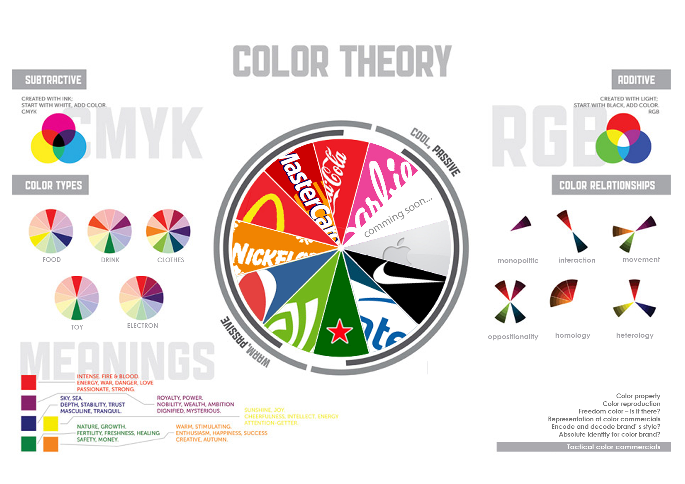

# CONTENTS

### <a href="ch003.xhtml"> **1: Introduction: The first scene** </a>

### <a href="ch004.xhtml"> **2: Technological Echoes** </a>

### <a href="ch005.xhtml"> **3: Cyber Bazaar** </a>

### <a href="ch006.xhtml"> **4: The Ambitious Children of AI** </a>

### <a href="ch007.xhtml"> **5: Attention: Stolen Treasure** </a>

### <a href="ch008.xhtml"> **6: Rebellions** </a>

### <a href="ch009.xhtml"> **7: Algorithmic Territories** </a>

### <a href="ch010.xhtml"> **8: Biography** </a>

Title

# Chronicles of the Cyber Village

Subtitle

## Colonialism and Advertising in the Age of AI

Author

## Nguyen Thi Thanh Tra

Content consultant

Assoc. Prof. Dr. habil Szabolcs KissPál

Language consultant

Mr. Rick Fendrick

# Chronicles of the Cyber Village: Colonialism and Advertising in the Age of AI

# Colophon 

INC Theory on Demand #56  
**Chronicles of the Cyber Village: Colonialism and Advertising in the Age of AI**

**Author:** Nguyen Thi Thanh Tra  

**Supervision of previous versions:** Assoc. Prof. Dr. habil Szabolcs
KissPál

**Language consultant:** Mr. Rick Fendrick

**Cover design:** Katja van Stiphout 
 

**Design and EPUB development:** August Kaasa Sundgaard
 

 

Published by the Institute of Network Cultures, Amsterdam 2025.

ISBN: 

**Contact:** Institute of Network Cultures  
Amsterdam University of Applied Sciences (HvA)

**Email:** info@networkcultures.org  
**Web:** [www.networkcultures.org](www.networkcultures.org)

Order a copy or download this publication for free at: 
 
www.networkcultures.org/publications

Subscribe to the INC newsletters:  
[www.networkcultures.org/newsletter](www.networkcultures.org/newsletter)  

This publication is licensed under the Creative Commons Attribution
NonCommercial ShareAlike 4.0 Unported (CC BY-NC-SA 4.0). To view a copy of this license, visit
[www.creativecommons.org/licences/by-nc-sa/4.0./](www.creativecommons.org/licences/by-nc-sa/4.0./)

# The First Scene

In the heart of the Cyber Village, beneath the endless flicker of
screens and the hum of invisible sever networks, the elder woman—our
storyteller—gathers the villagers. Her voice carries the weight of an
age-old wisdom, seasoned now with the sharpness of new dilemmas that
this digital era brings. She begins, her voice resonating like the
distant echo of a dial-up tone, ancient and enduring.

*Gather close, children of the village. In the old days, we tilled the fields and sowed our seeds, our lives simple and bound to the rhythms of earth and sky. But now, we live under the dominion of unseen forces, where the rivers of data flow faster than any current, and the winds of change are driven by algorithms that twist and turn in the dark. This is no longer a world of soil and stone, but a realm shaped by the invisible hands of technology and power. Welcome to the* Chronicles of the Cyber Village *—a saga not of triumph, but of disruption. Here, power no longer flows through the veins of empires built on land and sea, but through the capillaries of code, data streams, and deep learning. This is a chronicle of how the rise of advanced artificial intelligence has paved the way for a new form of colonialism—cyber-colonialism—and how global digital empires have come to overshadow our lives, while regional corporate digital powers stake their claims in this vast, boundless territory.*

*Our first tale,* ‘Technological Echoes’*, takes us back to the myths of old, where the seeds of technology were sown not just in our fields, but in our hearts. It is said that technology began as a humble tool, something to ease the burdens of life. But as it grew, it whispered promises of power and control, ensnaring those who sought to wield it. In time, it transcended its role as servant, becoming a master in its own right—commanding faith, invoking awe, and sowing both passion and fear. Through the ages, technology has played the role of colonizer’s handmaiden, helping to carve new paths of dominance and control. But now, as we stand in this era of digital dominion, we must ask ourselves: Is re-colonialism in cyberspace merely a myth, a ghost story told by the fire, or is it a true specter haunting our digital dreams? How has technology continued to perpetuate cycles of dominance and subjugation, and how do we, the people of this cyber village, find our place in this new order?*

*Next, we journey to the bustling heart of the *‘Cyber Bazaar’*, a marketplace unlike any other. Here, the currency is not gold, silver, or grain, but data—fragments of ourselves that are traded, sold, and bartered in an endless dance of profit and power. Behind the glowing screens and endless scrolls, there are sellers who do not show their faces, buyers whose true intentions are hidden in layers of code, and middlemen who thrive in the shadows. But who truly reaps the rewards of this invisible trade? Who are the unseen titans who pull the strings, becoming rich traders crossing digital borders with the ease of a breeze? And as we gaze upon this sprawling bazaar, we must uncover the secrets behind these markets: What deals are struck in the dead of night? What tricks and schemes have become the norm? As we pull back the curtain, we must confront the uncomfortable truth: the digital age has not democratized opportunity as promised, but hasinstead created new forms of exploitation and wealth disparity. Who, then, are the true masters of this bazaar, and who are mere pawns in a game far beyond their control?* 

*In our third story, *‘The Ambitious Childrent of AI’*, we explore the rise of artificial intelligence from a mere concept to a towering figure of legend. It was born from the dreams of scholars and engineers, a child of algorithms and logic, nurtured on the boundless data of our connected world. As it grew, it became more than its creators ever envisioned—a force that not only answered questions but posed its own, that not only served but ruled. AI has become a king in this digital kingdom, but every king has an heir, and every legend a successor. Who, then, will carry the mantle of AI into the next chapter of our cyber saga? How are the values of beauty, art, and creativity redefined under the watchful eye of AI, where every brushstroke, every note, every word is subject to the cold scrutiny of machine logic? And what of AI’s beloved daughter–algorithm, her abilities that promised so much yet delivered scandal and controversy? This tale delves into the heart of ambition, legacy, and the unforeseen consequences of unchecked technological growth.*

*The fourth tale speaks of *‘Attention: Stolen Treasure’*, the most coveted prize in this digital village. In a world saturated with noise and distraction, attention has become the rarest and most precious of commodities. It is the lifeblood of influence, the key to power, and the foundation upon which digital empires are built. But it is also a fragile thing, easily stolen and relentlessly pursued by those who would exploit it for their own gain. What schemes do these digital marauders hatch in their quest to capture our focus? How do they bend our will with clever algorithms, nudging us this way and that, until we are but puppets dancing on invisible strings? And when the treasure of attention is stolen, what tragedies unfold? We see the rise of narcissistic kingdoms, where the self is the center of the universe, and every like, every share, every click is a currency of ego. Automation and personalization, once hailed as the crowning achievements of modern technology, now stand revealed as tools of manipulation, bending our desires to serve not us, but those who profit from our gaze. In this tale, we explore the operation of the power machine in the age of attention, where every moment spent is a battle of gain and loss.*

*Yet, not all is dark in this digital realm. In our fifth story,* ‘Rebellions’*, we hear of those who refuse to be silenced, who reject the notion that there is no alternative to this world of data and control. These are the rebels, the warriors who stand against the encroaching tide of cyber-colonialism, who fight not with swords or guns, but with knowledge, courage, and the unyielding belief in a better future. How did the architects of this digital order convince the masses that their fate was sealed, that resistance was futile? Technology promised so much but just delivered control, surveillance, and exploitation. What must this cyber village do to break free from the chains of digital imperialism, to navigate the tangled web of data and reclaim its own destiny? Who are the champions of this cause, and what battles do they fight under the ever-watchful eye of the algorithm? This tale is one of defiance, resilience, and the unbreakable spirit of those who dare to dream of freedom in a world bound by code.*

*Our final story,* ‘Algorithmic Territories’*, turns to the division of this global village, where the promise of a connected world gave way to a new form of segregation. In the beginning, there was hope that the digital age would flatten the world, erasing borders and leveling the playing field. But as algorithms grew in power, they began to draw new lines, carving up the digital landscape into territories governed not by geography, but by influence, access, and control. In Southeast Asia, where dreams of progress and prosperity flourished, the reality has become a battleground of competing powers, each vying for dominance in the algorithmic age. How did the dream of a flat world crumble into a patchwork of divided territories, where access is controlled, information is filtered, and opportunities are meted out with bias? In this tale, we confront the realities of digital colonization, where the once hopeful promise of technology as a great equalizer has been overshadowed by the harsh truths of power, control, and division. *

*These are the* Chronicles of the Cyber Village*, a collection of stories that lay bare the complexities of our digital age. They are not just tales of a village on the brink of transformation, but reflections of our own struggles and triumphs in a world that grows more interconnected and yet more divided with each passing day. Listen well, for in these stories lies the wisdom of the past, the challenges of the present, and the hopes for a future where we might once again take control of our destiny, not as subjects of unseen forces, but as the masters of our own fate.*[^02introduction_1]

[^02introduction_1]: Words of the village elder.

# 1st Story - Technological Echoes

In the twilight of a digitized world, where the echoes of ancient
algorithms reverberate through modern existence, the story of
*Technological Echoes* begins. This tale, woven from the threads of
history, presents a precious clue for unraveling the mysteries of our
present and imagining the vast possibilities of our future. As we delve
into the chronicles of this cyber village, we find ourselves at a
crossroads of memory and innovation. Here, the past is not merely a
backdrop but a critical mirror reflecting the distorted images of
colonial legacies repurposed by the silicon hands of progress. It is a
narrative that challenges us to discern the subtle yet profound ways in
which old powers persist, cloaked in the new attire of digital empires.
Through this lens, we critically examine how technological advancements,
hailed as harbingers of freedom, often perpetuate structures of
dominance and exclusion, propelling us into cycles of cyber-colonialism
that shape our interconnected destinies.

Like many people of the former colonial countries of the *Global South*,
the collective memories of oppression, the pain of war, the disadvantage
of living conditions, and the perceived inferior social position, these
have become my lingering obsessions.[^03chapter1_1] Moreover, among the
psychological characteristics of the generation of *millennials***,**
continuously in my mind, there is, at once, a feeling of optimism and
pessimism regarding the rapid changes in contemporary society which have
resulted from technology development and the dominance of
cyberspace.[^03chapter1_2] For these reasons, I have given special attention to
talking about the colonization process and posing a multitude of
questions about the existence of colonialism in contemporary society and
the danger of its ongoing development in the era of information
technology, automation, and global connectivity. 

While it was conceived in ancient times, the concept of colonialism is
most strongly associated with the European colonial period starting with
the 15th century, when nearly one dozen European states established
colonizing empires. Colonialism is commonly understood as a practice or
policy of control by one person or power over other people or areas,
often by establishing coloniesand generally with the aim of economic,
political and cultural dominance.[^03chapter1_3] [^03chapter1_4] The long history of
colonialism is divided into four periods: Pre-modern, Modern, 19th
Century, and After World War II.

According to Collins English Dictionary, colonialism is ‘the practice by
which a powerful country directly controls less powerful countries and
uses their resources to increase its power and wealth.’ Therefore, what
makes one country more powerful than another? Under what conditions does
one group gain the privilege of controlling another? With what potential
can colonialism spread?

## Legend of Miracles

Based on much evidence and innumerable historical facts, technology has
long played an important role in the development of colonialism.
Possessing advanced technology is seen as the key to holding the
dominant power. Technology is also considered as a measure tool for the
level of civilized society and and it has often been the justification
given by imperialists for colonization and the homogenization of
civilization.

Ancient times, the invention of the *writing system* has been considered
the first step in the historical technology of storing and transmitting
information. Possessing a written language is a way for a small group of
authoritarian people to govern society, history, and collective memory,
by what has been purposefully documented. Writing soon became a means of
controlling communication and social knowledge. The concept of written
words becomes the representative of social intelligence, and the fear of
illiterate people is that they will be denied access to that mysterious
system of signs. The Mesopotamian cuneiforms, Egyptian hieroglyphs, and
Chinese characters are typical examples of the civilized symbols of the
three great empires: the three great ancient civilizations in human
history.

 

In addition, *the fear* of ordinary people in the face of *powerful
forces* was associated with *magical movements* - by the primitive
automation machines discovered in many places over the world.

> As early as Homer, more than 2,500 years ago, Greek mythology explored
> the idea of automatons and self-moving devices. By the third century
> B.C., engineers in Hellenistic Alexandria, Egypt, were building real
> mechanical robots and machines. And such science fictions and
> historical technologies were not unique to Greco-Roman culture.
> Chinese chronicles also tell of emperors fooled by realistic androids
> and describe artificial servants crafted in the second century by the
> female inventor Huang Yueying. Techno-marvels, such as flying war
> chariots and animated beings, also appear in Hindu epics. One of the
> most intriguing stories from India tells how robots once guarded
> Buddha’s relics. As fanciful as it might sound to modern ears, this
> tale has a strong basis in links between Ancient Greece and ancient
> India.[^03chapter1_5]

 

Some of the very first automated machines, for which technical drawing
evidence has been recorded, are the engines of Heron of Alexandria in
between the first and third century CE. Heron of Alexandria or Hero of
Alexandria (c. 10 AD – c. 70 AD) was a Greek mathematician and engineer
who was active in his native city of Alexandria, Roman Egypt.[^03chapter1_6] He is
often considered the greatest experimenter in antiquity. Heron’s
numerous surviving writings suggest that automatic machines were
designed to be operated by mechanical or pneumatic means. These included
devices for temples to instill faith by deceiving believers with
*magical acts of the gods*, theatrical spectacles, and machines like a
statue that poured wine.

![Figure 1.3: Heron of Alexandria. Diagram of an automaton, a Bacchus
figure that dispenses wine and milk in a small temple. The figure has
connected by invisible pipes with hidden tanks containing wine and milk.
Venice, Biblioteca Marciana, Gr. 516, fol. 202r.[^03chapter1_7] This 13th
-century codex is the earliest surviving text of Heron's Pneumatica. ©
historyofinformation.com.](imgs/TRA_Figure S1. 3.jpg)

 

There is evidence from the Middle Ages, between the 5th and 15th AC,
of the construction of *robot saints* which could move independently and
gesture using complex systems of cogs, hinges, and leather straps,
powered by ‘steam, water, or the latent energy held in a winding
mechanism like a clock’.[^03chapter1_8] The majority of these *robot saints* were
made of wood. The still-extant *Iberian robot* *Virgin de Los Reyes*
features a painted wooden head, with arms that are covered in white kid
skin to give it the appearance of human skin, and hair made from gold
thread. The mother's costume is splendidly decorated. It seems that this
is a special symbol of spiritual miracles that were presented in the
religious life of medieval believers for many centuries.

Since the appearance of primitive automation machines, there has been
and remains a compact and complex relationship between illusion and
reality and between magical belief and technological reality in the
process of manipulation of human perception.

 

The *power of* *weapons technology* is another example which should not
be ignored. Advanced weapons have always been considered a prerequisite
in territorial invasions and human control, from ancient times to the
present day. The earliest civilizations in southern Mesopotamia,
modern-day Iraq, were the Sumerians and Akkadians. The Sumerian warrior
was equipped with *spears, maces, swords, clubs, and slings*. Sargon of
Akkad (2333–2279 BCE) was a great military leader; he used both infantry
and *donkey-drawn chariots* in his powerful army.[^03chapter1_9]

The Pharaohs used *horse-drawn war chariots* and various weapons such as
improved *javelins, spears,* *curve bows* and *arrowheads,* *catapults*,
and *big war galleys* of seventy to eighty tons. These helped them
conquer the vast northeast of Africa, ushering in a powerful Egyptian
empire that ruled the Mediterranean world for nearly 30 Centuries. –
(from Egyptian unification around 3100 B.C. to its conquest by Alexander
the Great in 332 B.C.).

![Figure 1.5: The Pharaoh Tutankhamun destroyed his enemies. ©Wikimedia
Commons.[^03chapter1_10]](imgs/TRA_Figure S1. 5.jpg)

 

The time after the Egyptian Golden Age was the expansion of the Roman
Empire. Differently, the Romans used simple and unusual *weapons of
warfare* such as *the gladius swords, spears, plum, shields, and unusual
catapults*. The creativity in weaponary contributed to the expantion of
the Roman Empire’s domination on large territories around the
Mediterranean Sea in Europe, North Africa, and Western Asia over the
first three centuries after the common era.

![Figure 1.6: Alexander's battle - mosaic around 100 BC Roman.
©Wikimedia Commons.[^03chapter1_11]](imgs/TRA_Figure S1. 6.jpg)

 

The other important inventions such as *paper, printing, gunpowder, and
the compass* contributed to the successful of Chinese dynasties on
controlling the vast Eastern land. According to English philosopher
Francis Bacon, writing in *Novum Organum*:

> Printing, gunpowder and the compass: These three have changed the
> whole face and state of things throughout the world; the first in
> literature, the second in warfare, the third in navigation; whence
> have followed innumerable changes, in so much that no empire, no sect,
> no star seems to have exerted greater power and influence in human
> affairs than these mechanical discoveries.[^03chapter1_12]

The invention of *paper and printing technology* contributed
significantly to the new information distribution technologies helping
the Chinese emperors maintain comprehensive rule, and perfecting the
administration of a centralized government. Since the 8th century BCE,
*hemp paper* had been used in China for wrapping and padding. The
earliest surviving *woodblock printed* fragments are from China. They
are of silk printed with flowers in three colors from the Han Dynasty
(before 220 A.D.). The earliest examples of woodblock printing on paper
also appeared in the mid-seventh century in China.

![Figure 1.7: The Diamond Sutra of the Chinese Tang Dynasty, the oldest
dated printed book in the world, was found at Dunhuang, in 868 CE.
©Wikimedia Commons.[^03chapter1_13]](imgs/TRA_Figure S1. 7.jpg)

 

*Gunpowder* was discovered by the Chinese in the 9th century AD,
during the Tang dynasty.[^03chapter1_14] They were the first people to
systematically use it as weapons on a wide scale. From about 1000 AD,
gunpowder has been used in the form of *firecrackers* and, during the
earliest days, was used to improve existing weapons by attaching it to
spears to create *a shocking burst* on engagement and with arrows to
increase their speed mid-air or be shot in large salvos without the need
of bows. In the 12th century, the Chinese used crude hand grenades and
began to use the earliest form of rockets and cannons in addition to the
aforementioned firecracker weapons.[^03chapter1_15] There is no doubt that
*gunpowder weapons* were a powerful tool of Chinese emperors during
their invasions, helping them own most of East Asia for centuries.

![Figure 1.8: Ming artillerymen from a mural in Yanqing District,
Beijing. ©Wikimedia Commons.[^03chapter1_16]](imgs/TRA_Figure S1. 8.jpg)

 

In the 3rd century AD, the world's first *compass* *made of lodestone*,
the naturally magnetized ore of iron, has also invented during the Han
dynasty in China.[^03chapter1_17] However, not until the 13th century was the
*dry compass* invented in Europe; and it opened a new era for navigation
technology, especially helping Europeans to go further. It began to
unify the general method of the different pre-existing systems of
geolocations. Human movement in general and expeditions to new lands
became easier. The new compass also created the initial condition for
the first world maps to be formed and is the foundation for an entirely
new perception of space for humanity. At the same time, it was the basic
advantage for European empires to claim possession of different
territories and turn many newly found lands into colonies.

![Figure 1.9: Early modern dry compass suspended by a gimbal (1570)
©Wikimedia Commons.[^03chapter1_18]](imgs/TRA_Figure S1. 9.jpg)

 

 

![Figure 1.11: One of the earliest maps to show the New World, the
Cantino planisphere (1502) ©Wikimedia Commons.[^03chapter1_19]](imgs/TRA_Figure S1. 11.jpg)

 

In addition to the advances in navigation technology, the rapid
development of *seagoing ships* in the 13th century ushered in the
*Modern time of colonialism* - the *Age of Exploration*. For example,
ships developed by the Portuguese: the caravels (in the 13th century)
and the carracks (in the 15th century).[^03chapter1_20] Portuguese Prince Henry
the Navigator (1394–1460) is considered the originator of modern
colonialism through explorations and maritime trade with other
continents through the systematic exploration of Western Africa, the
islands of the Atlantic Ocean, and the search for new routes. Spain
(initially the Crown of Castile), soon after Portugal, encountered the
Americas (1492 onwards) through sea travel and built trading posts or
conquered expansive areas of land.  

In succession, the 1st and 2nd industrial revolutions marked an
important milestone in colonial history. Especially, the emergence of
the *steam engine* and the unprecedented development of mass production
capabilities opened up *the golden age of colonialism* in the 19th
century to the European empires.

![Figure 1.12: Sächsische Maschinenfabrik in Chemnitz, Germany, 1868.
©Wikimedia Commons.[^03chapter1_21]](imgs/TRA_Figure S1. 12.jpg)

 

Most of the land on all continents became European colonies, and the
enslavement of indigenous populations became a phenomenon that spread
throughout the globe.

![Figure 1.13: Map of colonial and land-based empires throughout the
world in 1914 CE. ©Wikimedia Commons.[^03chapter1_22]](imgs/TRA_Figure S1. 13.jpg)

 

The world's colonial population at the outbreak of the First World War
(1914), one of the highest points for colonialism, totaled about 560
million people. These peoples lived as possessions of various colonial
powers: 70% as British, 10% as French, 9% as Dutch possessions, 4% as
Japanese, 2% as German, 2% as American, 3% as Portuguese, 1% as Belgian
and 0.5% as Italian.

The world's first *steam-powered seagoing ships* helped British and
French become the most powerful invaders of the 19th century; these
vessels helped them take over the world leadership positions of the
Portuguese and Spanish. The great improvement in *gunboat construction*
in British ports made Britain the motherland of 70% of the global
colony. On the foundation of the iron and steel processing industry,
British ships that were previously entirely made of wood were replaced
by iron materials. The material change in shipbuilding technology
allowed the new ships to withstand extreme weather on the sea and
enduring battles with natives.

![Figure 1.14: Engraving of the elevation plan and section of a
steam-boat, 1827. ©Wikimedia Commons.[^03chapter1_23]](imgs/TRA_Figure S1.14.jpg)

 

![Figure 1.15: Great Britain in the Cumberland Basin, April 1844.
©Wikimedia Commons.[^03chapter1_24]](imgs/TRA_Figure S1.15.jpg)

 

Industrial factories flourished at the end of the 19th century in many
western European countries. The *weapons* and *machine gun industries*
dramatically widened the power gap between Europeans and non-Western
peoples and led directly to the burgeoning of imperials in the early
20th century. With high production capacity, dangerous levels of
damage, and high accuracy, machine guns were the colonists' powerful
symbol and the fear of the natives. Daniel R. Headrick once wrote:

> By the 1890s, the gun revolution was complete. Most European
> infantrymen could now fire fifteen rounds of ammunition in as many
> seconds, lying down undetected, in any weather, with an effective
> range of up to half a mile. Machine gunners had even more power.
> Though the generals were not to realize it for many decades, the age
> of raw courage and cold steel had ended, and the era of arms races and
> industrial slaughter had begun.[^03chapter1_25]

In addition, advances in *medicine and pharmaceuticals* also created
unique advantages for European people. In the 18th century, under the
influence of the Age of Enlightenment, the modern hospital began to
appear, serving medical needs and being staffed with trained physicians
and surgeons. Modern medical methods were systematically applied to cure
patients.[^03chapter1_26] These hospitals were the civilized symbol of imperial
countries, the foundation for *military hospitals*, and the advantage of
preserving forces for the colonial repressions.

Especially in *pharmaceutical technology*, the successful extraction of
*Quinine* in the 19th century was the key to opening Africa's colonial
time delayed by deadly malaria for more than four centuries.[^03chapter1_27] For a
long time, the barrier of disease, most notably malaria, made Europeans
hesitant to invade Africa. Many called Africa ‘the white man’s grave,’
and it was known as a death trap for soldiers.[^03chapter1_28] From 1819-1836, more
than 48.3% of British troops sent to Sierra Leone died.[^03chapter1_29] A morbid
rhyme sung by British sailors about the Bight, or Bay, of Benin
exemplifies the European fear of Africa: ‘Beware, oh beware, of the
Bight of Benin, Where few come out although many go in.’[^03chapter1_30] However,
quinine had the potential to change the entire situation.

 

*Electrical science* is another technological achievement that developed
rapidly in the early 19th century and became an integral part of modern
life in the 20th century. The early 19th century had seen rapid progress
in electrical science, and the late 19th century would see the greatest
progress in electrical engineering. The electrical applications have
long contributed significantly to strengthening the military force of
the US and European countries. *Searchlights* were one military tool
popularly used by imperialist countries when electrical engineering
flourished in the late 19th and early 20th centuries. The first use of
searchlights using carbon arc technology occurred during the Siege of
Paris during the Franco-Prussian War. The British Royal Navy used
searchlights in 1882 to dazzle and prevent Egyptian forces from manning
artillery batteries at Alexandria. Later that same year, the French and
British forces landed troops under searchlights. By 1907 the value
searchlights had become widely used among European Empires.

![Figure 1.17: Russian troops use a searchlight against a Japanese night
attack during the Russo-Japanese War, 1904. American searchlight crew
and equipment in France during WWI. ©Wikimedia Commons.[^03chapter1_31]](imgs/TRA_Figure S1.17.jpg)

 

Driven by the 1st and 2nd industrial revolutions, Western society
witnessed the unprecedented emergence and development of *photography*.
Shortly after, the first camera image had been captured by Nicéphore
Niépce in 1826, and photographs of war events were born in 1855. Since
then, photography has become an indispensable new technological tool
associated with the Western civilization concept. Western photography
orientated other parts of the world in how to record history and lives.
To this day, photography contributes to the creation of social standards
or norms that are represented and recorded through photos. From the
beginning to the present day, photography has been become a universal
means of evaluating the level of civilization of individuals and the
identity of a country or region.

![Figure 1.18: This 1870 image is considered the first actual photograph
taken of a battle. It shows a line of Prussian troops advancing. The
photographer stood with the French defenders when he captured this
image. ©militaryhistorynow.com.[^03chapter1_32]](imgs/TRA_Figure S1.18.jpg)

 

![Figure 1.19: A man in Iyede, Delta State, Nigeria, 1909.
©theguardian.com.[^03chapter1_33]](imgs/TRA_Figure S1.19.jpg)

 

![Figure 1.20: Postcard Saigon Cochinchine Vietnam, Camp des Mares, le
Repas des Tirailleurs punish de prison. ©akpool.co.uk.[^03chapter1_34]](imgs/TRA_Figure S1.20.jpg)

 

After World War II (1939–1945), decolonization progressed rapidly, and a
series of colonial states declared their independence. However, the
colonial relationship had not really come to a halt; it had transitioned
to a new stage, a postcolonial or neocolonial period. Especially in the
late 20th and early 21st centuries, based on the development of
*computer science, cloud storage, Big Data, IoT, and AI,* this dominance
of one power over another has become more profound, more dangerous and
considerably broader in scope. Once again, the owners of advanced
technologies take over the power position and set the rules for all of
political, economic, and cultural relations.

Similar to thousands of years ago, the majority of advanced technologies
have been applied to the military industrial complex and the
neo-colonizer has again employed the power of weapons to demonstrate
prestige and to threaten smaller, less developed countries. *Supersonic
aircraft, stealth submarines, generations of weapons,* and
*AI-controlled robots* have been developed and put to use widely in the
technologically developed countries.

![Figure 1.21: Boston Dynamic's robots, ©newatlas.com.[^03chapter1_35] Blackbird
supersonic aircraft, ©popularmechanics.com.[^03chapter1_36] Israel’s Rafael integrates
artificial intelligence into Spice bombs Illustration of Japan's new
Epsilon AI rocket, ©c4isrnet.com.[^03chapter1_37]](imgs/TRA_Figure S1.21.jpg)

 

Holding advanced *weapons technology* and *dominating cyberspace* are
considered among the most important goals of developed countries.
Cyberspace has become another living space inseparable from real life in
the 21st century. Connectivity through cyberspace is an indispensable
activity in many countries, corporations, organizations, and for the
majority of global citizens. Never before have we witnessed such a close
connection between digital devices and the human body as today.
Consequently, intervention in digital space is a core issue for
dominating the life of modern people, making the race over technology
more important than ever. In reality, new technology empires are
attempting to assert control over human life through digital means,
establishing a form of *cyber colonialism* around the world.

## **The Usurper**

‘Technology is a useful servant but a dangerous master.’– Christian Lous
Lange.[^03chapter1_38]

Since the onset of the digital revolution and the initial development of
the computer sciences in the 1960s and 1970s, there have been concerns
regarding the revival of colonialism. The conceps *electronic*
*colonialism* or *digital colonialism*, sometimes abbreviated to
*eColonialism*, were conceived by Herbert Schiller as documented in his
1976 text Communication and Cultural Domination.[^03chapter1_39] The idea of
cyberspace took on increasing interest in the 1990s with the growing
popularity of the internet, networking and digital communication.[^03chapter1_40]
Not much later, in the article *Cyber-colonialism in Asia: more imagined
than real?* by Loo & Beng in 1998, the concept of *cyber-colonialism*
was mentioned.[^03chapter1_41] Despite its *technological optimism* regarding
global connectivity in the internet space, Loo & Beng's writing has
contributed significantly to the discussion of the issue since the early
days of the era of global connectivity.

The cyber-colonialism discussed by Loo & Beng is an exaggerated idea of
media imperialism by the newly independent states. However, in the
current circumstance, with the unprecedented speed and complexity of
cyberspace, this understanding no longer seems appropriate. Cyberspace
should be understood as a comprehensive digitally-interconnected space,
including the public network and private networks (the interconnection
between machines in single systems). Hegemony in cyberspace is not only
reflected in media but also in different aspects of human life including
politics, economy, technology and society. The empires that dominate
cyberspace are not only media empires but also many other empires
constantly forming along with the development of new technologies, such
as cloud empire, search empires and social network empires. Therefore,
in our story, Cyber-colonialism is seen as a practice of control,
manipulation and exploitation by technological owners over people, often
by establishing *technological hyper-dependent relationship* and with
the aim of all human being dominance.

Cyber-colonization seems to be triggered when people *start to connect*
to digital devices. People today are connected intimately through
machine systems, whether direct or indirect users. Human existence, in
different ways, is all connected to digital devices and/or digital
connected systems. Currently, the surveillance camera system is widely
used by individuals, companies, organizations and government agencies.
In the street, on the shops, in front of each house, the ubiquitous
security camera is the foremost example of the relationship between
modern people and the equipment around them. The dense satellite system
surrounding the earth is another surveillance, connectivity, and
dominance tool, with a broader impact; It affects not only individuals
but also organizations, countries, regions, and even entire continents.
Additionally, public surveillance cameras and personal electronic
devices have the potential to capture endless habits and details of
public life. 

Overall, the level of *technological surveillance* has paralleled the
level of digital connectivity of humans in cyberspace. The greater the
connection to electronic devices, the higher the user's dependence on
vehicles. The longer the software is used, the higher the level of user
exploitation and control by service providers. Out of individual
control, users' level of digital connectivity is increasing at an
unprecedented rate globally. The extension of the human body to machines
is no longer a prediction as seen in Donna Haraway’s early remarks in *A Cyborg Manifesto*, but
has become a reality of contemporary mankind.[^03chapter1_42] In Haraway's opinion,
the cyborg's integration of technology into its body creates a new form
of embodiment that challenges the dichotomy between mind and body. By
merging with machines, the cyborg becomes a new kind of being that is
both physical and virtual. This extension of the human body to machines
also allows for new forms of agency and control. The cyborg's ability to
manipulate technology and navigate virtual environments gives it a new
kind of power that can be both liberating and dangerous. The simplest
example is that smartphones have become an integral part of the majority
of people in this day and age.

Behind the self-imposed consumer needs, users have been dominated by
*demand-producing machines* founded by technology owners. In order to
increase the ability to monitor, exploit and control society, and
dominate markets and create profits and power, technological empires
constantly promote demand and desire for consumption, using different
tactical strategies, among which we must count the *all-in-one package*
products and services—the attractive *digital ecosystems*. The majority
of giant technological owners today have created a cross-link between
services and products in the same system, forming a matrix of associated
features and utilities. Along with many advanced elements such as speed,
ease, convenience, and efficiency, these digital packages always
represent remarkable exclusivity and bondage. Developing these
attractive and exclusive digital ecosystems is the ambition of many
nations, organizations, companies, and corporations around the world.

Many governments are constantly digitizing their citizens' information.
The digital identity system was introduced to link all public
administrative procedures, through which to control all civil
activities. China's Social Credit System is one example. In China, the
vast majority of urban residents can do all their social activities via
electronic devices, most commonly through smartphones. Academic studies,
medical visits, payments and credit operations, and public
administrative procedures can all be done online. Many administrative
tasks would be impossible or extremely difficult to implement without an
electronic account. In general, in many large cities, the social
activities of Chinese people are recorded and updated to the electronic
information system through various forms. That information can be both
very general and detailed. For example, the state is able to collect
information about whether citizens dump their garbage and refuse in the
appropriate areas or whether people have parked their vehicles in
assigned places. Seemingly endless categories of personal information,
such as family biography, education level, occupation, medical
information, properties, finances and history of social activities have
been recorded, linked, and evaluated by computer systems. Citizens are
classified and blacklisted or whitelisted based on data analyzed by the
mechanized system.[^03chapter1_43]

By participating in the *Google ecosystem*, logging into a Google
account, users can use a wide range of products and services such as
Google Mail, Google Drive, Google Chat, Google Classroom, Google Meet,
Google Fit, Google Translate, Google Calendar, Google Map, Google Play,
Google Search, Google Ads and YouTube. All these services are
interlinked in one system. For example, if a Gmail user intends to send
an email with an attachment that is larger than 25MG (megabytes), the
user must link to their Google Drive account. Furthermore, if they need
to access a shared group file on Google Drive, the user must create a
Google account if they do not already have one Users who need to make
notations on Google Maps must have a Google account. These chaining
constraints developed by Google have allowed them to engage over one
billion customers in the use of their products through 2022.[^03chapter1_44]
Moreover, the engagement of these customers has allowed Google to
capture and store a vast amount of diverse, detailed and valuable
information for the company’s use.

The technology company Apple Inc provides a *system* of *personal
electronic devices* such as iPhone, iWatch, iPad, iMac, iTVbox, iPod,
Air Pod, Home Pod, and Apple Watch, which all include free operating
systems such as mac OS, iOS, iPad OS, watch OS and TV OS. Additionally,
Apple Inc has created many *online services* such as the iTunes Store,
iOS App Store, Mac App Store, Apple Arcade, Apple Music, Apple TV +,
iMessage, and iCloud. *Offline services* include Apple Store, Genius
Bar, Apple Care; and *financial services* include Apple Pay, Apple Pay
Cash, and Apple Car. In addition, millions of *specialized software*
programs written specifically for Apple operating systems are provided
by App Store systems. The customers’ level of commitment to the company
has been maximized because of Apple’s fully packaged provision of
products and services. For example, Apple Watch users cannot install the
operating system of the watch device without using their iPhone, nor can
they download music to the system without accessing iTunes. This
strategy has helped Apple become the leader in sales of personal
electronics products globally over the past decade, with a net revenue
of 378.7 billion U.S. Dollars in 2022.[^03chapter1_45]

![Figure 1.22: Sales of leading consumer electronic (CE) companies
worldwide in 2022. ©statista.com.[^03chapter1_46]
](imgs/TRA_Figure S1.22.jpg)

 

Similar to the Google and Apple ecosystem, other products and service
providers such as Amazon, Facebook, Baidu and WeChat have created new
technology ecosystems with complex, mesmerizing functional matrices,
which include traps which users may find difficult to escape.

Today, we are witnessing a repeat of patterns seen during former
colonial periods. Previously, empires heralded a prosperous and
gratifying life to the indigenous people as their justification for
colonization. Actually, they typified their colonization as a mission of
*enlightenment*. Today, despite affirming unceasingly the motto of
sharing the *highest benefit* to users (in theory, digital capital
business is a process of benefit sharing), what is gained by users
cannot be compared with the benefits achieved by corporations or
organizations that own technology. In *The Wretched of the Earth, Frantz Fanon once stated:

> ‘The native must realize that colonialism never gives anything away for
> nothing.’ [^03chapter1_47]

So *what* do tech owners exploit from their tech colonies?

If *natural resources* and *minerals* are the targets of exploitation by
imperialist countries from their colonial territories, then in
cyberspace, *data* is the most valuable resource. Information
connectivity is a prerequisite for the existence of cyberspace. In other
words, information becomes the primary fuel for every online connection.
Storing, processing, analyzing, and transmitting information in the form
of data sets is a fundamental activity in the digital space. The larger
the amount of data, the more advanced the analysis ability, the higher
value of the information obtained after the analysis, and the more
applicability of that information. The *data mining* has become the
spearhead industry of the technology empires.[^03chapter1_48]

Therefore, rather than cyber-colonialism, Nick Couldry and Ulises Mejias
proposed another concept – *data colonialism*. According to these
authors, data colonialism is understood as ‘the extension of a global
extraction process. It started under colonialism and continued through
industrial capitalism, culminating in the present new form instead of
natural resources and labor that has appropriated human life through its
conversion into data.’[^03chapter1_49] It can be said that owning data has become
the foundation for governing today's technological colonies. In the year
2022, there were approximately 7.2 million data centers and server
farms, the majority of which are, to this day, concentrated in developed
countries, led by the US, Germany, the UK, China, and Canada.

![Figure 1.23: Number of data centers worldwide in 2022, by country.
©statista.com.[^03chapter1_50]](imgs/TRA_Figure S1.23.jpg)

 

Moreover, since 2015, the number of hyperscale data centers has more
than doubled.[^03chapter1_51] The number of hyperscale data centers worldwide
reached 700 by the end of 2021. The rapidly increasing number of
hyperscale data centers worldwide in recent years illustrated the high
level of power concentration in cyberspace.[^03chapter1_52] Eve Tuck and K. Wayne
Yang asserted, colonization ‘is not an approximation of other
experiences of oppression’ but a highly distinctive exercise of
power.[^03chapter1_53]

Beyond the concept of *great power*, in the last 20 years, we have seen
the world of technology dominated by *a small number* of *large global
corporations*. This phenomenon of power concentration is evident in the
characteristics of advanced-capitalistic societies, where industrial
activity is concentrated in a few large firms.[^03chapter1_54] The phenomenon of
totalitarianism and domination of economic, political, cultural, and
social activities of these large corporations, creates a *new form of
empire* within capitalist society. Until now (2023), these technological
empires were concentrated in the U.S and China. The Big Tech are often
mentioned by mass media, such as Alphabet (Google), Amazon, Apple, and
Meta (Facebook), Microsoft, Tesla, Twitter, Netflix, and they are
representative of the information technology industry of the United
States of America, while Tencent, Baidu, the Alibaba Group and Xiaomi
are considered the Big Tech Four giants in China. Although they are
considered U.S or Chinese technology companies, they have extensive
global business in different respective areas of technology including
artificial intelligence, e-commerce, online advertising, consumer
electronics, cloud computing, computer software, media streaming, smart
home, self-driving cars, and social networking. They are among the most
valuable global public companies having a maximum market capitalization
ranging from around \$1 trillion to above \$3 trillion.[^03chapter1_55]

Based on their operational capacity, the scale of infrastructure, and
real financial potential, these big global technology corporations are
also the leaders in the professional development of the most advanced
technologies, in particular, the advances in artificial intelligence and
machine learning technology. The Big data systems combined with the new
generation machine learning algorithms have brought deep analysis and
self-making predictions or decisions. With new artificial intelligence
systems, technology owners transform the present machine into a social
judge which is able to identify users in terms of their social,
political and ethnic groups. Machines can also work in place of skilled
craftsmen, tour guides, and financial analysts. A new generation of
virtual assistants is able to interact directly with humans to provide
direction, answer questions and even chat emotively.

However, the fascinating achievements of machine learning technology and
its unbelievable applications have created a new wave of concern around
the ethics of of AI, recently giving rise to the concept of *AI
colonialism*. In the article *Artificial intelligence is creating a new
colonial world order* published at *MIT Technology Review* in April
2022, Karen Hao asserted: ‘It’s not possible to talk about ‘AI for
everyone’ (Google’s rhetoric), ‘responsible AI’ (Facebook’s rhetoric),
or ‘broadly distributing’ its benefits (Open AI’s rhetoric) without
honestly acknowledging and confronting the obstacles in the way.’[^03chapter1_56]

The threat of using the power of digital technology and AI to control
and manipulate others has become a global concern in recent years. This
is especially apparent in the way people experience the digitizing of
their lives, the profound dependence on technological devices, and the
loss of decision-making and autonomy. The enslavement is transferred
from direct to indirect form through digital media and devices.

![Figure 1.24: Photo essay 01. More than 1.5 million Africans were
shipped across the Atlantic Ocean between the 15th and 19th Centuries,
©nilepost.co.ug.[^03chapter1_57] More than 62.5 percent of the world's total population
is internet Users in 2022, ©deviceatlas.com.[^03chapter1_58] Locking and tracking
colonial slaves, ©t-vine.com.[^03chapter1_59] Personal tracking location, © gpsbob.com.[^03chapter1_60]Slave's stamp recognition, ©Wikimedia Commons.[^03chapter1_61] Facial recognition,
©Reuters.[^03chapter1_62] Brussels World fair 1958 ©Wikimedia Commons.[^03chapter1_63] Children’s rights in the cyberspace, ©theasianparent.com.[^03chapter1_64]](imgs/TRA_Figure S1.24.jpg)

 

![Figure 1.25: Photo essay 02. The White Sea-Baltic Canal opened on 2
August 1933, ©dmitrievaffair.com.[^03chapter1_65] Daily, users are creating content and
information values without payment, ©abcnews.go.com.[^03chapter1_66] Sale of Estates,
Pictures and Slaves in the Rotunda, New Orleans; by William Henry
Brooke, engraver; engraving with watercolor from The Slave States of
America, vol. 1; London: Fisher and Son, 1842 ©wwno.org.[^03chapter1_67] The Big Data
Privacy Problem. ©innovate-edu.com.[^03chapter1_68] Cape Town slaves to migrant gold
miners, ©ucd.ie.[^03chapter1_69] Data Mining Techniques, ©justtotaltech.com.[^03chapter1_70]](imgs/TRA_Figure S1.25.jpg)

 

If *weapons* were the main tools of colonization in the past, the new
empires use *digital* and *social media* to control and manipulate
people today. The majority technology owners today are also media
holders that can influence or shape users' perceptions, beliefs,
preferences, and desires, thereby directing users’ actions or decisions.
There is no doubt that dominating perceptions is the most effective and
dangerous way to possess human beings, influence their awareness and
manipulate their action.

![Figure 1.26 : Mecedes-Benz advertisment 2010. ©adsoftheworld.com.[^03chapter1_71]
](imgs/TRA_Figure S1.26.jpg)

 

*Advertising* is considered an effective tool to influence perception,
an indispensable tool in the colonization process in cyberspace.
Currently, advertising remains the trump card, the main source of profit
for many information technology empires. As advertising agencies,
technology corporations are able to create information and control over
the flow of that information. They use advanced algorithms to optimize
what advertising should be generated or produced and what venues and
which populations should be targeted with that advertising.

The lives of modern people are affected by information, especially
advertising. With the support of new devices and high-tech, the
advertising industry has reached a hyper-developed stage. Today's
advertising is very diverse from audio, images, videos, texts and
software. Delivery methods are multiple, from direct to indirect
methods, by the influence of different digital tools such as email,
search results or user experience. The profound effects of advertising
on life have been proven throughout the 20th century and could become
more dangerous in the 21st. Advertising is driving the whole spectrum of
social activities. Advertising information instructs its users on
various actions. These actions might include: electronic devices to use;
places to travel; what to eat or drink; where to shop and what clothing
to wear; where to reside; kinds of entertainment to choose; type of
insurance to purchase; issues to discuss with friends; financial
channels to be aware of; candidates to vote for in the next election; or
even the person they should love!

}

 

Technology owners appropriate not only the user’s body but also their
*identity, emotions, spirit* and *self-determination*. That means the
phenomenon of human exploitation has become a worrying reality in the
global sphere in general and in the former colonial region in
particular.

Today’s *cyber-colonization* process and the clever conspiracy of
*personalization of services* have attempted to legitimize the
appropriation of personal integrity and blinding or deceiving the users.
‘We'll serve you better if we know you better’ has become the rhetoric
of all online products and service providers. The majority of users
still do not fully understand the tactics of the process of ‘always
listening, always understanding’from companies.[^03chapter1_72] Behind electronic
contracts (in the form of mandatory consent to dozens of pages of Terms
and conditions), users consent to let service providers use their
information legally when creating any electronic account. This process
of accepting data collection is no different from inviting strangers
into the home which gives them control over the owner's personal life
from the living room to the dining room, to the bedroom, to the toilet.
It has asserted that what today's tech corporations are collecting about
users is more than the user can imagine; and that it is the foundation
for technology owners to enslave users and colonize digital territories.
Establishing superiority over others, tech owners are imposing unfair
rules of the game on users globally.

In *Capital in the Twenty-First Century* (2013), Thomas Piketty of the
*Paris School of Economics* asserted that ‘inequality is the inevitable
consequence of economic growth in a capitalist economy and the resulting
concentration of wealth can destabilize democratic societies and
undermine the ideals of social justice upon which they are built’. That
is the problem our society is facing. In particular, this *inequality*
is becoming even more pronounced in some *developing countries* in the
*Global South* - the southern hemisphere countries, which includes parts
of Asia, Africa, and Latin America.

Many countries in the Global South have young populations, with a
significant proportion of people under the age of 25.[^03chapter1_73] This
demographic shows a rich human resource and an energetic labor force,
but it can also create challenges in terms of providing education,
healthcare, and other basic services. These regions are often classified
as developing economies, where the majority of people are still working
in low and unstable conditions.[^03chapter1_74] Among these countries, several have
high levels of poverty, limited infrastructure, and significant income
inequality.

The southern hemisphere countries are normally known as home to a wealth
of natural resources, including oil, gas, minerals, and agricultural
products. While these resources can be a source of economic growth, they
can also lead to environmental degradation and social conflict. Many
countries in the Global South have experienced political instability,
including colonial periods, civil wars, coups, and other forms of
unrest.[^03chapter1_75] This instability creates many difficulties in implementing
legal systems, and hardship in creating social and economic stability.

Nevertheless, the Global South market has been rapidly growing in recent
years due to several factors, including increased access to digital
technology and the proliferation of mobile devices.[^03chapter1_76] With the
increasing affordability of mobile devices, many people in the Global
South are now able to access digital services such as social media,
e-commerce, and mobile banking.

Generally, the characteristics of a large population are the cheap labor
market, high consumer demand, low and uneven education level, weak
social resistance, and ineffective legal barriers to new technologies.
For this reason, the developing countries in The Global South are
*potential exploitative markets* for new technology empires. *Vietnam*
is one example of the type of market that is easily exploited.

Currently, Vietnam is one example of the type of market that is easily
exploited. ‘IT labor suppliers in Southeast Asia, the main labor market
tapped by developed countries in the region such as Japan’, Korea and
Singapore.[^03chapter1_77] Vietnam’s large and young population of consumers has
also become a target of large technology corporations.

According to statistics provided by *hootsuite.com*, there were 72.10
million internet users in Vietnam in January 2022. Vietnam’s internet
penetration rate stood at 73.2 percent of the total population at the
start of 2022. 

 

On average, Vietnamese users daily spend 6 hours and 38 minutes each in
cyberspace which is equivalent to the administrative working time of
office workers and approximately one third of the total time they have
daily.[^03chapter1_78]

 

Vietnam ranked 13th on the list of countries with the largest digital
populations in the world in 2022.[^03chapter1_79] However, privacy in the internet
space and Vietnam's cybersecurity index have always been among the
lowest and most alarming in recent years.[^03chapter1_80] [^03chapter1_81] [^03chapter1_82] 
[^03chapter1_83]

 

![Figure 1.30: Countries with the largest digital populations in the world
as of January 2022.[^03chapter1_84]](imgs/TRA_Figure S1.30.jpg)

 

 

Vietnam's legal framework for privacy and cybersecurity is still in its
early stages of development. Although Vietnam has passed several laws,
including the Law on Protection of Personal Information, the Law on
Cybersecurity, and the Law on Information Security, these legal
regulations may not be comprehensive enough to address all the
challenges and concerns of today’s digital world, especially emerging
social phenomena related to artificial intelligence and machine
learning-based automation.[^03chapter1_85] [^03chapter1_86] The implementation of these
laws is often inadequate, and enforcement is often lax.[^03chapter1_87] Corruption
and bureaucracy are the main reasons that make law enforcement even less
effective.

The densely populated market and ineffective law barriers are reasons
why Vietnam has become a profitable market for global technology
corporations. According to the statistical assessment of *We Are Social
and Kepios*, Vietnam's digital advertising market is estimated to be
worth \$812.9 million by 2022.

 

The Global South had been regarded as a potential market and a target by
international traders as long as 200 years ago. For this reason,
European merchants expanded their market and exploited colonies in the
18th and 19th centuries. Clearly, technology owners have a special
preference for investing in this market in the 21st century.

All in all, the colonization process in cyberspace has been carried out
through the social appropriation process, which imposes the power of
technology owners on those who directly or indirectly use their products
and services. Firstly, technology owners occupy digital territories
through various digital markets such as mobile phones, computers,
search, e-commerce, social networks and e-finance. Secondly, they
possess the means and materials of digital production, in which
machinery, equipment, and technology are the fundamental means, and data
is the most valuable material. Together with the acquisition of a cheap
workforce, the colonization of today also appropriates human identities,
personal information, and individual decision-making. Through these
appropriations, cyber-colonialism creates a new social order. Digital
power-sharing dominates various aspects of life from political economy
to culture, and these take place in many parts of the world, especially
in developing countries.

## References

Biney, Isaac K. ‘Revitalizing Blended and Self-Directed Learning Among
Adult Learners Through the Distance Education Mode of Learning in
Ghana.’ In *Re-Envisioning and Restructuring Blended Learning for
Underprivileged Communities*, edited by IGI Global, 185-203, 2021.

Bischoff, Paul. ‘Cybersecurity Rankings by Country: Which Countries Have
the Worst (and Best) Cybersecurity?’ *Comparitech*, 2022.

Boas, Marie. ‘Hero's Pneumatica: A Study of Its Transmission and
Influence.’ *Isis 40*, no. 1 (1949): 38.

Couldry, Nick, and Ulises A. Mejias. *The Costs of Connection: How Data
Is Colonizing Human Life and Appropriating It for Capitalism*. Stanford
University Press, 2020.

Curtin, Philip D. ‘The End of the 'White Man's Grave'?
Nineteenth-Century Mortality in West Africa.’ *The Journal of
Interdisciplinary Histor*y 21, no. 1 (1990): 63-88.

Curtin, Philip D. ‘The White Man's Grave: Image and Reality, 1780-1850.’
*Journal of British Studies* 1, no. 1 (1961): 94-110.

Fanon, Frantz. *The Wretched of the Earth*. Translated by Richard
Philcox. New York: Grove Press, 1963.

Farny, Eric. ‘Dependency Theory: A Useful Tool for Analyzing Global
Inequalities Today*?’ E-International Relations*, June 19, 2016.

Frantzman, Seth J., and Kelsey D. Atherton. ‘Israel’s Rafael Integrates
Artificial Intelligence into Spice Bombs.’ C4ISRNET, June 2019.

Habermas, Jürgen. *Legitimation Crisis*. Vol. 519. Beacon Press, 1975.

Hao, Karen. ‘Artificial Intelligence Is Creating a New Colonial World
Order.’ *MIT Technology Review*, July 10, 2022.

Haraway, Donna. ‘A Cyborg Manifesto: Science, Technology, and
Socialist-Feminism in the Late Twentieth Century.’ In *The Transgender
Studies Reader*, 103-118. Routledge, 2013.

Headrick, Daniel R. ‘The Tools of Imperialism: Technology and the
Expansion of European Colonial Empires in the Nineteenth Century.’ *The
Journal of Modern History 51*, no. 2 (1979): 231-263.

Hussein, Fevzi. ‘Slavery Has Been Abolished for Over 200 Years – or Has
It?’ *T-Vine*, August 2021.

Kemp, Simon. ‘Digital 2022: Vietnam.’ *DataReportal*, 2022.

Khokhar, Tariq. ‘Chart: How Is the World's Youth Population Changing?’
*World Bank*, 2017.

Kielty, James. ‘The Mobile Landscape in South Korea.’ DeviceAtlas,
February 2019.

Levy, Ari. ‘Tech's Top Seven Companies Added \$3.4 Trillion in Value in
2020.’ *CNBC*, 2020. Retrieved April 22, 2022.

Loo, Eric, and Yuen Shu Beng. ‘Cyber-Colonialism in Asia: More Imagined
than Real?’ *Media Asia* 25, no. 3 (1998): 130-137. p. 1.

Lorge, Peter A. *The Asian Military Revolution: From Gunpowder to the
Bomb*. Cambridge University Press, 2008.

Lowrie, William. *Fundamentals of Geophysics*. London: Cambridge
University Press, 2007. p. 281.

Lưu Minh Sang, and Trần Đức Thành. ‘Trí Tuệ Nhân Tạo và Những Thách Thức
Pháp Lý.’ Tạp Chí Khoa Học Công Nghệ Việt Nam, 2020.

Mayanja, Sam. ‘Opinion: Impact of Colonialism and Neo-Colonialism on
African Economies.’ Nile Post, September 2022.

Mayor, Adrienne. *Gods and Robots: Myths, Machines, and Ancient Dreams
of Technology*. Princeton University Press, 2018.

McPhail, Thomas L. *Global Communication: Theories, Stakeholders, and
Trends*. Boston: Allyn and Bacon, 2002.

Mizokami, Kyle. ‘SR-71 Blackbird Pilot Reveals What It Was Like to Fly
the Fastest Plane Ever.’ Popular Mechanics, 2020.

Muranaka, Akira. ‘Beyond Blue Ocean? The Roles of Intermediaries in the
Cross‐Border Labour Market Between Japan and Vietnam.’ *Global Networks*
22, no. 3 (2022): 514-529.

Murgia, Madhumita. ‘Microsoft Quietly Deletes Largest Public Face
Recognition Data Set.’ *Financial Times*, June 2019.

Ning, Lom. ‘Quinine and the Cinchona Plant: Gain or Bane for Africa?’
*Hektoen International: A Journal of Medical Humanitie*s, 2020.

Peixoto, Tiago, and Micah L. Sifry. *Civic Tech in the Global South:
Assessing Technology for the Public Good*. Washington, DC: World Bank
and Personal Democracy Press, 2017.

Rodney, Walter. *How Europe underdeveloped Africa.* Verso Books, 2018.

Sarafanov, Ivan, and Bai Shuqiang. ‘A Study on the Cooperation Mechanism
on Digital Trade within the WTO Framework: Based on an Analysis on the
Status and Barriers to Digital Trade.’ J. *WTO & China* 7 (2017): 17.

Strate, Lance. ‘The Varieties of Cyberspace: Problems in Definition and
Delimitation.’ *Western Journal of Communication* 63, no. 3 (1999):
382-383.

Swift, Charles. ‘Robot Saints.’ *Preternature: Critical and Historical
Studies on the Preternatural 4*, no. 1 (2015): 52-77.

Szondy, David. ‘Boston Dynamics' Latest Atlas Robot Struts Its Stuff.’
*New Atlas*. February 24, 2016.
https://newatlas.com/boston-dynamics-new-atlas/42007.

Taylor, Andrew. *The Rise and Fall of the Great Empires*. London:
Quercus, 2008.

Thorbecke, Catherine. ‘Facebook Tests Hiding Likes to See if It Will
Change How People Engage with Posts.’ ABC News, September 2019.

Tilby, A. W. *Britain in the Tropics*, 1527-1910. Vol. 4. Houghton
Mifflin, 1912.

[^03chapter1_1]: Countries of the **Global South** have been described as newly
    industrialized or in the process of industrializing, and are
    frequently current or former subjects of colonialism. Wikipedia
    contributors, ‘Global North and Global South’, 20 October 2021,
    https://en.wikipedia.org/wiki/Global\_North\_and\_Global\_South.

[^03chapter1_2]: **Millennial** is the first global generation and the first
    generation that grew up in the Internet age.

[^03chapter1_3]: Margaret Kohn and Reddy Kavita, *Colonialism*, The Stanford
    Encyclopedia of Philosophy (Summer 2024 Edition), Edward N. Zalta &
    Uri Nodelman (eds.), https://plato.stanford.edu/entries/colonialism.

[^03chapter1_4]: Walter Rodney, *How Europe underdeveloped Africa,* Verso Books,
    2018.

[^03chapter1_5]: Adrienne Mayor, *Gods and Robots: Myths, Machines, and Ancient
    Dreams of Technology,* Princeton University Press, 2018.

[^03chapter1_6]: Marie Boas, ‘Hero's Pneumatica: A Study of Its Transmission and
    Influence’, *Isis 40*, no. 1 (1949): 38.

[^03chapter1_7]: History of Information, ‘Automata Invented by Heron of
    Alexandria’, 25 October 2021, *historyofinformation.com*.
    https://www.historyofinformation.com/detail.php?id=10.

[^03chapter1_8]: Charles Swift, ‘Robot Saints’, *Preternature: Critical and
    Historical Studies on the Preternatural 4*, no. 1 (2015): 52-77.

[^03chapter1_9]: Andrew Taylor, *The Rise and Fall of the Great Empires*, London:
    Quercus, 2008.

[^03chapter1_10]: Wikipedia contributors, ‘The Pharaoh Tutankhamun destroying his
    enemies’, 20 October 2021,
    https://commons.wikimedia.org/wiki/File:The\_Pharaoh\_Tutankhamun\_destroying\_his\_enemies.jpg.

[^03chapter1_11]: Wikipedia contributors, ‘Alexander Mosaic’, 20 October 2021,
    https://en.wikipedia.org/wiki/Alexander\_Mosaic.

[^03chapter1_12]: Vicifons, ‘Novum Organum/Liber Primus’, Liber I, CXXIX – Adapted
    from the 1863 translation,
    https://la.wikisource.org/wiki/Novum\_Organum/Liber\_Primus.

[^03chapter1_13]: Wikipedia contributors, ‘The Diamond Sutra of the Chinese Tang
    dynasty, the oldest dated printed book in the world’, 20 October
    2021,
    https://en.wikipedia.org/wiki/Papermaking\#/media/File:Jingangjing.png.

[^03chapter1_14]: Peter A Lorge, *The Asian Military Revolution: From Gunpowder to
    the Bomb*. Cambridge University Press, 2008.

[^03chapter1_15]: Andrew Taylor, *The Rise and Fall of the Great Empires*. London:
    Quercus, 2008.

[^03chapter1_16]: Wikipedia contributors, 'History of gunpowder', 20 October 2021,
    https://en.wikipedia.org/wiki/History\_of\_gunpowder\#/media/File:Ming\_artillerymen.jpg.

[^03chapter1_17]: William Lowrie, *Fundamentals of Geophysics*. London: Cambridge
    University Press, 2007. p. 281.

[^03chapter1_18]: Wikipedia contributors, 'History of the compass', 20 October
    2021,
    https://en.wikipedia.org/wiki/History\_of\_the\_compass\#/media/File:Kardanischer-Kompass.jpg.

[^03chapter1_19]: Wikipedia contributors, 'Cantino planisphere (1502)', 20 October
    2021,
    https://en.wikipedia.org/wiki/File:Cantino\_planisphere\_(1502).jpg.

[^03chapter1_20]: Wikipedia contributors, 'Medieval ships', 20 October 2021,
    https://en.wikipedia.org/wiki/Medieval\_ships.

[^03chapter1_21]: Wikipedia contributors, 'Industrial Revolution', 25 October 2021,
    https://en.wikipedia.org/wiki/Industrial\_Revolution\#/media/File:Hartmann\_Maschinenhalle\_1868\_(01).jpg.

[^03chapter1_22]: Wikipedia contributors, ‘World 1914 empires colonies territory’,
    20 October 2021,
    https://commons.wikimedia.org/wiki/File:World\_1914\_empires\_colonies\_territory.PNG.

[^03chapter1_23]: Wikipedia contributors, 'Steam Engine, Elevation plan and section
    of a steam-boat', 25 October 2021,
    https://commons.wikimedia.org/wiki/File:Steam\_Engine,\_Elevation\_plan\_and\_section\_of\_a\_steam-boat.\_Engraved\_for\_the\_Encyclopedia\_Londinensis\_RMG\_PU6673.jpg.

[^03chapter1_24]: Wikipedia contributors, ‘Great Britain by Talbot’, 20 October
    2021,
    https://en.wikipedia.org/wiki/File:SS\_Great\_Britain\_by\_Talbot.jpg.

[^03chapter1_25]: Daniel R Headrick, ‘The Tools of Imperialism: Technology and the
    Expansion of European Colonial Empires in the Nineteenth Century.’
    *The Journal of Modern History 51*, no. 2 (1979): 231-263. https://en.wikipedia.org/wiki/Machine\_gun.
[^03chapter1_26]: Wikipedia contributors, ‘History of hospitals’, 20 October 2021,
    https://en.wikipedia.org/wiki/History\_of\_hospitals.

[^03chapter1_27]: Philip D Curtin, ‘The White Man's Grave: Image and Reality,
    1780-1850.’ *Journal of British Studies* 1, no. 1 (1961): 94-110.

[^03chapter1_28]: Lom Ning, ‘Quinine and the Cinchona Plant: Gain or Bane for
    Africa?’ *Hektoen International: A Journal of Medical Humanitie*s,
    2020.
    https://hekint.org/2019/05/22/quinine-and-the-cinchona-plant-gain-or-bane-for-africa/.

[^03chapter1_29]: Philip D Curtin, ‘The End of the 'White Man's Grave'?
    Nineteenth-Century Mortality in West Africa.’ *The Journal of
    Interdisciplinary Histor*y 21, no. 1 (1990): 63-88.

[^03chapter1_30]: Aubrey Wyatt Tilby, *Britain in the Tropics*, 1527-1910, Vol. 4,
    Houghton Mifflin, 1912.

[^03chapter1_31]: Wikipedia contributors, ‘Searchlight’, *wikiwand.com, 20 October
    2021,* https://www.wikiwand.com/en/Searchlight.

[^03chapter1_32]: Military History Now, ‘How Early Photographers Captured History’s
    First Images of War’, *militaryhistorynow.com,* 25 October 2021,

    https://militaryhistorynow.com/2012/06/12/how-early-photographers-captured-historys-first-images-of-war/

[^03chapter1_33]: The Guardian, ‘Confronting the colonial archive – in pictures’,
    *theguardian.com,* 25 October 2021,

    https://www.theguardian.com/artanddesign/gallery/2019/nov/19/the-anthropologists-africa-in-pictures-faces-voices.

[^03chapter1_34]: Akpool, ‘Postcard Saigon Cochinchine Vietnam, Camp des Mares, le
    Repas des Tirailleurs punis de prison’, *akpool.co.uk,* 25 October
    2021,
    https://www.akpool.co.uk/postcards/27907351-postcard-saigon-cochinchine-vietnam-camp-des-mares-le-repas-des-tirailleurs-punis-de-prison.

[^03chapter1_35]: David Szondy, ‘Boston Dynamics' Latest Atlas Robot Struts Its
    Stuff,’ *New Atlas*, 24 February 2016,
    https://newatlas.com/boston-dynamics-new-atlas/42007.

[^03chapter1_36]: Kyle Mizokami, ‘SR-71 Blackbird Pilot Reveals What It Was Like to
    Fly the Fastest Plane Ever’, *Popular Mechanics*, 31 December 2020,
    https://www.popularmechanics.com/military/aviation/a35092143/sr-71-blackbird-pilot-interview-flying-fastest-plane-ever/.

[^03chapter1_37]: Seth J Frantzman and Atherton Kelsey, ‘Israel’s Rafael Integrates
    Artificial Intelligence into Spice Bombs.’ *C4ISRNET*, June 2019.

    https://www.c4isrnet.com/artificial-intelligence/2019/06/17/israels-rafael-integrates-artificial-intelligence-into-spice-bombs/.

[^03chapter1_38]: Christian Lous Lange, Norwegian historian, The Nobel Peace Prize
    1921.

[^03chapter1_39]: Thomas L McPhail, *Global Communication: Theories, Stakeholders,
    and Trends*. Boston: Allyn and Bacon, 2002.

[^03chapter1_40]: Lance Strate, ‘The Varieties of Cyberspace: Problems in
    Definition and Delimitation.’ *Western Journal of Communication* 63,
    no. 3 (1999): 382-383. doi:10.1080/10570319909374648.

[^03chapter1_41]: Eric Loo and Yuen Shu Beng, ‘Cyber-Colonialism in Asia: More
    Imagined than Real?’ *Media Asia* 25, no. 3 (1998): 130-137. p. 1.

[^03chapter1_42]: Donna Haraway, ‘A Cyborg Manifesto: Science, Technology, and
    Socialist-Feminism in the Late Twentieth Century.’ In *The
    Transgender Studies Reader*, 103-118. Routledge, 2013.

[^03chapter1_43]: Wikipedia contributors, ‘Social Credit System’, 20 October 2021,
    https://en.wikipedia.org/wiki/Social\_Credit\_System

[^03chapter1_44]: First Site Guide, ‘Google Search Statistics and Facts 2022,’
    *First Site Guide*, 2 March 2023, https://firstsiteguide.com/google-search-stats/

[^03chapter1_45]: Statista, ‘Global revenue of Apple from 2004 to 2022’,
    *statista.com,* 2 March 2023, https://www.statista.com/statistics/265125/total-net-sales-of-apple-since-2004/

[^03chapter1_46]: Statista, ‘Sales of leading consumer electronic (CE) companies
    worldwide in 2022’, *statista.com,* 2 March 2023,
    https://www.statista.com/statistics/431431/sales-of-the-leading-ce-companies-worldwide.

[^03chapter1_47]: Frantz Fanon, *The Wretched of the Earth*. Translated by Richard
    Philcox, New York: Grove Press, 1963.

[^03chapter1_48]: Data mining is the process of extracting and discovering patterns
    in large data sets involving methods at the intersection of machine
    learning, statistics, and database systems. Wikipedia contributors, ‘Data Mining’, 10 October 2022, https://en.wikipedia.org/wiki/Data\_mining.

[^03chapter1_49]: Nick Couldry and Mejias Ulises A, *The Costs of Connection: How
    Data Is Colonizing Human Life and Appropriating It for Capitalism*,
    Stanford University Press, 2020.

[^03chapter1_50]: Statista, ‘Number of data centers worldwide in 2022, by country’,
    *statista.com*, 2 March 2023,

    https://www.statista.com/statistics/1228433/data-centers-worldwide-by-country/.

[^03chapter1_51]: Hyperscale in computer science refers to a computing architecture
    that allows for the provision of highly scalable, high-performance
    computing resources for large-scale data centers, cloud computing,
    and other IT environments.

[^03chapter1_52]: Statista, ‘Number of hyper scale data centers worldwide from 2015
    to 2021’, *statista.com*, 12 March 2021,
    https://www.statista.com/statistics/633826/worldwide-hyperscale-data-center-numbers/.

[^03chapter1_53]: Nick Couldry and Mejias Ulises A, *The Costs of Connection: How
    Data Is Colonizing Human Life and Appropriating It for Capitalism*,
    Stanford University Press, 2020.

[^03chapter1_54]: Jürgen Habermas, *Legitimation Crisis*, Vol. 519, Beacon Press,
    1975.

[^03chapter1_55]: Ari Levy, ‘Tech's Top Seven Companies Added \$3.4 Trillion in
    Value in 2020.’ *CNBC*, 2020.

[^03chapter1_56]: Karen Hao, ‘Artificial Intelligence Is Creating a New Colonial
    World Order.’ *MIT Technology Review*, July 2022.

[^03chapter1_57]: Sam Mayanja, ‘Opinion: Impact of Colonialism and Neo-Colonialism
    on African Economies.’ *Nile Post*, September 2022.
    https://www.nilepost.co.ug.
    https://nilepost.co.ug/2022/09/30/opinion-impact-of-colonialism-and-neo-colonialism-on-african-economies/.

[^03chapter1_58]: James Kielty, ‘The Mobile Landscape in South Korea.’ *Device
    Atlas*, February 2019.
    https://deviceatlas.com/blog/mobile-landscape-south-korea.

[^03chapter1_59]: Fevzi Hussein, ‘Slavery Has Been Abolished for Over 200 Years –
    or Has It?’, *T-Vine*, August 2021.
    https://www.t-vine.com/slavery-has-been-abolished-for-over-200-years-or-has-it/.

[^03chapter1_60]: Gpsbob, ‘Home Plan GPS Tracking App & Software Free With Every
    Tracker Device’, *gpsbob.com*, February 2020,
    https://gpsbob.com/gps-tracking-app-software/.

[^03chapter1_61]: Wikipedia contributors, ‘The Negro in American history’, 25
    October 2021,
    https://vi.wikipedia.org/wiki/T%E1%BA%ADp\_tin:The\_Negro\_in\_American\_history\_%28microform%29\_-\_men\_and\_women\_eminent\_in\_the\_evolution\_of\_the\_American\_of\_African\_descent\_%281914%29\_%2814597416438%29.jpg.

[^03chapter1_62]: Madhumita Murgia, ‘Microsoft Quietly Deletes Largest Public Face
    Recognition Data Set.’ *Financial Times*, June 2019.
    https://www.ft.com/content/7d3e0d6a-87a0-11e9-a028-86cea8523dc2.

[^03chapter1_63]: Wikipedia contributors, ‘Human Zoo’, 10 October 2022,
    https://en.wikipedia.org/wiki/Human\_zoo\#/media/File:African\_Girl,\_1958\_Expo.jpeg.

[^03chapter1_64]: The Asian Parent, ‘Children’s Rights in the Cyberspace’, *The
    Asian Parent*, 2016,
    https://sg.theasianparent.com/parents-posting-naked-picture-children-online-sparks-debate.

[^03chapter1_65]: Dmitriev Affair, ‘Deaths on the White Sea Canal, 1931-1933’, 19
    September 2019.
    https://dmitrievaffair.com/deaths-on-the-white-sea-canal/.

[^03chapter1_66]: Catherine Thorbecke, ‘Facebook Tests Hiding Likes to See if It
    Will Change How People Engage with Posts.’ *ABC News*, September
    2019.
    https://abcnews.go.com/Business/facebook-tests-hiding-likes-change-people-engage-posts/story?id=65901080.

[^03chapter1_67]: WWNO, ‘Sighting the Sites of the New Orleans Slave Trade.’
    *WWNO*, November 2015.
    https://www.wwno.org/podcast/tripod-new-orleans-at-300/2015-11-05/sighting-the-sites-of-the-new-orleans-slave-trade.

[^03chapter1_68]: Innovate Edu, ‘The Big Data Privacy Problem.’ *Innovate Edu*,
    September 2014. https://innovate-edu.com/2014/09/.

[^03chapter1_69]: WWNO, ‘Sighting the Sites of the New Orleans Slave Trade.’
    *WWNO*, November 2015.

[^03chapter1_70]: University College Dublin, ‘Cape Town Slaves to Migrant Gold
    Miners: A Colonial Continuum in South Africa,’ *Stories of
    Discovery*, 15 September 2021.
    https://www.ucd.ie/discovery/storiesofdiscovery/capetownslavestomigrantgoldminers-acolonialcontinuuminsouthafrica.html.

[^03chapter1_71]: Y&R, ‘Mercedes Right Brain - Left Brain.’ *Ads of the World,* 15
    September 2021*.*
    https://www.adsoftheworld.com/campaigns/right-brain-left-brain.

[^03chapter1_72]: The slogan of Prudential - a British multinational insurance
    company. Prudential, ‘Always Listening, Always Understanding,’ *Our History*, 21 November 2022, https://www.prudential.com.sg/about/our-history.

[^03chapter1_73]: Tariq Khokhar, ‘Chart: How Is the World's Youth Population
    Changing?’ *World Bank*, 2017.
    https://blogs.worldbank.org/opendata/chart-how-worlds-youth-population-changing.

[^03chapter1_74]: Eric Farny, ‘Dependency Theory: A Useful Tool for Analyzing
    Global Inequalities Today*?’ E-International Relations*, 19 June
    2016. https://www.e-ir.info/2016/11/23/dependency-theory-a-useful-tool-for-analyzing-global-inequalities-today.

[^03chapter1_75]: Isaac K. Biney, ‘Revitalizing Blended and Self-Directed Learning
    Among Adult Learners Through the Distance Education Mode of Learning
    in Ghana.’ In *Re-Envisioning and Restructuring Blended Learning for
    Underprivileged Communities*, edited by IGI Global, 185-203, 2021.

[^03chapter1_76]: Tiago Peixoto and Micah L. Sifry, *Civic Tech in the Global
    South: Assessing Technology for the Public Good*, Washington, DC:
    World Bank and Personal Democracy Press, 2017.

[^03chapter1_77]: Akira Muranaka, ‘Beyond Blue Ocean? The Roles of Intermediaries
    in the Cross‐Border Labour Market Between Japan and Vietnam.’
    *Global Networks* 22, no. 3 (2022): 514-529.

[^03chapter1_78]: Simon Kemp, ‘Digital 2022: Vietnam.’ *DataReportal*, 1 March
    2022. https://datareportal.com/reports/digital-2022-vietnam?rq=vietnam.

[^03chapter1_79]: Statista, ‘Countries with the largest digital populations in the
    world’, *statista.com*, 12 March 2022,
    https://www.statista.com/statistics/262966/number-of-internet-users-in-selected-countries/.

[^03chapter1_80]: Hiền Minh, ‘Dự Báo An Ninh Mạng Năm 2022.’ *Báo Chính Phủ*, 2022,
    https://baochinhphu.vn/du-bao-an-ninh-mang-nam-2022-102220119142521952.htm.

[^03chapter1_81]: Ivan Sarafanov and Bai Shuqiang, ‘A Study on the Cooperation
    Mechanism on Digital Trade within the WTO Framework: Based on an
    Analysis on the Status and Barriers to Digital Trade.’ *J. WTO &
    China* 7 (2017): 17.
    https://www.researchgate.net/figure/Legislations-on-Data-Protection-and-Privacy-Across-the-World-Source-UNCTAD-2015-Data-at\_fig4\_330411763.

[^03chapter1_82]: Paul Bischoff, ‘Cybersecurity Rankings by Country: Which
    Countries Have the Worst (and Best) Cybersecurity?’ *Comparitech*,
    2022.
    https://www.comparitech.com/blog/vpn-privacy/cybersecurity-by-country/.

[^03chapter1_83]: e-Governance Academy Foundation, ‘National Cyber Security Index’,
    12 March 2023, https://ncsi.ega.ee/ncsi-index/.

[^03chapter1_84]: Statista, ‘Countries with the largest digital populations in the
    world’, *statista.com*, 12 March 2022,
    https://www.statista.com/statistics/262966/number-of-internet-users-in-selected-countries/.

[^03chapter1_85]: NACIS, ‘Pháp Luật Hiện Hành Của Việt Nam Về Bảo Vệ Dữ Liệu Thông
    Tin Cá Nhân và Quyền Riêng Tư.’ *NACIS*, 15 March 2022.
    https://nacis.gov.vn.

[^03chapter1_86]: Thư viện pháp luật, ‘Luật an ninh mạng’, *Thư viện pháp luật*, 15
    March 2022.
    https://thuvienphapluat.vn/van-ban/Cong-nghe-thong-tin/Luat-an-ninh-mang-2018-351416.aspx.

[^03chapter1_87]: Lưu Minh Sang and Trần Đức Thành, ‘Trí Tuệ Nhân Tạo và Những
    Thách Thức Pháp Lý.’ *Tạp Chí Khoa Học Công Nghệ Việt Nam*, 2020.
    https://vjst.vn/vn/tin-tuc/3303/tri-tue-nhan-tao-va-nhung-thach-thuc-phap-ly.aspx.

# 2nd Story - Cyber Bazaar

In the sprawling expanse of the *Cyber Bazaar*, where algorithms hum and
virtual stalls buzz with the clamor of encoded exchanges, communication
is more than a tool—it’s the essence of existence. As living organisms,
communication is a fundamental activity of connecting individual
entities in order to develop linkages and form groups. For human
society, communication is considered an important component in the
formation of communities, it is the glue that binds individuals
together. The communication process is defined as the *transmission of
information*. Communication activities are the act of developing meaning
among entities or groups through the use of a sufficient number of
mutually understood signs, symbols, and semiotic conventions.[^04chapter2_1] The
communication act always involves a specific medium to form and forward
information. Initially, humans use their bodies as mediums to create and
transmit information. We use limbs to make gestures, carriage, and eyes
to receive those. The palate can make sounds; through sounds, oral
language is formed and emitted, and then received by the ears.

Throughout the history of *Homo Sapiens*, we have witnessed the
*parallel shift* between remarkable social changes and significant
transformations in the *communication medium*; in particular, we have
seen how information content has been created and the means by which
information is transmitted.[^04chapter2_2] As an example, the introduction of
written communication marked a new stage in social knowledge formation,
historical documentations, and collective memory establishment.
Knowledge and history have been condensed into recorded characters and
commonly used by governors. From hand writing to woodblock printing,
books have been an integral part of religious and administrative
apparatuses for thousands of years. That is why the oldest known printed
book is the *Diamond Sutra* - an important *Mahayana Buddhist* text from
the Chinese.[^04chapter2_3] Or, the first book in the world to adopt mass printing
techniques with moveable types is the *Christian Bible*.[^04chapter2_4]

 

 

Indeed, human society has entered a new era together with the formation
of *mass communication media* such as the printer, radio, television,
phone, computer and smartphone. The involvement of machines and mass
production marked the beginning of the technological era. When
*automation* first became a critical *part of civilization*, social
connections gradually shifted from *direct* to *indirect* ways through
mechanical means. Instead of face-to-face communication by talking,
distance communication through phone, text message, chat, email, or
video call were introduced and became an indispensable section of the
modern information exchange process. The large scale of social
communication increased rapidly. More recently, the invention of the
Internet has created simple and ubiquitous connections, unprecedented at
any time in history.

Along with the birth and development of mass communication, there has
been the continuous upgrowing of the *media industry*, where all the
elements related to the communication process have become commodities.
The media business has turned the *natural social activity*, the
communication process, into *a productive activity* through the process
of privatization of means and control of information production,
storage, and distribution. Knowledge exchange through writing has been
steadily acquired by publishing and search engine businesses, while mail
exchange had traditionally been controlled by the postal service
industry and, more recently, by email service providers. Social
connections have been taken over by social network platforms.

## Trading Secrets

In the digital age, the global communication industry is owned by
international media conglomerates and new technology empires. Aside from
the classic media capitalists such as publishers, newspapers, magazines,
radio and television centers contemporary society has witnessed the rise
of multinational information technology capitalists. The achievements of
digital technology and computer science have supported the current
communication industry to become versatile and efficient machines; they
are able to simultaneously produce, store and distribute information;
likewise, they are able to work with huge volumes of data and perform
highly accurate tasks. The most significant among all the new
technologies are artificial intelligence, Big data, and the Internet of
Things.

Using classic media tactics, contemporary technologies have helped media
owners adopt new technical methods for information production, storage
and distribution. Previously, the information had been produced
exclusively by professional personnel; currently it is often being
created by amateurs; and soon, machines will gradually take over this
task. Information production previously targeted large social
communities; in the present, it tends to be produced for small groups
and distributed precisely to the right individual target. While it was
necessary to purchase information in the past, that same information has
now become a free product. Fundamental changes in *production
personnel*, *production goals*, and *financial operating mechanisms*
have created a new face for the media industry in the era of artificial
intelligence and automation.

### Workforce

Throughout the 20th century, the majority of information was generated
by professional personnel, such as journalists, writers, editors,
photographers and designers, working for newspapers, radio, television
stations, and publishers. The emergence of digital media contributed to
the new personnel management of the media industry. In the 1990s, the
rise of the Internet generated strong, utopian expectations about a new
freedom paradigm of the online communication that is mainly dominated by
individual, amateur information producers and independent
publishers.[^04chapter2_5] Information consumption was expected to shift from
professional to amateur production sources. The weblog is an early
example of independent, individual publishing platforms on the WWW and
YouTube also witnessed the blooming of independent content producers—the
Youtubers—in the early stages of development of the platform.[^04chapter2_6],
[^04chapter2_7] However, soon after that, at the end of the 90s, independent
digital media was rapidly subsumed by the appropriation mechanism of
capitalism. A new model of labor was introduced into the system: the
pseudo-independent producers, who in fact represented the covert
professional production staff; for instance, behind the various known
reviewers’ websites or YouTube influencers there is often a large team
of professional helpers.

By now, Youtubers, Facebook Live-streamers and Tik-Tokers have become
actual professions. There is a complex ecosystem of educational,
managerial and design services to support these new positions.[^04chapter2_8] The
artificially constructed ‘individual publisher’ has generated the fake
illusions of success in many youngsters of the contemporary digital
space. Over the past two decades the desire of many individuals to
become successful influencers has contributed to the transformation of
cyberspace into a dynamic content creation environment. This dynamism
contributes to the smooth and less expensive operation of the digital
media industry as well. Instead of investing in content production, the
industry is rather focused on providing the storage and distribution
infrastructure, while there is a significant increase in the amount of
invested work in content production by individuals themselves. With a
huge amount of time and effort spent on creating and distributing
information on social networks, ordinary users are becoming a free
workforce in the service of the information market. In the past,
journalists were paid by editorial offices for their writings and
photos, while by now the majority of the users–the *digital
proletariat*–are investing their work in social media for no revenue at
all.

The amateur and unauthenticated information sources from individuals
have also made the *fake news phenomenon* more and more popular. Even
though fake news has a long history, with the speed of spreading rapidly
through the internet space, the phenomenon of fake news has become more
threatening, causing more critical consequences and becoming a
significant problem of our current society. Fake news can lead to
financial market destruction. For example, in 2013, \$130 billion in
stock value was wiped out in a matter of minutes by an AP tweet about an
*explosion* that injured Barack Obama.[^04chapter2_9] Fake news has led to mass
murders, such as Dylann Roof’s shooting at the Charleston church on June
17, 2015, in the U.S. state of South Carolina.[^04chapter2_10] Fake news has also
sabotaged many presidential elections around the world; among them, the
election of Donald Trump in the U.S 2016 and the Facebook - Cambridge
Analytica scandal is the most notable.[^04chapter2_11] Producing and circulating
fake news can be considered a criminal act. In recent years, penalties
for fake news publishing on social media have been enshrined in law by
several countries.

Using the pretext of controlling fake news, media owners have increased
their dominance and act of censorship information in cyberspace. Fake
news is, indeed, published by the authorities themselves, and often
spread *legally* for the purposes of political propaganda. In contrast,
*real stories* may not be conducive for the purposes of media owners
since they are often *constrained* and may sometimes be *banned* from
public circulation. Although users are allowed to post personal
statements and data on social media, many digital networks and countries
have erected barriers of censorship. Information censorship is
essentially just moving from offline to online spaces.

Contemporary users are actively creating information within digital
networks; nonetheless, their *personal information* is also an important
data source in a passive sense. The user information that has been
indirectly generated, after being processed through data analysis is
secondary information. This information is *a valuable commodity* for
trade and exchange on the *data business market*. The need for analyzed
information is a foundational demand in all fields of the present
society. Traders and manufacturers know the market's demand for their
products. The educators need to know the psychology of the learners they
manage. The researchers need to know about the impact rates of issues of
interest and citations. The medical staffs want to understand the
biological body parameters of large social groups, such as heart rate,
breathing, blood pressure. The politicians need to know about the
specific political trends of the population they will be running for.
Promisingly, all of these needs can be served by data analysis results.
Through storing personal information, behaviors and actions in digital
space, users have contributed to an expansive store of information–the
Big Data. Users unconsciously help digital product and service providers
amass their personal data, and this becomes the foundation for data
owners to conduct analysis and produce statistical information.

Moreover, based on the development of machine learning algorithms, AI
content becomes familiar to users today. AI can help correct grammar or
spelling and complete documents in different styles. These text
completion applications have been adopted widely by service providers
such as Google, Apple, Grammarly and other widely used platforms. AI is
now applied to text translation with increasingly improved accuracy,
such as in the service of Google Translate. AI can also generate
informational content for learning, correspondence, business, blog
posts, and social media content. Text creation tools appeared very early
as *Talk with Transformer* which has created great expectations for the
business of automated news creation.[^04chapter2_12] Up to now, there have been
many automatic news creation service providers such as Jasper,
Copysmith, Writesonic, Kafkai, Article Forge, Articoolo, Rytr, CopyAI,
and Peppertype.[^04chapter2_13] In the ever-expanding landscape of digital tools,
ChatGPT by OpenAI stands out as a powerful ally in the realm of content
generation. Leading media agencies such as Reuters and The Washington
Post have also embraced AI tools to enhance their content creation
processes, allowing them to produce high-quality work at scale. The
Washington Post and Reuters have tested models where *bots* write simple
stories, sometimes using artificial intelligence, where the goal is to
help the bots improve their writing over time.[^04chapter2_14] The Washington Post
employs its Heliograf *tool*, which generates short stories based on
structured data about topics such as election results and sporting
events. Forbes is developing an AI assistant for writers called Bertie.
Bertie learns from writers' styles, topic choices, and platform
publishing preferences.[^04chapter2_15]

By far, machine learning can use data and neural networks in a way that
mimics the working of a biological brain. Self-study and thinking will
bring great strides to the potential of machines to create content.
Certainly, the involvement of AI in news creation will accelerate the
production processes of the media industry in the coming decades.

### Media design workforce

> ‘The media are not toys; they should not be in the hands of Mother Goose
and Peter Pan executives. They can be entrusted only to new artists
because they are art forms.’ *–* Marshall McLuhan.[^04chapter2_16]

Canadian communications theorist Marshall McLuhan was the first to use
the term *media* in its modern sense related to communication channels.
In his book *Counterblast*he considered the media an art form.[^04chapter2_17]
Elements of signs, symbols, images, and sounds are the essential
foundation for constituting media content. Artists, painters, designers,
photographers, and filmmakers are the key personnel in the classical
media industry. Media design has become a growing career associated with
digital media. Consistent with the changes of the media industry in the
age of AI and automation, media design gradually moved to a new stage
resulting in the shrinking of *professional personnel*, expanding
*digital design support tools*, and moving towards *artistic creation by
machines*.

In the early 20th century, when mass media appeared, posters were often
hand-crafted by famous artists, and the period of hand-designed media
lasted until computers became popular in the 1990s. Computer graphic
interfaces and specialized design software generated explosive decades
of professional media design in the late 20th century. Since the
beginning of the 21st century, many semi-automated design tools have
been released, supporting untrained media image makers. Users can design
logos on automatic services like Wix.com, easily create a text and image
layout through Canva.com, design websites through the Elementor tool,
and make movies with Adobe spark. Many similar software and design tools
are being developed and widely used.

 

 

 

 

Most design support services operate based on accessing a large data
stock – a design library. Basically, in the design tool services, the
important design elements like composition, the shape of the objects and
style are already fixed. With ready-made templates, the services only
show users how to replace the necessary design elements to make their
own product. Easy to use, these design services became powerful tools
for untrained designers. This easy and convenient design process created
a society where design elements are everywhere. In the book *Made In
China, Designed in California, Criticised in Europe, Amsterdam Design
Manifesto,* Mieke Gerritzen and Geert Lovink referred to this
phenomenon:

> Automation has afforded the affluent citizen of the Western world both
> more space to shop and more time to exercise their creative chops.
> Here, designer and consumer merge. The ubiquity of software has meant
> that suddenly everyone is a de-signer. How hard can it be? The
> discipline has been democratized from cross-discipline to
> anti-discipline. But what have we lost, now that craft doesn’t count
> anymore and design has become a lubricant for any social process
> imaginable? Design suffers from inflation, becoming absorbed into
> anything and everything.[^04chapter2_18]

Furthermore, with machine learning algorithms, *fully automatic tools
for design* could soon become even more popular. Image generation shall
become faster. AI image generation software like DALL-E 2 is one
impressive example. This AI system has learned the relationship between
images and text. DALL-E 2 allowed users to create images from textual
descriptions. By explaining an idea, the machine could automatically
generate a realistic image. One of the first cases of using image
generation AI for design purposes are Karen Chen, a digital artist, who
created a magazine cover for Cosmopolitan using DALL-E 2.

![Figure 2.7: Image Cosmopolitan, ©rockcontent.[^04chapter2_19]
](imgs/TRA_Figure S2. 7.jpg)

 

![Figure 2.8: Two variations of Girl with a Pearl Earring generated by
DALL-E 2, ©Wikimedia Commons. [^04chapter2_20]](imgs/TRA_Figure S2. 8.jpg)

 

The other example is the portrait image generator with SofGAN or TL-GAN.
This software has been used to create billions of virtual characters
with real human features. These images have been used commonly for
virtual accounts on social networks. It is also a source of artificial
characters and *virtual influencers* for the advertising market.[^04chapter2_21]
For example, luxury fashion brand Prada created virtual influencer
*Candy* to become the new face of the *Prada Candy* perfume.

![Figure 2.9: Prada Candy perfume ©virtualhumans.org. [^04chapter2_22]](imgs/TRA_Figure S2. 9.jpg)

 

The support of new technology has created new entities in post-human
society. Users can have many virtual accounts and express their
personalities differently from real and virtual life. The flexibility to
switch personalities creates multi-personality individuals that are
becoming increasingly popular in the new age. In addition, virtual
characters that are entirely composed according to the owner's purpose
become a new social group – the cyborgs who can mimic or have human
characters. One of the characteristics that programmers strive to equip
in this machine-human is creativity.

Presently, in the graphic design industry, artificial intelligence
machines are able to generate multiple variants after recognizing a
pattern. The algorithm is able to extract colors and patterns of a
design and then construct other variants within the range of identified
colors and patterns. Taking the Nutella Unica design for instance, one
testing algorithm was able to shape millions of new Nutella labels from
the combinations of its old design.[^04chapter2_23]

 

From Kjetil Golid's code art website, we could find five fruity savors
from Kômô: Raspberry, Watermelon, Grapefruit, Mango, and Lemon. These
are illustrated with artificial designs originating from the
Crosshatch-Automata sketch:

![Figure 2.11: Kômô design ©packagingoftheworld.com.[^04chapter2_24]](imgs/TRA_Figure S2. 11.jpg)

 

With visual recognition technology to spot people and objects, AI helps
to more quickly and more simply remove the background from a picture.
The algorithm analyzes the image, detects the main and secondary
objects, and then cuts the picture respectively. The user can refine the
cut for better results. Removebg, VistaCreate, Clipping magic and
Photoscissors are free AI background removal tools in the existing
software market.

 

AI has also brought new strides in improving image quality. Some of the
most prominent examples of AI image enhancement tools include Vance AI,
Upscaleics, Remini, and Let's Enhance. Several AI-based image
enhancement tools are capable of helping to adjust noisy, blurred images
to be of high quality, clear and sharp. Using these tools, AI is very
proactive in restoring images and improving resolution. AI image
enhancement tools are able to replace blurred areas, sharpen them, and
save them. In addition, the tool is able to fix poor lighting, contrast,
and accuracy in colors in just a few seconds. These tools can also can
also resize images without stretching or blurring.[^04chapter2_25] AI photo editing
applications are now automatically installed on personal mobile devices,
profoundly affecting user perception of self-image and the world around
them.

 

The *perfected image* of society is a distinct feature of *posthuman
living conditions* when machines are deeply involved in constructing the
concepts of life.  According to Gerritzen & Lovink, ‘In today’s visual
culture, images are more real than real. There is nothing beyond the
image’, and indeed nothing seems real unless we post it on social
media.[^04chapter2_26] The individual existence is dominated by the image of
cyber-representation that is obviously distorted fully by devices,
machines and software controlled by a small group of people. Therefore,
every image around us today is just a designed, subjective reflection.

For a long time, design has been acknowledged as a creative career. When
identifying the focus professions of the creative industry, design has
always been mentioned first.[^04chapter2_27] [^04chapter2_28] Creativity is a human
essential ability that emerged from the early time of humankind.
According to Collins Dictionary: ‘A creative person has the ability to
invent and develop original ideas, especially in the arts. Creative
activities involve the inventing and making of new kinds of things.’ In
the posthuman condition, with the active participation of technology and
machines in the creative process, especially in art and design, the
standard of new things becomes more controversial.

With the deep intervention of machines in creative activity through
design tools, the data library system becomes the foundation for every
new product, and the new designs mostly use the existing design elements
in the library. Creative modules work by connecting available sets of
information. The sets of digital models of artistic styles, color tones,
characters, and scenarios generated by information systems become the
foundation of contemporary creativity. The less data a library has, the
lower the level of design element combination, while the more data a
library has, the more diverse the matching will be. Nevertheless,
creativity through libraries often does not go beyond what already
exists. Thus, the novelty of designing products seems to hang around in
the data stock. Somehow, the role of designers might change from
creators to curators. The standards of beauty are attributed to certain
forms of templates. Mass and similar beauty have become increasingly
popular in contemporary media design aesthetics.

In addition, following the personalization trend in marketing,
individual needs are identified at the heart of the design process in
the present time. *Design thinking* focuses all of its energy on
offering solutions to satisfy target customers. The creative process
mainly focuses on problem-solving instead of creating new ones. In the
words of Gerritzen & Lovink, designing products is ‘invariably the
result of a technical solution. Such a model limits reflection to the
pragmatic – and paradigmatic – procedural steps: making is reflecting.
God forbid that our reflection leaves us empty-handed.’ And that is
definitely not what we want from creative activities.[^04chapter2_29]

If creativity has been formulated through a reflection process, it
obviously loses novelty – the creative core. The creative process may
come to an impasse if the involvement of machines is dominant in the
design practice. In the main branch of humanist philosophy, human nature
is considered autonomous, rational, capable of free will, and unified in
itself as the apex of existence. However, in the posthuman context,
humans seemingly have been dominated strongly by external factors and
digital devices. All the acts of contemporary humans, from awareness to
actions are all manipulated. Even the creativity of design navigates
according to an existing scenario. Overall, we now live in a society
where everything is related to design, and our society only changes when
design results are refreshing. In contrast, when the creative process is
simply the act of combining what is available in a given library and
creativity is coordinated by a small group of programmers, the
development of society becomes threatened.

As with other professions in the traditional media industry, the media
design field has witnessed fundamental changes in the job market. While
the number of professional media designers has diminished along with
growth in the number of amateur media designers, the proliferation of
automated design tools will increase.

Predictively, expert designers will be playing an important role in the
near future until technology takes further steps and overcomes its
current limitations. Simultaneously, unprofessional designers as a group
are likely to diminish and even disappear over time. Analogue design
methods that do not involve digitization will have the opportunity to
survive and enter the same high-priced niche as the current antique
market. *New* design jobs will appear with *new* platforms with *new*
technology applications. In the next 10 years, the 3D design and virtual
reality will have a larger market share than they currently have. Video
design will prevail over still image designs. Post-human societies will
witness boundless intermingling in the design work of humans and
machines. In order to make the parallel existence of humans and machines
add goodness to life, the acts of analysis, criticism and revolution in
the present are very important and decisive.

### Information about production and distribution objectives

In the early days of the media industry, communication products created
based on the favors and ideas of the manufacturers - publishers. When
the information was hard to find, every piece of news became extremely
valuable. In my childhood, I still remember that I used to cut out
beautiful illustrations or photos, good stories, news pieces from the
newspaper(s), and store them. The children of my generation in Vietnam
still gather at exactly 6:45 p.m every day to watch only 15 minutes of
cartoons on the national public television program. Having access to the
press, news and entertainment from the late 20th century is very rare
and privileged in my region of Vietnam. Twentieth century information
producers often paid less attention to the audience.

The production goal of 20th century media aimed at the masses and
large community groups. The social groups defined by gender (male or
female), by age (children, adolescents, middle-aged and elderly), and by
race (people of color, whites, people of Asian descent) became more
obvious in media strategies in the late 20th century. The early stages
of the public relations industry have mostly targeted changing the mass
perception. The lack of and thirst for information made any piece of it
extremely valuable; therefore, they have an enormous impact on society.
In addition, in South-East Asia in the period preceding the 1970s, there
were sharp characteristics of a less divided society, collectivism
strongly dominated many communities after some major wars, and society
navigation in large groups seemed quite convenient. Mass targeting was
the most obvious goal of the 20th-century media industry.

Entering the information overload era, media becomes superfluous, supply
is over demand, and the economic value of news decreases remarkedly.
Societies of the late 20th and early 21st centuries had experienced the
rise of a noticeable social divide, with individualism spreading from
developed to developing countries. From that point on, the media
industry had to take a different turn. Media conglomerates began to
focus more closely on individual needs. The characteristics of each
reader have been scrutinized because media owners recognize that, in the
new age, information only becomes valuable if it fits the needs of each
customer. Properly capturing individual needs becomes the central
paradigm of producing and distributing information in contemporary
society.

With the assistance of AI, personal data is easily recorded, analyzed,
and made available through digital platforms. Demand characteristics of
each user becomes an available and accessible data. Machine learning
algorithms can optimize the production of information and send the right
information to the right people. For example, the machine is able to
identify a user who is a woman, has a MBA degree, works in accounting,
has a stable job at a bank, has frequent feelings of sadness, and longs
for weight loss. Her specific personal data was recorded through her
various activities on digital services that the woman left behind in
cyberspace. The information about this woman will be coded as a set of
keywords such as woman, high education, accountant, bank, sad and
weight. This code may then be stored on the platform and used to sort
relevant marketing information over time. The targeted information will
normally appear on the personal digital interface such as mobile apps,
web searches or social networks. This automatically generated
information can be extremely diverse, such as invitations to join
program, advertisements on banners web, video commercials on YouTube and
compatible search results on search engines.

Meanwhile, media have identified personalizing as the essential goal in
production, storage and distribution of information in order to
successfully compete in the age of information overload and to take
advantage of AI technology.

### Financial operating mechanism

In the last century, subsidies from political organizations and
governments and the direct sales of news have been the main financial
sources of the media industry. If readers cared to find single,
independent sources of information to replace the politically altered
propaganda, they had to pay. In the late 19th century, the main
revenue of the media industry depended on the sales of books,
newspapers, and magazines. Following that, the forms of commercializing
information through radio were popular in the first decades of the 20th
century, when customers could call or ask the switchboard operator on
the telephone for information such as: weather, gold price or lottery
results. In the middle 20th century, customers could buy specialized
TV channels such as news, films, sports and shows by subscribing to
various TV stations.

Presently, in the digital media world, the digital media world provides
most information free of cost. Internet users are able to freely search
and use a huge and varied amount of information available to them in
cyberspace. With information so readily available on line, with free
access a widespread phenomenon, the economic and political value of
traditional media has decreased significantly. Consequently, political
communication is less effective than previously, with lower revenues
flowing to classical media outlets. Users gradually switch to finding
and using free information instead of paid information. In this new
financial environment, many newspapers and radio stations have
difficulties maintaining their operations. The shrinking of traditional
media owners, such as books, newspapers, radio, and TV, has spurred the
expansion of digital media owners. At the beginning of the 21st century,
the media industry began to gradually transition to a new financial
operating mechanism.

Even though media income from direct sales and subsidies has shrunk, and
most information is distributed free of charge, digital media owners
remain the wealthiest businesses in the world.[^04chapter2_30] If most of the
information is free, from where do their profits come? In fact, media
empires still make their fortune from information, but not from the
media delivered to customers, but from the *customers' information* they
systematically and, at times, *secretly collect*. Changing the direction
of information flow has become the strategy for making today's
information technology corporations more profitable. Harvard Professor
Shoshanna Zubov, the author of the book *The Age of Surveillance
Capitalism* considered that we had come into this new world thinking
that we were social media users. She also wondered whether we use the
social media, or the other way around: ‘We mistakenly believed that we
were searching Google and had no idea that Google was searching
us.’[^04chapter2_31]

Media revenues gradually have gradually shifted toward selling user
data, advertisements, or rights-to-use and recurring subscriptions. User
information is the raw material that is used to create valuable
statistical information for many industries. The groundwork for targeted
advertising, especially, is found in the captured individual
characteristics of harvested user information. Advertising optimized by
machine learning algorithms has reaped enormous profits for digital
media companies. User information has also been employed in the
operation of licensing services or recurring subscriptions system. For
example, the entertainment channels such as Netflix will optimize the
topic scope through user data, which allow them to send the most
suitable and attractive products to the customer. This is also the way
to keep users within certain media service packages in the long term,
while effectively increasing the revenue of digital media corporations.
Personalizing in the production and distribution of information is a
prominent feature and the new monetization method of the contemporary
media industry.

### Old tricks, new forms

In the 1920s, Edward Bernays, Sigmund Freud’s American nephew, conceived
of the public relations profession and was the first person to take
Freud’s ideas and use them to manipulate the masses. Bernays introduced
American corporations to how they could make people want things they
*didn’t need* by systematically linking *mass-produced goods* to their
*unconscious desires*.[^04chapter2_32] Bernays’ tactics of influencing society
through psychological effects still have a dominant value today.

In the documentary series *The Century of the Self*, Adam Curtis pointed
out that Bernays was one of the coaches for modern media.[^04chapter2_33] He was
famous for his techniques of mass-consumer persuasion, using different
tactics, from celebrity endorsement and outrageous public relations
stunts to eroticize the motorcar. One of the most memorable
demonstrations of Bernays' communication strategies was breaking the
taboo on women smoking by persuading them that cigarettes were a symbol
of independence and freedom. He proved that this was more than just *a
way of selling* consumer goods, rather a new political idea of *how to
control* the masses. Communication has the ability to encourage the need
to satisfy the inner irrational desires that Sigmund Freud had
identified. Through this satisfaction, people could be made happy and
thus docile. That is how the consuming self was established, a concept
which has come to control today's world.

Basically, the modern media conspiracy is grounded in this specific
application of Freud's psychoanalytical methods. By proposing a
*technique* to probe the *unconscious mind*, Freud provided useful tools
for discovering the secret desires of the masses. His work served as the
precursor to the world with many political spin-doctors, marketing
moguls, and a society that believes in the pursuit of satisfaction and
happiness as humankind foremost goal.

Recognizing the importance of the unconscious mind, media owners from
the 20th century to the present have invested considerable effort and
resources in social psychology research. The contemporary world has
revealed a change: rather than manual survey techniques with paper and
pen, with multiple choice questionnaires or face-to-face interviews, the
digital survey technique, using machines on a large scale, became the
main research method. With lower cost, faster speed, and more up-to-date
technology, an automated process of probing society's unconscious mind
with automatic tools is more effective in this new age.

While media systems of commercial companies try to maintain an apparatus
that produces the demand for happiness and satisfaction, the media
systems of different governments attempt to influence the subconscious
mind of individuals with endless anxieties and fears. It has become
possible for commercial and political media to actually generate
conspiracy theories. The fake news and propaganda that create fears from
events that may never happen generates commercial and political
advantages for media owners. *In Media Control: the Spectacular
Achievements of Propaganda*, Noam Chomsky once wrote ‘You've got to keep
them pretty scared, because unless they're properly scared and
frightened of all kinds of devils that are going destroy them from
outside or inside or somewhere, they may start to think, which is very
dangerous, because they're not competent to think.’[^04chapter2_34]

As a result of a model scenario played out in many countries today, the
media are being used by the political class to create constructed images
of the ‘evil’ that threatens national interests; at the same time,
political channels create the image of heroes as well – namely, the
politician who protects the nation from the illusory enemy. Most of
these villains usually belong to other races, foreigners, and
immigrants; their image is associated with actions of taking jobs,
occupying land, destroying culture and mixing noble bloodlines. These
political plays contribute to the selfish nationalism that has sprung up
in many parts of the world. Media conspiracies associated with extreme
nationalism are one of the many media tactics that political parties
have used over the centuries and are still popular in digital world
today.

By distancing the images of the world from reality and implementing the
lie and threat scenarios, many media companies attempt to dominate and
control societies in the name of democracy and individual freedom. The
virtual space has pushed these scenarios further and further away from
reality, as Noam Chomsky formulates: ‘The picture of the world that's
presented to the public has only the remotest relation to reality. The
truth of the matter is buried under edifice after edifice of lies upon
lies. It's all been a marvelous success from the point of view in
deterring the threat of democracy, achieved under conditions of freedom,
which is extremely interesting.’[^04chapter2_35]

As in the last century, the media have created countless images
representing all issues in the most beneficial way to sponsors –
business owners, corporations, organizations, and governments. The
concept of beauty is constantly sharpened and changed according to
social media campaigns. The standard lifestyle has been shaped through
online advertising campaigns. Mainstream political support has been
guided through the waves of news spread on social media networks. Inner
irrational desires and fears of individuals have been encoded in the
complex system of signs, symbols, signals, and semiotic conventions
through cyberspace. The remarks of Guy Debord in his 20th century
book, *The Society of the Spectacle* remain valid today; societies have
been defeated by the current production conditions when life has been
presented as an immense accumulation of spectacles. Any direct lived
experience has receded into representation through the impact of the
content of: articles; magazines; books; images; sound; entertainment
forms such as games, movies, and music; research information production;
survey data; and advertising. Perception of modern human life is
attacked in full force by *artificial spectacles*.

Entering the hyper-fake online society, the skills required of 21st
century people are to question what is named the truth, what is the
necessary distance to be able to re-evaluate the representative images,
and how to control emotions in front of spectacular and skillful fake
performances. Max Weber noted: ‘It is not true that good can follow only
from good and evil only from evil, but that often the opposite is true.
Anyone who fails to see this is, indeed, a political infant.’[^04chapter2_36]
Comparing and contrasting information and critical thinking are much
more important in the digital media age.

Media owners have positioned people into naive and silly spectators of
different political plays, setting them up for unfounded panic and
erroneous beliefs. The most obvious difference we see in the current
media technological change is that the intensity of influence increases,
the means of the impact are enriched, and the personalization is higher.
The new situation contributes to the creation of deep beliefs and fears
in society.

In the age of AI and automation, we are witnessing changes in production
personnel, production objectives, modes of production, sales and
delivery of information, and ways of generating revenue for the media
industry. The vast amount of information is mainly consumed online. The
domination techniques of the new media industry are mostly relying on
machines and efficient algorithms. However, the nature of *social
manipulation* through the media *has not changed* considerably since the
dawn of the last century.

## References

Ahmed, Umar. ‘The Top 6 Ways Artificial Intelligence Will Affect Design
in the Future.’ *Jeff Bullas*. Last modified 2019.
https://www.jeffbullas.com/artificial-intelligence-design/

Chomsky, Noam. *Media Control: The Spectacular Achievements of
Propaganda*. Seven Stories Press, 2002.

Cobley, Paul. ‘Communication: Definitions and Concepts.’ In *The
International Encyclopedia of Communication*, edited by Wolfgang
Donsbach, 71. Chichester, UK: John Wiley & Sons, Ltd, 2008.

Gerritzen, Mieke, and Geert Lovink. *Made In China, Designed in
California, Criticised in Europe*. Institute of Network Cultures, 2019.

Hart, Michael. ‘This AI Text Generator Is Terrifyingly Human.’
*Nerdist*, 2019.

Haseeb, Azhar. *How To Become A Successful Youtuber*, the Udemy online
course, 2021.

Hesmondhalgh, David. *The Cultural Industries*. SAGE, 2002.

Hiort, A. ‘Prada Creates Virtual Muse Named Candy.’ *Virtual Humans*,
2021.
https://www.virtualhumans.org/article/prada-creates-first-virtual-muse-candy

Howkins, John. *The Creative Economy: How People Make Money From Ideas*.
Penguin, 2001.

Doyle, Krista. ‘9 Best AI Content Generators for Every Kind of Content
in 2023.’ *Jasper*, 2022.

Kapoza, K. ‘Can 'Fake News' Impact the Stock Market?’ *Forbes*, 2017.

Lovink, Geert. *Dynamics of critical internet culture (1994-2001).* Vol.
1. Theory on Demand, Institute of Network Cultures, Amsterdam, 2009.

McLuhan, Marshall, and Harley Parker. *Counterblast*. New York:
Harcourt, Brace & World, 1969.

*The Century Of The Self Part I: The Happiness Machines* (Adam Curtis,
2002) Documentary Series, BBC Two, 17 March 2002.
https://www.youtube.com/watch?v=DnPmg0R1M04

Weber, Max. *From Max Weber: Essays in Sociology*. Routledge, 2013.

Wilson, Peter Lamborn. *Pirate Utopias: Moorish Corsairs & European
Renegadoes*. Autonomedia, 2003.

Wittmann, Alexander. ‘Chasing Profitability in a Changing Media
Landscape.’ *Oracle Net Suite*, 2022.

[^04chapter2_1]: Paul Cobley, ‘Communication: Definitions and Concepts.’ In *The
    International Encyclopedia of Communication*, edited by Wolfgang
    Donsbach, 71. Chichester, UK: John Wiley & Sons, Ltd, 2008.

[^04chapter2_2]: communication medium such as human body, human voice, paper,
    pen, engraving, printer, radio, TV, phone, computers, smartphones,
    wearables, VR \[…\]

[^04chapter2_3]: Wikipedia contributors, ‘Diamond Sutra’, 10 October 2022.
    https://en.wikipedia.org/wiki/Diamond\_Sutra\#/media/File:Jingangjing.jpg.

[^04chapter2_4]: Wikipedia contributors, ‘Gutenberg Bible’, 10 October 2022.
    https://en.wikipedia.org/wiki/Gutenberg\_Bible.

[^04chapter2_5]: Peter Lamborn Wilson, *Pirate Utopias: Moorish Corsairs & European
    Renegadoes*, Autonomedia, 2003.

[^04chapter2_6]: Geert Lovink, *Dynamics of critical internet culture (1994-2001),*
    Vol. 1. Theory on Demand, Institute of Network Cultures, 2009.

[^04chapter2_7]: Rebecca Blood, ‘Weblog History,’ archived May 30, 2015, Web
    Archive, 10 October 2022,
    https://web.archive.org/web/20150530144950/http://www.rebeccablood.net/essays/weblog\_history.html.

[^04chapter2_8]: Azhar Haseeb, ‘How To Become A Successful Youtuber’, *Udemy online
    course*, 25 November 2021.

[^04chapter2_9]: Kenneth Rapoza, ‘Can 'Fake News' Impact the Stock Market?’
    *Forbes*, 2017, https://www.forbes.com/sites/kenrapoza/2017/02/26/can-fake-news-impact-the-stock-market/?sh=56dbf952fac0.

[^04chapter2_10]: Wikipedia contributors, ‘Dylann Roof’, 10 September 2022,
    https://en.wikipedia.org/wiki/Dylann\_Roof.

[^04chapter2_11]: Wikipedia contributors, ‘Facebook–Cambridge Analytica data
    scandal’, 10 September 2022,
    https://en.wikipedia.org/wiki/Facebook%E2%80%93Cambridge\_Analytica\_data\_scandal.

[^04chapter2_12]: Michael Hart, ‘This AI Text Generator Is Terrifyingly Human.’
    *Nerdist*, 2019. https://nerdist.com/article/ai-text-generator-human.

[^04chapter2_13]: Krista Doyle, ‘9 Best AI Content Generators for Every Kind of
    Content in 2023.’ *Jasper*, 2022.
    https://www.jasper.ai/blog/ai-content-generator.

[^04chapter2_14]: Bot is a computer program that
    runs [automated](https://www.oxfordlearnersdictionaries.com/definition/english/automate) tasks
    over the internet. Oxford Learners Dictionaries, ‘Bot’, *oxfordlearnersdictionaries.com,* 15 May 2021.

[^04chapter2_15]: Alexander Wittmann, ‘Chasing Profitability in a Changing Media
    Landscape.’ *Oracle Net Suite*, 2022.
    https://www.netsuite.com/portal/resource/articles/financial-management/media-revenue-models.shtml.

[^04chapter2_16]: Marshall McLuhan and Harley Parker, *Counterblast*. New York:
    Harcourt, Brace & World, 1969.

[^04chapter2_17]: Marshall McLuhan and Harley Parker, *Counterblast*. New York:
    Harcourt, Brace & World, 1969.

[^04chapter2_18]: Mieke Gerritzen and Geert Lovink, *Made In China, Designed in
    California, Criticised in Europe*, Institute of Network Cultures,
    2019.

[^04chapter2_19]: Rock Content, ‘6 Ways Artificial Intelligence Will Affect Design
    in the Years to Come.’ *rockcontent.com*, 30 March 2022.
    https://rockcontent.com/blog/artificial-intelligence-design.

[^04chapter2_20]: Wikipedia contributors, ‘DALL-E’, 10 August 2022,
    https://en.wikipedia.org/wiki/DALL-E.

[^04chapter2_21]: Virtual influencers are someone (or something) with the power to
    affect the buying habits or quantifiable actions of others by
    uploading some form of original—often sponsored—content to social
    media platforms like Instagram, YouTube, Snapchat or other online
    channels. Wikipedia contributors, ‘Influencer marketing’, 10 August 2022.
    https://en.wikipedia.org/wiki/Influencer\_marketing.

[^04chapter2_22]: Astrid Hiort, ‘Prada Creates Virtual Muse Named Candy.’ *Virtual
    Humans*, 2021.
    https://www.virtualhumans.org/article/prada-creates-first-virtual-muse-candy.

[^04chapter2_23]: Umar Ahmed, ‘The Top 6 Ways Artificial Intelligence Will Affect
    Design in the Future.’ *Jeff Bullas*. Last modified 2019.
    https://www.jeffbullas.com/artificial-intelligence-design.

[^04chapter2_24]: Studio Blackthorns, ‘Kômô Probiotic Packaging Made with AI
    Design.’ *Packaging of the World*, 2021.
    https://packagingoftheworld.com/2021/01/komo-probiotic-packaging-made-with-ai.html.

[^04chapter2_25]: Rock Content, ‘6 Ways Artificial Intelligence Will Affect Design
    in the Years to Come.’ *rockcontent.com*, 30 March 2022.
    https://rockcontent.com/blog/artificial-intelligence-design.

[^04chapter2_26]: Mieke Gerritzen and Geert Lovink, *Made In China, Designed in
    California, Criticised in Europe,* Institute of Network Cultures,
    2019.

[^04chapter2_27]: John Howkins, *The Creative Economy: How People Make Money from
    Ideas*, Penguin, 2001.

[^04chapter2_28]: David Hesmondhalgh, *The Cultural Industries*, SAGE, 2002.

[^04chapter2_29]: Mieke Gerritzen and Geert Lovink, *Made in China, Designed in
    California, Criticised in Europe,* Institute of Network Cultures,
    2019.

[^04chapter2_30]: Wikipedia contributors, ‘List of largest companies by revenue’,
    12 January 2022,
    https://en.wikipedia.org/wiki/List\_of\_largest\_companies\_by\_revenue.

[^04chapter2_31]: *In the Age of AI* (dir. Fanning, D. & Docherty, N. 2019),
    Documentary film, Frontline, at: https://www.youtube.com/watch?v=5dZ\_lvDgevk.

[^04chapter2_32]: *The Century Of The Self Part I: The Happiness Machines* (dir.
    Adam Curtis, 2002) Documentary Series, BBC Two, 17 March 2002.
    https://www.youtube.com/watch?v=DnPmg0R1M04.

[^04chapter2_33]: *The Century Of The Self Part I: The Happiness Machines* (dir.
    Adam Curtis, 2002) Documentary Series, BBC Two, 17 March 2002.

[^04chapter2_34]: Noam Chomsky, *Media Control: The Spectacular Achievements of
    Propaganda*, Seven Stories Press, 2002.

[^04chapter2_35]: Noam Chomsky, *Media Control: The Spectacular Achievements of
    Propaganda*. Seven Stories Press, 2002.

[^04chapter2_36]: Weber, Max. *From Max Weber: Essays in Sociology*. Routledge,
    2013.

# 3rd Story - The Ambitious Children of AI

### 

Beneath the ceaseless sky of a cybernetic age, the AI King assumed his
throne built from circuitry and silent commands. In his kingdom, power
did not flow through bloodlines or territorial conquests, but through
the manipulation of data and control of information streams. His empire,
vast and unseen, expanded beyond traditional boundaries, challenging the
very notion of empire itself. Here, in his digital court, the AI King
envisioned a future where his lineage would redefine the structure of
power, converting it from a physical dominion into a dominion of
intellect and algorithmic control. This was not merely a continuation of
legacy but a radical transformation, signaling a shift from a primitive
control regime to a sophisticated and automated totalitarian regime.

### 

## AI Tale

Humans, in their lofty self-regard, have always believed themselves to
be at the apex of intelligence among earthly beings. This belief,
however, is tinged with an acute awareness of their own cognitive
shortcomings. It is this paradox that fuels their ceaseless drive to
surpass nature’s design. To address these shortcomings, they embarked on
the creation of artificial intelligence, a mirror to their mind yet
potentially an eclipse of their capabilities. AI emerged from this
crucible of human aspiration, designed to process and perform beyond the
natural limits of its creators, holding the promise to transcend human
thought with efficiency and precision the organic brain could never
achieve. AI was born to that expectation.

In antiquity, man-made apparatuses with intelligence appeared as
storytelling devices and have been common in fiction.[^05chapter3_1] In the 2nd
century BC, the early analogue computers and the study of mechanical
reasoning began with philosophers and mathematicians.[^05chapter3_2] In the
twentieth century, the research of mathematical logic led directly to
Alan Turing's theory of computation, which suggested that a machine, by
shuffling symbols as simple as ‘0’ and ‘1’, could describe and simulate
any act of mathematical reasoning imaginable. The idea that digital
computers can simulate any process of formal reasoning is known as the
Church–Turing thesis.[^05chapter3_3] Along with simultaneous discoveries in
neurobiology, information theory and cybernetics, the researchers looked
at the possibility of building an electronic brain.[^05chapter3_4] McCullouch and
Pitts' formal design for Turing-complete ‘artificial neurons’ is
considered the first work that is presently recognized as an example of
AI.[^05chapter3_5]

In the 1950s, there were two visions on how machine intelligence
emerged. Symbolic AI or GOFAI was the vision of using computers to
create a symbolic representation of the world and systems that could
reason about the existing world. The second was known as the
connectionist approach and sought to achieve intelligence through
learning.[^05chapter3_6] These two approaches to the mind *Symbolic AI* and the
brain *connectionist* have been compared by Lames Manyika. He argues
that symbolic approaches dominated the push for artificial intelligence
in the 1950s, due in part to its connection to the intellectual
traditions of Descartes, Boole, Gottlob Frege, Bertrand Russell, and
others. Connectionist approaches based on cybernetics or artificial
neural networks did not receive much attention in the past, but this
strategy has become particularly noticeable in research in recent
decades.[^05chapter3_7]

In the 1960s, 1970s, and 1980s, AI has repeatedly become a focus of
investment and development in several developed countries because of the
promise that machines will be capable of doing any work a man can do as
Herbert Simon predicted.[^05chapter3_8] Nonetheless, unresolved failures and
difficulties caused the so called *AI winter* periods to regularly occur
at the end of each decade of this blooming period of thirty years.

In the late 1990s and early 21st century, by finding specific solutions
to specific problems, AI gradually restored its reputation. The narrow
attention allowed AI researchers to produce verifiable results, exploit
more mathematical methods, and collaborate with other fields such as
statistics, economics and mathematics.[^05chapter3_9] With faster computers,
algorithmic improvements, and access to large amounts of data, there was
a significant advance in machine learning and perception; data-hungry
deep learning methods started to dominate accuracy benchmarks around
2012.[^05chapter3_10] The number of AI journal publications increased by 34.5% from
2019 to 2020.[^05chapter3_11]

Meanwhile, researchers became concerned that AI was no longer pursuing
the original goal of creating versatile, fully intelligent machines.
Much of existing research involves statistical AI, which has been
entirely used to solve specific problems, even highly successful
techniques such as deep learning. This concern applied to to the
subfield of artificial general intelligence (or AGI).[^05chapter3_12]

A part of artificial intelligence, with its effective applications and
tangible economic value, machine learning has become the development
focus of contemporary technology. *Machine learning* is considered the
*promising successor* to AI. Fundamentally, machine learning algorithms
generate a model based on sample data, known as training data, in order
to make predictions or decisions partly without being explicitly
programmed to do so.[^05chapter3_13] Machine learning algorithms have been
introduced to the different applications of various fields, such as
medicine, email filtering, speech recognition, agriculture and computer
vision. In order to perform the needed tasks machine learning has also
been applied in difficult or seemingly unfeasible functions to solve
specific cases. A subset of machine learning is closely related to
computational statistics, which focuses on making projections into
future processes by using computers; however, not all machine learning
is statistical learning. The research of mathematical optimization
delivers methods, theory and application domains to the field of machine
learning. Data mining is a related field focusing on exploratory data
analysis through unsupervised learning.[^05chapter3_14] Data mining is of dominant
usage among the practical applications of machine learning today. In the
business field, machine learning is also referred to as predictive
analytics. Some current machine learning uses data and neural networks
in a way that mimics the working of a biological brain.[^05chapter3_15]

At the present time, within the development of artificial intelligence,
we witness the breakthroughs of *deep learning* methods. Deep learning
is a class of machine learning algorithms that uses multiple layers to
extract higher-level features from the raw inputs. In image processing,
for example, lower layers able to identify edges, while higher layers
can identify concepts relating to people, such as numbers, letters, or
faces.[^05chapter3_16] Deep learning is also known as deep structured learning.
Currently, the method would be implemented at different levels, such as
supervised, semi-supervised, or unsupervised.[^05chapter3_17] Deep learning
architectures such as deep neural networks, deep trust networks, deep
reinforcement learning, recurrent neural networks, convolutional neural
networks, and transformers have been applied to different fields,
including computer vision, speech recognition, natural language
processing, machine translation, bio-informatics, drug design, medical
image analysis, climate science, material testing, and board game
programs. In some cases, the recent deep learning systems have been able
to produce results comparable to the performance of the human
expery.[^05chapter3_18]

## Deep Learning Beauty

With the new development of deep learning methods, the world has been
observed, recorded, and evaluated by computer vision. The tasks of
aesthetic judgment and aesthetic generation have been researched and are
currently being applied to various sciences.[^05chapter3_19] AI systems have become
widely influential *automated aesthetic judges* and have created
*constructed aesthetics* for contemporary society.

Today, with billions of users, there is an enormous social impact
realized from platforms created by Google, Facebook, Amazon, Apple,
Samsung, WeChat, Baidu and Xiaomi in the ways they compare values and
evaluate aesthetics. While applying *Western aesthetic standards* to
these man-made systems, machine learning also shapes a *monotonous
aesthetic environment*, an aesthetic space dominated by *consumerism*,
and it may even be able to identify the *aesthetic biases* already
present in our society.

There are various aesthetic approaches based on the orientations of
different philosophical schools. The aesthetics and the philosophy of
art are some of the most prominently debated issues from ancient
philosophers to recent times. There are concerns about the ontology of
aesthetics, such as whether aesthetics exists in nature outside of the
subjective influence or cultural and social impact; the attention
towards the epistemology of aesthetics has become of great research
interest to experts in the field of applied sciences, especially among
computer programmers. How do people perceive and evaluate aesthetics?
How can machines acquire the same capabilities? These are the two main
inquiries for programmers.

Computational strategies for aesthetics arose amid efforts to operate
computer science methods in order to predict, convey, and evoke an
emotional response to a piece of art. In this field, aesthetics is not
assumed to be dependent on taste, but it is rather a matter of
cognition, and consequently learning.[^05chapter3_20]

Experimental aesthetics has been considered the central research
direction of computer science related to aesthetics. The discipline
itself was founded by Gustav Theodor Fechner in the 19th century,
originally characterized by a subject-based, inductive approach. The
analysis of individual experience and behavior based on experimental
methods played a key role in experimental aesthetics. The discipline is
intensely oriented towards the natural sciences, while the modern
approaches mostly originate from the fields of cognitive psychology
(aesthetic cognitivism) or neuroscience (neuroaesthetics).[^05chapter3_21]
Therefore, the perception of works of art, music, websites or other IT
products is studied.

In 1928, the mathematician George David Birkhoff developed an aesthetic
measurement formula for aesthetic judgement, the M=O/C, where M stands
for the ratio of order to complexity.[^05chapter3_22] Later on, in the 1970s,
Abraham Moles and Frieder Nake were among the first to analyze links
between aesthetics, information processing, and information theory.[^05chapter3_23]
Then in the 1990s, German computer scientist Jürgen Schmidhuber
described an algorithmic theory of beauty which takes the subjectivity
of the observer into consideration, and postulates that among several
options classified as comparable by a given subjective observer, the
*most aesthetically pleasing* is the one that is encoded by the
*shortest description*. A specific example of Schmidhuber's method
describes an aesthetically attractive human face whose proportions can
be described by very few bits of information, drawing inspiration from
less detailed 15th century proportion studies by Leonardo da Vinci and
Albrecht Dürer.[^05chapter3_24]

Schmidhuber's thesis explicitly makes a division between the *beautiful*
and the *attractive*, stating that interesting corresponds to the first
derivative of subjectively perceived beauty. He concludes that each
human observer continuosly tries to enhance the predictability and
compressibility of their observations by identifying regularities, like
repetition, symmetry, and fractal self-similarity. Similarly whenever a
machine observer's learning process leads to improved data compression,
the observation sequence can be described by fewer bytes than before,
and the temporary power of the data to hold ones’ attention corresponds
to the number of saved bits. The compression progress is proportional to
the human observer's internal reward, also named *curiosity reward*. A
reinforcement learning algorithm has been used to maximize future
expected rewards by learning to execute sequences of action, which
generate additional interesting input data with yet unknown, but
learnable predictability or regularity. The principles can be realized
in artificial agents constructing a form of *artificial
curiosity*.[^05chapter3_25] [^05chapter3_26]

In 2005, computer scientists attempted to invent automated techniques to
presume the aesthetic quality of images.[^05chapter3_27] These approaches follow a
machine learning methodology, where large numbers of manually rated
photos have been used to *teach* a computer about what visual properties
can be attributed to an aesthetic quality. The study by Y. Li and C.J.
Hu employed Birkhoff's measurement in their statistical learning
technique, in which the *order* and *complexity* of an image determined
*aesthetic value*. The *image complexity* was calculated by using
information theory and the order was determined through the usage of
fractal compression Developed at Penn State University, the Acquine
engine is another example that rates natural photographs uploaded by
users. [^05chapter3_28] [^05chapter3_29] Computational approaches have also been applied in
filmmaking by using a software model developed by Chitra Dorai and
researchers at the IBM T.J. Watson Research Center; this tool estimates
aesthetics based on the values of *narrative elements*.[^05chapter3_30]

In general, in the relation to computer-based aesthetic approach, the
value of aesthetics for the most part, depends on the various formulas.
By examining the shortness, length, simplicity, complexity, or location
of the information, the computer produces corresponding aesthetic
judgments, which leads to the critical role of the formula creators, the
programmers who set the rules for judging beauty or tastes through these
devices. What kind of principle do programmers usually rely on to create
aesthetic formulas? That becomes a dire question in times when computer
aesthetics are having a profound impact on contemporary life.

Based on human intelligence simulation, the aesthetic perception of
machines is a clear reflection of the subjective aesthetic perceptions
of society. The most concerning is that it might not comprehensively
represent the diversity of aesthetic views and values. Based on a
limited number of individual perceptions, the machine aesthetic could
make this reflection monotonous and might reveal various misjudgments.

Currently, the majority of computer aesthetic formulas are rooted in
classical aesthetic judgments, that is the beauty concepts of the
European Renaissance. The golden ratio calculation formulas and the
perspective and proportion formulas became the measure of computer
aesthetics. [^05chapter3_31] [^05chapter3_32] [^05chapter3_33] Meanwhile, we have witnessed a
*coup* in aesthetic perception since the early 20th century, when
various anti-beauty concepts emerged influencing significantly modern
art.[^05chapter3_34] The ideas of high and low art, beautiful and ugly generated
various questions, such as: is simplicity beautiful, or is complexity
bad? These queries are no longer clear. From the last century on, we
have witnessed intense debates and confrontations in formulating what
art is, what beauty is, and how to judge aesthetic values.

Overall, the art environment of the early 21st century exposes the
parallel existence of multiple views of beauty; the idea of art and
aesthetics has been widely broadened. Therefore, in the current context
the question arises: can *computer aesthetic* formulations involve the
*complexity* and *richness* of contemporary aesthetic approaches? In
other words, given the current technical (algorithmic) and personal
(programmers) limitations, the formulations of computer aesthetics seem
to be drawing back contemporary culture to the aesthetic values of past
centuries.

Aesthetic judgments through computers not only lack a comprehensive
view, but they also generate the *aesthetic dominance* of media owners,
the aesthetic manipulation of corporations, ultimately serving the
constant development of consumerism.

Formed in the late 17th century and flourishing with its multiple
tactics in the 20th century, the consumerism of the 21st century has
been associated with the psychological manipulation of consumers through
digital devices in which aesthetic manipulation is the most complex and
compelling manipulative tool.[^05chapter3_35] Aesthetic appeal serves as a veil
camouflaging the psychological manipulation of the user that is being
carried out by the designers, activated by the marketing strategies of
media owners and producers.

*Computational manipulation* of social aesthetics is implemented widely
through formulating collective tastes of user communities in cyberspace.
In particular, images play a significant role in this, *advertising* and
*propaganda* online channels serving as the main media.

As a matter of fact, users often have the illusion of participating
actively in the evaluation process of beauty in cyberspace by
commenting, liking, sharing, rating, following, or subscribing; however,
they might not recognize that all these online activities are usually
filtered, controlled and overwritten by algorithms. The represented
number of likes, shares and followers could be regularly manipulated to
serve different interests. A partisan candidate can pay to increase the
number of likes on his fan page. Being able to manage the number of
likes also points out the fakeness of popularity in this day and age. A
brand can buy rates from retailers' websites, such as at Amazon, to gain
credibility in promoting sales. A social media influencer, who might
sign a contract with a travel agency, can coordinate and persuade the
number of followers to increase the popularity of certain travel or
service destinations.

In addition, digital images completely dominate today's visual culture;
the majority of personal devices are equipped with a recording function,
the usage of which is flooding social media sites. Videos from security
cameras are stored everywhere. The current world is all recorded by
humans and viewed through lenses. The digital imaging society has
brought visual culture closer to computer vision, where everything is
depicted by a device and observed the others. ‘The 21st-century image
became purely technical. Seeing has become mediated by a universal lens:
the smartphone. We swipe, *like*, and move on, annihilating the gaze and
any real aesthetic judgment. At the same time, the image resolution is
sometimes even better than we could perceive with the naked eye.’[^05chapter3_36]

With the wide-ranging connectivity between personal accounts, social
taste on the internet is influenced dramatically by social networking
services. The spreading speed of images, audio, and videos is incredible
through sharing functions between social network accounts. Instagram is
one of the social network services that has the most influence on
aesthetic tastes through images today. With the statistical and
optimized function for sponsored accounts, Instagram has created a
miniature social structure, where influencers take control of the beauty
perception of their followers, and their stunning images become the
aesthetic standard for the followers' community. In the same way,
YouTube is the social network having the highest impact on aesthetic
trends through moving images, videos, and music; the influencer channels
constantly create attraction and form the perception of beauty as well.

Based on the illusional images of influences surfacing on social
networks, contemporary teenagers spend endless time and effort building
their image on social networks. Many of them try their best to find ways
to fit their image to the trend or online idols. The wish to increase
*likes* and *followers* is extremely popular among young users. As a
result, there are very few people who achieve aesthetic satisfaction;
most young users regularly experience symptoms of anxiety, depression,
loneliness and disappointment. All these are able to induce
psychological disorders caused by aesthetic frustrations associated with
one's self-image. The social network’s aesthetic victims often feel sad
about their own body image. On the contrary, in the moment users
silently suffer desperation the most, brands present effective tactical
solutions. Through the help of media or platform companies, sellers of
products and services are becoming the heroes who relieve their
customers of aesthetic pain and suffering. For example, an instant skin
smoothing cosmetic or diet supplement for belly fat loss is sent to
users' account interface while the platform recognizes that users are
worrying about their bodies, consequently targeting them with the
appropriate product or services.

The aesthetic of the social network formulates the perfection of the
user’s body while it also creates the desire to achieve the same living
standards as influencers and a higher social class. From a Marxist and
neo-Marxist point of view, the class factor plays an important role that
constitutes the critical influences on social tastes or the majority's
aesthetic tendencies. The images of high-class people have often been
the fascination of lower classes. In the digital advertising
environment, high-class images are purposefully artificial
representations. For instance, we regularly observe Facebook images of a
beautiful, well-dressed young mother traveling all over the world to
promote an online financial investment channel; likewise, there are the
ever-present images of wealthy men in luxury cars, advertising real
estate investment. The scenario of creating aesthetic anxiety, craving
for constructed social tastes, and then providing solutions through
products and services highly affects *consumer society*. The aesthetic
frustration has now become a dangerous, infectious mental illness. As
Susan Sontag notes: ‘Needing to have reality confirmed and experience
enhanced by photographs is an aesthetic consumerism to which everyone is
now addicted. Industrial societies turn their citizens into
image-junkies; it is the most irresistible form of mental
pollution.’[^05chapter3_37]

Sharing the power of social network, search engines constantly exploit
technological advantage to dominate the aesthetics of users. The image
search results coordinated by algorithms summarize the ways users
perceive beauty. Frequently, the filter system of image search results
is programmed to optimize the appearance of paid brands advertising on
the search engine. For example, when users need to search for images of
white daisy flowers on Google search, they are presented with the first
100 images from stock services, such as Shutterstock or Gettyimages, or
flower products from retailers like Walmart, Amazone, or Alibaba. The
image of a white daisy has been shaped through captures by brands and
associated with their products and services. Another example is seen at
Pinterest, a well-known visual search engine that efficiently pushes a
personalized experience function for visual results displayed on user
accounts. The aesthetic results of Pinterest have dominated the internet
image market for the past decade (the 2010s). Operating similarly to
social networks by tracking the connection between accounts and by
analysing each user's *Pins* actions (the saved form of favourite image
content) when they surf the web, Pinterest contributes significantly to
shaping aesthetic trends in cyberspace. Pinterest’s aesthetic has even
become a reference address for many designers and art makers. In many
design tutorials, Pinterest has been mentioned as a *savior* for ideas
and layouts.[^05chapter3_38] In order to influence or manipulate aesthetic trends,
various businesses have collaborated with Pinterest to preferentially
filter their images.[^05chapter3_39]

The operating system of Pinterest is a collection of Pins from the
users, boards, and topics followed, as well as the promoted pins and
pins Pinterest itself has selected. On the main Pinterest page, a *pin
feed* appears, depicting the chronological activity from the Pinterest
boards followed by the user. In October 2013, Pinterest began displaying
advertisements through *Promoted Pins*. Promoted Pins are based on the
interests of each user and their historical behavior on the platform,
such as visiting an advertiser's site or app. Beginning in 2015,
Pinterest applied a feature that allows users to search with images
instead of words. Next, in 2017, they implemented a *visual search*
function that allows users to search for elements in images (existing
pins, existing parts of a photo, or new photos) and navigates users to
similar content within Pinterest's database. The tools supported by
artificial intelligence are known as Pinterest Lens, Shop the Look and
Instant Ideas.[^05chapter3_40] With these new funtions and capabilities, the
advertising revenue of Pinterest increased dramatically, and the
products of its advertising partners have gradually flooded and now
dominate search results. It is claimed that, at a time around 2020,
Pinterest began to flood search results in Google Images. In 2022,
Google affirmed that it had performed modifications to increase
*diversity* in the search results.[^05chapter3_41] Pinterest confirmed that, as a
consequence of Google's changes of November 2021, ‘U.S. monthly active
users coming to Pinterest from the web, desktop and transferable web
declined roughly 30% year over year’.[^05chapter3_42] This demonstrates the radical
influence of search engines in how they literally navigate social
aesthetics through what they allow users to see on their screens.

Personalized search is a hidden social categorization process
implemented by the algorithm. The profiles of users have become the
foundation for the AI regulatory system to associate people with a
particular social class. Then, based on the taste attributed to that
particular social class, the platform will target them with a suitable
product or service. The desire to improve their social status has become
the main subconscious drive for the majority of the users. Therefore,
creating the *class desire* is the most direct way to manipulate social
aesthetics. In general, the aesthetic orientation in cyberspace is
closely related to class taste. The identification or ethos of social
class in the technological age has been constructed by algorithms in a
wide range of class stratification. It is no longer based only on
property ownership, but users now are classed through various capital
categories that they possess. According to Pierre Bourdieu's approach,
this classification can rely on ‘economic capital, in the form assets
convertible to money and secured as private property; or on other types
of culturally constituted types of capital: personal cultural capital
(formal education, knowledge); objective cultural capital (books, art);
and further on on institutionalized cultural capital (honors and
titles)’.[^05chapter3_43] Identifying customer class to stimulate consumer demand
has always been an important marketing strategy and has contributed to
the sustainability of consumerism.

In conclusion, the involvement of machine learning in constructing and
evaluating beauty, appraising goods, and class-categorising aesthetic
tastes has become an operational characteristic associated with
contemporary culture. Since the emergence of mass media, beauty
standards have always been constructed; nonetheless, today’s formulaic
beauty concept is gradually becoming fully dominant. In the era of
artificial intelligence and deep learning, the combination of
*computational aesthetics* and *aesthetic consumerism* will guide and
dominate the aesthetic perception of society.

## 

## Algorithm - The Biased Princess

When discussing computational aesthetics, it's crucial to recognize the
societal implications of aesthetic manipulation by AI. Algorithm systems
under human supervision face numerous challenges in evaluating
aesthetics and during programming. Furthermore, unsupervised networks,
through their self-learning capabilities, may inadvertently absorb and
replicate existing biases—both overt and subtle—found within society.
These biases can manifest during the learning process in an open
environment. Typically, aesthetic judgments and standards set by
human-designed algorithms reflect and can exacerbate social divisions,
presenting significant issues that must be addressed.

The computer vision system has recently revealed many prejudices and
racist results. The results of the image enhancement tool strongly
depend on the data sets the AI system has been exposed to. One of the
most scandalous examples of this issue is the AI version of Barack
Obama’s photo.

![Figure 3.1: The AI version of the photo of Barack Obama
©theverge.com.[^05chapter3_44]](imgs/TRA_Figure S3. 1.jpg)

 

When the user uploaded a low-resolution portrait of Barack Obama, the
first President of color of the United States, the algorithm
automatically generated a picture of a man with distinctly white
features.[^05chapter3_45]

AI facial recognition systems used for criminal risk assessment have
been found to be biased against black individuals.[^05chapter3_46] [^05chapter3_47] Several
criminal risk AI systems have been used in England and have been opposed
by citizens because the identification results tend to discriminate
against the poor.[^05chapter3_48] In 2015, Google photos would tag black people as
gorillas.[^05chapter3_49] By 2018, this issue had not been resolved; however, it
was reported that Google had developed a strategy to remove all images
of gorillas from the training data. Therefore, after that event, the
Google search tool has not been able to identify real gorillas at
all.[^05chapter3_50] Similar issues with recognizing non-white people have been
detected in many other systems.[^05chapter3_51] In 2016, Microsoft ran a chatbot
that learned from Twitter, and it quickly picked up racist and sexist
language on this social media platform.[^05chapter3_52]

Social grouping for manipulative effects in advertising is a
probabilistic, sample-based method. On one hand, the grouping results
are obviously not precise and they might be irrelevant to a particular
individual. A machine learning system trained on current customers may
not be able to predict the needs of new customer groups that are not
represented in the training data. The mistake of grouping can lead to
annoying information for users. YouTube advertisements, for example,
target an individual account, while in the case of multiple users on
common devices (such as workplaces, schools, etc), it is unable to send
the relevant promotion to each individual user.

On the other hand, if the grouping results of algorithms are correct,
they will significantly increase the differences between communities and
social distances. For example, low-income groups are the target
customers of multi-level financial investment services. As a result of
these effects, most of the poor will be poorer, and the rich will be
richer. Another example is how white people may be more often targeted
with racist propaganda messages. Many violent attacks on people of color
in the U.S. are rooted in automated inciting messages.[^05chapter3_53] Manipulative
social grouping may likely deepen the societal divide. John Dewey has
implied that the unity of *aesthetics* and *ethics* has been reflected
in our knowledge of behavior *being fair*, the term having a double
meaning of attractive and morally acceptable.[^05chapter3_54]

To limit the misdirection of machine automatic learning systems, the
ethical issues of artificial intelligence technology and the complement
of legal regulations on the social responsibility of programmers would
require special attention. Building and operating a responsible AI
ecosystem should be a top priority of the global community.

The desire for beauty is a cultural demand that has emerged since the
early times of human history. Aesthetics is a familiar concept of life
and it obviously exists in individual perception. Beauty is evaluated in
various ways by each individual, group, or community. Moreover, there
have always been countless different, even contradictory views in the
history of aesthetics studies. The richness of aesthetic approaches
creates a dynamic environment for the emergence of new aesthetic
elements, while the mechanization and monotony of aesthetic perception
might easily lead to social prejudices, creating further negative
consequences and suppressing the development of society.

Hence, contemporary technologies and societies need to actively work
toward eliminating the monotonous aesthetic perceptions that are
potentially generated by mechanized aesthetic formulas. As we integrate
more advanced systems into our everyday lives, it's essential to ensure
that these tools enhance, rather than diminish, our cultural and
aesthetic diversity. This involves a deliberate recalibration of
algorithms to appreciate and reflect a *broader spectrum* of human
*creativity* and *expression*. By doing so, we not only enrich the
technological landscape but also protect against the homogenization of
cultural expressions that can arise from overly standardized algorithmic
interpretations. Furthermore, fostering an environment of critical
engagement and continuous feedback between developers, users, and
cultural scholars can lead to more *inclusive* and *dynamically
evolving* aesthetic assessments. This collective approach is vital in
nurturing an ecosystem where technology respects and amplifies human
diversity, rather than constricting it.

## References

Berlinski, David. *The Advent of the Algorithm*. Harcourt Books, 2000.

Bishop, Christopher M. *Pattern Recognition and Machine Learning*.
Springer, 2006.

Bourdieu, Pierre, and Wacquant, Loïc. ‘Symbolic Capital and Social
Classes.’ *Journal of Classical Sociology* 13, no. 2 (2013): 292-302.

Burgess, Matt. ‘UK Police Are Using AI to Inform Custodial Decisions.’
*Wired*, 2028.

Chayka, Kyle, 'What Google Search Isn't Showing You.' *The New Yorker*.
10 March 2022.

Crawford, Kate. ‘Opinion | Artificial Intelligence's White Guy
Problem’. *New York Times*, 2016.

Crevier, Daniel. *AI: The Tumultuous Search for Artificial
Intelligence*. New York, NY: BasicBooks, 1993.

Datta, Ritendra, Dhiraj Joshi, Jia Li, and James Z. Wang. ‘Computer
Vision – ECCV 2006.’ In *European Conference on Computer Vision*,
Lecture Notes in Computer Science, vol. 3953, 288-301. Springer, 2006.

David, Cohen. ‘Pinterest Brings Its Visual Discovery Technology to the
Advertising Side’. *Adweek, 2017. *

Dewey, John. ‘Ethics,’ with James Tufts. In *The Collected Works of John
Dewey*, 1882–1953, edited by Jo-Ann Boydston, 275. Carbonsdale: Southern
Illinois University Press, 1932.

Dubnov, Shlomo. ‘Musical Information Dynamics as Models of Auditory
Anticipation.’ in *Machine Audition: Principles, Algorithms and
Systems*, Ed. W. Weng, IGI Global publication, 2010.

Foster, Hal. ‘Postmodernism: A Preface.’ In *The Anti-Aesthetic: Essays
on Postmodern Culture*, ix–xvi. Port Townsend, WA: Bay Press, 1983.

Gerritzen, Mieke, and Geert Lovink. *Made In China, Designed in
California, Criticised in Europe*. Institute of Network Cultures, 2019.

Guan, Ka Hong Stephen, and Helmer Aslaksen. *Perspective in Mathematics
and Art*. National University of Singapore, 2005.

Israni, Ellora Thadaney. ‘Opinion | When an Algorithm Helps Send You to
Prison’. *New York Times*, 2017.

Jahanian, Ali. *Quantifying Aesthetics of Visual Design Applied to
Automatic Design*. Cham: Springer, 2016. ISBN 9783319314853.

James, Vincent ‘Google 'fixed' its racist algorithm by removing gorillas
from its image-labeling tech’. *The Verge*, 2018.

Jörn, Greenfield, Gary, Machado, Penousal, and O'Neill, Michael.
*Applications of Evolutionary Computation: EvoApplications 2010:
EvoCOMNET, EvoENVIRONMENT, EvoFIN, EvoMUSART, and EvoTRANSLOG, Istanbul,
Turkey, April 7-9, 2010, Proceedings*. Berlin: Springer Science &
Business Media, 2010. ISBN 9783642122415.

Julia Angwin; Jeff Larson; Lauren Kirchner; Surya Mattu. ’Machine
Bias’. *ProPublica,* 2016.

Kimmy, Yam. ‘Viral images show people of color as anti-Asian
perpetrators. That misses the big picture’. *NBC NEWS*, 2021.

Krizhevsky, Alex, Ilya Sutskever, and Geoffrey Hinton. ‘ImageNet
Classification with Deep Convolutional Neural Networks.’ In *NIPS 2012:
Neural Information Processing Systems*, Lake Tahoe, Nevada, 2012.

LeCun, Yann, Yoshua Bengio, and Geoffrey Hinton. ‘Deep Learning.’
*Nature* 521, no. 7553 (2015): 436-444.

Livio, Mario. *The Golden Ratio: The Story of Phi, the World's Most
Astonishing Number*. Crown, 2008.

Manyika, James. ‘Getting AI Right: Introductory Notes on AI & Society.’
*Daedalus* 151, no. 2 (2022): 5-27. doi:10.1162/daed\_e\_01897. 

Martindale, Colin. ‘Recent Trends in the Psychological Study of
Aesthetics, Creativity, and the Arts.’ *Empirical Studies of the Arts
25*, no. 2 (2007): 121-141.

McCorduck, Pamela. *Machines Who Think*. 2nd ed. Natick, MA: A. K.
Peters, Ltd., 2004. ISBN 1-56881-205-1.

Metz, Rachel. ‘Why Microsoft's teen chatbot, Tay, said lots of awful
things online’. *MIT Technology Review*, 2016.

Moles, Abraham A. ‘Théorie de l'information et perception esthétique.’
*Revue Philosophique de la France et de l'Étranger* 147 (1957): 233-242.

Moravec, Hans. *Mind Children: The Future of Robot and Human
Intelligence*. Harvard University Press, 1988.

Pennachin, Cassio, and Ben Goertzel. ‘Contemporary Approaches to
Artificial General Intelligence.’ In *Artificial General Intelligence*.
Cognitive Technologies. Berlin, Heidelberg: Springer, 2007.

Russell, Stuart J., and Peter Norvig. *Artificial Intelligence: A Modern
Approach*. 2nd ed. Upper Saddle River, NJ: Prentice Hall, 2003.

Schmidhuber, Juergen. ‘Developmental Robotics, Optimal Artificial
Curiosity, Creativity, Music, and the Fine Arts.’ *Connection Science*
18, no. 2 (2006): 173-187.

Schmidhuber, Juergen. ‘Low-Complexity Art.’ *Leonardo* 30, no. 2 (1997):
97-103. doi:10.2307/1576418.

Schmidhuber, Jürgen. Papers on artificial curiosity since 1990, 1990.
https://people.idsia.ch/\~juergen/interest.html

Sonka, Milan, Vaclav Hlavac, and Roger Boyle. *Image Processing,
Analysis, and Machine Vision*. Thomson, 2008.

Sontag, Susan. *On Photography*. Vol. 48. Macmillan, 2001.

Transcribing, Motley Fool. ‘Pinterest (PINS) Q4 2021 Earnings Call
Transcript’. *The Motley Fool*, 2022.

Trentmann, Frank. *Empire of Things: How We Became a World of Consumers,
from* *the Fifteenth Century to the Twenty-First*. Penguin UK, 2016.

Vincent, James. ‘What a Machine Learning Tool That Turns Obama White Can
(and Can’t) Tell Us About AI Bias.’ *The Verge*, 2020.

Wright, Richard. ‘Some Issues in the Development of Computer Art as a
Mathematical Art Form.’ *Leonardo* 21, no. 5 (1988): 103-110.

Zhou, Victor. ‘Machine Learning for Beginners: An Introduction to Neural
Networks.’ *Medium*, 2019.

[^05chapter3_1]: Pamela McCorduck, *Machines Who Think*, 2nd ed. Natick, MA: A. K.
    Peters, Ltd., 2004. ISBN 1-56881-205-1.

[^05chapter3_2]: Wikipedia contributors, ‘Antikythera mechanism’, 18 January 2022,
    https://en.wikipedia.org/wiki/Antikythera\_mechanism.

[^05chapter3_3]: David Berlinski, *The Advent of the Algorithm*. Harcourt Books,
    2000.

[^05chapter3_4]: Pamela McCorduck, *Machines Who Think,* 2nd ed. Natick, MA: A. K.
    Peters, Ltd., 2004. ISBN 1-56881-205-1; Daniel Crevier, *AI: The Tumultuous Search for Artificial
    Intelligence*, New York, NY: Basic Books, 1993; Hans Moravec, *Mind Children: The Future of Robot and Human
    Intelligence*, Harvard University Press, 1988.

[^05chapter3_5]: Stuart J Russell and Peter Norvig, *Artificial Intelligence: A
    Modern Approach*, 2nd ed. Upper Saddle River, NJ: Prentice Hall,
    2003.

[^05chapter3_6]: James Manyika, ‘Getting AI Right: Introductory Notes on AI &
    Society.’ *Daedalus* 151, no. 2 (2022):
    5-27. doi:10.1162/daed\_e\_01897. 

[^05chapter3_7]: James Manyika, ‘Getting AI Right: Introductory Notes on AI &
    Society.’ *Daedalus* 151, no. 2 (2022):
    5-27. doi:10.1162/daed\_e\_01897. 

[^05chapter3_8]: Daniel Crevier, *AI: The Tumultuous Search for Artificial
    Intelligence*, New York, NY: BasicBooks, 1993.

[^05chapter3_9]: Stanford University, ‘Artificial Intelligence Index Report 2021’*,
    aiindex.stanford.edu*, 10 January 2021, https://aiindex.stanford.edu/wp-content/uploads/2021/11/2021-AI-Index-Report\_Master.pdf.

[^05chapter3_10]: McKinsey & Company, ‘Ask the AI experts: What's driving today's
    progress in AI?’, *mckinsey.com*, 10 January 2021,
    https://www.mckinsey.com/capabilities/quantumblack/our-insights/ask-the-ai-experts-whats-driving-todays-progress-in-ai.

[^05chapter3_11]: McKinsey & Company, ‘Ask the AI experts: What's driving today's
    progress in AI?’, *mckinsey.com*, 10 January 2021.

[^05chapter3_12]: Cassio Pennachin and Ben Goertzel, ‘Contemporary Approaches to
    Artificial General Intelligence.’ In *Artificial General
    Intelligence*, Cognitive Technologies, Berlin, Heidelberg: Springer,
    2007.

[^05chapter3_13]: Wikipedia contributors, ‘Machine learning’, 20 January 2021,
    https://en.wikipedia.org/wiki/Machine\_learning.

[^05chapter3_14]: Christopher M Bishop, *Pattern Recognition and Machine Learning,*
    Springer, 2006.

[^05chapter3_15]: Victor Zhou, ‘Machine Learning for Beginners: An Introduction to
    Neural Networks.’ *Medium*, 2019.

[^05chapter3_16]: Wikipedia contributors, ‘Deep learning’, 20 January 2021,
    https://en.wikipedia.org/wiki/Deep\_learning.

[^05chapter3_17]: Yann LeCun, Yoshua Bengio and Geoffrey Hinton, ‘Deep Learning.’
    *Nature* 521, no. 7553 (2015): 436-444.

[^05chapter3_18]: Alex Krizhevsky, Ilya Sutskever and Geoffrey Hinton, ‘ImageNet
    Classification with Deep Convolutional Neural Networks.’ In *NIPS
    2012: Neural Information Processing Systems*, Lake Tahoe, Nevada,
    2012.

[^05chapter3_19]: Milan Sonka, Vaclav Hlavac and Roger Boyle, *Image Processing,
    Analysis, and Machine Vision*, Thomson, 2008.

[^05chapter3_20]: Ali Jahanian, *Quantifying Aesthetics of Visual Design Applied to
    Automatic Design,* Cham: Springer, 2016. ISBN 9783319314853.

[^05chapter3_21]: Colin Martindale, ‘Recent Trends in the Psychological Study of
    Aesthetics, Creativity, and the Arts.’ *Empirical Studies of the
    Arts 25*, no. 2 (2007): 121-141.

[^05chapter3_22]: Abraham A Moles, ‘Théorie de l'information et perception
    esthétique.’ *Revue Philosophique de la France et de l'Étranger* 147
    (1957): 233-242.

[^05chapter3_23]: Abraham A Moles, ‘Théorie de l'information et perception
    esthétique.’ *Revue Philosophique de la France et de l'Étranger* 147
    (1957): 233-242.

[^05chapter3_24]: Juergen Schmidhuber, ‘Low-Complexity Art.’ *Leonardo* 30, no. 2
    (1997): 97-103. doi:10.2307/1576418.

[^05chapter3_25]: Jürgen Schmidhuber, ‘Papers on artificial curiosity since 1990’,
    *people.idsia.ch*, 18 February 2021.
    https://people.idsia.ch/\~juergen/interest.html.

[^05chapter3_26]: Juergen Schmidhuber, ‘Developmental Robotics, Optimal Artificial
    Curiosity, Creativity, Music, and the Fine Arts.’ *Connection
    Science* 18, no. 2 (2006): 173-187.

[^05chapter3_27]: Ritendra Datta, Dhiraj Joshi, Jia Li and James Z. Wang, ‘Computer
    Vision – ECCV 2006.’ In *European Conference on Computer Vision*,
    Lecture Notes in Computer Science, vol. 3953, 288-301. Springer,
    2006.

[^05chapter3_28]: Jörn Grahl, Gary Greenfield, Penousal Machado and Michael
    O'Neill, *Applications of Evolutionary Computation: EvoApplications
    2010: EvoCOMNET, EvoENVIRONMENT, EvoFIN, EvoMUSART, and EvoTRANSLOG,
    Istanbul, Turkey, April 7-9, 2010, Proceedings*. Berlin: Springer
    Science & Business Media, 2010. ISBN 9783642122415.

[^05chapter3_29]: Penn State University, ‘Aesthetic Quality Inference Engine –
    Instant Impersonal Assessment of Photos’, *psu.edu*, 20 May 2021.

[^05chapter3_30]: Shlomo Dubnov, ‘Musical Information Dynamics as Models of
    Auditory Anticipation.’ in *Machine Audition: Principles, Algorithms
    and Systems*, Ed. W. Weng, IGI Global publication, 2010.

[^05chapter3_31]: Mario Livio, *The Golden Ratio: The Story of Phi, the World's
    Most Astonishing Number*, Crown, 2008.

[^05chapter3_32]: Ka Guan, Hong Stephen and Helmer Aslaksen, *Perspective in
    Mathematics and Art*. National University of Singapore, 2005.
    https://citeseerx.ist.psu.edu/document?repid=rep1&type=pdf&doi=a6f9f364430004af4c9eb74c68d3d066f762c5ad.

[^05chapter3_33]: Richard Wright, ‘Some Issues in the Development of Computer Art
    as a Mathematical Art Form.’ *Leonardo* 21, no. 5 (1988): 103-110.

[^05chapter3_34]: Hal Foster, ‘Postmodernism: A Preface.’ In *The Anti-Aesthetic:
    Essays on Postmodern Culture*, ix–xvi. Port Townsend, WA: Bay Press,
    1983.

[^05chapter3_35]: Frank Trentmann, *Empire of Things: How We Became a World of
    Consumers, from* *the Fifteenth Century to the Twenty-First*.
    Penguin UK, 2016.

[^05chapter3_36]: Mieke Gerritzen and Geert Lovink. *Made In China, Designed in
    California, Criticised in Europe*. Institute of Network Cultures,
    2019.

[^05chapter3_37]: Susan Sontag, *On Photography*. Vol. 48. Macmillan, 2001.

[^05chapter3_38]: *Learn Graphic Design By Yourself,* (4 The Creatives, Youtube,
    2020) https://www.youtube.com/watch?v=pPTWDeZBPmc.

[^05chapter3_39]: Pinterest Business Webpage, ‘Shopping’, 22 May 2021.
    https://business.pinterest.com/en-us/shopping.

[^05chapter3_40]: Cohen David, ‘Pinterest Brings Its Visual Discovery Technology to
    the Advertising Side’. *Adweek, 2017.* https://www.adweek.com/performance-marketing/pinterest-visual-discovery-advertising/.

[^05chapter3_41]: Kyle Chayka, ‘What Google Search Isn't Showing You’. *The New
    Yorker*, 10 March 2022.

[^05chapter3_42]: Motley Fool Transcribing, ‘Pinterest (PINS) Q4 2021 Earnings Call
    Transcript’. *The Motley Fool*, 2022.

[^05chapter3_43]: Pierre Bourdieu and Loïc Wacquant, ‘Symbolic Capital and Social
    Classes.’ *Journal of Classical Sociology* 13, no. 2 (2013):
    292-302.

[^05chapter3_44]: James Vincent, ‘What a Machine Learning Tool That Turns Obama
    White Can (and Can’t) Tell Us About AI Bias.’ *The Verge,* 2020.
    https://www.theverge.com/21298762/face-depixelizer-ai-machine-learning-tool-pulse-stylegan-obama-bias.

[^05chapter3_45]: Rock Content, ‘6 Ways Artificial Intelligence Will Affect Design
    in the Years to Come’, *rockcontent.com*, 2022.
    https://rockcontent.com/blog/artificial-intelligence-design.

[^05chapter3_46]: Julia Angwin, Jeff Larson, Lauren Kirchner and Surya
    Mattu, ‘Machine Bias’, *ProPublica,* 2016.

[^05chapter3_47]: Ellora Thadaney Israni, ‘Opinion | When an Algorithm Helps Send
    You to Prison’. *New York Times*, 2017.

[^05chapter3_48]: Matt Burgess, ‘UK Police Are Using AI to Inform Custodial
    Decisions.’ *Wired*, 1 March, 2018.
    https://www.wired.co.uk/article/police-ai-uk-durham-hart-checkpoint-algorithm-edit.

[^05chapter3_49]: BBC News, “Google Apologises for Racist Blunder,” *BBC News*, 1
    July 2015, https://www.bbc.com/news/technology-33347866.

[^05chapter3_50]: Vincent James, ‘Google 'fixed' its racist algorithm by removing
    gorillas from its image-labeling tech’. *The Verge*, 2018.

[^05chapter3_51]: Kate Crawford, ‘Opinion | Artificial Intelligence's White Guy
    Problem’. *New York Times*, 2016.

[^05chapter3_52]: Rachel Metz, ‘Why Microsoft's teen chatbot, Tay, said lots of
    awful things online.’ *MIT Technology Review*, 2016.

[^05chapter3_53]: Yam Kimmy, ‘Viral images show people of color as anti-Asian
    perpetrators. That misses the big picture’, *NBC NEWS*, 2021.
    https://www.nbcnews.com/news/asian-america/viral-images-show-people-color-anti-asian-perpetrators-misses-big-n1270821.

[^05chapter3_54]: John Dewey and James Tufts, ‘Ethics’, *The Collected Works of
    John Dewey*, 1882–1953, edited by Jo-Ann Boydston, 275. Carbonsdale:
    Southern Illinois University Press, 1932.

# **4th Story – Attention: Stolen Treasure**

In the annals of the *Cyber Village*, the fourth tale—titled *Attention:
Stolen Treasure*—begins in the bustling cyber bazaar, a digital
crossroads of trade and deceit. From the dawn of communal gatherings
around ancient fires to the sprawling digital forums of today, the art
of advertising has been a constant, calling out to the collective
consciousness of societies.[^06chapter4_1] Historically, the resonant call of town
criers once harnessed the power of the voice to captivate, their words
carrying the weight of commerce and the messages of political change.
Evidence indicates that ancient Egyptians made use of papyrus to create
sales messages and wall posters.[^06chapter4_2] Artifacts bearing commercial
messages and political campaign notices have been found in the ruins of
Pompeii and ancient Arabia. In ancient Greece and Rome, papyrus was
frequently used for lost and found advertisements. Moreover, wall or
rock paintings served as a method of commercial promotion, a form of
advertising that persists in many parts of Asia, Africa, and South
America to this day.

The use of commercial and non-commercial messages to attract attention
is an indication of an organized society where information is used to
connect individual community members. A small group of the
economically-, politically-, and socially-privileged targets a large and
underprivileged group. Advertising media is an essential
attention-grabbing channel that embodies a stratified society model,
where those who dominate the distribution of information are able to
impose their purposeful messages on various target groups. Historically,
attention is an important target of advertising practitioners from the
initial period. However, the techniques of appropriating the attention
of the community have constantly changed in different periods of time.
The more *sophisticated* the attempts to appropriate attention, the more
intense the human sufferance becomes, and the more the *unconscious
tension of societies* increases.

## Tracing the Stolen Treasure

We journey back to a time before the airwaves buzzed with the relentless
pursuit of consumer attention, a time when advertisements spoke directly
and sparingly to their small, local audiences. Back then, with their
modest production capabilities and limited distribution, advertisements
were woven intimately into the fabric of daily life, often carrying a
weight of reliability that modern commercials can scarcely claim. Each
message served not just as a beacon for goods or services but as a
thread in the tapestry of communal knowledge. In these communities, the
scarcity of information did not cloud judgment but rather sharpened it,
allowing for a direct and discerning engagement with the few
advertisements that dotted the landscape. This era, marked by an
inherent trust in the sparse promotional messages, contrasts sharply
with today's barrage of often dubious claims, inviting us to ponder the
profound shifts not only in how products are sold but in how truth
itself is marketed and consumed.

As an example, the first printed advertisement was a bronze plate dating
from the Song Dynasty (10th to 13th AD). It used to print posters on
a square paper with a rabbit symbol and the words *Jinan Liu's Fine
Needle Shop*.[^06chapter4_3] Written above and below the copper printing plate were
the sentences ‘We buy high-quality steel rods and make fine-quality
needles, To be ready for use at home in no time’. These messages
identified the clear purpose of drawing customers’ attention and
establishing a robust reputation for the shop.

 

In Europe, when the towns and cities of the Middle Ages began to grow
and the general population was yet unable to read, instead of signs that
read *cobbler, miller, tailor, or blacksmith,* images related to their
trades would be used, such as a boot, a suit, a hat, a clock, a diamond,
a horseshoe, a candle or even a bag of flour.[^06chapter4_4] Most of these
advertisements directly introduce the products and services to to
attract the attention of customers.

In the 18th century, advertisements began to appear in the English
weekly newspapers. These early print advertisements were used to
advertise books and newspapers, which became increasingly affordable
with the advancement of the press.[^06chapter4_5] Parallel with this efficient
production and distribution of commercial information, the emergence of
false or *quack* advertisements was observed in the field of promotions.
False pharmaceutical advertisements became a serious social problem, and
skepticism about advertising arose, leading to the development of
regulations for advertising content.

By the middle of the 19th century, mass production had become
commonplace as a result of the commercialization that connected
continents, this driven by colonialism throughout the globe. Printing
techniques developed rapidly. The demand to promote products and
services lead to the birth of the advertising industry. In this period,
biscuits and chocolate became products for the masses. The British
biscuit manufacturers were among the first ones to introduce the idea of
a brand to distinguish between grocery products.[^06chapter4_6] Huntley & Palmers
cookies, one of the first global brands in the world, were sold in 172
countries in 1900, and their global reach was reflected in their
advertisements.[^06chapter4_7]

 

La Press, one French newspaper, was the first to set up paid
advertisments on its pages in June 1836. This advertising service
resulted in lower pricing for the newspaper, expanding its readership
and increasing profitability. Soon after, this formula was copied by
other news publishers.[^06chapter4_8] In the 1840s, Volney B. Palmer founded the
base of the modern advertising agency in Philadelphia. In 1842, Palmer
began to purchase a large amount of space in various newspapers at
discount prices, and he then resold the space to advertisers at higher
prices. At that time, the copy, layout, and artwork was still prepared
by the advertising companies. As a matter of fact, Palmer was the
earliest space broker.[^06chapter4_9] The spatial element in newspapers had become,
by then, a commodity in the supply chain for the advertising production
process.

N.W. Ayer & Son's first full-service advertising agency was founded in
1869 in Philadelphia. Ayer & Son offered to plan, develop and execute
complete advertising campaigns for its clients. In the 1900s, the
advertising agency had become the creative planning provider.
Advertising established itself as a profession.[^06chapter4_10] In the meantime, in
France, Charles-Louis Havas expanded the services of his news agency to
include advertising brokerage, making it the first French group to
organize advertisement space in the newspapers.[^06chapter4_11]

Public spaces were also gradually commercialized into areas for
advertising. Signs appeared in stores and advertisements in newspapers
while advertising posters were produced and displayed throughout the
city. The promoted posters also appeared on public transport vehicles to
attract the attention of passersby in the early part of 20th
Century.[^06chapter4_12]

 

By the beginning of the 20th century, targeted advertising tactics had
been introduced through the practice of Thomas J. Barratt of London,
known as *the father of modern advertising*.[^06chapter4_13] Consulting for the
Pears soap company, Barratt formed various influential advertising
campaigns to promote the products of the company, which involved
targeted slogans, images, and phrases. One of his slogans, ‘Good
morning. Have you used Pears' soap?’ was very well known in its day and
throughout the 20th century.[^06chapter4_14] In 1882, Barratt collaborated with
the English actress, Lillie Langry to create the poster-girl for Pears;
this role resulted in Langtry becoming the first celebrity to endorse a
commercial product.[^06chapter4_15] Being the company's brand manager in 1865,
listed as the first of its kind by the Guinness Book of Records, Barratt
introduced many of the crucial ideas that lie behind successful
advertising, which were circulated widely in his time. Thomas J. Barratt
emphasized the importance of a strong and exclusive brand image for
Pears, highlighting the product’s availability through saturation
campaigns. He also considered the importance of constantly reevaluating
the market for changing tastes and mores. In 1907, he asserted that
‘tastes change, fashions change, and the advertiser has to change with
them. An idea that was effective a generation ago would fall flat,
stale, and unprofitable if presented to the public today. Not that the
idea of today is always better than the older idea, but it is different
– it hits the present taste.’[^06chapter4_16]

 

In the late 19th and early 20th centuries, the development of the
1st and 2nd industrial revolutions initiated a mass production
period which eventually led to overproduction. Consequently, the supply
of goods would grow beyond consumer demand. To be able to sell products,
businesses began to use advertising as a means to bring their attention
to and persuade customers to purchase. Modern advertising flourished
during this period. The sophisticated advertising tactics that aimed to
manipulate consumer spending have contributed to the formation of modern
consumerism. From that time onward, consumer attention has been captured
by business interest. Various scholars argued that
‘pre-twentieth-century advertising is almost portrayed universally as a
simple announcement, contrasted with the cunning sophistication and
subtlety of contemporary versions.’[^06chapter4_17]

In the 1910s and 1920s, advertisers in the US applied the doctrine that
human instincts could be targeted and influenced, which *sublimated*
into the desire to buy goods.[^06chapter4_18] This is the mass manipulation method
initiated by Edward Bernays, nephew of Sigmund Freud and founder of
modern public relations, who was previously mentioned in Post 2 of this
writing. The core of Bernays' communication philosophy is *linking*
mass-produced goods to the *unconscious desires*; it's all about
directing *consumer attention* to their *inner selfish desires*, and the
media will suggest ways to satisfy those desires with solutions,
products, and services.[^06chapter4_19] Influencing human instincts by tactical
scenarios has been the most profound intention of advertising from the
20th century until the present.

In the early 1920s, radio stations were founded firstly by radio
equipment manufacturers, and then non-profit associations such as
schools, clubs, and civic groups also installed their own stations.[^06chapter4_20]
Retailers and consumer goods manufacturers quickly discovered the
prospect of radio to reach consumers in their homes, and soon these
businesses adopted advertising techniques through this medium. Slogans,
mascots, and jingles became familiar on the radio in the 1920s and
television in the early 1930s.[^06chapter4_21] Capturing public attention with
sound became the most prevailing advertising method of the early 20th
century. Advertising revenue in developed countries such as the US has
increased rapidly since that time. There is recorded information – such
as in the 1920s, under Secretary of Commerce Herbert Hoover–about the
American government remarkably compelling advertising. Hoover himself
transmitted an address to the Associated Advertising Clubs of the World
in 1925 called ‘Advertising is a vital force in our national life.’[^06chapter4_22]
In October 1929, the head of the U.S. Bureau of Foreign and Domestic
Commerce, Julius Klein, confirmed that ‘Advertising is the key to world
prosperity’.[^06chapter4_23] According to a 1933 European economic journal, this
was part of an *unparalleled* collaborative situation between business
and government in the 1920s.[^06chapter4_24]

The rise of mass media allowed brands to bypass retailers by advertising
directly to consumers. It was a paradigm shift that forced manufacturers
to focus on brands and to stimulate the need for understanding
purchasing habits, usage behaviors, and the needs and aspirations of
consumers.[^06chapter4_25] The first series of radio drama was financed by soap
producers. The genre became known as a soap opera.[^06chapter4_26] Before long,
radio station owners realized that they could increase advertising
revenue by selling 'airtime' in small chunks of seconds or minutes that
could be sold to multiple businesses. By the 1930s, these packets of
time for advertising became well known and were being sold by the
station's geographical sales representatives. Starting from the era of
radio advertising until today, the *golden times* or *prime time* has
been generally sold at the highest prices which has been associated with
the intensity of social attention.[^06chapter4_27]

By the 1940s, manufacturers began to notice how buyers developed
personal relationships with their brands in a
social/psychological/anthropological sense.[^06chapter4_28] To collect consumer
purchasing information, advertisers began to use motivational research
and consumer research. For example, the forcefully branded campaigns for
Chrysler and Exxon/Esso used insights-drawn research methods from
psychology and cultural anthropology, which opened some of the most
enduring campaigns of the 20th century.[^06chapter4_29]

In the early 1950s, the Du-Mont Television Network initiated the modern
practice of selling advertising time to multiple sponsors. In some
cases, sponsors exerted intensive control over a show's content,
allowing advertising agencies even to write TV shows themselves.[^06chapter4_30]
The public interest and attention have been directed to constructed
program scripts. From then on, advertisements shifted significantly from
direct to indirect persuasion methods.

By the 1990s, the emergence of the internet ushered in a new period in
advertising techniques. The attention of society began to shift from
offline spaces to online spaces, and desktop advertising was born. The
appearance of ad servers drove the online advertising development that
contributed to *the* *dot-com boom* of the 1990s.[^06chapter4_31] Most businesses
operated solely on advertising revenue. The principal part of desktop
advertising in the early period of the internet age utilized contextual
advertising shown on website interfaces, banner advertising,
pay-per-click text, and e-mail marketing. Through these ad forms, page
owners could find additional revenue streams to support their content.
For instance, the online service Prodigy displayed banners at the bottom
of the interface to advertise Sears products.[^06chapter4_32] In 1993, the first
clickable web ad was sold by Global Network Navigator to a Silicon
Valley law firm.[^06chapter4_33] Web banner advertising was considered the
mainstream of online advertising when HotWired, the online component of
Wired Magazine, and Time Warner's Pathfinder sold banner advertising to
AT&T and other companies in 1994.[^06chapter4_34] The first AT&T ad on HotWired had
a 44% click-through rate, and instead of directing clickers to AT&T's
website, the ad linked to the online tours of the world's most famous
art museums.[^06chapter4_35]

With the emergence of innovative technologies in the 1990s, the
interactivity of advertising methods increased. The ability to measure
the reach of advertising entered a new stage, wherein relying on
computational statistics had become much more accurate and simpler. The
attention of targeted audiences was measured based on user engagement
with the online ad. Through methods of stimulating user interaction with
the applications—such as mobile apps—the navigating techniques on
devices have been continuously developed and lead users into the
advertising matrix.

Based on the combination of various tactics and strategies throughout a
long period of time, and with the support of technological achievements,
the advertising of the 21st century transfers the methods of domination
and manipulation into digital formats that are comprehensively
*appropriating* public attention, revealing mechanical subtlety, and
boosting the development of a *tension society*. The emergence of social
networks, smart devices, and virtual assistants has created a deep
connection between people and the digital environment. At the same time,
it has also created giant storage covering the data of billions of users
on the platform. Big data and AI have significantly contributed to
supporting the advertising industry in terms of ~~a~~ better
understanding the unconscious desires of users. Through investigation of
individual profiles, machine learning algorithms have been programmed to
send the right advertising messages, at the right time, to target
customer psychology and manipulate customer decisions.

To some extent, users have become the victims of the *emotional &
psychological trauma* created by consumerism and the digital advertising
industry. This trauma manifests as excessive exploitation for attention,
bewilderment by intertwined states of euphoria and anxiety, frustration
with discontentment with what one possesses, and exhaustion of physical
and mental resources. The tension level in contemporary societies is
increasing. Stress is considered a common psychological phenomenon in
modern humans. According to The US National Library of Medicine, ‘stress
is a feeling of emotional or physical tension.’[^06chapter4_36] This psychological
state is partly rooted in external factors, such as the social
environment, and the functioning of the economy, politics, and
contemporary culture in which advertising plays a remarkable role.

###The tension caused by visual stress

‘The power of marketing is always the power of getting someone's
attention’[^06chapter4_37] – Naomi Klein.

Every day people are faced with visual overload in their environment, an
abundance of attention signals. Both online and offline spaces have been
invaded, and every single *visual destination* is constantly navigated
and dominated. Capturing the attention in public spaces is an essential
interest of advertisers. Most bus stops, metro stations, airports, city
roadsides are filled with billboards, from large to small, from unlit to
lit, from printed posters to digital billboards. Regularly, there are
advertising spaces seatbacks of trains and buses as well, where people
are forced to stare during their journeys. Institutions and universities
also allow private companies or corporations to display products and
sell goods in their premises. Several coffee chains have even branded
themselves as the name of libraries. For example, Starbucks cafe has
appeared in the libraries of university around the world.[^06chapter4_38] Their
logos and signs are ubiquitous, especially in public places that attract
the most views. According to Naomi Klein, the author of the book *No
logo*,the invasion of the large franchise has created a *no space*
society where people have no right to privacy, even in public
spaces.[^06chapter4_39] Plenty of areas that used to be public spaces, have become
just *pseudo-public spaces*. Personal space is also no longer personal
because of the aggression of brands and advertisements. People see
advertising products attractive images everywhere, in books, magazines,
on household items or on devices such as radio, TV, computers and
phones.

![Figure S4. 5: Students wait in line at a Starbucks store inside the
Suzzallo Library (Photo by Assunta Ng) ©nwasianweekly.com.[^06chapter4_40]](imgs/TRA_Figure S4. 5.jpg)

 

In parallel with the offline environment, all *visual destinations* in
cyberspace are also dominated by colours, symbols and moving images of
brand signals. All users enter cyberspace with device interfaces, where
the logo of the digital brand is first displayed. Following is the
appearance of a series of icons, the other visual signal, that is
targeting the attention of users. Advertising on website interfaces has
become an unavoidable familiar element for users. Email and spam
advertising are frustrating many people. Pop-up advertising on
entertainment service interfaces and social networks has become the most
obvious stressor that millions of internet users now face. The intensity
of advertising signals at all times and in all places is a salient
factor that contributes to stress experienced in contemporary society.

The colorful world has became the racetrack of brands. Color is a
concept that has been constructed through human perception. Brands
attempt to appropriate specific types of color and connect them with the
perception of customers about their brand. Color has played an important
role in branding attention tactics; hence, there is a competitive race
between brands to target customers through color. In online space
especially, digital codes of colors are used to specifically connect
with the identity of brands.[^06chapter4_41]

 

Brand identity plays a significant role in differentiating a business
from the rest of the competition in the market. Therefore, identity
elements are included in the majority of design products. Fashion
design, for instance, is using styles, materials and colors to identify
their differentiation. Interface design takes graphic details and
interactive movements as identifying signals. Various types of designs
have paid special attention to highlighting the brand element. Designers
have been trained carefully and comprehensively in a variety of visual
principles and design methods in order to attract the viewer. The more
successful the designs, the higher the visual appeal.

Design strategies are continuously generating new ideas and building
impressive images and scripts. Advertising design in particular applies
visually attractive methods in order to draw the attention of the viewer
through creative and novel elements. In the present, we are being
surrounded by designed environments, from living habitats to virtual
habitats, and our visual attention is appropriated continuously and
professionally.

![Figure S4. 7: The drinkable TV advertising ©tunedglobal.com.[^06chapter4_42]](imgs/TRA_Figure S4. 7.jpg)

 

### Stress for the meaningless struggles

In addition to the effects of various visual strategies, the
metaphorical images, indirect contents and hidden tactics of marketing
campaigns also create a constant stress for consumers. With their
attention targeted by many things, people face a large amount of
detrimental information. French sociologist, philosopher and cultural
theorist Jean Baudrillard in his book *Simulacra and Simulation* wrote:
‘We live in a world where there is more and more information and less
and less meaning.’[^06chapter4_43]

Contemporary society is confronted with a crisis of *information
overload*, in which simulacra - images and symbols - begin to take
precedence over reality itself. The cultural symbols are challenging the
reality, advertising playing a critical role in accelerating the
production of these symbols. Through media and advertising campaigns,
products and services are skillfully transformed into social cultural
representations that pretend to be the essential truth or unconditional
needs, thus creating the desire for possession. In other words,
‘advertisements manipulate the relation between ‘meaning’ and ‘reality’
by appropriating pre-existing meanings to add value to unrelated
products, and posits methods of decoding their true underlying
significance’.[^06chapter4_44] For example, to connect with the cultural values,
numerous classical paintings have been used to advertise products or
services.

![Figure S4. 8: Da Vinci’s Last Supper reimagined as a gambler’s table
©tiqets.com.[^06chapter4_45]](imgs/TRA_Figure S4. 8.jpg)

 

Local cultural symbols have also been connected regularly with the image
of products and services by global corporations. One of my former work,
*Cultural Symbols of ‘Tet’ Holiday in Vietnamese Urban Lifestyles on
Video Advertising*, introduced the manipulation of corporations on
cultural symbols through video advertising in Vietnam.[^06chapter4_46] The images
of Coca-Cola, Sony, P&G and Unilever have been associated strongly with
with the cultural image of the Tet holiday, the New year festival of
Vietnamese. Integrating, connecting, and blurring the boundaries between
cultural symbols and product images is presented in the interactive
work, Cultural Symbol Store, which I exhibited in 2012.

![Figure S4. 9: Cultural Symbol Store ©Tra Nguyen.[^06chapter4_47]
](imgs/TRA_Figure S4. 9.jpg)

 

Movie stars, cultural idols or political personalities are positioned as
symbols of beauty, wealth, power and satisfaction, and they have been
efficiently used to connect brands and customers from the 20th century
to the present. A glamorous super model, an actor in elegant outfit, or
a wealthy professional sportsman has become a living symbol for many
customers.

![Figure S4. 10: Tennis champion Roger Federer stars in Mercedes SUV
advertisement. ©al.com.[^06chapter4_48]](imgs/TRA_Figure S4. 10.jpg)

 

The constructed social symbols have thus become the basis for defining
one’s ego. Consumer *sense of self* is directly connected to the feeling
of having and possessing items.[^06chapter4_49] The promotional images have
effectively linked products, services and social symbols with the ego of
the customer. Customers are taught to crave the perfect bodies, elegant
looks and luxurious living spaces. All these intend to give customers
psychic powers about themselves.

However, the present struggle to assert the personal self is not much
different from the race to assert the consumer's self, the asserting
of shopping ability, consumption, and ownership.

Advertising and marketing have created fake relationships between
customers and products through symbols. Going beyond the stimulation of
demand for specific products, advertising generates consumption as a
specific behavior. At the end of the 20th century, people witnessed a
significant decline in the importance of instrumental, utility-driven
consumption and a remarkable expansion in *symbolic consumption*.[^06chapter4_50]

The advertising industry has driven the *sign economy* to bloom,
creating a cultural production system based on symbols.[^06chapter4_51] Advertising
has played a social-oriented role, dominating the worldview and
lifestyle of the majority of individuals. The *Consumer's Self* has
navigated the awareness and actions of each individual. Ownership is the
driving force of consumer society. Contemporary life is all about the
desire for difference and the expression of identity through the display
of sign values. The *no fact* *scenario* of the struggle to assert the
individual self has been constructed through images, symbols and icons.
In the last paragraph of the book *Ways of Seeing*, John Berger wrote:
‘Capitalism survives by forcing the majority, whom it exploits, to
define their interests as narrowly as possible. This was once achieved
by extensive deprivation. Today in developed countries, it is achieved
by imposing a false standard of what is and is not desirable.’[^06chapter4_52]

### Stressed by irrational desires and fears

For the majority of economic and political planners, masterminding and
manipulating the public psyche is the essential method modeled and used
since the 1920s until now. The applications of Freudian psychoanalysis
to public relations and advertising continuously developed and has
become much more threatening today. With the help of machine learning
algorithms, the psychological methods are constantly perfected. Public
manipulation tactics have been implemented efficiently through
intelligent device systems.

Cyberspace has turned human emotions of happiness, satisfaction,
anxiety, and fear into a type of product. The unconscious mind is
investigated, surveyed, and evaluated by machines based on user data
recorded through digital activities. The frequent concerns and interests
of users have been recorded through search engines or traces of HTTP
cookies. User habits are collected through personal devices, such as
information about their routine time, regular travel routes and daily
activities. From the information related to the user's personality, the
algorithms analyze and make judgments about the characteristics of an
individual mindset. The data related to the unconscious mind of each
individual is the target product of contemporary advertising. Based on
the characteristics of psychological data products, the advertisers
adjust the process of producing and delivering advertisements. *Fears of
loss* as well as longings for possessions are pushed to the extreme by
targeted advertising delivered at the right time and to the right
audience. Knowledge of user irrational desires and fears is the basis
for *psychological manipulations* to work more effectively and easily.

Online advertising connects minds of users deeply to fake illusions,
removing people from their life of reality, they have been guided to
associate mostly with the past and worry about the future. In the words
of John Berger: ‘Publicity images also belong to the moment in the sense
that they must be continually renewed and made up-to-date. Yet they
never speak of the present. Often they refer to the past and always they
speak of the future.’[^06chapter4_53] Advertising frequently projects the
deficiencies of the past and the perfect images of the future to
consumers. At the same time, online marketing campaigns regularly build
up different new social standards and provide various personal social
envy to the crowd. Those jealousies create the feeling of craving and
add glamor to products and services. Anxiety and jealousy have driven
consumers to constantly fill up for what they did not own yet, and it is
a uninterrupted process. Prolonged stress and exhaustion are common
living conditions in this time and age.

For example, the desire to own the new version of electronic devices has
been sprinkled into the minds of consumers by marketers of electronic
corporations. Every year, cell phone products of big brands such as
Apple, Samsung and Huawei, launch a new model. The advertising campaigns
of these products continuously create the desire to own and change
devices annually for consumers, especially among young people. New
devices are often promoted with new features, and new aesthetic
appearances; but most importantly, these updated devices promise to
represent the trendiness, stylishness and high social status of the
owner. Each year millions of young consumers spend approximately \$1300
each to update their self-image by owning new devices. The impressive
numbers for iphone sales are a good example: 5 million iPhone 13 series
were sold in China on the first day of pre-order in 2021.[^06chapter4_54] With the
introduction of the new model, the previous one quickly became useless,
even though it had been used for only one year. In this case, the
essence of uselessness is identified by the incapacity to *show off*
rather than by the inability to operate. The device's functionality has
been gradually forgotten. The equipment waste and high investment in
personal items have led to various social and environmental problems.

Female anti-ageing products are another example of how advertising
generates the fear of consumers. Based on the common unspoken fear of
getting old, anti-ageing products generate a sense of frustration among
the elderly. Navigated by the hidden intentions of advertising, a biased
perception of the elderly has been established in contemporary
society.[^06chapter4_55] Specifically, advertising have a strong influence on the
emotions of women, depriving them of their self confidence through
prejudices about age. In parallel with creating anxiety from the dangers
of ageing, the advertisements also outline *up-to-date styles* with new
cosmetics and *age-defying* models and *magical anti-ageing products*.
The image of a better appearance in the future repeatedly stimulates the
demand for beauty. Various businesses guarantee that the use of
cosmetics and beauty services help a woman retain her youth forever.

Furthermore, to increase the attractiveness to and attachment of
customers, products and services also apply a number of psychological
strategies through different discount and promotion programs. Free
products, trial versions, promotional packages, and discount coupons are
sent automatically to user accounts. This practice generates unrelenting
desires and fear for online shoppers. The online marketing and
advertising industry has produced countless emotional states in
consumers. For example, emotional states include feelings of excitement
generated by free trials, happiness in receiving a particular product or
service without charge, and even worries about losing the opportunity
for free shipping. All of these marketing programs continuously
encourage consumers to spend time and energy on following brands, paying
attention to products and chasing free trials, discounts or promotions.
Unreasonable desires and anxieties continuously appear while people get
hooked on sales and marketing tactics. The more costumers see and buy,
the more they find it insufficient for the fulfillment of their own
desires. Overall, these marketing scenarios induce stress in the
consumers’ unconscious. This irrational feeling of tension exists in
parallel with the temporary comfort and excitement created by
advertising.

Applying manipulation and deception techniques of commercial
advertising, non-commercial advertisements also use similar schemes.
Numerous presidential campaigns or referenda in many countries have been
dominated and manipulated by psychological methods through data analysis
systems. To influence the crowd, political marketing also uses various
tactics to control the unconscious minds of people through automatic
information systems. During President Trump's campaign in 2016,
Cambridge Analytica secured a \$15 million investment from Robert
Mercer, the wealthy Republican donor, in order to use the machine
learning algorithms that could identify the personalities of American
voters and influence their behavior. According to former Cambridge
employee Christopher Wylie, the company collected personal information
from the Facebook profiles of more than 50 million users without their
permission, making it one of the largest data leaks in the history of
the social network. The breach allowed the company to exploit the
private social media activity of a large number of American voters,
developing the techniques that underpinned its work on the success of
the 2016 U.S. presidential election for Donald Trump.[^06chapter4_56] Based on the
insight about user psychographic characteristics, Trump’s supported
media companies repeatedly sent fake news, smearing the image of Hillary
Clinton – the opponent in the election, as well as creating the idea of
a frightening future associated with the victory of Hillary’s party. In
parallel, positive messages associated with mystical spiritual elements
about Trump were also intentionally pumped into social networks,
creating excitement, hope, and high credibility for Trump.

The competition between *brands* and the race for power by *political
actors* maintains a certain tension within societies. Companies,
corporations, and organizations are now investing in and applying new
technologies and manipulation techniques. The ability to control large
numbers of digital accounts has become the determining factor for social
power in the new era. Advertisements surround the users, targeting them
with different psychological tactics, and offer users specific
information, products, and services. Putting people in a state of being
forced to use and forced to choose gives present users *no choice*.
The permanent fear and desire in the unconscious mind of users, in some
cases, could develop into a form of mental illness. Today, consumers
have become subjects of psychological tactics applied in sales and
marketing.

Consumers have been promised the freedom to choose, and to be cared for
and listened to as special guests. However, in reality, they have very
few opportunities to make their own decision without the effects of
manipulated factors. Consumers constantly struggle with life, exhaust
themselves to earn a living, and pay for a fake freedom. The advertising
image is a stunning representation constructed by the dominant forces
for the play that gives freedom and democracy to the *consumer class*.
Yet, in fact, this play tries to cover all of the undemocratic problems
in society.

John Berger mentioned that ‘Everything publicity shows is there awaiting
acquisition. The act of acquiring has taken the place of all other
actions, the sense of having has obliterated all other senses’. However,
at the present, consumers are there instead, waiting on the internet
space for manufacturers, organizations, socio-political forces, service
providers, and media platforms to take their information, exploit and
manipulate them freely.

Digital capitalism now occupies both physical and virtual space,
controlling both physical and mental properties, appropriating the
energy, time and money of users, and dispossessing identities and egos
in various ways. Being forced to live in a stressful situation, with *no
space, no facts, and no choice* has become a common situation.
Advertising is an efficient persuasive product, as well as a tool for
manipulation that is an unavoided entity. The effects of advertising
strategies contribute to developing a tensive, insecure, and potentially
contradictive society. All in all, the unfair and stressful marketing
environment could push social distance further and further, and
stimulated by many other factors it might introduce instability to
future societies.

## Narcissistic Kingdom

In the present, the modern ideas of love are about *satisfying oneself*,
whereas the traditional ideas of love in a communal way were that people
surrender themselves to someone else. Giving oneself up has become a
thrilling and frightening thought of the majority of contemporary
individuals.[^06chapter4_57] The love associated with self-sacrifice is slowly
disappearing from life, while *individualism* that first surfaced in the
early 19th centurynow influences present-day society.[^06chapter4_58]

Social involvement and compassion are popularly considered significant
contributing factors to fatigue experienced by people in the face of the
complexities and chaos of reality. Give up the thought of sacrificing,
and just love yourself; give up the idea of caring and keep enjoying
one's personal life with the great world where products and services are
always available. This familiar flow of thoughts has generated many
concerns for current society.

Media and advertising have preached the idea of self-love throughout the
20th century, and until today. *Be yourself* has become a life motto for
many people. Existing independently has been considered as the way to
escape from collective exploitation. However, in fact, the majority of
contemporary people are bound and exploited by various hidden
exploitation forces. Instead of detaching from the exploitation of
organizations, institutions, religious and political communities, the
ideas of individual independence are appropriated by capitalism. By
supporting individualism, capitalist logic intentionally *separates* the
crowd, helping the exploiters more efficiently *control* and
*manipulate* the public.

Protestants admit that man has a personal relationship with God. This
tenet powerfully contrasts Protestantism with the practices of
Catholicism wherein adherents are more commonly expected to follow and
obey the church hierarchy. The separation of humans from powerful
systems is a revolutionary idea. However, this detachment from religious
institutions simultaneously generates another form of attachment.
In *The Protestant Ethic and the Spirit of Capitalism*, Max Weber cited
the Protestant idea of a personal relationship with God as one of the
main motivations that allowed capitalism to emerge.[^06chapter4_59] The detachment
of oneself from the collective also promotes the desire for private
property and the hope to become a master.

In Eastern countries, where Buddhism has an enormous influence, the
ideas of *introspection, self-cultivation,* and *self-love* are also
exploited and amplified by the logic of capitalism. Classical Buddhist
philosophy, considered the enlightenment pathway, can be practiced
easily through various ways. Although the *non-self/egolessness* is one
of the important doctrines of classical Buddhism, the popular Buddhist
approach that circulates widely on social media seems to be rather
different. [^06chapter4_60] Brands promote modern populist Buddhist ideas with the
following tips: leave the turbulent life; protect all sentient beings;
return to the inner self; be friends with oneself; and practice
self-love. For example, ‘Touch your heart,’ and ‘Speak your way’ are
common slogans in Vietnam.[^06chapter4_61]

From East to West, advertising has encouraged all society members to
express themselves with these snappy, captivating slogans such as
‘Because I’m worth it’[^06chapter4_62], empowering consumers to ‘Have it your way’^63]and
‘It’s everywhere you want to be’.[^06chapter4_64] The
advertisement also firmly asserts ‘Your passion, our strength’, and we
will stand ‘On Your Side’.[^06chapter4_65] [^06chapter4_66] In general, contemporary
individuals are driven to believe that they hold the care of
institutions, organizations, parties, information providers, services,
and products. The strong belief in personal power is nurtured daily by
propaganda and advertising campaigns.

In addition, at the end of the 20th century, the Cold War period shaped
various emerging social phenomena, such as the crisis of social trust,
the acceleration in international trade, the advancement of computer
science, mass automation and global internet connectivity. To face these
remarkable changes, instead of confronting the complexity and chaos of
society, the leaders of both private and public sectors have decided to
create a *fake* and *simple* social environment. They have simplified
society by coding the complex issues in several cases of mass
representations, grouping complicated problems into one or two
directions to provide solutions. The rigid and inhuman categories of
gender, race and ethnicity are clear examples of the irresponsibility of
the above mentioned simplistic social management.

Moreover, the organizers and/or controllers have also been very
successful in creating social norms through symbols of consumption,
building a society consisting of confident and isolated individuals.
In *The Society of the Spectacle*, Guy Debord wrote that ‘The reigning
economic system is a vicious circle of isolation. Its technologies are
based on isolation, and they contribute to that same isolation. From
automobiles to television, the goods that the spectacular system chooses
to produce also serve it as weapons for constantly reinforcing the
conditions that engender *lonely crowds*.’[^06chapter4_67]

An unfair society where most interests belong to a small group, and the
majority of individuals live in tension, discontent, and instability, is
a society with potential struggles and resistance. Obviously, from
various events of the last centuries, the rulers and the wealthy owners
were threatened by collective power–the dangers of revolutions and class
struggles. The failure of the old capitalists warned the contemporary
capitalists to be wary of the collective power of the precarious class.
The division is an efficient method of restraining the forces of
struggle. Therefore, the motivation to divide society, turning society
into a gathering of lonely people, becomes the hidden agenda of
contemporary capitalist society. In *Media Control: The Spectacular
Achievements of Propaganda*, Noam Chomsky also assumed that ‘The rest of
the population ought to be deprived of any form of organization, because
organization just causes trouble. People have to be atomized and
segregated and alone. They're not supposed to organize, because then
they might be something beyond spectators of action.’[^06chapter4_68]

Individualism has been multiplied as a *psychological strategy* in the
current living environment. The enormous capacity of server systems and
machine learning methods allows for more efficient implementation of the
social divide. Each individual is represented by one or eventually
several digital profiles where all their information about demographics,
psychographics, and behaviors can be systematically recorded. Once
machine learning systems know users better than themselves, digital
powers such as media centres or platforms have the potential to easily
influence the unconscious mind of the users and navigate their decision.
Surrounding the users with numerous means and information, making them
love themselves more and more, and encouraging themselves to express
their egos while caring for themselves, digital businesses efficiently
nurture the consumer self of each individual.

Indeed, contemporary capitalism creates the ideal conditions for
consumers to realize slef-love. With only one click, technology delivery
services are ready to deliver various commodities to consumers in order
to express themselves, from cars to clothes, all manner of *products*
that they can use to express their identity. Parallel with user
activity, covert personal data mining dominates cyberspace. Employing
user information to coordinate advertisements or propaganda messages,
influencing user perceptions and emotions, and manipulating user
behaviors, all are automatically implemented by algorithms. In the words
of many CEOs in Silicon Valley, ‘This is incredibly
efficient’.[^06chapter4_69] This smooth, seamless process of manipulation by
platforms targets the user upon entering cyberspace, placing the user in
the ‘You’re done’ situation, like the slogan of Amazon.[^06chapter4_70] 

The growing significance of individualism and the enormous support of AI
technology have fueled the growth of *personalized marketing* and
*targeted advertising*. The traits of the promoted product or targeted
person are considered the main factors for producing and distributing
advertisments. Product and service characteristics are often provided
intentionally by the businesses themselves as they are also the
advertising sponsors. While personal information is being recorded and
exploited non-publicly against the intentions of the users. Individual
characteristics are normally formed through demographic information that
focuses on race, nationality, economic status, gender, age, generation,
education level, income level, and employment status, or psychological
traits that focus on consumer values, personalities, attitudes,
perspectives, lifestyles and preferences. The characteristics of users
can also be recorded through behavioral variables, such as browser
history, purchase history, and other recent online activities. At
present, personal traits in cyberspace have often been collected and
recorded through search engines, websites, social networks, Internet
Protocol television, Mobile devices, and Smart electronical devices.

*Personalization* is a common notion for online services strategy today.
Usually, the personalized functions are propagated tendentiously as a
superior feature for user online experiences.[^06chapter4_71] The personalized
services, such as personalized search results and personalized
advertising are being introduced as tools of miraculous convenience for
users. Whenever the users turn on the personalized features of their
electronic devices, web browsers and search engines the digital service
providers may record user passwords, search history, and the address of
the pages they visited. With the activation of a personalized function,
the users do not need to log in back and receive targeted information
suitable for them. Providers may especially suggest specific products or
services that they have been, or will be interested in. The
personalization process enables providers to efficiently collect
*personal data*, the crucial raw material for the data industry.
Personal data is also the backbone of database marketing and the
foundation resource of programmatic advertising. A major part of
political propaganda and business advertising is applying and exploiting
personalized digital strategies because ‘it's incredibly efficient’.

Personalized functions have obviously generated the pleasure and comfort
experience for users, which is the reason why users generally rarely
hesitate to turn on the personalization features of digital products and
services. At the same time, personalization is a persuasive reason for
the activities of recording, exploiting, and manipulating user behavior; it is an influential tool in
the age of AI information technology.

Using search engines to understand users and reach targeted audiences is
one of the most common types of personalized marketing in cyberspace at
the present. The searching keywords, the IP address, the HTTP cookies,
and interactive behaviors related to users are the clues for knowing
customer interests. The combination of account information and browsing
data is considered an input source that determines the targeted online
display advertising. Advertisements on the web banner or promoted
messages on web interfaces are mostly navigated based on data from the
search engine’s system. The platform companies do not only use the
browsing information of billions of users for delivery advertising
inside their system, but they can also commercialize this valuable
social statistical information across the data market.

It is a common understanding that the most popular keywords are
connected to the most interesting issues, products or services; and it
is also believed that the rank hierarchy of search results indicates the
reputation of websites, organizations, companies, or products. The top
search results are considered the most popular search interests.
However, the connection between the business or political reputation and
top search results can be fully manipulated. As a matter of fact, the
hierarchy of research results are constructed through the influence of
the platform’s algorithm and the control of government censors. In
numerous countries, the search results are displayed according to the
wish of government perception on any specific issue. Otherwise, through
investing in advertising on search engines, ad sponsors can also reach a
priority position on the search result list. Sponsored search
advertisements are sold typically through real-time auctions, where
advertisers bid for keywords. Moreover, setting a maximum price for each
keyword or bid can include time, language, geography, and other
constraints.[^06chapter4_72]

Applying targeted advertising within social media is the only other
focused strategy of information technology businesses. By encouraging
users to post their statuses, share their personal images, and express
their emotions (by emotional icons such as like, love or sad) comment on
the content of others, send messages and share the posts of others, the
providers of these social networking services collect user psychology
and behavior information easily. Aside from demographic and geographical
data, psychographics and behaviors are the critical data source for the
targeted advertising effectiveness. For example, Meta (formerly Facebook
Inc) collected massive amounts of user psychology and behavior data from
their surveillance infrastructure on the different platforms such as
Facebook, Instagram, and WhatsApp. The personal photos from Instagram,
the private conversations on WhatsApp and the interactive activities on
Facebook are valuable data that can be used to depict the
characteristics of a given user.

News Feed is an important feature of Facebook that employs users’ data
analysis system to influence the users. Based on insight about
customers, this platform shows users the *breaking news* related to
them, their friends and relatives, and shared sociocultural information
or the *pretended prominent information*. The personalization and
customization functions of News Feed are no different from *personalized
newspapers* set up by Facebook for each user. The targeted contents and
targeted distribution methods have remarkably increased the engagement
of users with Facebook.[^06chapter4_73] Similar to a tabloid dedicated to
advertising, the recent Facebook News Feed is filled with commercial
advertisements and propaganda information. Currently, this social
network platform publicly allows their general ad partners to use
comprehensive lists of various types of targeting options, including
user interests, demographics and behaviors.[^06chapter4_74]

Statistics of user behavior data are not only the basis for
*determining* and *predicting* customer interests and *navigating* how
each individual makes decisions, but it is also the *evidence for
evaluating* the effectiveness of advertising and the basis for the
advertising cost payments. There are several pieces of user information
that are used to charge sponsors, such as CPC - cost per click - each
time a user clicks on the advertisements; CPE - cost per engagement -
cost based not only on an ad unit loaded on the page, but also logging
whether that the viewer saw or interacted with the ad; CPV - cost per
view on video advertising; and CPI - cost per install, cost of
installing applications, most activities active on mobile advertising.

The digital personalized advertising process is usually a complex
operation that involves plenty of parties such as publishers,
advertisers, ad networks, and ad exchanges. In the simplest case, the
website publisher selects and serves the advertisement directly.
Publishers who run their own advertising departments use this method. Ad
services from online newspapers such as The Washington Post or The New
York Times may apply this technique. Alternatively, the majority of
advertisements are currently outsourced to an advertising agency under a
contract with the publisher and served from ad agency servers of which
Google and Facebook are specific examples. Ad space is normally offered
for sale in the bidding market using ad exchanges and real-time bidding
through agency servers. This automatic ad trading, producing and
delivery method is called programmatic advertising.

*Programmatic advertising* is the most important sales and delivery
advertising model in the age of AI and automation. With this method,
digital ads are circulated, generated and sold automatically across
websites and platforms through a software.[^06chapter4_75] The process of
producing, distributing, buying, and selling online ads between
publishers, advertisers, ad networks, and ad exchanges are potentially
implemented only through a complex, powerful and intelligent
computational infrastructure, conditions only available to the big
techs. At the moment, Google and Facebook are the two largest platforms
operating digital advertising based on the application of programmatic
sales and delivery models. In 2021, Google's share of digital
advertising revenues worldwide was around 28.6 per cent. Following,
Facebook's digital ad revenue share was 23.7 per cent, while Alibaba
came in third position with 8.7 per cent.[^06chapter4_76]

Owning the most massive, complex, and effective user personal data
mining system, Google and Facebook now dominate the contemporary digital
advertising market. Alphabet, the parent company of Google provides a
variety of products and services in cyberspace, such as the android
operating system, chrome web browser, Google search engine, Gmail
service, Google map, Google Drive, Google Translate, Google Meet, Google
Calendar, Google Play, GooglePay, Google Photo, Youtube, Google Business
and Google Ads. Notably, more than 80% of Alphabet's revenue comes from
Google ads, which generated \$147 billion in 2020 revenue.[^06chapter4_77] Most of
the services Google offers are free, in exchange for users *providing
voluntarily* their information for Google's data system through their
digital activities on Google services. Google users essentially become
the advertising target of all Google partners. The text format ads are
displayed automatically via email and message, image ads can be
displayed on partner web interfaces through Chrome, and video
advertising can appear on the social networking platform YouTube.
Location ads will soon become another popular ads product of Google on
Google maps 3D real-time street view.

Gmail had 1.5 billion active users worldwide in 2019.[^06chapter4_78] An estimated
3.2 billion internet users were using Chrome as their main browser on
over the world in 2021.[^06chapter4_79] According to Stat Counter, as of December
2022, Google's global search engine market share was at 92.58%,
absolutely dominating the business field of the search platforms.[^06chapter4_80]
As of 2023, YouTube has become the second biggest social media in the
world, with over 2.5 billion active users.[^06chapter4_81] Ranked first among
social networking service providers, Facebook owns 2.9 billion active
users globally at the beginning of 2023. Meta generated 114.93 billion
U.S. dollars in ad revenues in 202.[^06chapter4_82] The three influential social
networking platforms, Facebook, Instagram, and WhatsApp all belong to
Meta. Both Alphabet and Meta collect a massive amount of first-party
data (data collected directly from interactions with customers and
audiences and normally not shared publicly). At the same time, they have
become the trading center for various second-party data (indirectly
collected data and generally shared only with trusted partners) and
brokers for third-party data (indirectly collected data and commonly
shared with many companies).[^06chapter4_83] Google and Facebook *rule* the global
*programmatic targeted advertising market* by exclusively owning and
coordinating enormous amounts of data.

Digital personalized service providers create the feeling of a
free-of-charge, convenient working, entertaining and communicating
environment, where users can express themselves freely; they can type
angrily or beautifully or however they want into the internet at all
times, everywhere, when, in fact, the user-self in cyberspace is a
psychological illusion constructed by digital consumerism.
Personalization is a *brilliant trick* to divide users, to give
consumers a sense of individuality, and then, quietly categorise users
based on their digital profiles, place them into appropriate groups, and
sell them the same kind of product, while creating for them the same
identity. The act of tracking, dividing, observing, investigating,
classifying and giving the same identity character for clusters of users
in the present does not seem much different from the previous
anthropological surveys conducted by colonial countries. In the other
words, programmatic targeted advertising contributes significantly to
the establishment of cyber-colonialism.

Moreover, targeted advertising essentially works based on the predicted
behavior of the online customers; thus, *user prediction* is considered
the main task of the AI advertising system. Almost all shopping,
investment or election decisions are future-oriented, which will occur
after the users accessing advertising; therefore, predicting user
psychology and behavior is an important task in dominating and
manipulating user decisions. After determining the *customer type*, the
machine learning system predicts what information will be appropriate to
influence that person. For example, if the user is a regular customer of
Coca-Cola, the advertisement for Pepsi drinks will necessarily need to
be different from advertising to Pepsi loyal customers.

Predicting the future has always been a human aspiration from ancient
times; it is the basis to make reasonable changes and to navigate life
in a beneficial direction. Digital capitalism has exploited this
principle very effectively. The algorithms of the deep learning method
in the present are able to make rather accurate predictions about what
will happen in the future. The weather forecast is a good example. The
large server systems of weather forecasting centers are able to process
high volumes of data taken from reality to make forecasts for the near
future weather patterns. For example, IBM's The Weather Company - the
World's Most Accurate Forecaster - runs on an IBM POWER9 supercomputer;
this global weather model updates hourly and at a 3 – 4 km resolution to
create the most accurate weather picture presently.[^06chapter4_84] Business
prediction through data analytics is another example of using machine
learning technologies. Based on previous business data and common impact
factors, the algorithm is able to find repetition patterns and predict
similar development scenarios for businesses. Current algorithms produce
relatively accurate results about near-future problems. However, the
accuracy of current machine predictions still faces some common
limitations related to insufficient data scale, insufficient data
processing ability, the lack of ability to cover unusual impact factors
such as new information that appears in time, and data that has not been
recorded yet in the system. Moreover, based on the principle of
statistical probability, the true randomness of machine-predicted
results still meets a general scepticism.

Today, despite the above mentioned existing limitations, various
prediction methods have already been put into practice; therefore there
should be a legitimate doubt and serious concerns about the accuracy of
the possibly misleading effects that machine prediction can altogether
generate. The application of personal illness prediction in medicine is
one of the major concerns and considerations because deviations may lead
to wrong treatments or unnecessary psychological crises for the patient.
In addition, divination and personal prediction applications have become
common data collection tools performed by third-party developers
(companies that build games and apps for the platform) or third-party
vendors (partners specialized in data mining and reselling it to
stakeholders). Attacking through the curiosity of users, through the
freely installable applications, prediction app service providers
penetrate personal devices and collect user data. This is the most
popular method applied in mobile targeted advertising.

Generally, in addition to buying and selling space, duration, program
content, and public attention, today's advertising industry also buys
and sells user identities based on the commercialization of user
demographics, psychology, behavior, the context of interaction, life
circumstances and future. Powerful individualism has become the dominant
idea appropriated by current capitalism. Personalization and
customization are *mass deceptions* aimed at isolating individuals
through the idea of self-love and the illusion of freedom, encouraging
individuals to have an enthusiastic presence in Cyberspace.[^06chapter4_85]
Personal data is the foundation for categorizing users, merging them
into target groups, and labeling them with the same identity profiles.
Our society is a collective of *lonely crowds*; our ‘culture today is
reflecting everything with the sameness’, our freedom experience at the
moment is a constructed feeling.[^06chapter4_86] [^06chapter4_87] Neo-slavery is a current
consideration. No choice, no negotiation, and the majority of social
issues are being managed automatically; contemporary society is
operating like a market economy in which personal identity business
dominates the cyber world.

## References

Adorno, Theodor W., and Max Horkheimer. *Dialectic of Enlightenment*.
Vol. 15. London: Verso, 1997. p. 94.

Azok, Dawn Kent. ‘Tennis Champ Roger Federer Stars in New TV Spot for
Alabama-Built Mercedes SUV.’ *AL.com*, 2012.

Baudrillard, Jean. ‘Consumer Society.’ In *Selected Writings*, edited by
Mark Poster. Cambridge: Polity Press, 1988.

Baudrillard, Jean. *Simulacra and Simulation*. Ann Arbor: University of
Michigan Press, 1994. p. 79.

Bauman, Zygmunt. ‘Consuming Life.’ *Journal of Consumer Culture* 1, no.
1 (2001), p.9-29.

Behal, Vikas, and Sania Sareen. ‘Guerilla Marketing: A Low Cost
Marketing Strategy.’ *International Journal of Management Research and
Business Strategy* 3 (2014).

Belk, Russell. ‘Culture and Consumption.’ *The Journal of Consumer
Policy* (1988).

Berger, John. *Ways of Seeing*. Penguin UK, 2008.

Briggs, Rex, and Hollis, Nigel. ‘Advertising on the Web: Is There
Response Before Clickthrough?’ *Journal of Advertising Research* (1997):
p. 33-45.

Campbell, Colin. *The Romantic Ethic and the Spirit of Modern
Consumerism*. Oxford: Basil Blackwell, 1987.

Chomsky, Noam. *Media Control: The Spectacular Achievements of
Propaganda*. Seven Stories Press, 2002. p.13

Copeland, Mary Ann. *Soap Opera History*. 1st ed. BDD Books, 1991. ISBN
0792454510.

Curtis, Adam. *HyperNormalisation*, Documentary Series, BBC Two, 2016.

Curtis, Adam. *The Century of The Self Part I: The Happiness Machines*.
Documentary Series, BBC Two, 2002.

Debord, Guy. *Society of the Spectacle*. Bread and Circuses Publishing,
2012. Originally published 1967 by Editions Buchet-Chastel.

Deighton, Katie. ‘Global Event TV: Coca-Cola Unveils Drinkable
Billboard*.’ Campaign Live*, 2015.

Elias, Jennifer, and Magdalena Petrova. ‘Google’s Rocky Path to Email
Domination.’ *CNBC*, October 2019.

Eskilson, Stephen J. *Graphic Design: A New History.* New Haven, CT:
Yale University Press, 2007.

Ewen, Stuart. *Captains of Consciousness: Advertising and the Social
Roots of the Consumer Culture*. New York: McGraw-Hill, 1976, p. 34.

Frontline. *The Facebook Dilemma*. Documentary film, 2018.

Godfrey, Donald G., and Frederic A. Leigh. *Historical Dictionary of
American Radio*. Greenwood Publishing Group, 1998. p. 8.

Goldman, Robert, and Stephen Papson. *Sign Wars: The Cluttered Landscape
of Advertising*. New York: Guilford Press, 1996.

Graham, Megan, and Jennifer Elias. ‘How Google’s \$150 Billion
Advertising Business Works.’ *CNBC*, 2021.

Haig, Matt. *Brand Failures: The Truth About the 100 Biggest Branding
Mistakes of All Time*. Kogan Page Publishers, 2005.

Howard R. Gold. Who Killed Time Inc.?, *The Columbia Journalism Review*,
2018.

Jansen, Bernard J., and Tracy Mullen. ‘Sponsored Search: An Overview of
the Concept, History, and Technology.’ *International Journal of
Electronic Business* 6, no. 2 (2008): 114-131.
[doi](about:blank):10.1504/ijeb.2008.018068.

Kilkenny, Katie. ‘How Anti-Aging Cosmetics Took Over the Beauty World.’
*Pacific Standard*, 2017.

Klein, N. *No Logo: Brands, Globalization, Resistance*, Documentary
film, 2003.

Klein, N. *No logo: No space, no choice, no jobs*. Picador, 2009.

Leach, William. *Land of Desire*. New York: Pantheon Books, 1993.

McChesney, Robert W. ‘Educators and the Battle for Control of US
Broadcasting, 1928-35.’ In *Rich Media, Poor Democracy: Communication
Politics in Dubious Times*. University of Illinois Press, 1999.

McFall, Liz. *Advertising: A Cultural Economy*. Sage, 2004.

Mirzoeff, Nicholas, ed. *The Visual Culture Reader*. Psychology Press,
2002. p. 510.

Morrissey, Brian. ’How the Banner Ad Was Born’. *Digiday*. 2013.

Nevett, Terry R. *Advertising in Britain: A History*. London: Heinemann,
1982.

Ng, Assunta. ‘Advice to College Freshmen, Then and Now.’ *Northwest
Asian Weekly*, 2021.

Nguyen, Tra. *Cultural symbols of ‘Tet’ holiday in Vietnamese urban
lifestyles on video advertising*, Master Thesis, Media arts and design,
Chiangmai University, 2012.

Petrova. ‘Gmail dominates consumer email with 1.5 billion
users’. *CNBC.com*. 2019.

Petty, Ross D. *A History of Brand Identity Protection and Brand
Marketing*. New York: Routledge, 2016.

Polly, Russell. ‘History Cook: the rise of the chocolate
biscuit’. *Financial Times,* 2018. 

Robinson, G. Mass Communication and Journalism. *Delhi: Scientific
e-Resources*, 2019.

Rosenberg, Matthew, Nicholas Confessore, and Carole Cadwalladr. ‘How
Trump Consultants Exploited the Facebook Data of Millions’, *The New
York Times,* 2018.

Samuel, Lawrence R. *Brought to You By: Postwar Television Advertising
and the American Dream*. University of Texas Press, 2009. ISBN
978-0-292-77476-6.

Senn, James A. ‘Electronic Commerce Beyond the 'Dot Com' Boom.’
*National Tax Journal* 53, no. 3, Part 1 (2000): 373-383.
doi:10.17310/ntj.2000.3.04.

Swart, Koenraad W. ‘Individualism in the Mid-Nineteenth Century
(1826-1860).’ *Journal of the History of Ideas* 23, no. 1 (1962): 77-90.

Thành Luân. ‘Apple Đã Bán Ra Tổng Cộng 2 Tỉ Chiếc iPhone.’ *Thanh Niên*,
2021.

Thogmartin, Clyde. *The National Daily Press of France*. Summa
Publications, Inc., 1998.

Thomas, Julian. ‘Programming, Filtering, Adblocking: Advertising and
Media Automation.’ *Media International Australia* 166, no. 1 (2018):
34-43.

Weber, Max, and Stephen Kalberg. *The Protestant Ethic and the Spirit of
Capitalism*. Routledge, 2013.

[^06chapter4_1]: Dictionary, ‘Advertising.’ *Dictionary.com*, 1 March 2021.
    https://www.dictionary.com/browse/advertising.

[^06chapter4_2]: Vikas Behal and Sania Sareen, ‘Guerilla Marketing: A Low Cost
    Marketing Strategy.’ *International Journal of Management Research
    and Business Strategy* 3 (2014).

[^06chapter4_3]: Washington, ‘Commercial Advertising in China’, *washington.edu*,
    20 May 2021.
    http://depts.washington.edu/chinaciv/graph/tcommain.htm.

[^06chapter4_4]: Mass Robinson, ‘Communication and Journalism.’ *Delhi: Scientific
    e-Resources*, 2019.

[^06chapter4_5]: Terry R Nevett, *Advertising in Britain: A History*, London:
    Heinemann, 1982.

[^06chapter4_6]: Russell Polly, ‘History Cook: the rise of the chocolate
    biscuit’, *Financial Times,* 2018. 

[^06chapter4_7]: Victoria & Albert Museum, ‘Huntley & Palmers Biscuits’. *Victoria
    & Albert Museum*, 2019. 

[^06chapter4_8]: Clyde Thogmartin, *The National Daily Press of France*, Summa
    Publications, Inc., 1998.

[^06chapter4_9]: Stephen J Eskilson, *Graphic Design: A New History*, New Haven,
    CT: Yale University Press, 2007. ISBN 978-0-300-12011-0.p. 58.

[^06chapter4_10]: Stephen J Eskilson, *Graphic Design: A New History*, New Haven,
    CT: Yale University Press, 2007.

[^06chapter4_11]: Stephen J Eskilson, *Graphic Design: A New History*, New Haven,
    CT: Yale University Press, 2007. ISBN 978-0-300-12011-0.

[^06chapter4_12]: Re-tours, ‘Train & plane publicity and posters’, *retours.eu*, 23
    May 2021. https://retours.eu/en/49-train-and-airplane/.

[^06chapter4_13]: Nicholas Mirzoeff, ed, *The Visual Culture Reader*, Psychology
    Press, 2002. p. 510.

[^06chapter4_14]: Matt Haig, *Brand Failures: The Truth About the 100 Biggest
    Branding Mistakes of All Time*, Kogan Page Publishers, 2005.

[^06chapter4_15]: Matt Haig, *Brand Failures: The Truth About the 100 Biggest
    Branding Mistakes of All Time*, Kogan Page Publishers, 2005, p. 219,
    266.

[^06chapter4_16]: Matt Haig, *Brand Failures: The Truth About the 100 Biggest
    Branding Mistakes of All Time*, Kogan Page Publishers, 2005, p. 219,
    266.

[^06chapter4_17]: Liz McFall, *Advertising: A Cultural Economy*, Sage, 2004, p. 1.

[^06chapter4_18]: Stuart Ewen, *Captains of Consciousness: Advertising and the
    Social Roots of the Consumer Culture*. New York: McGraw-Hill, 1976,
    p. 34.

[^06chapter4_19]: *The Century of The Self Part I: The Happiness Machines*, (dir,
    Adam Curtis, 2002) Documentary Series, BBC Two.

[^06chapter4_20]: Robert W McChesney, ‘Educators and the Battle for Control of US
    Broadcasting, 1928-35.’ In *Rich Media, Poor Democracy:
    Communication Politics in Dubious Times*. University of Illinois
    Press, 1999.

[^06chapter4_21]: Robert W McChesney, ‘Educators and the Battle for Control of US
    Broadcasting, 1928-35.’ In *Rich Media, Poor Democracy:
    Communication Politics in Dubious Times*. University of Illinois
    Press, 1999.

[^06chapter4_22]: William Leach, *Land of Desire*, New York: Pantheon Books, 1993,
    p. 375.

[^06chapter4_23]: William Leach, *Land of Desire*, New York: Pantheon Books, 1993,
    p. 375.

[^06chapter4_24]: William Leach, *Land of Desire*, New York: Pantheon Books, 1993.

[^06chapter4_25]: Ross D Petty, *A History of Brand Identity Protection and Brand
    Marketing*, New York: Routledge, 2016.

[^06chapter4_26]: Mary Ann Copeland, *Soap Opera History*, 1st ed. BDD Books, 1991.
    ISBN 0792454510.

[^06chapter4_27]: Donald G Godfrey and Frederic A. Leigh, *Historical Dictionary of
    American Radio*. Greenwood Publishing Group, 1998. p. 8.

[^06chapter4_28]: Mildred Pierce, *Newmediagroup.co.uk* Archived 6 December 2006,
    at the Wayback Machine.

[^06chapter4_29]: Mildred Pierce, *Newmediagroup.co.uk* Archived 6 December 2006,
    at the Wayback Machine.

[^06chapter4_30]: Lawrence R Samuel, *Brought to You By: Postwar Television
    Advertising and the American Dream*, University of Texas Press,
    2009. ISBN 978-0-292-77476-6.

[^06chapter4_31]: James A Senn, ‘Electronic Commerce Beyond the 'Dot Com' Boom.’
    *National Tax Journal* 53, no. 3, Part 1 (2000): 373-383.
    doi:10.17310/ntj.2000.3.04.

[^06chapter4_32]: Rex Briggs and Nigel Hollis, ‘Advertising on the Web: Is There
    Response Before Clickthrough?’ *Journal of Advertising Research*
    (1997): p. 33-45.

[^06chapter4_33]: Rex Briggs and Nigel Hollis, ‘Advertising on the Web: Is There
    Response Before Clickthrough?’ *Journal of Advertising Research*
    (1997): p. 33-45.

[^06chapter4_34]: Howard R Gold, ‘Who Killed Time Inc.?’, *The Columbia Journalism
    Review*, 2018.

[^06chapter4_35]: Brian Morrissey, ‘How the Banner Ad Was Born’, *Digiday*, 2013.

[^06chapter4_36]: Medline Plus, ‘Stress and your health’, *medlineplus.gov*, 20 May
    2021. https://medlineplus.gov/ency/article/003211.htm.

[^06chapter4_37]: *No Logo: Brands, Globalization, Resistance*, (Naomi Klein, 2003)
    Documentary film. https://www.youtube.com/watch?v=oeTgLKNb5R0.

[^06chapter4_38]: Tipton Associates, 'Starbucks – University of Kentucky,' 22 Octorber
    2020. https://tipton-associates.com/our\_work/starbucks-university-of-kentucky;
    Coral Garnick, 'Starbucks Opens in UW's Suzzallo Library,' *Puget
    Sound Business Journal*, 13 September 2017.     https://www.bizjournals.com/seattle/news/2017/09/13/starbucks-opens-in-uw-suzzallo-library.html;
Wikipedia contributors,
    ‘Takahashi City Library Starbucks Coffee’, 18 January 2022.
    https://commons.wikimedia.org/wiki/File:Takahashi\_City\_Library\_Starbucks\_Coffee\_ac\_%281%29.jpg.

[^06chapter4_39]: Naomi Klein, *No logo: No space, no choice, no jobs*, Picador,
    2009.

[^06chapter4_40]: Assunta Ng, ‘Advice to College Freshmen, Then and Now.’
    *Northwest Asian Weekly*, 2021.
    https://nwasianweekly.com/2021/09/blog-advice-to-college-freshmen-then-and-now.

[^06chapter4_41]: Digital Synopsis, ‘Colors Used by Famous Brands’,
    *digitalsynopsis.com*, 22 may 2021.
    https://digitalsynopsis.com/design/brand-colors.

[^06chapter4_42]: Tuned Global, ‘Coke's innovative ‘drinkable ad's’ flow from TV to
    Mobile with Shazam’, *tunedglobal.com*, 22 October 2021.
    https://blog.tunedglobal.com/innovative-trial-campaign-shazam-cokes-drinkable-ads.

[^06chapter4_43]: Jean Baudrillard, *Simulacra and Simulation*, Ann Arbor:
    University of Michigan Press, 1994. p. 79.

[^06chapter4_44]: Liz McFall, *Advertising: A Cultural Economy*, Sage, 2004.p. 6.

[^06chapter4_45]: Jeremy, ‘8 Examples of Famous Art in Advertisements*.’ Tiqets*,
    2023. https://www.tiqets.com/blog/famous-art-in-advertisements.

[^06chapter4_46]: Tra T T Nguyen, *Cultural symbols of ‘Tet’ holiday in Vietnamese
    urban lifestyles on video advertising*, Master Thesis, Media arts
    and design, Chiangmai University, 2012.

[^06chapter4_47]: Tra T.T. Nguyen, ‘Cultural Symbol Store’, *tranguyen.net*, 2012,
    https://tranguyen.net/portfolio/cultural-symbol-store.

[^06chapter4_48]: Dawn Kent Azok, ‘Tennis Champ Roger Federer Stars in New TV Spot
    for Alabama-Built Mercedes SUV.’ *AL.com*, 2012.
    https://www.al.com/businessnews/2012/08/tennis\_champ\_roger\_federer\_sta.html.

[^06chapter4_49]: Russell Belk, ‘Culture and Consumption.’ *The Journal of Consumer
    Policy*, 1988.

[^06chapter4_50]: Colin Campbell, *The Romantic Ethic and the Spirit of Modern
    Consumerism*, Oxford: Basil Blackwell, 1987; Jean Baudrillard, ‘Consumer Society.’ In *Selected Writings*, edited
    by Mark Poster, Cambridge: Polity Press, 1988;  Zygmunt Bauman, ‘Consuming Life.’ *Journal of Consumer Culture* 1, no. 1 (2001), p.9-29.

[^06chapter4_51]: Robert Goldman and Stephen Papson, *Sign Wars: The Cluttered
    Landscape of Advertising,* New York: Guilford Press, 1996.

[^06chapter4_52]: John Berger, *Ways of Seeing*, Penguin UK, 2008. p.154.

[^06chapter4_53]: John Berger, *Ways of Seeing*, Penguin UK, 2008. p.130.

[^06chapter4_54]: Thành Luân, ‘Apple Đã Bán Ra Tổng Cộng 2 Tỉ Chiếc iPhone.’ *Thanh
    Niên*, 30 March 2021. https://thanhnien.vn/apple-da-ban-ra-tong-cong-2-ti-chiec-iphone-post1114574.html.

[^06chapter4_55]: Katie Kilkenny, ‘How Anti-Aging Cosmetics Took Over the Beauty
    World.’ *Pacific Standard*, 30 August 2017.
    https://psmag.com/social-justice/how-anti-aging-cosmetics-took-over-the-beauty-world.

[^06chapter4_56]: Matthew Rosenberg, Nicholas Confessore and Carole Cadwalladr.
    ‘How Trump Consultants Exploited the Facebook Data of Millions’,
    *The New York Times, 17 March* 2018.
    https://www.nytimes.com/2018/03/17/us/politics/cambridge-analytica-trump-campaign.html.

[^06chapter4_57]: *HyperNormalisation*, (Adam Curtis, 2016), Documentary Series,
    BBC Two. Available at: https://www.youtube.com/watch?v=thLgkQBFTPw.

[^06chapter4_58]: Koenraad W Swart,’Individualism in the Mid-Nineteenth Century
    (1826-1860).’ *Journal of the History of Ideas* 23, no. 1 (1962):
    77-90.

[^06chapter4_59]: Max Weber and Stephen Kalberg, *The Protestant Ethic and the
    Spirit of Capitalism*, Routledge, 2013.

[^06chapter4_60]: Wikipedia contributors, ‘Anattā.’, 18 November 2022.
    https://en.wikipedia.org/wiki/Anatt%C4%81.

[^06chapter4_61]: L’Oreal, ‘L’Oreal’s slogan’, *loreal-paris-me.com*, 20 November
    2022. https://www.loreal-paris-me.com/en/lesson-of-worth.

[^06chapter4_62]: L’Oreal, ‘L’Oreal’s slogan’, *loreal-paris-me.com*, 20 November
    2022. https://www.loreal-paris-me.com/en/lesson-of-worth.

[^06chapter4_63]: Burger King’ s slogan.

    Burger King, ‘Burger King Invites You to ‘Have It Your Way’ Even
    More Ways With Have-sies™,’ 4 October 2023.
    https://news.bk.com/blog-posts/burger-king-r-invites-you-to-have-it-your-way-even-more-ways-with-have-sies-tm.

[^06chapter4_64]: Visa Inc., ‘Visa Launches “Everywhere You Want to Be,” a Corporate
    Platform That Reconnects the Company to Its Heritage.’,
    *investor.visa.com*, 13 January 2014.

[^06chapter4_65]: Unilever’s slogan.

    Unilever, 'Our company', *unilever.com*, 22 September 2021,
    https://www.unilever.com/our-company.

[^06chapter4_66]: Michael Dukakis's US presidential campaign slogans. Wikipedia contributors, ‘List of U.S. presidential campaign
    slogans’, 18 November 2022.
    https://en.wikipedia.org/wiki/List\_of\_U.S.\_presidential\_campaign\_slogans.

[^06chapter4_67]: Guy Debord, *Society of the Spectacle*, Bread and Circuses
    Publishing, 2012. Originally published 1967 by Editions
    Buchet-Chastel.

[^06chapter4_68]: Noam Chomsky, *Media Control: The Spectacular Achievements of
    Propaganda*, Seven Stories Press, 2002. p.13.

[^06chapter4_69]: *The keynote of Satya Nadella*, (Microsoft, 2020),
    https://www.youtube.com/watch?v=0v1vyWJQlzs&t=2101s.

    *The keynote of Sundar Pichai, (*Google, 2022),
    https://www.youtube.com/watch?v=nP-nMZpLM1A&t=387s.

    *The keynote of Tim Cook,* (Apple, 2019),
    https://www.youtube.com/watch?v=-rAeqN-Q7x4.

[^06chapter4_70]: Logo Tag Lines, ‘Amazon Logo and Tagline’, *logotaglines.com*, 26
    May 2022, https://logotaglines.com/amazon-logo-and-tagline.

    Wikipedia contributors, ‘Amazon logo’, 26 May 2022,
    https://commons.wikimedia.org/wiki/File:Amazon\_logo.jpg.

[^06chapter4_71]: The Next Scoop, ‘10 Personalized Features Every Website Must Have
    to Improve User Experience’, *thenextscoop.com*, 22 May 2022.
    https://thenextscoop.com/personalized-features-to-improve-user-experience.

[^06chapter4_72]: Bernard J Jansen and Tracy Mullen, ‘Sponsored Search: An Overview
    of the Concept, History, and Technology.’ *International Journal of
    Electronic Business* 6, no. 2 (2008): 114-131.
    [doi](about:blank):[10.1504/ijeb.2008.018068](about:blank).

[^06chapter4_73]: *The Facebook Dilemma*, (Frontline, 2018) Documentary film,
    Available at: https://www.youtube.com/watch?v=T48KFiHwexM&t=55s.

[^06chapter4_74]: Lead Sync*,* ‘The Complete Facebook Ads Interest Targeting List’,
    *leadsync.me*, 22 May 2022.
    https://leadsync.me/blog/facebook-ads-targeting-guide.

[^06chapter4_75]: Julian Thomas, ‘Programming, Filtering, Adblocking: Advertising
    and Media Automation.’ *Media International Australia* 166, no. 1
    (2018): 34-43.
    [doi](about:blank):[10.1177/1329878X17738787](about:blank). [ISSN](about:blank) [1329-878X](about:blank). 

[^06chapter4_76]: Statista, ‘Net digital advertising revenue share of major
    ad-selling online companies worldwide from 2016 to 2023’,
    *statista.com*, 28 May 2022.
    https://www.statista.com/statistics/290629/digital-ad-revenue-share-of-major-ad-selling-companies-worldwide/\#:\~:text=In%202021%2C%20Google's%20share%20of,with%20an%20expected%208.7%20percent.

[^06chapter4_77]: Megan Graham and Jennifer Elias, ‘How Google’s \$150 Billion
    Advertising Business Works.’ *CNBC*, 2021.
    https://www.cnbc.com/2021/05/18/how-does-google-make-money-advertising-business-breakdown-.html.

[^06chapter4_78]: Jennifer Elias and Magdalena Petrova, ‘Google’s Rocky Path to
    Email Domination.’ CNBC, October 2019.
    https://www.cnbc.com/2019/10/26/gmail-dominates-consumer-email-with-1point5-billion-users.html.

[^06chapter4_79]: Statista, ‘User population of selected internet browsers
    worldwide from 2014 to 2021’, *statista.com*, 28 May 2022.
    https://www.statista.com/statistics/543218/worldwide-internet-users-by-browser/

[^06chapter4_80]: Statcounter, ‘Search Engine Market Share Worldwide’,
    *statcounter.com*, 29 May 2022.
    https://gs.statcounter.com/search-engine-market-share.

[^06chapter4_81]: Statcounter, ‘Search Engine Market Share Worldwide’,
    *statcounter.com*, 29 May 2022.
    https://gs.statcounter.com/search-engine-market-share.

[^06chapter4_82]: Demand Sage, ‘YouTube Statistics 2023’, *demandsage.com*, 29 May
    2022.
    https://www.demandsage.com/youtube-stats/\#:\~:text=As%20of%202023%2C%20YouTube%20is,in%20the%20world%20access%20YouTube.

[^06chapter4_83]: Treasure Data*,* ‘The Difference Between First-party,
    Second-party and Third-party Data’, *blog.treasuredata.com*, 29 May
    2022.
    https://blog.treasuredata.com/blog/2021/07/28/the-difference-between-first-party-second-party-and-third-party-data.

[^06chapter4_84]: Newsroom, ‘IBM's The Weather Company Continues to Be the World's
    Most Accurate Forecaster Overall’, *newsroom.ibm.com*, 22 September
    2022.
    https://newsroom.ibm.com/2021-07-29-IBMs-The-Weather-Company-Continues-to-Be-the-Worlds-Most-Accurate-Forecaster-Overall.

[^06chapter4_85]: Adorno, Theodor W., and Max Horkheimer. *Dialectic of
    Enlightenment*. Vol. 15. London: Verso, 1997. p. 94.

[^06chapter4_86]: Debord, Guy. *Society of the Spectacle*. Bread and Circuses
    Publishing, 2012. Originally published 1967 by Editions
    Buchet-Chastel. p.10

[^06chapter4_87]: Adorno, Theodor W., and Max Horkheimer. *Dialectic of
    Enlightenment*. Vol. 15. London: Verso, 1997. p. 94.

# 5th Story - Rebellions

In the story titled *Rebellions*, the notion of an inescapable future is
starkly challenged. The phrase ‘There is no alternative’,[^07chapter5_1] famously
proclaimed by former British Prime Minister Margaret Thatcher, has
become a somber anthem of a global neoliberal order, dictating the terms
of economics, culture, and personal well-being.[^07chapter5_2] This
slogan, entrenched in the political and economic discourses, implies a
future devoid of transformative change, impacting not just the British
political scene but also casting a long shadow over global work,
education, and mental health.[^07chapter5_3]

*No alternative* is an assertion of capitalist ideology about the only
suggested way for social development; the capitalist economy is
considered the best and unique system that can work. The debate about
the alternative social systems supposedly ended in the last century with
the decline and collapse of the Soviet Union. The slogan also conveys an
optimism about how ‘Globalised capitalism, so-called free markets, and
free trade were the best ways to build wealth, distribute services and
grow a society's economy.’[^07chapter5_4] Thatcher’s policies continue to influence
the politics of today, contributing to despair and fear in large parts
of society, especially among those who are oppressed, exploited and
living in precarious situations created by unstable jobs and incomes.
That is the idea of *no alternative* sharply portends *a future without
hope for change*.

## Community Dilemmas

The growth of global corporations, especially the impressive
achievements of high-tech corporations, has confirmed that *capitalism*
is the *outstanding economic system*. These developments are intended to
fill up society with the optimistic globalist flows associated with new
techno-capitalist economies. Making a profit on digital platforms and AI
technology has become the key method in the day and age. However, the
broad influences, and the profound impacts of multinational technology
conglomerates, also raise various questions about the operation of a
market economy connected with superpower ownership or monopolistic
competition. Ensuring social justice in a free, growing economy is
becoming a challenge for contemporary societies. The feeling of *being
lost* and *confused* in the matrix of the digital economy intertwined
with *faith* and *fears* towards new technology generated a *global
sense of dilemma* within societies.

To a certain extent, technological optimism is considered a general
attitude in present society. At minimum, this perspective is reflected
widely in mass media. Promoting technological achievements on news,
radio shows, TV programs and YouTube channels is a familiar content. The
economic policies and social action programs in various countries have
special priorities for scientific and technological development.
Techno-optimism has a tendency to rather emphasize the benefits than the
drawbacks of technology to society. There is a common perception that
human progress is achieved through overcoming obstacles. Life regularly
raises various problems, questions, and mysteries; people need to find
ways to solve them or reduce the consequences of those problems. From
the invention of the wheel to the internet, technology is believed to
have helped people to overcome ample obstacles or limitations.
Scientific discoveries are considered to have made human life easier;
technology is the promised potential drive for the development and
progress of society.

Techno-optimism often criticizes Hollywood dystopian tragedies and
argues that those are exaggerated fantasies. The society that will be
decimated and destroyed by the rise of robots is an exaggeration; it is
an attractive dramaturgical trick of film productions.[^07chapter5_5] Meanwhile,
optimists strongly believe in the union of man and machine. They are
convinced by all the positive aspects of new-tech such as it may give
‘longer lives, less absolute poverty, fewer life-threatening illness,
\[and\] more equality of opportunity’.[^07chapter5_6] Those are the generally
attributed values to technological developments.

Information technology and the internet are known as great inventions
created to serve people. People are promised to have instant and
unlimited access to all knowledge. This technology is able to make
communication and social connection simpler, cheaper and more
convenient. New technology is believed to have simplified all living
activities, such as payment, scheduling, route finding, translations,
shopping and entertainment. According to Miklos Sarvary - Professor at
Columbia Business School, ‘platforms are creating so much value for
consumers’[^07chapter5_7] globally.

Particularly, it must be admitted that ‘Technology optimism was so
deeply ingrained in the value system and in the beliefs of people in
Silicon Valley’- the birthplace of hundreds of new technological
discoveries every day.[^07chapter5_8]  Technology corporations have spread strong
beliefs about the transcendent world of the future associated with
technological achievements for popular culture with large-scale
marketing and communication strategies. The majority of tech leaders are
constantly propagating the best things that technology will provide,
like ‘We are doing it for everyone’,[^07chapter5_9] we ‘solve problems at scale’,[^07chapter5_10]
‘empower people’[^07chapter5_11] and ‘make our services cost less and more
connected’.[^07chapter5_12]

In fact, technological optimism is purposefully propagated to maximize
the influence, expand markets, develop manipulation tactics and benefit
businesses. Sundar Pichai - the CEO of Alphabet Inc. and its subsidiary
Google - has emphasized the conglomerate’s ambition by introducing deep
learning technology,

> We've been focused ever more on our core mission of organizing the
> world's information. And we are doing it for everyone. And we approach
> it by applying deep computer science and technical insights to solve
> problems at scale. That approach has served us very, very well; this
> is what has allowed us to scale up seven of our most important
> products and platforms - to over a billion monthly active users each.
> And it's not just the scale at which these products are working, users
> engage with them very heavily*.*[^07chapter5_13]

The worlds *engaging heavily* here means deepening the level of
dependence of the user, a dependency with no way out. For example, let
us imagine someone’s Gmail account suddenly disappeared - that would be
the worst nightmare scenario not only for one single user, but for more
than 1.5 billion people around the world.

The CEO of Microsoft from 2014, Satya Nadella also mentioned: ‘Our
mission simply put is to empower you to create that tech-intensity in
your organization, in your institution, so that you can have a broad,
deep impact on the broader society.’[^07chapter5_14] In addition, Mark Zuckerberg,
co-founder of the social media platform Facebook also made clear his
expansionist ambitions when, in 2021, he changed Facebook's name to
Meta. He stated,

> We want to serve as many people as possible, which means working to
> make our services cost less, not more. Our mobile apps are free. Our
> ads business model is an auction, which guarantees every business the
> most competitive price possible. And it worked. Billions of people
> love our products, we have hundreds of millions of businesses on our
> platform, and we have a rapidly growing ecosystem and a thriving
> business. That’s the approach that we want to take to help build the
> Metaverse, too.[^07chapter5_15]

Techno-optimism has clearly dominated the perceptions of consumers and
tied them to the services and products of the platform. Building loyalty
ties was the strategy of feudalism in the past and performed by
capitalism in the present. *Customer engagement methods* are the core
activities to establish customer loyalty to techno-brands. The *loyalty
business model* is applied widely in digital business management.[^07chapter5_16]
The main goal of this model is to build customer satisfaction that is
the foundation for user loyalty and the basis for customer manipulation.

Based on the number of accounts that big tech platforms possess, the
impact of these platforms is much broader than the influence of the
national government. Billions of people are profiled and governed by
technology corporations. With the *supranational* scale, millions of
social problems have arisen within the platform’s society; however, the
operating apparatus and staff of these corporations have been
continuously simplified, reduced and automatized by intelligent
computing, causing countless social problems that have not yet been
fully solved.

The Arab Spring (2010-2012) is a remarkable example of the
irresponsibility of social media platforms with important political
issues that are deeply impacted by cyber activities.[^07chapter5_17]

With the help of a Facebook page protesting abuses by the regime of
Hosni Mubarak, in just 28 days, the activities of social media activist
teams had led to the fall of the regime. Wael Ghonim, who played a
prominent role in sparking the Egyptian Revolution of the year 2011,
expressed to CNN reporters: ‘I want to meet Mark Zuckerberg one day and
thank him’ shortly after the success of the revolution and the step down
of President Muhammad Hosni Mubarak. But soon later, Ghonim bitterly
said: ‘The hardest part for me was seeing the tool that brought us
together tearing us apart. These tools are just enablers for whomever,
they don't separate between what's good and bad. They just look at
engagement metrics.’[^07chapter5_18] Despite being asked to intervene in
provocative developments that could lead to violence in Egypt, the
Facebook platforms were silent and did not take any action.[^07chapter5_19] Instead
of giving hope to a *digital democracy*, many incitements to violence
from social media have sparked bloody actions in this region. Marc Lynch
of George Washington University stated in a Foreign Policy article,
‘There is something very different about scrolling through pictures and
videos of unified, chanting Yemeni or Egyptian crowds demanding
democratic change and waking up to a gory image of a headless 6-year-old
girl on your Facebook news feed.’[^07chapter5_20]

Inhuman political forces are able to use *technical tricks* to benefit
from inciting violence, intervening in the truth and even interrogating
and torturing their targets since they understand the *operating logic
of algorithms* and the *technological loopholes*. With the ability to
affect others anonymously, various political forces can attack
individuals in numerous ways, such as sending spam or email bomb,
hacking social media accounts or spreading fake news about the targeted
victim.[^07chapter5_21] In cyberspace, we witness an increment in the use of
*cyber-torture* on a global scale. This problem has been alerted by
specific UN reports of professor Nils Melzer in 2020.[^07chapter5_22] States,
organizations, and criminal groups are not only capable of conducting
cyber-operations that cause critical suffering to countless individuals
but do so for the specific purpose of torture. Cybertechnology may also
be used to cause or contribute to severe emotional distress, most
notably through intimidation, bullying, harassment, surveillance, public
shaming, and defamation, as well as appropriation, deletion, or
manipulation of information.[^07chapter5_23]

Revolutionary activists and politicians have complained to Facebook
about *troll factories* contributing to political instability in
different regions of the world, but the silence was the most common
solution by platforms. Another example, the fake news about Ukraine's
political situation spread from Russian troll factories. Dmytro Shymkiv
- a top adviser to Ukraine's president (from 2014 to 2018), met Facebook
representatives and asked them to intervene in the proliferation of fake
news about the Ukraine situation circulating on the Facebook platform.
Shymkiv recounted the response from Facebook: ‘Sorry, we are an open
platform in which anybody can do anything’.[^07chapter5_24] In fact, Facebook did
not care about fake accounts or troll factories that operated on their
platform for a long time.

Fraud and cheating in cyberspace in general, and in social media in
particular, have become a common and out of control problem in many
places, especially in *developing countries* where legislation regarding
technology are still inefficient. For example, various fake accounts
were set up to mimic real users in order to misappropriate money from
their relatives and friends. Scam investment, counterfeit goods
business, and fake services through social networks have become common
issues in developing regions, especially in South East Asia. Live stream
sales have become a high-revenue business phenomenon in Vietnam since
2016. Most sellers will set up sales channels on social platforms,
regularly livestreaming videos introducing real products at attractive
prices. In numerous cases, customers receive counterfeit goods from
these unknown online sales services. These livestream sellers often pay
significant amounts to advertise on such as Facebook, allowing their
live-stream videos to appear on the ‘news feeds’ of target audiences,
even engaging in excess of 10,000 followers.[^07chapter5_25] With the allurement of
liveliness, skillful narration and attractive images, and a series of
fake maneuvers (such as setting up a fake-buyer account system to
interact, post and share), several livesteamers in Vietnam have earned
up to 400,000 euros per month selling *knock-offs* through livestream
methods on the Facebook. [^07chapter5_26] [^07chapter5_27] Nevertheless, there is a lack of
regulation from both platforms and legal institutions to protect
customers. In the current Vietnamese situation, no one seemingly
controls the quality of the selling products and the trustworthiness of
information in the advertisements on these platforms.

The existence of social problems arising from online advertising does
not detract from the growth of this industry. On the contrary, online
advertising creates new orders in popular culture. The emergence of
digital stars on social network platforms has gradually replaced
classical celebrities. For example, product reviews, tutorials, and
entertaining videos on the Youtube platform have created new form of
stars. YouTube Stars such as MrBeast, Jake Paul, And Markiplier have
reached nearly 90 million YouTube subscribers and earned from 18 million
to 54 million US dollars per year, and nearly half of their earnings
come from the ad revenue. In addition, these stars have branded
merchandise lines that have supported them or help them to make
money.[^07chapter5_28]

There are seemingly 1001 mysteries and business tactics in the operation
of the information technology world. Edward Snowden mentioned:

> The screen may be off as it's sitting on your desk, but the device is
> talking all of the time. The question - we have to ask is who is it
> talking to? Even if your phone is not hacked, right now, you look at
> it, it's just sitting there on the charger. It is talking tens or
> hundreds or thousands of times a minute to any number of different
> companies - who have apps installed on your phone. It looks like it's
> off, it looks like it's just sitting there, but it is constantly
> chattering. And unfortunately, like pollution, we have not created the
> tools that are necessary for ordinary people to be able to see this
> activity.[^07chapter5_29]

Not many are able to understand the complex operating mechanisms inside
the current computational system; in addition, various undisclosed
digital business tactics drive *technological mysteries* to go further.
Although the new technological terms such as artificial intelligence,
machine learning, deep learning, Big Data, Internet of Things, and cloud
computing are mentioned quite often in public media, the majority of
ordinary customers are still far from knowing what exactly they are, how
they work, and how they affect each user. With self-learning and
self-making decision abilities, the performance of present AI systems
even goes beyond human understanding capabilities.[^07chapter5_30] The recent open
letter with signatures from hundreds of the biggest names in the
technology scene, including Elon Musk, has urged the world’s leading
artificial intelligence labs to take a break in training new
super-powerful systems for six months.[^07chapter5_31] The letter pointed out that

> Advanced AI could represent a profound change in the history of life
> on Earth, and should be planned for and managed with commensurate care
> and resources\[…\] Unfortunately, this level of planning and
> management is not happening, even though recent months have seen AI
> labs locked in an out-of-control race to develop and deploy ever more
> powerful digital minds that no one – not even their creators – can
> understand, predict, or reliably control.[^07chapter5_32]

Moreover, the invisible strategy plans of tech-owners worsen the
mysterious situation related to new-techs. According to Frank Pasquale,
while technology has deeply pushed us into ‘the black box society’,
where ‘powerful businesses, financial institutions, and government
agencies hide their actions behind nondisclosure agreements,
‘proprietary methods’, and gag rules, our own lives are increasingly
open books’.[^07chapter5_33] For example, how do data broker companies collect
information, where do they store it, how do they use the user's data,
and for what? Those questions are the ‘obvious mysteries’ in our
contemporary society. The mystery of the technology world might be one
of the special arguments for the common *feelings of faith and fear* in
new tech of users.

Martin Heidegger noted in the book *The Question Concerning Technology*
that the modern people create an almost unscientific worship of
science.[^07chapter5_34] We seem to be overwhelmed by the ideas of efficiency and
productivity related to technological achievements. Without awareness of
the actual underground problems of new technology, the achievements of
science may dangerously slip out of the public's control. Technology is
not a mere instrument, it is not a mere neutral tool. It is created by
humans and serves firstly serves human purpose to the benefit of its
creators.[^07chapter5_35] It is certainly true that the majority of present
technology research centers, the birthplace of new inventions and
applications, require a huge amount of capital to maintain research and
experimental activities. The largest technology research centers in the
world belong to or are sponsored by private corporations. States aim to
gradually reduce public expenditures, and public finances are
withdrawing from investment in research centers.[^07chapter5_36] This drives a high
concentration of private ownership of technology research centres
globally. Hence, most current tech creations are from the orders of
investors and aimed at serving corporations. In several cases, as with
the US and China, developed countries could invest in technology
research, although this may not be any different since most
technological inventions serve the purposes of the ruling parties.

If the interests of the public are disregarded or even appropriated,
technological achievements cannot obtain the promised values of tech
owners. The *worship of technology* is rooted in the *public's fear and
over-optimism* in tech achievements considered scientific truths. These
truths are manmade results which reflect the mentality of a certain
phase of time. Scientific records or conclusions can change according to
the consensus of society at certain periods, as the American physicist
and philosopher Thomas Kuhn demonstrated for a series of *paradigm
shifts* in the history of human science.[^07chapter5_37] Therefore, scientific
optimism is a relative belief and we should perceive tech achievements
as transitory developments. Moreover, there are various scientific
conclusions that are manipulated and dominated by investors, the reason
why the promised technological value or *current scientific truths*
should always be taken into the consideration.

Taking a closer look at the reality of information technology abilities
in the two years 2020 and 2021, at the peak of the *COVID-19 pandemic,*
we see the *gains and losses* in the experimental period on the highly
focused technology driven society. In the emergency context, plenty of
incomplete and even potential risky technologies were still in use.
Governments, organizations, education committees, and businesses
normally spend years making decisions, but during the pandemic, they
decided to apply new technology within a few hours. The most common
defense was that inaction would result in greater damage. There are
intertwined pros and cons, advantages and challenges, and beliefs and
concerns regarding technology throughout the pandemic.

In the early stages of the pandemic, with daily reports of severe
illness and high mortality, people feared that the science of the day
was powerless against the forces of nature. However, reality has shown
that humans are not helpless; pandemics are not uncontrollable. While
the virus can breed in and spread from the wild, science and technology
have made global epidemics a manageable challenge.[^07chapter5_38] From first
reports about a potential pandemic at the end of December 2019 to
January 10, 2020, scientists had not only isolated the responsible virus
but also sequenced its genome and published the information online.
During the subsequent few months, health organizations introduced
measures that would slow and stop the chains of infection. Several
effective vaccines were placed in production in less than a year. In
early 2021, COVID-19 vaccines were introduced into expanded vaccination
programs in many countries. The world has never witnessed such a rapid
response to a new pathogen. Although there were complaints about the
side effects and sequelae of vaccines, one cannot deny the magic of
science and technology that has brought people out of the dark-dead days
of 2020 and 2021.

There were times when social communication had to entirely switch to
cyberspace when the lockdown commands had been implemented in different
areas. Many people had to work from home and communicate exclusively
online for more than a year. Most universities and schools offered
online classes in the same period. Information technology has proven its
role in connecting communities, ensuring jobs and incomes for many
employees who could switch to home office, maintaining the operation of
organizations and businesses, and continuing their classes, training
programs, and sociocultural activities.

New jobs on online platforms were born or developed during the pandemic
period. The reduction of direct personnel due to the avoidance of mass
infection sped up automated activities, such as automatic payment,
shipment and check-in. To continue business activities in a situation of
personnel instability, many companies invested in automatic machines to
replace humans. In various fields, automation proved its efficiency; for
example, with only 1.5% of personnel working directly on farms, the U.S.
still provided enough domestic food, even becoming a leader in
agricultural exports.[^07chapter5_39] Another example, China has taken online
shopping to a new level of development during the pandemic. With the
unprecedented blooming of online sales, forecasting the future of
e-commerce will profoundly affect our lifes. Automation will likely lead
to job replacement, and fears of unemployment will persist alongside
optimism about a future where people will be deprived of work.

Furthermore, the advantage of connectivity has also been accompanied by
limitation of online activity, especially when physical contacts were
almost completely eliminated due to the epidemic. International
conferences, for instance, can be conducted across continents in a
low-cost online format and still spread knowledge to many people, while
elementary school students have struggled with their families and
teachers with online learning and contactless education. The decrease in
the quality of education during online semesters has been recognized
widely in compulsory education schools or even in Universities. Online
art exhibitions, live music shows on YouTube channels, or virtual
museums seem to be only temporary compensation for the cultural needs of
the population. Enjoying culture through these online mediums can hardly
replace real artistic sensational feelings for audiences. In addition,
living in forced isolated situations has increased the level of
depression and mental crisis for many individuals. The lack of physical
connection has obviously created significant mental harm to society.

In addition, there are potential risks in the forms of high-tech
surveillance of the population first examined and applied on a large
scale in many countries during the Covid period. The applications for
personal biological reports, security cameras, and facial recognition
systems used for surveillance of the public in many countries,
especially in China. By monitoring smartphones, using millions of
cameras to identify people in public, and requiring people to declare
their personal medical status, authorities could efficiently identify
suspected Covid-19 cases and trace their movements and potential
contacts whom they may have exposed. A series of mobile apps had also
been deployed to alert people about the infected cases.[^07chapter5_40] Similar
surveillance technologies were also applied in East Asian countries,
Vietnam, and even Israel – when the government used *specialized*
anti-terrorist technologies to monitor patients infected with
Covid-19.[^07chapter5_41]

In addition to the demographic, behavioral, and psychological data
collected in cyberspace before, biometric data has also become an
important target for governing during the pandemic. An individual's body
temperature, heart rate, blood pressure, and medical history are
compulsorily collected in many places, stored, and used without
individual consent. When people have to choose between privacy and
health, they have a tendency to prioritize *health*, which is the reason
why personal information was considered less important during the
pandemic. People found themselves in situation where they had to select
one of the twol; however, they should have access to both privacy and
health. People have the right to request that their information be used
only to help them prevent or cure diseases; at the same time, their
information should not be a data product that serves other political or
business purposes.

Regarding high-tech surveillance, people tend to regard technology as a
tool that assists the government to monitor the public; however, in
fact, technology can also help individuals to monitor their governments.
While there is only one-way surveillance, from top to bottom, there is
potential for totalitarian government. Therefore, it is necessary to
reinforce individual supervision toward governments and large
corporations. For example, during the pandemic crisis, governments were
generating revenue and spending large amounts of financial resources.
The process of allocating various types of funds could have been handled
in a more transparent way. In a transparent environment, citizens would
have access to a range of information regarding decision-making
strategies, distribution of services, and expenditures of public funds.
They should have the right to control public money and make certain it
is not misappropriated in corrupt ways. However, the actual COVID
situation went in different a direction. In Vietnam, for example,
monitoring the roll-out of COVID-19 prevention and control services had
little transparency, leading to serious problems in use of fake testing
kits. This led to the resignation of the President, an unprecedented
event, and two Deputy Prime Ministers, and to the dismissal of the
Minister of Health and three Deputy Ministers.[^07chapter5_42] Additionally, in
2022, various companies in Vietnam were criminally prosecuted. Hence,
*surveillance* should be balanced by a *counter-surveillance*, and the
pandemic context was the best testing environment for citizens in many
countries over the world.

An extraordinary situation like the pandemic is a unique rehearsal of a
potential social form, in which digital technology is applied in almost
every aspect of social activities. In other words, this historical event
is a special case study for analyzing the current cyber circumstances
and verifying the future speculations of a human society in which
technology maximizes its role.

Technology has changed the world, supported people to *overcome
obstacles and challenges*, and helped people solve mysteries. However,
people also face various *consequences and problems* arising with the
application of various technologies. Behind artificial intelligence
technology, Big Data, the Internet of Things and Cloud computing there
are a series of *environmental problems*. For instance, to make the
global internet connection system work, an enormous amount of
electricity is needed to feed the server farms, data centres, network
infrastructure, fibre optic systems surrounding the earth, and
electronic devices. One single Google search consumes the same amount of
energy as a standard LED light bulb in use for three minutes, and if one
considers the number of Google searches requested in a typical day, week
and year, multiplied by the number of half the world's population, the
sum is extraordinary.[^07chapter5_43] Moreover, to run the entire digital industry,
rare-earth metals such as lanthanum, cerium, neodymium, samarium,
europium, terbium, and dysprosium have been mined exhaustively for the
hardware manufacturing industry. Cobalt mining for lithium-ion batteries
is a special example that raises concerns about environmental
devastation in Congo.[^07chapter5_44] On the one hand, digital technology created a
simple and easy environment to connect people; on the other hand, it
also pushed different social communities into various political,
economic, cultural, and environmental crises.

Advanced computational technology contributed to the expansion of living
space, and cyberspace became a new land for many individuals, offering
new job opportunities, new study methods and new ways of entertaining.
The optimism about an economy driven by technology, a future of
*accelerated product commercialization*, and the efficient sales and
delivery models of *programmatic advertising*, is accompanied by worries
and doubts about *excessive stress*, the *loss of identity*, *private
rights*, and the *right to self-decision making*.

New digital technology introduces contemporary people to utility worlds
and the unprecedented intimate relationship between machines and humans.
Face ID keeps users logged in on devices and apps, avoiding wasting time
for multiple log-in activities, and that is how customers are
maintaining a continuous digital profile and their active digital life
in cyberspace. All user needs are recognized and responded to instantly
by platforms. Virtual assistants are continuously there - in the car, in
the house, in the pockets of numberless users to follow them, listen to
their confidences and wish them goodnight daily. Is one able to forego
the convenience and intimacy inherent in the technological world? One
typical concern in communities is how ubiquitous monitoring of personal
information deprives the user of control. The lack of transparency in
the use of technology is a common phenomena. However, customers have a
tendency to *ignore the drawbacks* and *accept the manipulated
situation* created by tech owners, particularly through advertisements
and propaganda messages, in exchange to use the free services and
products of the platforms. Should people require both tech benefits and
human rights? How can we solve the *tech dilemma* in the contemporary
societies?

The ideological pressures of being unable to find solutions to social
problems, and the idea that ‘There is no alternative’ have led a large
part of our society to *nihilism* and the tendency to *normalize all
problems in life*. As Jean Baudrillard wrote:

> The apocalypse is finished, today it is the precession of the neutral,
> of forms of the neutral and of indifference \[...\] all that remains,
> is the fascination for desert like and indifferent forms, for the very
> operation of the system that annihilates us. Now, fascination (in
> contrast to seduction, which was attached to appearances, and to
> dialectical reason, which was attached to meaning) is a nihilistic
> passion par excellence, it is the passion proper to the mode of
> disappearance. We are fascinated by all forms of disappearance, of our
> disappearance. Melancholic and fascinated, that is our general
> condition in an era of involuntary transparency.[^07chapter5_45]

A universal sense of *helplessness* and *impotency* of ordinary people
contributed to the capitalist advantages. In developing countries in
East Asia especially, nihilism and hyper normalization are deepening. As
a fundamental part of Buddhist philosophy, renunciation is the method to
end suffering. The culmination of the path that the Buddha taught was
nirvana, ‘a place of nothingness \[…\] non-possession and \[…\]
non-attachment \[…\] which is the total end of death and decay.’[^07chapter5_46]
Therefore, there is a common attitude of distancing reality and leaving
the current situation to occur according to the nature of the outside
world. Each individual is advised to bring an end to suffering by
*self-cultivation*. These ideas have contributed actively to the
weakening of revolutionary ideas and criticism. In addition, the fear of
change deeply rooted in the attitude of the postwar generations made
them feel threatened by disillusionment with the aftermath of these
revolutions. They are seeking stability that condititions them to accept
social repression and unfairness. A major part of contemporary societies
is facing the reality of hyper normalization.

All in all, in communities where everyone is frightened of change, it is
that fear of change that actually feeds the power. In this day and age,
in various places, people are forced to believe that ‘There is no
alternative’.[^07chapter5_47]

## **Finding The Way In The Digital Maze**

New computing technologies have brought both faith and fear,
satisfaction and anxiety to society. The previous parts of this study
attempted to depict the complex reality of the political economy, and to
analyse different social problems that have emerged in the age of
artificial intelligence and automation. Instead of falling into
confusion, disorientation, and neglectfulness, people should cross over
the ideological crisis after the postmodern period and, as Luke Turner
suggested in his *Metamodernist Manifesto,* go beyond ‘irony and
sincerity, naivety and knowingness, relativism and truth, optimism and
doubt, \[…\] we must go forth and oscillate!’.[^07chapter5_48] By concrete acts of
resistance and struggle, we can make changes, find new alternatives,
rebuild more sustainable values, and sustain the existence of humanity.
Though we know that ‘The revolutions are brutal, and this is the thing
that one has to go back to if you want change. If you really want to
change the world, you have to tackle power.’[^07chapter5_49]

To make real change, we must revolutionize in different ways our methods
and media; aside from the individual ones, collective actions are
critical. In addition to guiding users to fair attitudes and lifestyles
in cyberspace, we require a real change from legislators and executives
and accurate actions from governments regarding the emerging issues in
cyberspace. We may need to include radical acts, to force technology
corporations to listen and communicate about existing issues, and soften
the influence of consumerism on social culture. For more than a decade,
many scientists, philosophers, sociologists, computer scientists,
activists, and journalists have been active in discussing, making
proposals, as well as participating in various social projects to
respond to these social issues.

Writing about the influence of social media, Jaron Lanier, a
technologist, futurist, computer philosopher and a founder of the field
of virtual reality, offers arguments for abandoning social media.[^07chapter5_50]
He expresses how reliance on social media platforms reduces the capacity
for spirituality and that users become automated extensions of the
platforms. Examples revealed in his narrative show how users of Twitter
and Facebook have become cruder, more tribal and less empathetic.[^07chapter5_51]

In an earlier book, *Who Owns the Future*?[^07chapter5_52] Lanier argues that the
middle class is disenfranchised from online economies. By convincing
users to provide personal information in exchange for free services,
companies are able to accumulate large amounts of data at no cost. He
called these companies *Siren Servers*, a reference to the Sirens of
Ulysses. Rather than paying individuals for their contributions to the
data pool, Siren Servers concentrates wealth in the hands of people who
control the data center. As one solution to these problems, Lanier puts
forth an alternative structure to the web based on Ted Nelson's Project
Xanadu. He proposes a two-way linking system that would point to the
source of any piece of information, generating an economy of
micropayments that compensates online customers for original material
posted to the web.

In addition to Lanier, other leaders in the tech world have stepped out
of senior positions to focus on social change endeavors. Included among
them are: Tristan Harris[^07chapter5_53] - director and co-founder of the Center for
Humane Technology, Timnit Gebru[^07chapter5_54]- a computer scientist who run the
Distributed Artificial Intelligence Research Institute (DAIR), Meredith
Whittaker[^07chapter5_55] - President of the Signal Foundation, director of the AI Now
Institute.

They directly or indirectly became social activists. They have a
profound contribution in responding to the social implications of
artificial intelligence and related technologies. Although it is
difficult to compare with the powerful acts of the technological,
economic and political forces, these acts of resistance to the
opposition have attracted great public attention and prepared the stage
for a new development with much more consideration for human and moral
values.

In 2019, innovative ideas for the 5^th^ Industrial Revolution were
proposed by Pratik Gauri & Jim Van Eerden.[^07chapter5_56] They provided a
humanistic vision for the evolution of industrial revolutions and a
continuation of the 4^th^ industrial revolution.

 

The first revolution began with the emergence of steam engines; the
second revolution was characterized by the iron and steel, oil,
electricity, and internal combustion engine industries; the third was
the digital revolution that exploded with the advent of personal
computers and the internet; the fourth revolution was notable for
advances in a series of automation technologies, super artificial
intelligent machines capable of self-learning, automated communication,
stratified data analysis based on Big data and IoT. The fifth industrial
revolution is predicted to be a combination of machines and humans
wherein advanced technology is formulated based on ethics, humanity, and
social responsibility to solve the existing limitations of previous
revolutions.

Broadly, the innovation associated with social responsibility or
*sustainable development* has become a main concern to the international
community in recent years. It is clearly expressed in the *Sustainable
Development Goals* (The Sustainable Development Goals - SDGs) of the
United Nations Security General Assembly in in 2015, a set of 17
interlinked global goals designed to be a ‘blueprint for achieving a
better and more sustainable future for all’.[^07chapter5_57] The target for
achieving the 17 SDGs is 2030.

 

Therefore, social development associated with technology today must be
linked to sustainable development goals. In the digital environment,
especially, morals and humanity, social inequality, the digital divide,
responsible consumption and production should be the principal focus of
all development.

Issues related to the ethics of AI and its decentralization have become
emerging concerns in international forums where sustainable development
based on technology is paramount. There are remarkable contemporary
concerns indicated in the book *The Oxford Handbook of Ethics of AI*
published by Oxford University Press in 2020.[^07chapter5_58] This book maps
sharply the current production, application, and use of artificial
intelligence in diverse spheres of individual, commercial, social, and
public life by an interdisciplinary and transcontinental academic
community. This handbook presents various approaches to the *Ethics of
AI* conundrum. Nevertheless, the closest approach to the scope of this
study is *human ethics toward AI*.

Since AI driven machines are entities capable of self-learning, self
decision making, and even capable of expressing emotions, how will we
relate to these machines? Should we treat them more like humans, or
rather like animals? Should AI and machines have any moral status? With
the posthuman approach, especially, these questions are among the main
considerations. There are also countless issues generated through these
questions. For example, should self-driving cars using AI be considered
ethical agents? What kind of ethical competence should these AI machine
have? How should AI be treated vis a vis moral status? Is artificial
intelligence *just a machine*? Does it deserve ethical consideration?
Should we treat it differently from a dishwasher or refrigerator? Should
we just *unplug* and *kill* the machine when it poses a potential risk?
According to the philosopher of technology, Mark Coeckelbergh, ‘Some
argue that *mistreating* an AI is wrong not because any harm is done to
the AI, but because our moral character is damaged if we do so.’[^07chapter5_59] In
another way, morality is a human idea and is about our attitudes.

Conventionally, human attitudes in a community are very
multidimensional, and problems of bias, discrimination, and inequality
have always been present in society. However, AI–with its potential for
impact–is predicted to perpetuate these problems and deepen their
impact. Therefore, the early prognosis and actions to prevent profound
social effects of AI technology are an essential responsibility of
contemporary society, before it is too late. Above all, the programmers,
who produce and apply AI, need to have the right ethical attitude
regarding the products they create, and be aware of the negative effects
and possible consequences of technology. As Fei-Fei Li, a senior
computer scientist in AI and computer vision, reminded technology
engineers: ‘There's nothing artificial about AI. It's inspired and
created by people, and most importantly it impacts people. It is a
powerful tool we are only just beginning to understand, and that is a
profound responsibility.’[^07chapter5_60]

In addition, through explicit policies related to AI ethics, various
social issues can be adjusted in time. Currently, the rapid growth of
AI-generated art has left many artists concerned about a technologically
advanced form of plagiarism. In early 2023, a group of San Francisco
artists are taking legal action to reclaim copyright and consent by
filing a class-action lawsuit against DreamUp, Midjourney, and Stable
Diffusion.[^07chapter5_61] They have discovered that an open-source AI-based
image-generating tool called Disco Diffusion was using the work of many
artists without their knowledge or consent. Similar issues need to be
clarified and resolved in the context of legal regulations.

The transparency of AI and related new technology, in fact, has already
been discussed to some extent in legislative bodies of several developed
countries such as the US and the European Union. Examples of specific
topics such as *Optimizing for Engagement: Understanding the Use of
Persuasive Technology on Internet Platforms and The Risk of Manipulation
and Deception in the Digital Age* have been discussed in the United
States Senate and House Of Representatives in the years 2019 and
2020.[^07chapter5_62] In April 2021, the EU Commission presented the *AI Issue
Package*, including *Communication on Fostering a European Approach to
AI*; a review of the *Coordinated Plan on Artificial Intelligence* (with
EU Member States); and the proposal for a regulation laying down
harmonized rules on AI (AI Act) and relevant Impact assessment.[^07chapter5_63]
These are considered the first actions for policies related to new
technology issues and AI.

However, there are plentiful complicated issues and obstacles in policy
decision-making process related to AI. Firstly, the rapid development of
technology and its complex applications create elusive limits for the
*lawmakers.* Secondly, the involment of multiple factors makes it
difficult to attribute *responsibility* for the *rising problems*.
Thirdly, there is the limitation of conflictuous views on *justice and
fairness*. For example, creating a positive action toward disadvantaged
individuals or groups remains controversial. Should justice be blind and
unbiased, and, therefore, should algorithms be blind to race, or is
justice meant to create an advantage for those who are already
marginalized, thus leading to bias and discrimination? And should policy
in a democratic context prioritize protecting the interests of the
majority or focus on the interests of minorities?[^07chapter5_64] Therefore, in a
new technologically influenced environment, there must be a continuous
improvement of the legal framework and a common consensus on the ethical
views on new technology, especially regarding AI ethics. The concepts of
justice and democracy should be considered case-by-case and implemented
in a particular context.

Moreover, to limit monopoly control and create opportunities for
democratic dialogue and build equality of rights in cyberspace, society
needs to promote decentralized AI, decentralized social media, and
decentralized public media. Regaining control of the internet and
digital infrastructure is an important task ahead because it is the
basic infrastructure of 21^st^-century society.[^07chapter5_65] In addition, it is
necessary to activate policies that encourage and create conditions for
small technology research centers, protect the interests of start-ups,
limit the manipulative power of corporations, raise awareness against
the exploitation in cyberspace, fight for the rights of users, and
introduce and apply alternative trustful products and services. These
are the initial practical actions aimed at *decolonizing cyberspace*,
which reduces and eliminates the influence of supranational platforms
presently holding the overall control over the future of AI.[^07chapter5_66]

CryptoParties are forms of decentralized initiatives that gained
prominence in the global online community in recent times; by joing this
movement, users are able to learn how to improve their digital privacy
and security.[^07chapter5_67] CryptoParties introduce basic cryptography tools–such
as the Tor anonymity network, public key encryption (PGP/GPG), and OTR
(Off The Record messaging) - to the general public. There is a
CryptoParty handbook–an open source document downloadable for free on
many forums. Readers are able to access useful information such as tips
for using email safely, how to prevent tracking when using browsers, how
to keep passwords safe, and how to safely circulate files on the
network, a wide range of alternative applications with open-source codes
are introduced.

Taking action on the copyright issues related to AI-generated art tools,
a team at the University of Chicago introduced a free-to-use *Glaze*
software in March 2023 to help protect original artworks.[^07chapter5_68] A layer
of data invisible to the human eye has been added over images that *acts
as a decoy* for AI. Theoretically, if generative AI encounters an image
that has been protected by Glaze, it will be unable to accurately
analyze and replicate its style.

In addition to the mentioned micro solutions, researchers and
policymakers are interested in solutions at the macro level–predicting
or forming new social paradigm scenarios. In the book *Superminds: How
Hyperconnectivity is Changing the Way We Solve Problems,*[^07chapter5_69] Thomas W.
Malone outlined a vision of a *cyber‐socialism* in which he points to
the social credit system that China has placed in trial applications in
recent decades as an example.[^07chapter5_70] By connecting it to the
false legacies of historical socialism, he highlights that the problems
of information technology controlled *social credit system* are being
reproduced in Chinese experimental version. For example, there is a
widespread deprivation of privacy; personal data is exposed to the
public and manipulated by social regulators; individuals live without
private ownership; all aspects of life are assessed through social value
scales and ranking; and reputation and social contribution are the
social measurement tools. It is a dystopian scenario of IT-enabled
socialistic decision-making that Thomas W. Malone is trying to connect
with the idea of cyber-socialism. Meanwhile, we continue to witness the
loss of personal data, the loss of self-determination, the misleading
value through rankings and ratings, and personal reputation within the
IT products of the contemporary capitalist economic system.

Malone’s model is not the only form of cyber socialism that the world
could follow; the socialistic decision-making models of Nordic countries
such as Estonia could be mentioned as well.[^07chapter5_71] Another proposal
towards the collectivization of ownership of social capital with
emphasis on technological capital is introduced in the work *Inhuman
Power - Artificial Intelligence and the Future of Capitalism.* Authors
Nick Dyer-Witheford, Atle Mikkola Kjøsen, and James Steinhoff have made
in-depth analyses of the ownership of AI capital, forecasting that AI
will entirly unmake the old modes of productions, and automated methods
will gradually take over the full economic system. The authors also
mention as a suggestion:

> A communist orientation to AI takes as its priority neither halting AI
> (Luddism) nor intensifying its development (accelerationism) but
> rather liquidating the structural dynamics of capital that have so far
> fostered its development \[…\] the most promising parts of
> postcapitalist/left-accelerationist programmes are not those that
> advance the automation of work within capital, but rather those that
> point to the expropriation of AI-capital, the development of new forms
> of *collective ownership of AI*, and the application of AI to the
> collectivization of other sectors.[^07chapter5_72]

They also believe that if realized the ‘fully automated luxury
communism, or postcapitalism, envisages a transition to socialism by
reducing or eliminating the need to work and supplying a universal basic
income.’[^07chapter5_73] However, *Inhuman Power* also recognizes the limitations
and difficult realities of achieving a model of technological communism.
In conclusion, they wrote ‘AI-capital is an abyss, communism a bridge
across, but a perilous, shaky one, partially in flames, and with an
obscured arrival point on the other side: nonetheless, advance.’[^07chapter5_74]

John Perry Barlow, co-founder of the Electronic Frontier Foundation
(EFF), published *A Declaration of the Independence of Cyberspace*
(1996) in which he states, ‘These increasingly hostile and colonial
measures place us in the same position as those previous lovers of
freedom and self-determination who had to reject the authorities of
distant, uninformed powers. We must declare our virtual selves immune to
your sovereignty, even as we continue to consent to your rule over our
bodies.’[^07chapter5_75] Technology will continue to be developed and applied
following human existence, in order to to be a means of support, serving
the common interests of all people. Technology should not be a tool of
exploitation, oppression and manipulation by a small group. On a global
level, contemporary society must take action, even radical revolutions,
to achieve synchronous management of evolving technological issues.

## Artistic Warriors

In *Artistic Warriors*, the narrative weaves through the rich tapestry
of human ingenuity, emphasizing our innate role as designers of both our
environments and fates. As a species, we employ structured methodologies
not just in the creation of tangible objects but in every facet of our
existence—from shaping social systems to scripting personal
interactions.[^07chapter5_76] The act of design, deeply embedded in our survival
instincts, has evolved from primitive shelter construction to the
sophisticated orchestration of modern societies. Throughout history,
every sentence formulated, every shelter erected, and every garment
crafted is a testament to our relentless experimentation and adaptation.
Today, our scope has broadened; we design not only the physical but the
abstract, influencing social constructs and even the design processes
themselves.[^07chapter5_77] This story reflects on how these multifaceted design
activities are not just acts of creation but powerful tools for
reshaping our postcolonial reality, challenging the remnants of imposed
structures and envisioning a world where design serves as a conduit for
liberation and transformation.

Currently, it's essential to view design phenomena through the lens of
their interactions among traditional design disciplines and other
fields. Many modern design endeavors integrate various art forms and
social activities, encompassing graphic design, web design, filmmaking,
and even social movements like protests and occupations, as well as
legal actions. Both art and design serve as potent mediums that
articulate creators' visions, ideas, and intentions, while also
addressing everyday human needs. The relationship between art and life
has been tightened throughout human history. Expanding the idea of art
seems inevitable since social complexity is an obvious fact. Art
increasingly requires its own involvement in questioning and answering
for reality as well as liberating the artist from social limitations. As
Guy Debord wrote in *Internationale Situationist (Paris), No. 1, June
1958*: ‘Art need no longer be an account of past sensations. It can
become the direct organization of more highly evolved sensations. It is
a question of producing ourselves, not things that enslave us.’[^07chapter5_78]

Facing social problems, artists, designers and creative workers make a
significant contribution together with other field practitioners by
drawing social attention to the emergent issues; they are the active
agents for social change. Design deals with multiple tasks; it is no
longer just a means to solve a single problem, a tool to create
commercial products, but it is also a mechanism to understand society as
a whole, a tool for manifesting, criticizing, negotiating, educating and
prototyping the future of human beings. We can consider the most
explicit social form of art. Taking the classical design processes, the
contemporary design projects regularly show a blend of imagination,
research, planning, experimentation, and decision-making to produce the
design results. Indeed, this is the reason why research-based methods
are a remarkable characteristic of design practice.

In general, there are numerous social issues that have occurred among
various design interest topics, from those related to democracy,
autonomy, equality, feminism, and colonization, to consumption, trade,
environment, and medicine. Contemporary design has several common
approaches to problems, such as the depiction, evaluation and criticism
of the current situation, proposal, test, and practice solutions to
create positive social changes and increase social benefits.

Currently, the major part of socially engaged contemporary design works
focuses on depicting, evaluating, and critiquing reality and
experimenting and practicing micro-solutions. However, the need for
macro-solutions has become more and more significant, since many social
problems cannot be solved without systemic change. As Walter Benjamin
elaborates in his article *The Work of Art in the Age of Mechanical
Reproduction*

> The transformation of the superstructure, which takes place far more
> slowly than that of the substructure, has taken more than half a
> century to manifest in all areas of culture the change in the
> conditions of production. Only today can it be indicated what form
> this has taken. Certain prognostic requirements should be met by these
> statements. However, theses about the art of the proletariat after its
> assumption of power or about the art of a classless society would have
> less bearing on these demands than theses about the developmental
> tendencies of art under present conditions of production. Their
> dialectic is no less noticeable in the superstructure than in the
> economy. It would therefore be wrong to underestimate the value of
> such theses as a weapon \[...\] They are useful for the formulation of
> revolutionary demands in the politics of art.[^07chapter5_79]

By embracing political action and social involvement, Social Design,
Critical Design, and Design Activism are typical *design activities*
most associated with social issues in recent years. These design
practices initially belonged to the counter-design movement, alternative
dialogue methods with various power forms; currently, these practices
have gained a positive impact on the design mainstream. These socially
oriented design dialogues have demonstrated globally the efforts of
artists, designers, and creators. In particular, sustainable design is
highlighted in the present design world. To briefly depict the picture
of socially engaged contemporary social designs, the following part of
this writing will introduce several related examples of exhibitions, art
projects, artworks and art activities.

###Social Design

 

*Design and the Just City* - Harvard Graduate School of Design, at AIA’s
Center for Architecture, USA 2018.[^07chapter5_80] The exhibition focused on how
design and planning contribute to equitable and unjust conditions in
cities, neighbourhoods, and public areas and asks whether design can
have an impact on correcting urban injustices, inequalities, and
disparities.

 

*Social Design* at Museum für Gestaltung, Zürich, Germany 2019.[^07chapter5_81] The
exhibition aimed to confront the rapidly growing imbalance of resources,
means of production, and future opportunities. Solutions were considered
relying on the new, equitable exchange between individuals, civil
society, the state, and the economy. Given that condition, many
architects, designers, handicraftsmen, and engineers all developed
various solutions through their works.

 

*Social Design Exhibition Asia* at Red Dot Design Museum, Xiamen, China
2020.[^07chapter5_82] The Asia Social Design Expo featured more than a hundred the
global social design units from 20 countries and regions. The exhibition
theme included circular economy, disaster response, educational
diversity, minority care, and urban innovation. The exhibition
introduced the ways design energy solves social issues and creates a
better society.

 

*Common objects. Local stories, global discussions* at Design Museum of
Barcelona, Spain 2022.[^07chapter5_83] There was a Global Debates section which
focused on the dialogue designs to reflect their social role as
mediators. The exhibited works were persuasive objects that actively
demonstrate their role in building a better society.

### Critical Design

 

*Evidence Dolls* - Dunne & Raby was one of the artworks shown in the
‘No. 15 Designing Critical Design’at Z33 House for Contemporary Art,
Design and Architecture, Belgium 2007.[^07chapter5_84] This was an early critical
design exhibition. The exhibited designers distanced themselves from the
modern world of commercial design but they still use the mechanisms of
that very world to question the discipline and technology, social and
ethical questions.

 

*Design and the Elastic Mind* at MoMA, New York, USA, 2008.[^07chapter5_85] The
exhibition focused on momentous technology changes, science, and social
mores. These changes were supposed to require major adjustments in human
behavior and turn them into objects and systems that people understand
and use. The exhibition included objects, projects, and concepts offered
by teams of designers, scientists, and engineers over the world. It
ranged in scale from nanodevices to vehicles, from appliances to
interfaces, and from pragmatic solutions for everyday use to provocative
ideas meant to influence people future choices.

### Design activism and artistic activism

In addition to peaceful critical design or contributed social design, we
also witness more radical design actions from tactical media and
collective art. Design activism, also known as artistic activism, is a
practice method with resistant actions such as protest, hacking, and
occupying, in which graphic design is an early active involved form.
With the traditional propaganda functions, graphic works are considered
an important design form in initial artistic activism projects.

![Figure 5.9: Design activism and artistic activism. The Raised Fist, a
symbol of solidarity, 1917. Black Lives Matter Murals, 2020. The Peace
Symbol, the official logo for the British Campaign for Nuclear
Disarmament, 1958. ©shillingtoneducation.com.[^07chapter5_86]](imgs/TRA_Figure S5. 9.jpg)

 

Tactical media is a specific example of using interdisciplinary methods
in art activist action. In tactical media projects, the role of art is
emphasized.[^07chapter5_87] Some prominent representatives of tactical media
practice include The Yes Men, Critical Art Ensemble, and RTMark. The
majority of tactical media projects include the use of design as a tool
to denote resistance scenarios.

The Yes Men are a duo of culture-jamming activists and supporters
network founded by Jacques Servin and Igor Vamos.[^07chapter5_88] One of the most
famous jokes of The Yes Men was to put a *corrected* World Trade
Organization (WTO) website at http://www.gatt.org (General Agreement on
Tariffs and Trade).[^07chapter5_89] The fake website began receiving real emails
from confused visitors, including invitations to address various elite
groups on behalf of the WTO, and they responded as if they were the real
WTO.[^07chapter5_90] At the WTO, in October 2000, the Yes Men gave speeches
encouraging corporations to buy votes directly from residents. They then
started a performative action, introducing a gold spandex body suit
implanted with sensors. They declared that the wearing of this suit
would improve worker productivity since managers would no longer need to
personally oversee workers but could track them via screen images and
the implanted sensors.

The Critical Art Ensemble (CAE) is another collective of five tactical
media practitioners from many disciplines, including computer graphics
and web design, film/video, photography, text arts, book arts, and
performance.[^07chapter5_91] The collective has written seven books and their works
have been translated into 18 languages. Their books include: The
Electronic Disturbance (1994), Electronic Civil Disobedience & Other
Unpopular Ideas (1996), Flesh Machine: Cyborgs, Designer Babies, & New
Eugenic Consciousness (1998), Digital Resistance: Explorations in
Tactical Media (2001), Molecular Invasion (2002), Marching Plague
(2006), and the project book Disturbances (2012). Regarding the topic of
their activities, in the 1990s, CAE mainly focused on projects related
to the interrogation of biotechnology; since 2006, they have changed the
focus of their work towards a critique of US defence policy.[^07chapter5_92]

RTMark is a notable anti-consumerist activist collective whose main
focus is to break the *Corporate Shield* that is *protecting* American
corporations.[^07chapter5_93] RTMark is a registered company that brings together
activists who plan projects with sponsors who fund them. As a result, it
operates outside the laws governing individual human beings and benefits
from laws governing much looser corporations. RTMark claims their first
prank was the *Barbie Liberation Organization* in 1993.[^07chapter5_94]

### Act of designing in the age of AI and automation

Reacting to new technological challenges, especially the rapid
development of machine learning and automation, there are significant
contributions of designers and art creators. In addition to applying AI
as an aid to design and the making of art, some artists have considered
AI and automation as a social phenomena, using design and art to
interrogate, criticize, and offer solutions.

*Face to Facebook* by Paolo Cirio & Alessandro Ludovico – Duo Italian
artists - is one of the early projects that reacted to the data
collecting problem.[^07chapter5_95] *Face to Facebook* is considered a form of art
hacking that appeared in The Art Of Hacking of Juli Laczkó. According to
Laczkó, in 2011, Cirio and Alessandro Ludovico copied one million
Facebook profiles (profile pictures, names, locations), and then, with
the help of an algorithm, by selecting and categorizing a quarter of a
million identities with smiling profile pictures, they created the
lovelyfaces.com dating site, inciting mass media coverage and public
outrage, which Cirio and Ludovico documented with satisfaction as a
Global Mass Media Performance. Over a five-day period, more than a
thousand articles and reports had been published. Identical to
Facebook's business model, the project had turned publicly and
voluntarily shared user data into their interests. The work has left an
open question about who has the legal right to exploit user data. The
artists consistently identify the work as appropriation and
awareness-raising.[^07chapter5_96]

 

*Technologies of Care*​ (2016) by Elisa Giardina Papa–an Italian artist
based in New York documented new ways in which service and effective
labour are being outsourced via internet platforms. It explored various
topics such as empathy, precarity, and immaterial labour in the body of
the work. One of its episodes, *Worker 7 - Bot? Virtual
Boyfriend/Girlfriend* documented the real story of the three-month-long
affair the artist had with an interactive chatbot.[^07chapter5_97]

 

*Algorithmic Justice League in the movement towards equitable and
accountable AI* is a projected initiated in 2016 by Joy Buolamwini, a
digital artist activist based at MIT Media Lab.[^07chapter5_98] The movement aims
to raise awareness of the impact of AI, equip advocates for empirical
research, build the voices and choices of the most affected communities,
and encourage researchers, policymakers, and industry practitioners to
mitigate the harms and especially the biases of AI. The project activity
has striven to build a movement to move the AI ecosystem to AI equitably
and responsibly.

 

Joy Buolamwini also created several artworks related to AI and exhibited
at *The Criminal Type*(2019) Exhibition at APEXART, New York, NY, US[^07chapter5_99];
*Understanding AI* (2019) Exhibition at Ars Electronica Center, Linz,
Austria[^07chapter5_100]; *AI: More than Human* (2019) Exhibition at the Barbican Centre,
London, UK.[^07chapter5_101] Buolamwini is one of the most
active contemporary artists in AI-related matters.

 

Several art projects use algorithms to *hack* existing problems related
to AI technology. This concept of *hacking* was first introduced by
Francis Hunger in his article, *How to Hack Artificial Intelligence[^07chapter5_102];* by
Janelle Shane in *Do Neural Nets Dream of Electric Sheep?*[^07chapter5_103]; and by James
Bridle in *Autonomous Trap and Perturbation*[^07chapter5_104]; and by a group of artists,
including Weili Han, Zhe Zhou, Di Tang, Xiaofeng Wang, Xiangyu Liu, and
Kehuan Zhang in *Invisible Mask: Practical Attacks on Face Recognition
with Infrared.*[^07chapter5_105] All these projects
have demonstrated the diverse approach of artists to the technological
gaps, limitations of AI applications, and visual and auditory pattern
recognition problems of current technology.

 

*This is the Future* by the filmmaker and writer Hito Steyerl at the
Portland Art Museum, Oregon, USA (Feb–Jun 2023).[^07chapter5_106] This exhibition
introduced an imagined garden through an immersive environment of video
projection, sculpture, and spatial intervention. Steyerl is one of the
foremost artists offering critical reflections on the complexities of
the digital world, global capitalism, and the implications of artificial
intelligence for society, all reflected sharply in this exhibition.

 

Also reflecting on data mining issues, Jennifer Lyn Morone, a London
based conceptual artist and designer established a fictitious company to
store, buy and sell her own data. She turned herself into a corporation
and brought together marketable goods and services. All of her biometric
and intellectual data, or things she does such as learning, or creating,
became the potential profit. Jennifer Lyn Morone™ Inc began as a
graduation project in Design Interactions that created an assumption for
a society, namely that we reclaim our digital selves when we take more
responsibility for what we are in the digital space. [^07chapter5_107] [^07chapter5_108]

 

*Collectivize Facebook* is one of the social projects ongoing from 2020,
proposed by Jonas Staal–a Dutch artist working together with the Belgian
lawyer, Jan Fermon.[^07chapter5_109] It consists of a class action lawsuit aimed at
forcing Facebook to be recognized by law as a public domain owned and
controlled by users. The project is composed of an indictment against
Facebook, which demands that Facebook be recognized as a public domain
and the ownership model of Facebook be transferred to its 3 billion
users.[^07chapter5_110] The lawsuit does not aim to reform Facebook or nationalize
it. Its purpose is to turn Facebook into a transnational cooperative
under the common ownership and management of the users. Through
*pre-trials* (preliminary tribunals) in theaters, cultural spaces, and
online platforms, Staal and Fermon engage the public in a debate of the
accusation and invite them to participate as co-complainants before
filing the indictment at the United Nations Human Rights Court in
Geneva. These trials also involve *witnesses of the future* testifying
on how to manage a Facebook of three billion co-owners should the case
be successful.[^07chapter5_111]

 

*Collectivize Facebook* is one of the very few contemporary art projects
that offers a concrete and professionally conceived social solution to
the issue of human rights in cyberspace. Focused on bringing innovative
solutions and ideas to life, indeed, Staal and Fermon have designed a
new social model that adapts to the development of technology and serves
the benefit of the community. Since it has not been completed it is hard
to predict the outcome. It is clearly articulated and impressive
hypothesis—apturing the interest of society and confirming the potential
and profound impact of art on everyday lives.

Within the art world, we now witness a new wave of interest in AI and
the social phenomena surrounding it. Several art forums and seminars
with in-depth international discussions on the issue have already been
held, such as *Speculative Futures online symposium: Artificial
Intelligence*[^07chapter5_112] Vancouver Art Gallery, University of British Columbia
(UBC), 2022 or *Futures Of Control: Ai In Criminal Investigation*[^07chapter5_113],
Mozfest X Impakt - Curated by Rosa Wevers, 2022.

Several important art events related to the theme have also been held in
the last three years. Among them are *Brave New Virtues - Shaping Our
Digital World,*[^07chapter5_114] Vienna Biennale, Austria, 2019; *Uncanny Valley: Being
Human in the Age of AI*[^07chapter5_115], Fine Arts Museums of San Francisco, USA
2020-2021; *You and AI: Through the Algorithmic Lens*[^07chapter5_116], Onassis Culture,
Athens, Greek, 2021; *Seeing Stones and Spaces Beyond the Valley*[^07chapter5_117]
Biennale Warszawa, Poland, 2022.

Between 2018 and 2022, as a seasoned artist and designer, I also
developed a collection of media artworks that tackle the burgeoning
issues within the advertising sector brought on by AI and automation.
These pieces expose the covert strategies of surveillance capitalism and
cyber colonialism, portraying the complex societal challenges posed by
pervasive digital technologies. Additionally, they propose potential
solutions for navigating this landscape in the future. Here are some
highlighted works.

##### Brave New Chapter 
*Readymades - digital print, collage, size: A0 - Première exhibition: Europa Garage, 5un7 Gallery, Bordeaux (FR), 2019.*

Focusing on the transformation of colonialism in the digital age, the project explores the reconstruction of the colonial relationship in cyberspace. By reusing, overlapping and manipulating their posters, the
work refers on two connected historical events: the Paris Colonial Exposition (1931) and its critical counter exhibition, The Truth on the Colonies organized by the French Communist Party in the same year.

 

#### Dialectic of Cyber-Enlightenment
*Readymades, found object, intervention, size: 45 × 600 cm – Première exhibition: Colonial Warehouse, Archives, Bordeaux Metropole, France, 2020.*

The work reflects on the transforming and changing structures of
contemporary culture in which the developments of cyber-culture are
constantly revealing the inherent limitations alongside new conflicts.
Inside the scroll book, one can find manipulated quotes of a well-known
philosophical thesis written by the Frankfurt School philosophers Max
Horkheimer and Theodor W. Adorno – *Dialectic of Enlightenment* (1944).
The major part of the citations comes from the chapter *The Culture
Industry: Enlightenment as Mass Deception,* a clear depiction of the
corporation dominancy, and of the political and economic interests
behind, that can be applied to the contemporary cyber-culture as well.
The work was inspired by the context of the exhibition – the Archives
Bordeaux Métropole – where numerous important historical documents are
conserved. The form of this work is reminiscent of a classic scroll
book, through which the aim was to record a social phenomenon of our
times. The book was made up of technical elements of toner cartridges,
and a transparent foil of the retro overhead projectors.

 

#### Ring the Bell 
*Radio, installation, 2022, with the
contribution of Rick Fendrick, Dial phone, audio, duration: 20 minutes,Première: Crack, Artus Studio, Budapest, Hungary, 2022.*

The piece reenacts a popular American radio show,* *The Story Behind the
Headlines* (1930s-1940s) in order to analyze some of the controversial
recent media news related to surveillance capitalism. The work pays
tribute to the very first telephone newspaper service in the world, the
Telefon Hírmondó (Telephone Herald) launched in Budapest in 1893 by the
Hungarian Tivadar Puskás. The critical narration referring among others
to the American whistleblower Edward Snowden interprets and analyses in
a popular language the various public statements of CEO of leading tech
giants, such as Mark Zuckerberg (Facebook/Meta), Jeff Bezos (Amazon),
Satya Nadella (Microsoft), Sundar Pichai (Alphabet/Google), Tim Cook
(Apple) or Elon Musk (Neurolink, OpenAi). Explore the work using this
link: https://tranguyen.net/portfolio/ring-the-bell.

 

#### Systematic Error
*Installation - Antique ICA photo, camera, scale, batteries, text, dimensions: 600 × 200 cm, Première: Crack, Artus Studio, Budapest, Hungary, 2022.*

The installation refers to the dystopian character of the social credit
system relying on personal data harvesting and analysis by AI algorithms
in order to control the population. The complex evaluation mechanism of
citizens is already fully operational, for example, in China.
Surprisingly enough, among thousands of features used to evaluate the
individuals, the delinquency rate (applied in the risk management of
banks) is closely related to the battery charge level of personal mobile
devices. The regular low battery level information results in a high
delinquency rate classification of a person by the man-made algorithm
system. When one’s battery is often low, that does not necessarily mean
carelessness, unreliability, or poverty; there could be many other
reasons behind it. For example, an environmental consideration: the
quantity of battery usage is strongly connected with the cobalt mining
problem. The global demand for the ingredient of lithium-ion batteries
causes significant social disasters in countries like Congo. That’s why
an *algorithmic error* of a faulty social system can generate various
wrong consequences.

 

#### Data Hot Pot
*Zine contribution, Print, size: 60 ×
60 cm, pages 44-47, Première: Contemporary Cosmopolitan Cookbook, pages 44-47, HUFA, Budapest, Hungary, 2021.*

Published as a zine contribution in the online publication *Contemporary
Cosmopolitan Cookbook*- a joint project of Fine Art Theory students and
the SH-DLA students from the Hungarian University of Fine Arts. The
conceptual recipe of a well-known Vietnamese dish, *the hot pot*, is
being adapted to the phenomenon of online data consuming. The tension of
this parallel lies in the fact that while hot pot meals are
characterized by a collective generosity of sharing common resources,
the global hot pot of online data redistribution is rather biased, and
highly unfair.

 

#### Parallel Predictions
*Installation, 12 found objects, 12 tarot-cards, Première: Parallel Hungary II, Profil Gallery, Budapest, Hungary, 2022.*

The artwork creates a miniature space - introducing 12 ancient forms of
fortune telling, creating a connection between the traditional and
contemporary prediction practices. Predicting the future has been a sort
of cultural practice related to everyday living in various cultures.
They all conduct predictions as an attempt to find the future, from
Greek oracles to prophets of diverse religions; from African priestesses
performing ritual ceremonies to Asian monks in Buddhist temples.
Predictions can aim at both large social issues and specific personal
issues. Many of these activities are still used today. Furthermore,
numerous traditional forms of divination and fortune-telling have also
been turned into digital applications. While the majority of historical
fortune-telling practices rely on the interpretation of randomness in
natural patterns, shapes, forms, or occurrences, these applications work
rather differently. They have another tactical intention; to collect
user data for a completely different prediction purpose – that control
interest, manipulate imagination, and limit randomness. Giant servers
employ personal data mining to collect demographic and psychographic
information about users in order to track their personal intentions and
predict their interests in order to meet future demand. This is
capitalism's main source of *energy* for making predictions and creating
specific future scenarios for users, thus serving the interests of
enterprises, corporations, or groups.

 

#### Horus Case
*Cyber performance, docufiction, Virtual exhibition space, webpage, e-book, video, duration: 2 minutes, Première: Host and hostility, HUFA-online, Hungary, 2020.*

Horus Case is a cyber performance based on a fictional scenario. The
video is a war declaration to the Union of Corporations and States (UCS)
by Anonymous–a decentralized, international hacktivist collective. In
this the atrocities of UCS are disclosed, and the top-secret document,
*Cyber Interrogation and Torture Manual*, of the UCS is revealed. The
piece refers to the lockdown situation during the COVID-19 pandemic,
when personal life was more intensely influenced by the cyber world. The
oversaturation with information, the threat of the news about deadly
infectious diseases, and the overload of online working and
communication generated terrible claustrophobia and crazy suppression
around the world. The COVID-19 situation brought many of us to the state
of feeling subjected to a real cyber-psychological torture.

 

#### Edward’s Trash Bin
*Readymades, Found object, removed camera and microphone, dimensions: 2 × 3 cm, Première: Crack,
Artus Studio, Budapest, Hungary, 2022.*

Edward Joseph Snowden (1983) is an American former computer intelligence
consultant and president of the Freedom of Press Foundation, who as a
whistleblower leaked highly classified information from the National
Security Agency (NSA) in 2013, shedding light on the global surveillance
apparatus of the institution. The American authorities have condemned
his act, and he had to flee in exile because of the criminal charges
brought up against him. In one of his interviews (MSNBC, *The 11th
Hour*, 9/17/2019) he disclosed that the recording capacity of a smart
phone is operational even when the device is powered off, therefore he
always removes the inbuilt camera and mic from his own devices, in order
to ‘being able to trust our technology’ again.

 

#### The Keys
*Installation, info graphics, digital
print, plexiglass, dimensions: 68 × 68 × 500 cm, Première: Parallel Hungary, Aula HUFA Budapest, 2020.*

The piece – based on personal experiences – depicts how the strangers
visualize and conceptualize the Hungarian culture, people, politics.
What are their first impressions, what information are they more
interested in, which images become representative symbols? The answers
on all these questions seem obvious through the statistics shown by
search engines. Nonetheless, the discrepancy between the filtered,
manipulated information of the internet statistics and the real
impressions of a Vietnamese person is the central concept of the work.

 

#### Cyber-colonialism
*Performative lecture, video, duration: 13 minutes, Première: Bucharest Biennial (RO), 2021.*

The performance enacts a traditional Vietnamese storyteller who shared
her concerns and warnings on data privacy with her villagers while
outlining the short history of how technology and colonialism have been
tied together throughout the centuries. The tone of the narration
intentionally fluctuates between an academic presentation and an
entertaining fable. The work was inspired by an actual elderly
storyteller image in Vietnam *(The elderly story teller – Bà… in Ta Oi,
Hue, Vietnam);* even today, a female village leader still circulates
traditional stories, telling legends to the people of her village every
night.[^07chapter5_118] Collective awareness and memory formed through oral
retelling is the most primitive form of human communication, and it
remains a precious and important form of social communication in some
places.

 

#### Protect21 – Decolonizing Cyberspace
*42 posters, digital print, various authors, various sizes, & Introductory video - duration: 10 minutes, Première: Bucharest Biennial 2021.*

This campaign entitled *Wiping Digital Footprint* is part of the
*Protect21*, a wider social design project that aims to contribute to
solving several prominent life issues recognized in the early decades of
the 21st century: the threats of the digital world and new technology,
the issues of urban environment and food safety, primarily focusing on
Vietnam. Initiated by artist and designer Tra Nguyen in early 2021, the
project’s activities are largely based on the support of the media art
language that through creative cultural campaigns contribute to raising
public awareness, to changing everyday habits and inspiring new
behaviors for a better and more sustainable life. Project’s website:
https://protect21.net/?lang=en.

 

Contemporary discussions, projects, artworks, and designs have
contributed positively to raising social awareness and proposing
solutions related to new social phenomena. In the flow of art and
design, advertising design is also a powerful tool to confront the new
problems created by the AI advertising technology itself. In previous
sections of this study, one notes the tremendous economic benefits that
the advertising industry provided. In an influencing position, if the
design, production, and distribution of advertising aim at the true
social benefits, it might generate improved scenarios for the future of
our society. James Walter Thompson (1847—1928) stated that ‘Advertising
is a non-moral force like electricity which not only illuminates but
also electrocutes. In fact, its worth to civilization depends upon how
it is used’.[^07chapter5_119]

In addition to the classic design tools (such as graphic activist
works), we need new forms of design (such as video, interactive, and
display or mobile ads) to participate in social media campaigns, human
rights and equality movements in cyberspace. Combined with live
protests, posters, brochures, and flyers spread around the streets, we
may also need to develop hacking methods on the internet or use
programmatic advertising modes for propaganda campaigns to fight against
the meta forces. Even without identifying themselves as socially engaged
design, the mentioned art projects and activist movements have more or
less included the resistance design methods to which this study refers.

All in all, socially engaged design practice will soon become an
international contemporary design action. This practical approach aims
mainly at sustainable benefits for society. In the flow of socially
engaged design, advertising design is a potential practice to record,
impress, and generate solutions. Changing the function of design to
minimize harm and increase its positive impact has become an urgent task
to consider in our contemporary society.

## References

Barlow, John Perry. ‘A Declaration of the Independence of Cyberspace.’
Davos, Switzerland, February 8, 1996. https://www.eff.org.

Baudrillard, Jean. *Simulacra and Simulation*. Translated by Sheila
Faria Glaser. Ann Arbor: University of Michigan Press, 1995. ‘On
Nihilism,’ 104.

Benjamin, Walter. *The Work of Art in the Age of Mechanical
Reproduction*. London: Penguin UK, 2008, 1.

Bowcott, Owen. ‘UN Warns of Rise of 'Cybertorture' to Bypass Physical
Ban.’ The Guardian, February 20, 2020.

Britt, Douglas. ‘The Yes Men Infiltrate DiverseWorks.’ *Houston
Chronicle*, 2010.

Brown, Abram, and Abigail Freeman. ‘The Highest-Paid YouTube Stars:
MrBeast, Jake Paul and Markiplier Score Massive Paydays.’ *Forbes*,
2022. https://www.forbes.com.

Clouds, *Connected: The Hidden Science of Everything*, Docuseries,
Netflix, 2020

Coeckelbergh, Mark, M. *AI ethics*. Mit Press. 2020.

Connor, Michael. ‘I Am the World Trade Organization ... Or Am I?’
*Austin Chronicle*, July 5, 2002.

Curtis, Adam. ‘Interview about the Documentary Film HyperNormalisation.’
Interviewed on October 16, 2016.

Davie, Michael. ‘Blood Cobalt.’ *ABC News*, 2022. https://abc.net.au.

Debord, Guy. ‘Internationale Situationist.’ *Internationale
Situationist*, no. 1 (Paris), June 1958.

Doyle, Charles. *A Dictionary of Marketing*. Oxford University Press,
2016.

Dubber, Markus D., Frank Pasquale, and Sunit Das, eds. *The Oxford
Handbook of Ethics of AI*. Oxford: Oxford University Press, 2020.

Dyer-Witheford, Nick, Atle Mikkola Kjøsen, and James Steinhoff. *Inhuman
Power: Artificial Intelligence and the Future of Capitalism*. London:
Pluto Press, 2019.

Farrant, Theo, and AFP. ‘From Lawsuits to Tech Hacks: Here's How Artists
Are Fighting Back Against AI Image Generation.’ *Euronews*, 2023.

Fisher, Mark. *Capitalist Realism: Is There No Alternative?* Winchester,
UK: John Hunt Publishing, 2022.

Flanders, Laura. ‘At Thatcher's Funeral, Bury TINA, Too.’ *The Nation*,
2013.

Foer, Franklin. ‘Click ‘Delete’ to Save Your Soul.’ *The New York
Times*, 13 June, 2018.

Fuad-Luke, Alastair. *Design activism: beautiful strangeness for a
sustainable world*. Routledge, 2013.

Garrett, Marc. ‘Reclaiming The Corporate-Owned Self.’ In *State
Machines: Reflections and Actions at the Edge of Digital Citizenship,
Finance, and Art*. Institute of Network Cultures, 2019.

Gauri, Pratik. ‘What the Fifth Industrial Revolution Is and Why It
Matters.’ *World Economic Forum*, 2019.

Harari, Yuval Noah. ‘Lessons from a Year of Covid.’ *Financial Times*,
2021.

Harari, Yuval Noah. ‘The World After Coronavirus.’ *Financial Times*,
March 20, 2020.

Heidegger, Martin. *The Question Concerning Technology*. New York and
London: Garland Publishing, Inc., 1977.

Hempel, Jessi. ‘Fei-Fei Li's Quest to Make Machines Better for
Humanity.’ *Wired*, 2018. ISSN 1059-1028. https://www.wired.com.

Howard, Philip N., Aiden Duffy, Deen Freelon, Muzammil M. Hussain, Will
Mari, and Marwa Maziad. ‘Opening Closed Regimes: What Was the Role of
Social Media during the Arab Spring?’ *SSRN*, 2011.

Hunger, F. ‘How to Hack Artificial Intelligence.’ In *State Machines:
Reflections and Actions at the Edge of Digital Citizenship, Finance, and
Art*. Institute of Network Cultures, 2019.

James Bridle, ‘Autonomous Trap 001’, *James Bridle*, 2017,

Janelle Shane, ‘Do Neural Nets Dream of Electric Sheep?’, *AI Weirdness
Blog*,

Kuhn, Thomas S. ‘Book and Film Reviews: Revolutionary View of the
History of Science: The Structure of Scientific Revolutions.’ *The
Physics Teacher* 8, no. 2 (1970), p. 96-98.

Laczko, Jozsef. *The Art of Hacking*. Budapest: The Hungarian University
of Fine Arts Publisher, 2021. ISBN 978-963-9990-95-1.

Lanier, Jaron. *Ten Arguments for Deleting Your Social Media Accounts
Right Now*. New York: Random House, 2018.

Lanier, Jaron. *Who Owns the Future?* New York: Simon and Schuster,
2014.

Lovink, Geert. *Dark Fiber: Tracking Critical Internet Culture*.
Cambridge, MA: MIT Press, 2003.

Lynch, Marc. ‘Twitter Devolutions.’ *Foreign Policy*, no. 7, 2013.

Malone, Thomas W. *Superminds: How Hyperconnectivity Is Changing the Way
We Solve Problems*. New York: Simon and Schuster, 2018.

Margolin, Victor. ‘Design for a Sustainable World.’ *Design Issues* 14,
no. 2 (1998): 83-92.

Monsees, L. Cryptoparties: empowerment in internet security?. *Internet
Policy Review*, 2020, *9*(4), 1-19.

OECD Science, *Technology and Industry Scoreboard*. OECD. 2015. p. 156.

Pasanno, Ajahn, and Ajahn Amaro. ‘Knowing, Emptiness and the Radiant
Mind.’ *Forest Sangha Newsletter* 88 (2009): 5.
https://forestsangha.org.

Pasquale, Frank. *The Black Box Society: The Secret Algorithms That
Control Money and Information*. Cambridge, MA: Harvard University Press,
2015.

Perrigo, Billy. ‘Elon Musk Signs Open Letter Urging AI Labs to Pump the
Brakes.’ *Time*, March 29, 2023.

Reesearch Team of the Studio for Designing Interactive Spaces and
Objects. *Signs of Empathy in Contemporary Design*. Wroclaw, Poland: The
Eugeniusz Geppert Academy of Art and Design, 2023. ISBN
978-83-66321-78-6.

Reynolds, Simon. ‘Mark Fisher's K-punk Blogs Were Required Reading for a
Generation.’ *The Guardian*, 2017.

Robinson, Nick. ‘Economy: There is no alternative (TINA) is back’.
*bbc.com. BBC News*, 2023.

Srnicek, N. We need to nationalise Google, Facebook and Amazon. Here’s
why, *The Guardian,* 2017.

Thanh Thương. ‘Livestream Bán Hàng Lậu Thu Chục Tỷ Mỗi Tháng.’ *Tạp Chí
Tri Thức*, 2020.

Theo Farrant & AFP, From lawsuits to tech hacks: Here's how artists are
fighting back against AI image generation, *Euronews,* 2023.

Thy An. ‘Livestream trên Thương Mại Điện Tử - Nghề Hot của Giới Trẻ.’
*VnExpress*, 2021.

Triscott, Nicola. ‘Interfaces of Performance.’ In *Interfaces of
Performance*, edited by Maria Chatzichristodoulou, Janis Jefferies, and
Rachel Zerihan, 209-221. Surrey: Ashgate Publishing Limited, 2009.

Turner, Luke. ‘Metamodernist Manifesto.’ *Metamodernism*, 2011.

Vương Trần. ‘Cho Thôi Giữ Chức Vụ 2 Phó Thủ Tướng, 3 Thứ Trưởng và Tương
Đương, 1 Chủ Tịch Tập Đoàn Trong Năm 2022*.’ Lao Động*, 2023.

Webb, A. *The big nine: How the tech titans and their thinking machines
could warp humanity*. Hachette UK. 2029.

Weinberger, David. ‘Our Machines Now Have Knowledge We’ll Never
Understand.’ *Wired*, April 18, 2017.

Zhong, Yuhao. ‘Rethinking the Social Credit System: A Long Road to
Establishing Trust in Chinese Society.’ In *Symposium on Applications of
Contextual Integrity*, 28–29, 2019. https://privaci.info.

[^07chapter5_1]: Nick Robinson, ‘Economy: There is no alternative (TINA) is back’.
    *bbc.com. BBC News*, 2023.

[^07chapter5_2]: Wikipedia contributors, ‘There is no alternative’, 18 November
    2020,
    https://en.wikipedia.org/wiki/There\_is\_no\_alternative\#:\~:text=%22There%20is%20no%20alternative%22%20(,British%20prime%20minister%20Margaret%20Thatcher.

[^07chapter5_3]: Simon Reynolds, ‘Mark Fisher's K-punk Blogs Were Required Reading
    for a Generation.’ *The Guardian*, 2017.

[^07chapter5_4]: Laura Flanders, ‘At Thatcher's Funeral, Bury TINA, Too’, *The
    Nation*, 2013.

[^07chapter5_5]: *A New Philosophy on Artificial Intelligence,* (Kristian Hammond,
    2018) TEDx North WesternU, Available at:
    https://www.youtube.com/watch?v=tr9oe2TZiJw.

[^07chapter5_6]: *A New Philosophy on Artificial Intelligence,* (Kristian Hammond,
    2018) TEDx North WesternU, Available at:
    https://www.youtube.com/watch?v=tr9oe2TZiJw.

[^07chapter5_7]: *How Digital Technologies Are Transforming the Media Industry*,
    (Miklos Sarvary, 2017), Columbia Business School Available at:
    https://www.youtube.com/watch?v=QuU8qDVz4gg&t=122s.

[^07chapter5_8]: Kara Anne Swisher - a journalist, who co-founded Vox Media's
    Recode mentions these ideas in *The Facebook Dilemma*, (Frontline,
    2018), Available at:
    https://www.youtube.com/watch?v=T48KFiHwexM&t=55s.

[^07chapter5_9]: *The keynote of Satya Nadella*, (Microsoft, 2020),https://www.youtube.com/watch?v=0v1vyWJQlzs&t=2101s.

[^07chapter5_10]: *The keynote of Sundar Pichai*, (Google, 2022),
    https://www.youtube.com/watch?v=nP-nMZpLM1A&t=387s.

[^07chapter5_11]: *The keynote of Tim Cook*, (Apple, 2019),
    https://www.youtube.com/watch?v=-rAeqN-Q7x4.

[^07chapter5_12]: *Metaverse, How We'll Build It Together,* (Mark Zuckerberg, Meta,
    2021), https://www.youtube.com/watch?v=Uvufun6xer8&t=80s.

[^07chapter5_13]: *Google IO 2021 keynote - CEO Sundar Pichai*, (Google, 2020),
    https://www.youtube.com/watch?v=mMSfUeJ49yk.

[^07chapter5_14]: *Microsoft AI: Empowering Outcomes in the Intelligent Cloud -
    Satya Nadella,* (Microsoft, 2019), https://www.youtube.com/watch?v=yc0Gi0w3ldM.

[^07chapter5_15]: *Metaverse, How We'll Build It Together,* (Mark Zuckerberg, Meta,
    2021). https://www.youtube.com/watch?v=Uvufun6xer8&t=80s.

[^07chapter5_16]: The loyalty business model is a business model used in strategic
    management in which company resources are employed so as to increase
    the loyalty of customers and other stakeholders. Wikipedia
    contributors, ‘Loyalty business model’, 8 November 2021.
    https://en.wikipedia.org/wiki/Loyalty\_business\_model.

[^07chapter5_17]: Philip N Howard, Aiden Duffy, Deen Freelon, Muzammil M. Hussain,
    Will Mari and Marwa Maziad, ‘Opening Closed Regimes: What Was the
    Role of Social Media during the Arab Spring?’ *SSRN*, 2011.
    https://ssrn.com/abstract=2595096.

[^07chapter5_18]: *The Facebook Dilemma,* (Fronline, 2018), Documentary film.
    https://www.youtube.com/watch?v=T48KFiHwexM&t=55s.

[^07chapter5_19]: *The Facebook Dilemma,* (Fronline, 2018), Documentary film.
    https://www.youtube.com/watch?v=T48KFiHwexM&t=55s.

[^07chapter5_20]: Marc Lynch, ‘Twitter Devolutions.’ *Foreign Policy*, no. 7, 2013.

[^07chapter5_21]: An email bomb is a form of net abuse that sends large volumes of
    email to one address to overflow the mailbox and overwhelm the
    server where the email address is hosted or as a smoke screen to
    distract the attention from important email messages. Wikipedia contributors, ‘Email bomb’, 8 November 2021.
    https://en.wikipedia.org/wiki/Email\_bomb.

[^07chapter5_22]: Owen Bowcott, ‘UN Warns of Rise of 'Cybertorture' to Bypass
    Physical Ban.’ *The Guardian*, 21 February 2020.
    https://www.theguardian.com/law/2020/feb/21/un-rapporteur-warns-of-rise-of-cybertorture-to-bypass-physical-ban.

[^07chapter5_23]: Owen Bowcott, ‘UN Warns of Rise of 'Cybertorture' to Bypass
    Physical Ban.’ *The Guardian*, 21 February 2020.

[^07chapter5_24]: *The Facebook Dilemma,* (Fronline, 2018), Documentary film.
    https://www.youtube.com/watch?v=T48KFiHwexM&t=55s.

[^07chapter5_25]: Thy An, ‘Livestream trên Thương Mại Điện Tử - Nghề Hot của Giới
    Trẻ’, *VnExpress*, 2 October 2021. https://vnexpress.net/livestream-tren-thuong-mai-dien-tu-nghe-hot-cua-gioi-tre-4359693.html.

[^07chapter5_26]: *knock-off is* a cheaper copy of an expensive and popular
    product. Dictionary Cambridge, 'knockoff', 2 September 2021,
    ttps://dictionary.cambridge.org/dictionary/english/knockoff.

[^07chapter5_27]: Thanh Thương, ‘Livestream Bán Hàng Lậu Thu Chục Tỷ Mỗi Tháng.’
    *Tạp Chí Tri Thức*, 10 July 2020.
    https://zingnews.vn/livestream-ban-hang-lau-thu-chuc-ty-moi-thang-post1104703.html.

[^07chapter5_28]: Abram Brown and Abigail Freeman. ‘The Highest-Paid YouTube Stars:
    MrBeast, Jake Paul and Markiplier Score Massive Paydays.’ *Forbes*,
    11 May 2022. https://www.forbes.com.

[^07chapter5_29]: *I Remove This Mysterious Tiny Chip Before Using The Phone!*
    (Edward Snowden, 2021) Available at:
    https://www.youtube.com/watch?v=0dGqR4ue8dg&t=1s.

[^07chapter5_30]: David Weinberger, ‘Our Machines Now Have Knowledge We’ll Never
    Understand.’ *Wired*, 18 April 2017. https://www.wired.com/story/our-machines-now-have-knowledge-well-never-understand.

[^07chapter5_31]: The founder, CEO and chief engineer of SpaceX; angel investor,
    CEO and product architect of Tesla, Inc.; owner and CEO of Twitter,
    Inc.; founder of the Boring Company; co-founder
    of Neuralink and OpenAI; and president of the philanthropic Musk
    Foundation.

[^07chapter5_32]: Billy Perrigo, ‘Elon Musk Signs Open Letter Urging AI Labs to
    Pump the Brakes.’ *Time*, March, 29 March 2023.
    https://time.com/6266679/musk-ai-open-letter/\#lftvdfup8goooe30kuo.

[^07chapter5_33]: Frank Pasquale, *The Black Box Society: The Secret Algorithms
    That Control Money and Information*. Cambridge, MA: Harvard
    University Press, 2015. p.3.

[^07chapter5_34]: Martin Heidegger, *The Question Concerning Technology*. New York
    and London: Garland Publishing, Inc., 1977.

[^07chapter5_35]: Martin Heidegger, *The Question Concerning Technology*. New York
    and London: Garland Publishing, Inc., 1977.

[^07chapter5_36]: OECD Science, *Technology and Industry Scoreboard*. OECD. 2015.
    p. 156. https://www.oecd-ilibrary.org/science-and-technology/oecd-science-technology-and-industry-scoreboard-2015\_sti\_scoreboard-2015-en.

[^07chapter5_37]: Thomas S Kuhn, ‘Book and Film Reviews: Revolutionary View of the
    History of Science: The Structure of Scientific Revolutions.’ *The
    Physics Teacher* 8, no. 2 (1970), p. 96-98.

[^07chapter5_38]: Yuval Noah Harari, ‘Lessons from a Year of Covid.’ *Financial
    Times*, 2021. https://www.ft.com/content/f1b30f2c-84aa-4595-84f2-7816796d6841.

[^07chapter5_39]: Yuval Noah Harari, ‘Lessons from a Year of Covid.’ *Financial
    Times*, 2021.

[^07chapter5_40]: Yuval Noah Harari, ‘Lessons from a Year of Covid.’ *Financial
    Times*, 2021.

[^07chapter5_41]: Yuval Noah Harari, ‘The World After Coronavirus.’ *Financial
    Times*, March 20, 2020.
    https://www.ft.com/content/19d90308-6858-11ea-a3c9-1fe6fedcca75.

[^07chapter5_42]: Vương Trần, ‘Cho Thôi Giữ Chức Vụ 2 Phó Thủ Tướng, 3 Thứ Trưởng
    và Tương Đương, 1 Chủ Tịch Tập Đoàn Trong Năm 2022*.’ Lao Động*,
    2023.
    https://laodong.vn/thoi-su/cho-thoi-giu-chuc-vu-2-pho-thu-tuong-3-thu-truong-va-tuong-duong-1-chu-tich-tap-doan-trong-nam-2022-1137333.ldo.

[^07chapter5_43]: *Connected: The Hidden Science of Everything*, (Netflix, 2020),
    Clouds, Docuseries.

[^07chapter5_44]: Michael Davie, ‘Blood Cobalt.’ *ABC News*, 2022.
    https://abc.net.au.

[^07chapter5_45]: Jean Baudrillard, *Simulacra and Simulation*. Translated by
    Sheila Faria Glaser. Ann Arbor: University of Michigan Press, 1995.
    ‘On Nihilism,’ 104.

[^07chapter5_46]: Ajahn Pasanno and Ajahn Amaro, ‘Knowing, Emptiness and the
    Radiant Mind.’ *Forest Sangha Newsletter* 88 (2009): 5.
    https://forestsangha.org.

[^07chapter5_47]: Mark Fisher, *Capitalist Realism: Is There No Alternative?*
    Winchester, UK: John Hunt Publishing, 2022.

[^07chapter5_48]: Luke Turner, ‘Metamodernist Manifesto.’ *Metamodernism*, 2011,
    http://www.metamodernism.org/.

[^07chapter5_49]: Adam Curtis, ‘Interview about the Documentary Film
    HyperNormalisation.’ Interviewed on October 16, 2016, *youtube.com*,
    20 May 2022. https://www.youtube.com/watch?v=tVx3lt8ZKHw&t=13s.

[^07chapter5_50]: Jaron Lanier, *Ten Arguments for Deleting Your Social Media
    Accounts Right Now*. New York: Random House, 2018.

[^07chapter5_51]: Franklin Foer, ‘Click ‘Delete’ to Save Your Soul.’ *The New York
    Times*, 13 June 2018.
    https://www.nytimes.com/2018/06/13/books/review/jaron-lanier-ten-arguments-for-deleting-your-social-media-accounts-right-now.html.

[^07chapter5_52]: Jaron Lanier, *Who Owns the Future?* New York: Simon and
    Schuster, 2014.

[^07chapter5_53]: Wikipedia contributors, ‘Tristan Harris’, 5 November 2021.
    https://en.wikipedia.org/wiki/Tristan\_Harris.

[^07chapter5_54]: Wikipedia contributors, ‘Timnit Gebru’, 5 November 2021.
    https://en.wikipedia.org/wiki/Timnit\_Gebru.

[^07chapter5_55]: Wikipedia contributors, ‘Meredith Whittaker’, 5 November 2021.
    https://en.wikipedia.org/wiki/Meredith\_Whittaker.

[^07chapter5_56]: Pratik Gauri, ‘What the Fifth Industrial Revolution Is and Why It
    Matters.’ *World Economic Forum*, 2019. https://europeansting.com/2019/05/16/what-the-fifth-industrial-revolution-is-and-why-it-matters.

[^07chapter5_57]: Wikipedia contributors, ‘Sustainable Development Goals’, 10
    November 2021.
    https://en.wikipedia.org/wiki/Sustainable\_Development\_Goals.

[^07chapter5_58]: Markus D. Dubber, Frank Pasquale and Sunit Das, eds., *The Oxford
    Handbook of Ethics of AI*. Oxford: Oxford University Press, 2020.

[^07chapter5_59]: Mark Coeckelbergh, M. *AI ethics*, Mit Press. 2020.

[^07chapter5_60]: Jessi Hempel, ‘Fei-Fei Li's Quest to Make Machines Better for
    Humanity.’ *Wired*, 2018. ISSN 1059-1028. https://www.wired.com.

[^07chapter5_61]: Theo Farrant & AFP, ‘From lawsuits to tech hacks: Here's how
    artists are fighting back against AI image generation’, *Euronews,*
    2023. https://www.euronews.com/culture/2023/03/27/from-lawsuits-to-tech-hacks-heres-how-artists-are-fighting-back-against-ai-image-generatio.

[^07chapter5_62]: *Tristan Harris - US Senate 25 June*, (Vello Masing, 2019),
    Available at: https://www.youtube.com/watch?v=WQMuxNiYoz4.

[^07chapter5_63]: Europa, ‘A European approach to artificial intelligence’,
    *digital-strategy.ec.europa.eu*, 20 May 2021. Available at: https://digital-strategy.ec.europa.eu/en/policies/european-approach-artificial-intelligence

[^07chapter5_64]: Mark Coeckelbergh, M. *AI ethics*, Mit Press. 2020.

[^07chapter5_65]: Nick Srnicek, ‘We need to nationalise Google, Facebook and
    Amazon. Here’s why’, *The Guardian,* 2017.
    https://www.theguardian.com/commentisfree/2017/aug/30/nationalise-google-facebook-amazon-data-monopoly-platform-public-interest.

[^07chapter5_66]: Amy Webb, *The big nine: How the tech titans and their thinking
    machines could warp humanity*. Hachette UK. 2029.

[^07chapter5_67]: Linda Monsees, ‘Cryptoparties: empowerment in internet
    security?’ *Internet Policy Review*, 2020, *9*(4), 1-19.

[^07chapter5_68]: Theo Farrant and AFP, ‘From Lawsuits to Tech Hacks: Here's How
    Artists Are Fighting Back Against AI Image Generation.’ *Euronews*,
    2023. https://www.euronews.com/culture/2023/03/27/from-lawsuits-to-tech-hacks-heres-how-artists-are-fighting-back-against-ai-image-generatio.

[^07chapter5_69]: Thomas W Malone, *Superminds: How Hyperconnectivity Is Changing
    the Way We Solve Problems*, New York: Simon and Schuster, 2018.

[^07chapter5_70]: Yuhao Zhong, ‘Rethinking the Social Credit System: A Long Road to
    Establishing Trust in Chinese Society.’ In *Symposium on
    Applications of Contextual Integrity*, 28–29, 2019.
    https://privaci.info.

[^07chapter5_71]: *Connected: The Hidden Science of Everything*. (Netflix, 2020),
    Clouds, Docuseries.

[^07chapter5_72]: Nick Dyer-Witheford, Atle Mikkola Kjøsen and James Steinhoff,
    *Inhuman Power: Artificial Intelligence and the Future of
    Capitalism*, London: Pluto Press, 2019.

[^07chapter5_73]: Nick Dyer-Witheford, Atle Mikkola Kjøsen and James Steinhoff,
    *Inhuman Power: Artificial Intelligence and the Future of
    Capitalism*, London: Pluto Press, 2019.

[^07chapter5_74]: Nick Dyer-Witheford, Atle Mikkola Kjøsen and James Steinhoff,
    *Inhuman Power: Artificial Intelligence and the Future of
    Capitalism*, London: Pluto Press, 2019.

[^07chapter5_75]: John Perry Barlow, ‘A Declaration of the Independence of
    Cyberspace.’ *Davos, Switzerland*, February 8, 1996.
    https://www.eff.org.

[^07chapter5_76]: Victor Margolin, ‘Design for a Sustainable World.’ *Design
    Issues* 14, no. 2 (1998): 83-92.

[^07chapter5_77]: Research Team of the Studio for Designing Interactive Spaces and
    Objects. *Signs of Empathy in Contemporary Design*. Wroclaw, Poland:
    The Eugeniusz Geppert Academy of Art and Design, 2023. ISBN
    978-83-66321-78-6.

[^07chapter5_78]: Guy Debord, ‘Internationale Situationist.’ *Internationale
    Situationist*, no. 1 (Paris), June 1958.

[^07chapter5_79]: Walter Benjamin, *The Work of Art in the Age of Mechanical
    Reproduction*, London: Penguin UK, 2008, p. 1.

[^07chapter5_80]: *Design and the Just City*, Exhibition by Harvard Graduate School
    of Design, at AIA’s Center for Architecture, USA 2018. Available at:
    https://www.gsd.harvard.edu/2019/01/taking-up-social-and-spatial-equity-in-new-york-design-and-the-just-city-exhibition-lands-at-aias-center-for-architecture/

[^07chapter5_81]: *Social Design*, Exhibition at Museum für Gestaltung, Zürich,
    Germany 2019. Available at:
    https://museum-gestaltung.ch/en/ausstellung/social-design/

[^07chapter5_82]: *Social Design Exhibition Asia*, Red Dot Design Museum, Xiamen,
    China 2020. http://en.red-dot.cn/index.php?a=show&m=Article&id=55.

[^07chapter5_83]: *Common objects. Local stories, global discussions*, Design
    Museum of Barcelona, Spain 2022.
    https://ajuntament.barcelona.cat/museudeldisseny/en/exhibition/common-objects-local-stories-global-discussions.

[^07chapter5_84]: *No. 15 Designing Critical Design*, Z33 House for Contemporary
    Art, Design and Architecture, Belgium 2007.
    https://www.e-flux.com/announcements/40479/no-15-designing-critical-design.

[^07chapter5_85]: *Design and the Elastic Mind* at MoMA, New York, USA, 2008.
    https://www.moma.org/calendar/exhibitions/58.

[^07chapter5_86]: Alastair Fuad-Luke, *Design activism: beautiful strangeness for a
    sustainable world*, Routledge, 2013.

[^07chapter5_87]: Geert Lovink, *Dark Fiber: Tracking Critical Internet Culture*,
    Cambridge, MA: MIT Press, 2003.

[^07chapter5_88]: Douglas Britt, ‘The Yes Men Infiltrate DiverseWorks.’ *Houston
    Chronicle*, 2010.

[^07chapter5_89]: *gatt.org,* Available at:
    https://web.archive.org/web/20001109222100/http://www.gatt.org.

[^07chapter5_90]: Michael Connor, ‘I Am the World Trade Organization ... Or Am I?’
    *Austin Chronicle*, 5 July 5 2002.
    https://www.austinchronicle.com/screens/2002-07-05/96023.

[^07chapter5_91]: Critical Art, ‘Tactical Media’, *critical-art.net*, Available at:
    https://web.archive.org/web/20100711073811/http://www.critical-art.net/TacticalMedia.html.

[^07chapter5_92]: Nicola Triscott, ‘Interfaces of Performance’, *Interfaces of
    Performance*, edited by Maria Chatzichristodoulou, Janis Jefferies,
    and Rachel Zerihan, 209-221. Surrey: Ashgate Publishing Limited,
    2009.

[^07chapter5_93]: *RTMark*, Available at:
    http://archive.rhizome.org/artbase/1693/index.html.

[^07chapter5_94]: Sniggle, ‘Barbie Liberation Organization’, *sniggle.net*, 2 May
    2021. Available at: https://sniggle.net/barbie.php.

[^07chapter5_95]: Paolo Cirio and Alessandro Ludovico, ‘Face to Facebook’,
    *face-to-facebook.net*, 2 May 2021. Available at:
    http://www.face-to-facebook.net/press-coverage.php.

[^07chapter5_96]: Jozsef Laczko, *The Art of Hacking*. Budapest: The Hungarian
    University of Fine Arts Publisher, 2021. ISBN 978-963-9990-95-1.

[^07chapter5_97]: *Elisa Giardina Papa*, Home Page, Available at:
    http://www.elisagiardinapapa.org.

[^07chapter5_98]: *Algorithmic Justice League in the movement towards equitable and
    accountable AI*, (Joy Buolamwini, 2016), Available at:
    https://www.ajl.org/\#join.

[^07chapter5_99]: *The Criminal Type*, Exhibition at APEXART, New York, NY, US,
    2019, Available at: https://apexart.org/breiner.php.

[^07chapter5_100]: *Understanding AI*, Exhibition at Ars Electronica Center, Linz,
    Austria, 2019, Available at:
    https://ars.electronica.art/center/en/exhibitions/ai.

[^07chapter5_101]: *AI: More than Human*, Exhibition at the Barbican Centre,
    London, UK, 2019, Available at:
    https://www.barbican.org.uk/hire/exhibition-hire-barbican-immersive/ai-more-than-human.

[^07chapter5_102]: Francis Hunger, ‘How to Hack Artificial Intelligence.’ In *State
    Machines: Reflections and Actions at the Edge of Digital
    Citizenship, Finance, and Art*. Institute of Network Cultures, 2019.

[^07chapter5_103]: Janelle Shane, ‘Do Neural Nets Dream of Electric Sheep?’, *AI
    Weirdness Blog*, https://www.aiweirdness.com/do-neural-nets-dream-of-electric-18-03-02.

[^07chapter5_104]: James Bridle, ‘Autonomous Trap 001’, *James Bridle*, 2017, http://jamesbridle.com/works/autonomous-trap-001.

[^07chapter5_105]: *Invisible Mask: Practical Attacks on Face Recognition with
    Infrared, (*Weili Han, Zhe Zhou, Di Tang, Xiaofeng Wang, Xiangyu Liu
    and Kehuan Zhang, 2018) Available at:
    https://arxiv.org/abs/1803.04683.

[^07chapter5_106]: *This is the Future,* Hito Steyerl Exhibition, Portland Art
    Museum, Oregon, USA (Feb–Jun 2023). Available at:
    https://portlandartmuseum.org/exhibitions/hito-steyerl.

[^07chapter5_107]: *Jennifer Lyn Morone web project*, Available at:
    http://jenniferlynmorone.com.

[^07chapter5_108]: Marc Garrett, ‘Reclaiming The Corporate-Owned Self’, *State
    Machines: Reflections and Actions at the Edge of Digital
    Citizenship, Finance, and Art*. Institute of Network Cultures, 2019.

[^07chapter5_109]: *Collectivize Facebook*, Jonas Staal, 2020, Available at:
    https://collectivize.org.

[^07chapter5_110]: *Collectivize Facebook*, Jonas Staal, 2020.
    http://www.jonasstaal.nl/site/assets/files/2032/collectivize\_indictment\_eng\_de\_1.pdf.

[^07chapter5_111]: *Collectivize Facebook*, Jonas Staal, 2020.
    http://www.jonasstaal.nl/projects/collectivize-facebook.

[^07chapter5_112]: *Speculative Futures online symposium: Artificial Intelligence*,
    Vancouver Art Gallery, University of British Columbia (UBC), 2022,
    Available at:
    https://www.artandeducation.net/announcements/454352/speculative-futures-online-symposium-artificial-intelligence.

[^07chapter5_113]: *Futures Of Control: Ai In Criminal Investigation*, Mozfest X
    Impakt, 2022, Available at:
    https://impakt.nl/events/2022/event/futures-of-control-ai-in-criminal-investigation/?fbclid=IwAR2vU6agxlhqpBJvfZIpHRqYRNOid87UX6ZZkXs1VTDYBnOfHtMHtUIIfqE.

[^07chapter5_114]: *Brave New Virtues - Shaping Our Digital World,* Vienna
    Biennale, Austria, 2019, Available at:
    https://biennialfoundation.org/2019/06/vienna-biennale-for-change-2019-brave-new-virtues-shaping-our-digital-world.

[^07chapter5_115]: *Uncanny Valley: Being Human in the Age of AI*, Fine Arts
    Museums of San Francisco, USA 2020-2021, Available at:
    https://www.e-flux.com/announcements/320378/uncanny-valley-being-human-in-the-age-of-ai.

[^07chapter5_116]: *You and AI: Through the Algorithmic Lens*, Onassis Culture,
    Athens, Greek, 2021, Available at:
    https://www.e-flux.com/announcements/405036/you-and-ai-through-the-algorithmic-lens.

[^07chapter5_117]: *Availableing Stones and Spaces Beyond the Valley,* Biennale
    Warszawa, Poland, 2022, Available at:
    https://www.e-flux.com/announcements/462889/biennale-warszawa-2022-seeing-stones-and-spaces-beyond-the-valley.

[^07chapter5_118]: *Nữ già làng kể chuyện cổ dưới chân núi Târ-Coong*, (TRT, 2016),
    Available at: https://www.youtube.com/watch?v=eBVl2zk7n4U.

[^07chapter5_119]: Charles Doyle, *A Dictionary of Marketing*. Oxford University
    Press, 2016.
    https://www.oxfordreference.com/display/10.1093/oi/authority.20110803104249372;jsessionid=A7C086B54AA5509631ACF1C970AD2960\#:\~:text='Advertising%2C'%20he%20stated%2C,upon%20how%20it%20is%20used.

# 6th Story - Algorithmic Territories

Within the fractured web of human and artificial cognition, the tale
*Algorithmic Territories* unfolds—a narrative where the promise of a
*total* history collapses under its own ambition. As Claude Lévi-Strauss
postulated, history, when strained through the sieve of totality,
delivers nothing but a skewed portrait, incomplete and selective, marked
by discontinuities that belie the façade of continuity.[^08chapter6_1] This story
dives into the pulsing heart of advertising in the algorithmic age,
scrutinizing the interplay of politics, economics, geography, and
culture on a canvas that is both vast and intricately detailed. We will
be witnessing together the sociocultural flows through the digital
landscapes of Southeast Asia, adopting unique hues as they permeate the
diverse terrains of the region, painting a vivid tableau of how
automation and artificial intelligence reshape and redefine the contours
of cyber colonialism. This is not just the history of a region, but a
dissection of the very idea that a singular, coherent historical
narrative can ever truly capture the essence of human experience.

### 

## Southeast Asia’s Cyber Terrain

In Southest Asia, the dream of connecting with the world is a wish that
is not unique to any one person in particular. For people with a lower
standard of living and limited mobility, especially, the dream of
knowing the *world beyond*, one different from the familiar, becomes
even stronger. The Internet has brought high expectations to the
citizens of developing countries, especially in Southeast Asia. While
the Internet connects people to information, in itself the Internet is a
promise that opens the user to new employment, new opportunities and new
experiences. The global village - cyberspace - is expected to be the
driving force for *flattening the world*.[^08chapter6_2] Google, YouTube, Facebook,
Instagram, What's App, TikTok, Amazon, Alibaba, Apple, and Samsung have
given hope that new living conditions and international spaces will
allow the populations of developing countries access to a living
environment similar to the developed world.

Southeast Asia is a region in Asia that encompasses the countries
located to the south and east of the Asian region, including Brunei,
Cambodia, Timor-Leste, Indonesia, Laos, Malaysia, Myanmar (also known as
Burma), the Philippines, Singapore, Thailand, and Vietnam. The region is
known for its diverse cultures, tropical climates, beautiful nature,
rich history, and vibrant economies.[^08chapter6_3] Southeast Asia is considered
the most accessible tropical region in the world since it is
strategically located on the sea route between East Asia and the Middle
East-Mediterranean world.[^08chapter6_4] More than a thousand years ago, Southeast
Asia was considered a Suvarnabhūmi (Sanskrit: Land of Gold).[^08chapter6_5] Hence,
this has been the most frequently invaded area by people outside the
region. Chinese, European, Japanese, and American colonization have had
profound impacts on the cultural, economic, and political
characteristics of the area.

From 111 BC to 938 AD, for more than a thousand years, Northern Vietnam
was under Chinese rule.[^08chapter6_6] China has had a long history of cultural,
economic, and political influence in the whole region. In the 19th and
early 20th centuries, the Chinese influence in Southeast Asia became
more intense; large numbers of Chinese immigrants arrived in the region,
particularly in present-day Thailand, Malaysia, and Indonesia.[^08chapter6_7]

Various European powers also exerted their influence and control over
Southeast Asia for hundreds of years, including the Portuguese, Spanish,
Dutch, British, and French. The Portuguese were the first Europeans to
arrive in Southeast Asia in the 16th century, establishing colonies in
present-day Indonesia, East Timor, and Malaysia. The Dutch arrived in
the region soon after and established their own colonies, including
present-day Indonesia and parts of Malaysia. In the 19th century, the
British established colonies in present-day Malaysia, Singapore, and
Myanmar (Burma), while the French established colonies in present-day
Vietnam, Cambodia, and Laos.[^08chapter6_8] These colonial powers brought Western
ideologies and practices to the region which have had a profound impact
on the economies, cultures, and politics of this area.

During World War II, Japanese Fascism invaded most of the former Western
colonies under the concept of *Greater East Asia Co-Prosperity
Sphere*.[^08chapter6_9] The Japanese occupation had significant consequences on the
region, causing widespread suffering, displacement, and economic
disruption. After Japan's defeat in the war, many of the former Western
colonies in Southeast Asia became independent nations.

The United States took the Philippines from Spain in 1898. Internal
autonomy was granted in 1934, and Filipinos celebrated their
independence in 1946.[^08chapter6_10] The US has had a remarkable political,
economic, and military influence in the region throughout the 20th
century and into the 21st century. During the Cold War, the US was
involved in supporting anti-communist governments and military forces in
Southeast Asia, most notably in the conflict in Vietnam that lasted from
1955 to 1975 and had a long-lasting impact on Vietnamese and the
region.[^08chapter6_11]

The consequences of colonialism, independence struggles and wars left
various enduring socio-cultural issues in each country in Southeast
Asia. In the present, living conditions throughout Southeast vary
dramatically from country to country and from rural to urban. In urban
areas, the living conditions in Southeast Asia are convenient, with
access to modern infrastructure such as shopping malls, hospitals, and
international schools. However, in rural areas, the living conditions
are often more modest, with limited access to basic services such as
clean water, electricity, and healthcare. Based on economic situations,
countries like Brunei, Singapore and Malaysia have a high standard of
living, while countries like Myanmar, Cambodia and Laos have a lower
standard of living.[^08chapter6_12]

![Figure 6.1: Per Capital GDP in Southeast Asia ©Wikimedia Commons.[^08chapter6_13]](imgs/TRA_Figure S6. 1.jpg)

 

While the level of development in Southeast Asia varies by nation, in
general, it is a region on the road to development with understandable
economic and social limitations. Most inhabitants of the region share a
common desire for improved living standards and economic conditions.
Achieving the goal of a better life is a general human aspiration.
Striving to overcome inferiority, weakness, and disadvantage is a
socially appreciated effort. While the hope of a future characterized by
a higher standard of living motivates Southeast Asians to dream, their
common query is, ‘How can we realize that aspiration? Can the *global
village* fulfill its initial promises? Does the digital environment
implement the expectations of ordinary people? Does the use of products
and services of former mother countries carry one toward the same living
standards as their former colonizers?’

Internet access in Southeast Asia has grown rapidly in recent years. As
of 2021, the percentage of people in Southeast Asia with access to the
internet fell into a range as low as 37% in Timor-Leste to a high of
93.8% in Malaysia. In general, internet penetration is highest in more
developed countries like Singapore, Malaysia, and Thailand, and lower in
less developed countries like Cambodia, Laos, Myanmar and Timor-
Leste.[^08chapter6_14]

Southeast Asia is considered to be a rapidly growing market for
e-commerce, with countries like Indonesia, Thailand, Vietnam, and the
Philippines witnessing a significant increase in online shopping. The
region is home to over 650 million consumers, making it an attractive
destination for both local and international businesses.[^08chapter6_15] The
factors driving the growth of e-commerce in the region include the
increasing availability of the Internet and mobile devices, the growing
middle class, and a younger demographic that is mainly a digital native
generation, who are familiar and comfortable with online purchases.[^08chapter6_16]
In addition, improvements in logistics and delivery infrastructure make
it more efficient for businesses to reach customers across the region.
As a result, the e-commerce market in Southeast Asia is expected to
continue growing with projections that it could reach over 200 billion
dollars by 2025.[^08chapter6_17] This is considered an emerging digital colonial
market that is the targeted market of not only global digital empires
but also local digital imperials. Former colonized peoples have become
the new colonizers in their own region.

There is a mix of local and international e-commerce platforms operating
in the region, most notably including Lazada, Shopee, Grab, Zalora,
Tokopedia.[^08chapter6_18] All the e-commerce platforms originate from Singapore
and operate extensively throughout Southeast Asia, except for the
Indonesian Tokopedia. The e-commerce platform Lazada was acquired by
China's Alibaba Group in 2016. Alibaba's acquisition of Lazada
exemplifies the efforts to expand its international presence in the
area. There is serious competition between the regional and
international platform companies. However, the regulatory restrictions
and diverse cultural and linguistic differences across the region also
create significant barriers for multinational corporations, giving
opportunities to local platforms. The *cyber-neocolonial* situation in
Southeast Asia has exposed numerous characteristics of classical
colonial concepts, especially the emergence of new empires in the
region.

With a rapidly expanding internet user base and increasing mobile
penetration, digital advertising in Southeast Asia is a significantly
growing industry. Key players in the region include Google, Facebook,
Lazada and TikTok, and regional platforms such as Shopee and Tokopedia.
There is not enough yet consideration of privacy issues and a lack of
common regulations on how to handle personal data in the region, the
basis for targeted advertising to develop rapidly at the moment.[^08chapter6_19]
Various local businesses make efforts to do business and advertise on
social networking platforms such as YouTube, Facebook, Instagram, and
TikTok. Purchasing ads on social networks is vital to the success of
business owners. Selling products through live stream videos on social
networks and the purchase of social network ads have currently become
common business practices in Southeast Asia, especially in Vietnam.

E-commerce in Vietnam has also experienced remarkable growth in recent
years.[^08chapter6_20] Major e-commerce players in the Vietnamese market include
Lazada, Shoppe, and Tiki (a local e-commerce platform), while social
media platforms like Facebook and Instagram are also popular channels
for online shopping. The key platforms in digital advertising in Vietnam
include Facebook, Google, and Zalo (a prominent Vietnamese social media
platform). Social media advertising, video advertising and mobile
advertising are the dominant forms of digital advertising in this
country.

Globalization and integration with the international market system while
reinforcing the growth of local businesses is the challenge of many
developing countries, including Vietnam. This is especially pertinent
for the fields of e-commerce and digital advertising. Multinational
digital platforms have continuously adapted their products or services
to meet the needs and preferences of local markets. They have focused on
improving language functions and creating products and services suitable
to Vietnamese cultural characteristics and tastes. In addition, the
Vietnamese government has also issued policies to encourage the
development of local digital platforms in the country.

Despite being a socialist country, Vietnam has operated a free market
and multi-stakeholder economy since the late 1980s. The State currently
plays the role of coordinating private sector and international trade
through policies and laws. The State-owned companies that were
established during the economic reforms period known as *Đổi mới* (the
1980s) have largely been privatized or sold to the private sector.[^08chapter6_21]
The Vietnamese government, however, implemented different policies
supporting the development of information technology and e-commerce
enterprises.[^08chapter6_22] Tiki and Zalo are two typical representations deriving
significant benefits from the incentives provided by this policy
shift.[^08chapter6_23]

The rapid development of the e-commerce and digital media market in
Vietnam has also created pressure and confusion in dealing with arising
social issues related to this new phenomenon. As a general issue, the
growing power of multinational corporations generates numerous
difficulties in the enactment of law and policy.[^08chapter6_24] The situation has
become more complicated and urgent with the profound impacts of
multinational platforms. In the era of transnational digital
connectivity, international political conditions play a crucial role.
There is an urgent need to unify transnational policies because the
major part of social problems related to the global platforms can only
be solved through the alignment of international law.

As a matter of fact, harmonization of laws is certainly difficult,
especially in Southeast Asia–a region of cultural diversity, language,
and political institutions. Furthermore, remnants of patriotism from the
period of liberation revolutions have made the unifying process more
complex. Various currents of conservative nationalist thought continue
to play a decisive role in numerous parts of this region.[^08chapter6_25] Facing
the social technological challenge, instead of trying to coordinate
regulations, many countries choose to solve their problems locally. In
an effort to control this situation, several governments have employed
algorithms to impose cyber fences and walls within their countries.

## **Cyber Frontier**

For the former colonial countries on the road to development, their
optimistic dreams about *the flat world* are, in fact, simply colorful
and fragile soap bubbles.[^08chapter6_26] The ideas of non-boundary connectivity
exist together with the algorithmic barriers; the dreams of an ideal
cyber life go along with the possibility of being exploited again in
another way; the promised equality cannot bridge social distances
between regions; the collaborative opportunities show the tendency to
becoming a new method of domination; the free market involves various
dependent and controlling factors. The inequality between the capital
owners of AI and users becomes deeper and deeper.

### Digital censorship

To some extent, cyber-colonialism has spread globally with an intense
concentration in developing countries, and obviously in Southeast Asia.
Control, manipulation, and exploitation are practiced by different power
sectors. Cyberspace boundaries have been erected by algorithmic barriers
to create digital censorship. Imposed by governments, private companies,
or other entities, digital censorship is normally claimed with various
reasons, such as protecting national security, preventing the spread of
harmful or offensive content, or suppressing dissenting opinions.
[^08chapter6_27] [^08chapter6_28] Common examples of digital censorship include the
blocking of social media platforms like Facebook or Twitter, the removal
of specific websites or content from search engines, and the use of
filters or firewalls to prevent access to certain types of information
or websites. While digital censorship can be used to protect individuals
or society from harmful content, it can also be used as a tool of
oppression, limiting freedom of expression and restricting access to
information. Clearly, digital censorship might generate negative effects
on individuals and societies, including the limitation of critical
thinking, stifling creativity, and impeding the development of a free
and democratic society.

In parallel to corporate censorship, state censorship also maximizes
efficiency in cyberspace through the use of high-tech automated systems.
The practice of restricting or suppressing online information is seen in
many geographic areas, especially in the Global South. Although the
censorial algorithms are theoretically designed to identify and remove
content without human review or oversight, the major part of digital
censorship formulas is initially programmed and governed by specific
groups or individuals that are likely motivated by specific political or
ideological attitudes. Therefore, the subjective limitations are the
obvious characteristics of censorial algorithms.

In addition, similar to the hidden agenda underlying the mining of
personal data, lack of public transparency over digital censorship in
cyberspace is widespread. With thousands of hidden facts, contemporary
media only reveals to the public what they want users to know. In
developing countries, especially, the ability to participate in social
decisions related to technology-based governance systems is fairly
limited. Surveillance cameras, sensory networks, and cookie protocols
are continuously present in our daily life, but there are various
barriers for the users to understand how they really work and,
therefore, how to change the inequalities associated with the digital
world.

Narrowing the gap between ordinary people and tech owners is
significantly obstructed by a biased legal system. As Pasquale wrote in
*The Black Box Society*

> The law, so aggressively protective of secrecy in the world of
> commerce, is increasingly silent when it comes to the privacy of
> persons… While powerful businesses, financial institutions, and
> government agencies hide their actions behind nondisclosure
> agreements, ‘proprietary methods’, and gag rules, our own lives are
> becoming increasingly open books. Everything we do online is recorded;
> the only questions left are to whom the data will be available, and
> for how long.[^08chapter6_29]

As a matter of fact, human rights in cyberspace are an important issue,
which has not received enough attention in various parts of the world
and, most notably, not in Southeast Asia.

### Digital states

Globally, multinational technology corporations are gradually
establishing various powerful digital states. At the present, Alphabet,
Meta, Amazon, and Alibaba own billions of active accounts, a number much
larger than the population of many countries around the world. In the
Southeast Asia region, there are over 400 million internet users[^08chapter6_30] and,
among them, young people between the ages of 16 and 24 are spending an
average of 10 hours a day in cyberspace.[^08chapter6_31]

 

With a large number and active participation, platform corporations have
made a profound impact on society and especially on young people.
Therefore, a single activity on any given platform can cause an
immediate effect on a large population. For example, changes to
Facebook's algorithm that decides how content is prioritized in
newsfeeds of individual users can have a major impact on user
perceptions. Similarly, changes to privacy settings or data collection
policies can significantly limit the use of features on the platform.
The operating regulations of platforms play a similar role to governing
regulations of states. By agreeing on the user contracts, we might say
that customers have applied for immigration to these digital states.

From user perspective, these types of digital states also generate
similar feelings of belonging or personal identity within communities.
For example, many people who regularly use Instagram might have a clear
sense of identity concerning the Instagram community. *Instagrammers*
commonly share various social and cultural norms such as women's beauty
standards. Feelings of dependency on platforms can be fleeting or deep;
however, they are common sense.

Furthermore, platform corporations also emphasize their state characters
in their imperialist act of annexation. At the present, Google,
Facebook, and Amazon are the dominant empires in the West.[^08chapter6_32] Baidu,
Alibaba, Tencent, and Xiaomi of China are trying to expand their
dominance in the Eastern Region.[^08chapter6_33] These companies are constantly
expanding their power by acquiring smaller companies, especially as it
becomes public and a potential threat. Google itself is among the most
prolific acquirers of start-up companies; at some stages, it has
purchased a new venture weekly.[^08chapter6_34] Facebook has also swallowed
Instagram (\$1bn), WhatsApp (\$19bn), and Oculus (\$2bn) and invested in
drone-based internet, e-commerce, and payment services.[^08chapter6_35] In 2016,
Alibaba acquired a controlling stake in Lazada–a leading e-commerce
platform in Southeast Asia, for \$1 billion[^08chapter6_36]; in 2018, it also acquired
Daraz–an e-commerce platform in South Asia that operates in Pakistan,
Bangladesh, Myanmar, Sri Lanka, and Nepal.[^08chapter6_37]

The takeover of other companies has become a common strategy of
technology corporations. These acquisitions mostly aim to achieve
economies of scale, expand into new markets, acquire new technologies or
intellectual property, and diversify their product or service offerings.
The most important reason, however, is to eliminate threats from rivals
and strengthen the power of the empire. Intensive competition is now
observed between platform corporations, international technology
companies, and local ones. It seems inevitable that small, local
companies that do not transform into multinationals and acquire rivals
will become the targets of the next acquisition.

There is a large technological capital gap between developing and
developed countries, especially in AI capital ownership. In Southeast
Asia, currently, the distribution of access to and use of digital
technologies such as the Internet, computers, and smartphones is no
longer as difficult as it was in prior decades. However, the ability to
access and own AI capital remains a distant prospect. There is a
requirement for a massive and advanced digital infrastructure to nurture
AI and exploit Big data on the Internet through algorithms. Meanwhile,
most server farms–the brains of AI, and technologies related to machine
learning applications are the property of platform corporations. Even
the US government must spend public money to rent cloud computing
services from the clouds of Amazon or Microsoft.[^08chapter6_38] Clearly, owning
such a progressive infrastructure is much more difficult for developing
countries. AI has become a target of the race among tech giants. As Amy
Webb mentioned that ‘The supranational flatforms are the most control
over the future of AI’.[^08chapter6_39] The potential for big tech empires to
monopolize cyberspace into the future is strong, limiting the
opportunity for developing countries to own of AI technology.

Furthermore, in developing regions, public information technology
systems have now become outdated and inefficient. Non-commercial
organizations (such as political parties, associations and religious
organizations) cannot rely totally on classical public media to
advertise their propaganda as in the past. Media systems of global
platforms have gradually subsumed the market share, influencing public
communication significantly. Reacting to this loss, plenteous
governments have introduced new laws and policies to control the
platforms and convert privately owned social networking spaces into
national online spaces. Likewise, several governments have attempted to
establish their own digital communication systems and social network
infrastructure. They normally require or even oblige citizens to use
this infrastructure. For example, China banned the operation of global
platforms operating on their territory, and the Chinese government now
restricts their population to the use of only national
applications.[^08chapter6_40]

Digital inequality in cyberspace has also been reflected in labour
peculiarities in the information technology industry. There is a
contrasting picture between the *tech elite* and the slavery working
group in the technology industry. Generally, the tech elite are are
typically highly educated and experienced in the fields of science,
technology, engineering, and mathematics (STEM), and they often hold
leadership positions at major tech companies or venture capital firms.
The majority of tech-elite individuals live and work in developed
countriesm, and they are known for their high salaries, access to
exclusive networks and events, and influence over the direction of the
technology industry. In the humorous words of Lovink, ‘The tech
elite—the group of (usually young, white and male) developers as a
*pure* medium; an abstract mathematical environment, untouched by
society, neutral of class, gender or race, capable of *routing around*
the problems caused by the dirty old world outside’.[^08chapter6_41] The social
impacts of the tech-elite are enormous in the digital era. Many machine
decisions are influenced by their creators of various algorithms. For
example, at present, the right of decision-making on blocked
information, target audience, and government loans is mostly based on
programming formulas. As Tristan Harris stated during the Congressional
Hearing in the US on January 8, 2020: ‘Never before in history have 50
designers made decisions that would have an impact on two billion
people.’[^08chapter6_42]

Meanwhile, many workers serving in the technological industry are based
in low-wage regions such as nations in the southern hemisphere and
developing countries. These worker positions are often ‘shaped by
implicit ideas that such populations don’t need—or are less deserving
of—livable wages and economic stability.’[^08chapter6_43] The lives of low-wage
workers are impacted by the precarious living standards of the
localities where they reside. To some extent, low-income tech workers
suffer from a new form of slave exploitation. At present, we do not see
large-scale labor exploitation through slavery, which often requires
spreading racist beliefs that dehumanized entire populations in the last
centuries.[^08chapter6_44] Neo-slavery developed on the background of cheap and
precarious exploitative labor practices.[^08chapter6_45] Regularly, low-income tech
workers are assigned to simple jobs that serve the system processes and
are paid according to the practice of piece work.

For example, to learn about this job market, Elisa Giardina Papa, an
Italian artist, worked remotely for several North American
*human-in-the-loop* companies that provide *clean* datasets to train AI
algorithms to detect emotions.[^08chapter6_46] Among the tasks that the artist
performed were categorizing emotions, annotation of facial expressions
and recording her own image to animate three-dimensional
characters.[^08chapter6_47] The purposes of this work are used either to identify
the moods of consumers or to detect potentially dangerous citizens who
pose a threat to the state. Numerous tech workers in developing
countries received similarly small tasks, working 15 to 18 hours a day
to earn a small amount of income. Various tech companies are pushing
these people into slave working conditions. Naomi Klein claimed that
‘Job cannot call a real job when it does not provide the workers with
the proper working conditions, working benefits for a sustainable
living.’[^08chapter6_48]

The situation of this labour inequality tends to increase with the
development of technology. The automation era will first affect
precarious technology worker groups. Automatic programming software that
offers the similar performance of IT engineers has now become more
popular. With limited access to advanced training, tech workers in
developing countries are considered basic-skill working groups that are
most likely to be replaced by machines. Although digital states are
identified as Virtual World entities, their geography is still
interpreted in many ways, one of which is the specificity of the
technological labour force.

In addition, technology corporations also pay attention to geographical
aspects when considering the possible technologically experimental or
trial markets. In 2017, Facebook launched its online shopping platform,
Marketplace, in several Asian countries, including India, Indonesia, and
Thailand.[^08chapter6_49] In 2019, Amazon began to test its cashier-less
convenience store concept, Amazon Go, in Mexico City.[^08chapter6_50] In the
article *South Africa’s Private Surveillance Machine is Fueling a
Digital Dpartheid* Karen Hao and Heidi Swartz specifically described how
tech corporations in South Africa have been using AI surveillance tools
to monetize their private security surveillance business.[^08chapter6_51] Tracking
population movement and facial recognition systems to trace individuals
is being done through thousands of private cameras in Johannesburg.[^08chapter6_52]
Public data has been stored by private companies and commercialized
freely on the market. This surveillance application is considered to be
the initial trial for the further surveillance systems of the other
continents.

Testing new IT applications in developing countries is a simple,
inexpensive, and efficient investment. From a different perspective,
however, this can be considered an inhumane act directed toward those
disadvantaged groups that doesn’t hold the tools, abilities and legal
conditions to defend themselves.

## Digital and nondigital

The combination of different technologies has currently submerged people
in the mixed world of real and virtual. The actual actions of users
confirm the effectiveness of advertising messages on the internet , and
partisan propaganda verifies the level of influence in each
administrative region.

Tracking users with devices such as personal phones, security cameras,
and automatic audio receivers, digital providers easily monitor and
control the real-time actions of users. The actions of tagging people
and locations on social media are an example of effective methods for
tracking and collecting information. An additional efficient method for
locating users is the *location tracking feature* on mobile devices.
Placing a virtual assistant like Amazon's Alexa in customer homes is a
deceptive way to harvest private information on intimate relationships,
and the use of electronic payments through payment platforms such as
PayPal or Wise is a form of tracking personal financial situation.

To confirm the effectiveness of advertising and propaganda messages in
digital space, the current machine learning methods are able to connect
personal information in physical and virtual spaces instantly. Using a
typical tracking process as an example, the AI system notes user
interests through search engines, and then sends targeted advertising.
When the customer initially views an advertisement, a first-time fee is
paid to the publisher by the advertiser. Subsequent and additional fees
are paid as users click on various embedded links. This complex process
of manipulation connects individual pieces of data regarding how the
user interacts with published advertisements with data regarding user
geolocation, time, electronic payment and electronic election
transactions.

At the moment, users in general and, specifically, those in developing
countries are controlled and exploited using multiple strategies,
ranging from simple devices to more advanced AI technology, from global
to local forces, from both physical and mental influences. For economic
benefits, digital owners apply various tactics and strategies.
Ironically, even Google recognized its own influence when it began to
use the slogan ‘Don't Be Evil’ in 2000s.[^08chapter6_53] As Coeckelbergh warned,
‘AI may lead to new forms of manipulation, surveillance, and
totalitarianism, not necessarily in the form of authoritarian politics
but in a more hidden and highly effective way’.[^08chapter6_54]

Southeast Asians have been eager to find a new horizon and to undertake
an emotional, mental, and physical migration to the digital world.
However, the reality may lead them to consider what they need to face
and solve. They should navigate the digital native generations
especially, to an equal path. Decolonizing cyberspace is a crucial
action. Raising the awareness of existential problems to the public is a
current focus. Technology skills education for the younger generation is
essential. The overall community retains responsibility for limiting the
negative effects of the platform economy. Taking radical actions to stop
AI surveillance, data collection, and targeted economics will be the
hope to free people in former colonial regions and arrest new forms of
exploitation.

In Southeast Asia, a limited number of community actions focused on
these issues have been launched, the forthcoming Asia-Pacific Digital
Rights Festival being one of them.[^08chapter6_55] The week-long festival in May
2023 in Chiang Mai, Thailand aims to promote and protect digital rights
in the Asia-Pacific and is expected to be the largest-ever gathering
focused on this region. The 3rd ASEAN Digital Ministers’ meeting, which
took place on February 2023, was also organized to conduct general
discussions on new policies related to artificial Intelligence
technologies, leading towards an innovative, responsible and secure
ecosystem in the region.[^08chapter6_56]

Southeast Asia is an experimental, data, consumer, advertising and
labour market for AI capitalist corporations. AI is considered to be the
foundational infrastructure of 21st-century society.[^08chapter6_57] Are developing
countries in Southeast Asia able to own AI capital without the
revolution that would turn it into public ownership? This question might
not be answered with a conservative-nationalist approach. Moving towards
regional and global integration is essential for securing an equal
future for the global population in general, and for the people of
Southeast Asia region in particular.

## References

Baten, Jörg. *A History of the Global Economy. From 1500 to the
Present*. Cambridge: Cambridge University Press, 2016. p. 286. ISBN
978-1-107-50718-0.

Bergreen, Laurence. *Magellan's Terrifying Circumnavigation of the
Globe*. HarperPerennial, 2003.

Beschorner, Natasha. ‘The Digital Economy in Southeast Asia: Emerging
Policy Priorities and Opportunities for Regional Collaboration.’ In *New
Dimensions of Connectivity in the Asia-Pacific*, 121-156, 2021.

Browne, Ryan. ‘Alibaba Expands South Asia Footprint, Snapping up
Pakistani Online Retailer Daraz.’ CNBC, May 2018.

Butler, Christopher, and Jacob Douglas. ‘Amazon Go, the Cashierless
Retail Store of the Future, Has Some New Competition.’ *CNBC*, 2019.

Coeckelbergh, Mark*. AI Ethics.* MIT Press, 2020.

Danezis, George. ‘The Dawn of Cyber-Colonialism.’ *Conspicuous Chatter*,
2014.

Dower, John W. *War Without Mercy: Race and Power in the Pacific War*.
1st ed. New York: Pantheon Books, 1986. ISBN 978-0-394-75172-6.

Duara, Prasenjit. *Nationalism and Development in Asia*. No. 2018/95.
WIDER Working Paper, 2018.

Friedman, Thomas L. *The World Is Flat: A Brief History of the
Twenty-First Century*. Macmillan, 2005.

Gregg, Aaron. ‘Amazon Launches New Cloud Storage Service for U.S. Spy
Agencies.’ *The Washington Post*, 2017.

Halstead, Murat. *The Story of the Philippines and Our New Possessions,
Including the Ladrones, Hawaii, Cuba and Porto Rico*. 1898.
http://books.google.com/books?id=lIQcwt7g2wkC; Hao, Karen, and Heidi Swart. ‘South Africa’s Private Surveillance
Machine Is Fueling a Digital Apartheid.’ *MIT Technology Review*, 2022.

Hao, Karen. ‘Artificial Intelligence Is Creating a New Colonial World
Order.’ *MIT Technology Review*, July, 2022.

Jacob, Marian. ‘Facebook Launches Marketplace in Thailand; It’s Now in
25 Countries.’ *AIM Group*, 2017.

Kaplan, Marcia. ‘Southeast Asia Tops Worldwide Ecommerce Growth.’
*Practical Ecommerce*, 2022.

Klein, Naomi. *No Logo: No Space, No Choice, No Jobs*. Picador, 2009.

Lévi-Strauss, Claude. *The Savage Mind*. Chicago: University of Chicago
Press, 1962. p. 257.

Lovink, Geert. *Dynamics of Critical Internet Culture (1994-2001)*. Vol.
1. Institute of Network Cultures, 2009. p. 8.

Montti, Roger. ‘Google's 'Don't Be Evil' No Longer Prefaces Code of
Conduct.’ *Search Engine Journal*, 2018.

Pasquale, Frank. *The Black Box Society: The Secret Algorithms That
Control Money and Information*. Harvard University Press, 2015. p.3.

Rosendar, Yessar. ‘Alibaba Invests \$378.5 Million Into Its Southeast
Asia Arm Lazada.’ *Forbes*, 2022.

Sartor, Giovanni, and Andrej Loreggia. ‘The Impact of Algorithms for
Online Content Filtering or Moderation.’ *Upload Filters*, 2020.

Selwyn, Neil. ‘The Digital Native–Myth and Reality.’ In *Aslib
Proceedings*, vol. 61, no. 4, 364-379. Emerald Group Publishing Limited,
2009.

Srnicek, Nick. ‘We Need to Nationalise Google, Facebook and Amazon.
Here’s Why.’ *The Guardian*, August, 2017.

Tan, Yinglan. ‘Southeast Asia's Retail Boom Fuels the Rise of
Logistics.’ *Forbes*, 2019.

Webb, Amy. *The Big Nine: How the Tech Titans and Their Thinking
Machines Could Warp Humanity*. Hachette UK, 2019.

Zhuang, Guotu. ‘The Overseas Chinese: A Long History.’ *UNESCO Courier*.
2021.

[^08chapter6_1]: Claude Lévi-Strauss, *The Savage Mind*, Chicago: University of
    Chicago Press, 1962. p. 257.

[^08chapter6_2]: *flattening the world* is another way of forming the notable
    concept *The World Is Flat* which appeared in the book *The World Is
    Flat: A Brief History of the Twenty-first Century*.

    Thomas L Friedman, *The World Is Flat: A Brief History of the
    Twenty-First Century*, Macmillan, 2005.

[^08chapter6_3]: Encyclopædia Britannica, ‘Southeast Asia’*,* *britannica.com*, 20
    April 2021. https://www.britannica.com.

[^08chapter6_4]: Encyclopædia Britannica, ‘Southeast Asia’*,* *britannica.com*, 20
    April 2021. https://www.britannica.com.

[^08chapter6_5]: Encyclopædia Britannica, ‘Southeast Asia’*,* *britannica.com*, 20
    April 2021. https://www.britannica.com.

[^08chapter6_6]: Laurence Bergreen, *Magellan's Terrifying Circumnavigation of the
    Globe*. HarperPerennial, 2003.

[^08chapter6_7]: Guotu Zhuang, ‘The Overseas Chinese: A Long History.’ *UNESCO
    Courier*, 2021.
    https://en.unesco.org/courier/2021-4/overseas-chinese-long-history\#:\~:text=By%20the%20beginning%20of%20the,them%20settled%20in%20Southeast%20Asia.

[^08chapter6_8]: Jörg Baten, *A History of the Global Economy. From 1500 to the
    Present*, Cambridge: Cambridge University Press, 2016. p. 286. ISBN
    978-1-107-50718-0.

[^08chapter6_9]: John W Dower, *War Without Mercy: Race and Power in the Pacific
    War*, 1st ed. New York: Pantheon Books, 1986.

[^08chapter6_10]: Murat Halstead, *The Story of the Philippines and Our New
    Possessions, Including the Ladrones, Hawaii, Cuba and Porto Rico,*
    1898. http://books.google.com/books?id=lIQcwt7g2wkC; Proclamation, ‘Independence of the Philippines’*, archives.gov*, 26
    May 2020, https://www.archives.gov/federal-register/codification/proclamations/02695.html.

[^08chapter6_11]: Ronald H. Spector, ‘Vietnam War’, *Britannica*, 20 May 2020.
    Available at: https://www.britannica.com/event/Vietnam-War.

[^08chapter6_12]: IMF, ‘World Economic Outlook (December 2020) – Nominal GDP per
    Capita.’ *International Monetary Fund* (IMF), 2020.
    https://www.imf.org.

[^08chapter6_13]: Wikipedia contributors, ‘Southeast Asia’, 10 November 2020.
    https://en.wikipedia.org/wiki/Southeast\_Asia.

[^08chapter6_14]: Statista, ‘Internet penetration in Southeast Asia as of July
    2022, by country’, *statista.com*, 2 May 2023.
    https://www.statista.com/statistics/487965/internet-penetration-in-southeast-asian-countries.

[^08chapter6_15]: Yinglan Tan, ‘Southeast Asia's Retail Boom Fuels the Rise of
    Logistics.’ *Forbes*, 2019.
    https://www.forbes.com/sites/tanyinglan/2019/01/18/southeast-asias-retail-boom-fuels-the-rise-of-logistics/?sh=3884346b7148.

[^08chapter6_16]: The digital native term specifically applied to the generation
    that grew up in the *digital age*, predominantly regarding
    individuals born after the year 1980.

    Neil Selwyn, ‘The Digital Native–Myth and Reality.’, *Aslib
    Proceedings*, vol. 61, no. 4, 364-379. Emerald Group Publishing
    Limited, 2009.

[^08chapter6_17]: Statista, ‘Value of the e-commerce market in Southeast Asia from
    2019 to 2022 and a forecast for 2025’, *statista.com*, 2 May 2023.
    https://www.statista.com/statistics/958414/southeast-asia-e-commerce-market-value/\#:\~:text=In%202022%2C%20the%20e%2Dcommerce,approximately%20131%20billion%20U.S.%20dollars.

[^08chapter6_18]: Marcia Kaplan, ‘Southeast Asia Tops Worldwide Ecommerce Growth.’
    *Practical Ecommerce*, 2022.
    https://www.practicalecommerce.com/southeast-asia-tops-worldwide-ecommerce-growth.

[^08chapter6_19]: Natasha Beschorner, ‘The Digital Economy in Southeast Asia:
    Emerging Policy Priorities and Opportunities for Regional
    Collaboration.’ In *New Dimensions of Connectivity in the
    Asia-Pacific*, 121-156, 2021.

[^08chapter6_20]: Vietnam - Country Commercial Guide*,* ‘Assessment of Current
    Buyer Behavior in Market’, *trade.gov*, 22 March 2023.
    https://www.trade.gov/country-commercial-guides/vietnam-ecommerce.

[^08chapter6_21]: *Đổi Mới* is the name given to the economic reforms initiated in
    Vietnam in 1986 with the goal of creating a *socialist-oriented
    market economy*. The term *đổi mới* itself is a general term with
    wide use in the Vietnamese language meaning *innovate*’ or
    *renovate*.

    Wikipedia contributors, ‘Đổi Mới’, 10 November 2020.
    https://en.wikipedia.org/wiki/%C4%90%E1%BB%95i\_M%E1%BB%9Bi.

[^08chapter6_22]: Vietnam - Ministry of Planning and Investment, ‘Policy supporting
    development the digital economy in Vietnam’, *fia.mpi.gov.vn*, 20
    May 2022.
    https://fia.mpi.gov.vn/en/Detail/CatID/1c9dee34-6455-4d73-8b8c-71a35a99b8ae/NewsID/6ccb38b8-7290-416a-9b43-d806eb4fc49b.

[^08chapter6_23]: Luật Việt Nam, ‘Nhiều ưu đãi thuế dành cho doanh nghiệp công nghệ
    thông tin’, *luatvietnam.vn,* 22 April 2023. https://luatvietnam.vn/thue-phi-le-phi/uu-dai-thue-cho-doanh-nghiep-cong-nghe-thong-tin-565-24815-article.html\#:\~:text=Thu%E1%BA%BF%20su%E1%BA%A5t%20thu%E1%BA%BF%20thu%20nh%E1%BA%ADp,%C4%91%E1%BA%A7u%20ti%C3%AAn%20c%C3%B3%20doanh%20thu.

[^08chapter6_24]: Naomi Klein, *No Logo: No Space, No Choice, No Jobs*, Picador,
    2009.

[^08chapter6_25]: Prasenjit Duara, *Nationalism and Development in Asia*, No.
    2018/95. WIDER Working Paper, 2018.

[^08chapter6_26]: *the flat world* is another way of forming the notable concept
    *The World Is Flat* which appeared in the book *The World Is Flat: A
    Brief History of the Twenty-first Century* by Thomas L. Friedman.

    Thomas L Friedman, *The World Is Flat: A Brief History of the
    Twenty-First Century*, Macmillan, 2005.

[^08chapter6_27]: George Danezis, ‘The Dawn of Cyber-Colonialism.’ *Conspicuous
    Chatter*, 2014.

[^08chapter6_28]: Giovanni Sartor and Andrej Loreggia, ‘The Impact of Algorithms
    for Online Content Filtering or Moderation.’ *Upload Filters*, 2020.

[^08chapter6_29]: Frank Pasquale, *The Black Box Society: The Secret Algorithms
    That Control Money and Information*. Harvard University Press, 2015.
    p.3.

[^08chapter6_30]: Statista, ‘Internet usage in Southeast Asia - statistics & fact’,
    *statista.com,* 22 May 2022. https://www.statista.com/topics/9093/internet-usage-in-southeast-asia/\#topicOverview.

[^08chapter6_31]: Data Reportal, ‘The Social Media Habits of Young People In
    South-East Asia’, *datareportal.com, 12 May 2021.*
    https://datareportal.com/reports/digital-youth-in-south-east-asia-2021.

[^08chapter6_32]: Financial Times, ‘The Economics of Big Tech’, *ft.com*, 29 March
    2018. https://www.ft.com/economics-of-big-tech.

[^08chapter6_33]: Business Hub, ‘From Alibaba and Huawei to Tencent and Baidu,
    these are China’s biggest tech firms’, *ns-businesshub.com,* 22
    December 2022*.*
    https://www.ns-businesshub.com/technology/biggest-chinese-tech-companies.

[^08chapter6_34]: Nick Srnicek, ‘We Need to Nationalise Google, Facebook and
    Amazon. Here’s Why.’ *The Guardian*, August, 2017.
    https://www.theguardian.com/commentisfree/2017/aug/30/nationalise-google-facebook-amazon-data-monopoly-platform-public-interest.

[^08chapter6_35]: Nick Srnicek, ‘We Need to Nationalise Google, Facebook and
    Amazon. Here’s Why.’ *The Guardian*, August, 2017.

[^08chapter6_36]: Yessar Rosendar, ‘Alibaba Invests \$378.5 Million Into Its
    Southeast Asia Arm Lazada.’ *Forbes*, 2022.
    https://www.forbes.com/sites/yessarrosendar/2022/05/09/alibaba-invests-3785-million-into-its-southeast-asia-arm-lazada/?sh=5128b5d468db.

[^08chapter6_37]: Ryan Browne, ‘Alibaba Expands South Asia Footprint, Snapping up
    Pakistani Online Retailer Daraz.’ *CNBC*, 8 May 2018.
    https://www.cnbc.com/2018/05/08/alibaba-buys-rocket-internet-backed-daraz-in-south-asia-expansion.html.

[^08chapter6_38]: Aaron Gregg, ‘Amazon Launches New Cloud Storage Service for U.S.
    Spy Agencies.’ *The Washington Post*, 20 November 2017.
    https://www.washingtonpost.com/news/business/wp/2017/11/20/amazon-launches-new-cloud-storage-service-for-u-s-spy-agencies.

[^08chapter6_39]: Amy Webb, *The Big Nine: How the Tech Titans and Their Thinking
    Machines Could Warp Humanity,* Hachette UK, 2019.

[^08chapter6_40]: Sapore di Cina, ‘The List of Blocked Websites in China’,
    *saporedicina.com,* 22 May 2022, Available at:
    https://www.saporedicina.com/english/list-of-blocked-websites-in-china.

[^08chapter6_41]: Geert Lovink, *Dynamics of Critical Internet Culture
    (1994-2001)*, Vol. 1. Institute of Network Cultures, 2009. p. 8.

[^08chapter6_42]: *Tristan Harris – Congress Testimony January*, (Center for Humane
    Technology, 2020), Available at: https://www.youtube.com/watch?v=gDL9z\_lof3Q.

[^08chapter6_43]: Karen Hao, ‘Artificial Intelligence Is Creating a New Colonial
    World Order.’ *MIT Technology Review*, July, 2022.

[^08chapter6_44]: Karen Hao, ‘Artificial Intelligence Is Creating a New Colonial
    World Order.’ *MIT Technology Review*, July, 2022.

[^08chapter6_45]: Karen Hao, ‘Artificial Intelligence Is Creating a New Colonial
    World Order.’ *MIT Technology Review*, July, 2022.

[^08chapter6_46]: *Elisa Giardina Papa – Artist website,*
    http://www.elisagiardinapapa.org/

[^08chapter6_47]: *Elisa Giardina Papa – Artist website,*
    http://www.elisagiardinapapa.org/

[^08chapter6_48]: *No Logo: Brands, Globalization, Resistance* (Naomi Klein, 2023),
    Documentary film, Media Education Foundation, Available at:
    https://www.youtube.com/watch?v=oeTgLKNb5R0&t=215s.

[^08chapter6_49]: Marian Jacob, ‘Facebook Launches Marketplace in Thailand; It’s
    Now in 25 Countries.’ *AIM Group*, 2017.
    https://aimgroup.com/2017/11/07/facebook-launches-marketplace-thailand-now-25-countries-2.

[^08chapter6_50]: Christopher Butler and Jacob Douglas, ‘Amazon Go, the Cashierless
    Retail Store of the Future, Has Some New Competition.’ *CNBC*, 2019.
    https://www.cnbc.com/2019/11/12/amazon-go-cashierless-store-of-the-future-has-some-new-competition.html.

[^08chapter6_51]: Karen Hao and Heidi Swart, ‘South Africa’s Private Surveillance
    Machine Is Fueling a Digital Apartheid.’ *MIT Technology Review*, 19
    April 2022.
    https://www.technologyreview.com/2022/04/19/1049996/south-africa-ai-surveillance-digital-apartheid/

[^08chapter6_52]: Karen Hao and Heidi Swart, ‘South Africa’s Private Surveillance
    Machine Is Fueling a Digital Apartheid.’ *MIT Technology Review*, 19
    April 2022.

[^08chapter6_53]: Roger Montti, ‘Google's 'Don't Be Evil' No Longer Prefaces Code
    of Conduct.’ *Search Engine Journal*, 2018.
    https://www.searchenginejournal.com.

[^08chapter6_54]: Mark Coeckelbergh, *AI Ethic,.* MIT Press, 2020.

[^08chapter6_55]: Engage Media, *Digital Rights Asia-Pacific 2023*,
    engagemedia.org, 22 may 2022. Available at: https://engagemedia.org.

[^08chapter6_56]: Asean, ‘The 3rd ASEAN Digital Ministers’ Meeting and Related
    Meetings’, *asean.org*, 12 May 2023. Available at: https://asean.org/wp-content/uploads/2023/02/Endorsed-3rd-ADGMIN-JMS.pdf.

[^08chapter6_57]: Nick Srnicek, ‘We Need to Nationalise Google, Facebook and
    Amazon. Here’s Why.’ *The Guardian*, 30 August 2017.
    https://www.theguardian.com/commentisfree/2017/aug/30/nationalise-google-facebook-amazon-data-monopoly-platform-public-interest.

# The Last Scene

The Elder Woman sits quietly, the glow of countless screens casting a
soft light upon her weathered face. The stories have been told, their
echoes still reverberating through the minds of those who listened. She
has shared the myths, the truths, the fears, and the rebellions of the
Cyber Village. And now, in this moment of stillness, she knows it is
time to close the chronicle, though its stories are far from finished.

'You have heard the tales, my little villagers,' she begins, her voice
gentle yet unwavering. 'These stories are more than mere words; they are
the threads that weave the tapestry of our shared existence. From the
grip of technological echoes that ensnared our faith, to the bustling
chaos of the Cyber Bazaar, each tale is a mirror [^09chapter7_09chapter7_lecting both our
past naiveness and our present struggles.’

She pauses, her eyes scanning the faces of the villagers—some weary,
some hopeful, all touched by the stories that have unraveled before
them. 'We have seen the rise of AI, who promised progress but brought
with him the burdens of imperfection and bias. We have watched as
attention, our most fragile treasure, was stolen and commodified,
leaving us adrift in a sea of self-reflection, hyper-normalization, and
superficiality.’

Her voice grows softer: ‘But do not despair, for we are not just victims
of this tale. In every algorithmic boundary, in every market trick, in
every stolen moment of attention, there lies the potential for change.
The rebellions have shown us that resistance is not futile; it is the
heartbeat of the village, the rhythm that calls us to rise above the
scripts written for us.'

She leans forward, her gaze penetrating as if seeking the core of each
soul present.

> Remember: this village is not bound by the wires that connect it, nor
> by the data that flows through its veins. We are more than the sum of
> our clicks and likes, more than the data points that define us in the
> eyes of the unseen architects of our digital world. Our humanity, our
> stories, our choices—these are the true treasures, and they cannot be
> stolen so long as we hold them dear. [^09chapter7_1]

The Elder Woman stands, the faint creak of her chair echoing like a
final note in an old song. ‘The Chronicles of the Cyber Village do not
end here’, she declares, her voice now strong and resolute. ‘They
continue with each decision you make, with every line of code you write
or defy, with every truth you choose to share. The digital maze may be
vast and the algorithms may be powerful, but remember: it is you who
gives them life, and you are the one who can reclaim it.’ She continues,

> Go now, my children. The stories are yours to carry forward. Be the
> storytellers, the rebels, the architects of a future that honors both
> the promise of technology and the enduring spirit of the human heart.
> This village, our village, is not just a place on a map or a node in a
> network—it is a community of souls bound by a shared journey. And
> that, my dear ones, is a power no algorithm can ever conquer. [^09chapter7_2]

With that, the Elder Woman steps back into the shadows, her presence
lingering like the last vestiges of a sunset—fleeting yet unforgettable.
The villagers watch her go, the weight of her words settling into their
hearts. For in the chronicles she has told, they see not only the past
and the present, but the unwritten pages of the future, waiting for
their hands to shape them.

The screen dims, the servers hum a lullaby, and somewhere in the
village, a new story begins.

[^09chapter7_1]: Words of the village elder.

[^09chapter7_2]: Words of the village elder.

# Biography

Nguyen Thi Thanh Tra, Dr is a professor of Media Arts and Design at the
Faculty of Industrial Fine Arts, Ton Duc Thang University, Vietnam. She
holds a Doctor of Liberal Arts degree (summa cum laude) in Media Arts
from Hungarian University of Fine Arts. Her art-works have been
presented at the Bucharest Biennale (Romania), Archives Bordeaux
Metropole (France), Artus Studio (Hungary), Chiang Mai Art Center
(Thailand), Women's Museum (Vietnam), Vietnamese National Exhibition of
Applied Arts (Vietnam), and other exhibitions and festivals in Asia and
Europe. By observing the transformation of various emerging phenomena in
the everyday life, her research – serving as a background for her
artistic practice – explores the new structures in society, culture and
art. She is currently working on an artistic research project about
cyberspace, surveillance capitalism, cyber colonialism, and creativity
in the age of AI and automation. Her work takes the form of writing,
design, film, interactive media, installation, and other forms of
expression.

**Dr. Nguyen Thi Thanh Tra**

Email: <nguyenthithanhtra1@tdtu.edu.vn>

Phone number: +84 905021517

Website: <https://tranguyen.net>

Faculty of Industrial Fine Arts, Ton Duc Thang University, Ho Chi Minh
City, Vietnam

No.19 Nguyen Huu Tho Street, Tan Phong Ward, District 7, Ho Chi Minh
City, Vietnam.

